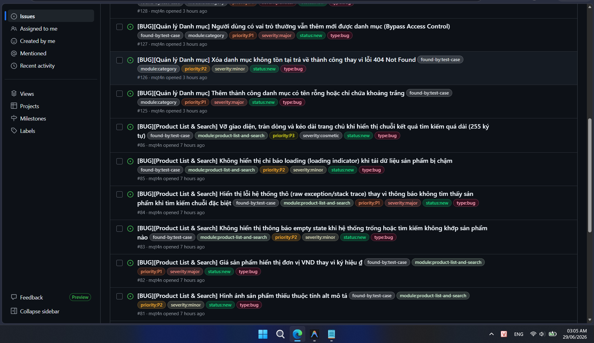
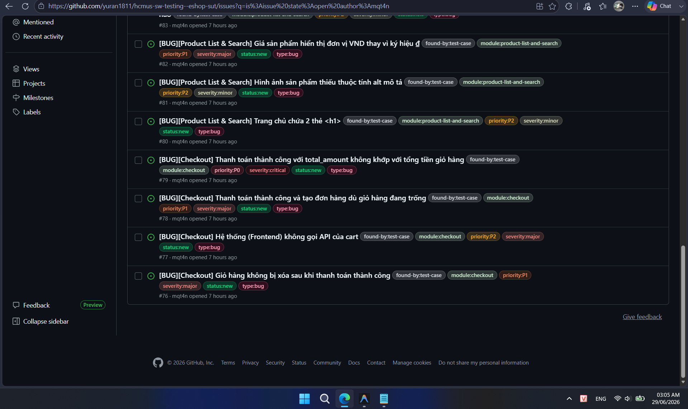
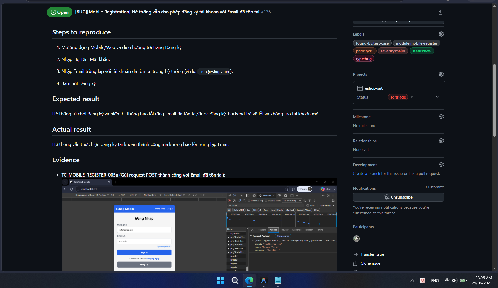
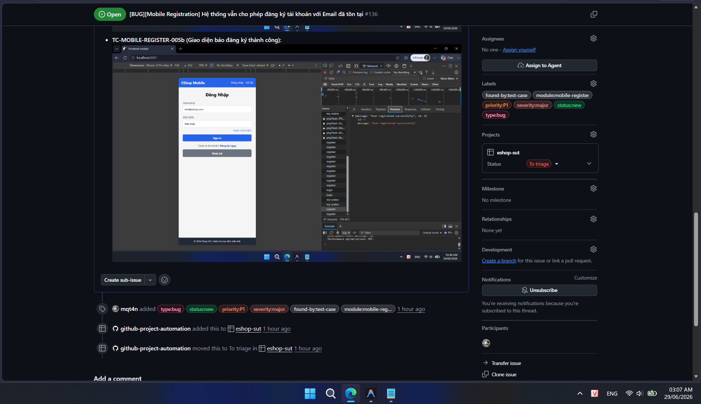

# Bug Report

Danh sách tổng hợp các lỗi tìm thấy trong quá trình kiểm thử:

1. **[BUG-CATEGORY-001](../../../tests/bug-reports/manual/category/BUG-CATEGORY-001.md)** - [BUG][Quản lý Danh mục] Thêm thành công danh mục có tên rỗng hoặc chỉ chứa khoảng trắng
   - **Module**: Quản lý Danh mục (Category) | **Requirement**: FR-14 (Quản lý Danh mục)
   - **Severity**: Major | **Priority**: P1 | **Status**: New
   - **Linked Test Case**: TC-CATEGORY-002, TC-CATEGORY-003
   - **GitHub Issue**: [#125](https://github.com/yuran1811/hcmus-sw-testing--eshop-sut/issues/125)

2. **[BUG-CATEGORY-002](../../../tests/bug-reports/manual/category/BUG-CATEGORY-002.md)** - [BUG][Quản lý Danh mục] Xóa danh mục không tồn tại trả về thành công thay vì lỗi 404 Not Found
   - **Module**: Quản lý Danh mục (Category) | **Requirement**: FR-14 (Quản lý Danh mục)
   - **Severity**: Minor | **Priority**: P2 | **Status**: New
   - **Linked Test Case**: TC-CATEGORY-006
   - **GitHub Issue**: [#126](https://github.com/yuran1811/hcmus-sw-testing--eshop-sut/issues/126)

3. **[BUG-CATEGORY-003](../../../tests/bug-reports/manual/category/BUG-CATEGORY-003.md)** - [BUG][Quản lý Danh mục] Người dùng có vai trò thường vẫn thêm mới được danh mục (Bypass Access Control)
   - **Module**: Quản lý Danh mục (Category) | **Requirement**: FR-12 (Kiểm soát truy cập), FR-14 (Quản lý Danh mục)
   - **Severity**: Major | **Priority**: P1 | **Status**: New
   - **Linked Test Case**: TC-CATEGORY-008
   - **GitHub Issue**: [#127](https://github.com/yuran1811/hcmus-sw-testing--eshop-sut/issues/127)

4. **[BUG-CATEGORY-004](../../../tests/bug-reports/manual/category/BUG-CATEGORY-004.md)** - [BUG][Quản lý Danh mục] Vẫn xóa được danh mục đang có sản phẩm liên kết (Vi phạm ràng buộc khóa ngoại)
   - **Module**: Quản lý Danh mục (Category) | **Requirement**: FR-14 (Quản lý Danh mục)
   - **Severity**: Critical | **Priority**: P1 | **Status**: New
   - **Linked Test Case**: TC-CATEGORY-009
   - **GitHub Issue**: [#128](https://github.com/yuran1811/hcmus-sw-testing--eshop-sut/issues/128)

5. **[BUG-CATEGORY-005](../../../tests/bug-reports/manual/category/BUG-CATEGORY-005.md)** - [BUG][Quản lý Danh mục] Người dùng có vai trò thường vẫn xóa được danh mục (Bypass Access Control)
   - **Module**: Quản lý Danh mục (Category) | **Requirement**: FR-12 (Kiểm soát truy cập), FR-14 (Quản lý Danh mục)
   - **Severity**: Critical | **Priority**: P1 | **Status**: New
   - **Linked Test Case**: TC-CATEGORY-011
   - **GitHub Issue**: [#129](https://github.com/yuran1811/hcmus-sw-testing--eshop-sut/issues/129)

6. **[BUG-CHECKOUT-001](../../../tests/bug-reports/manual/checkout/BUG-CHECKOUT-001.md)** - [BUG][Checkout] Giỏ hàng không bị xóa sau khi thanh toán thành công
   - **Module**: Checkout (Thanh toán) | **Requirement**: FR-08 (Thanh toán)
   - **Severity**: Major | **Priority**: P1 | **Status**: New
   - **Linked Test Case**: TC-CHECKOUT-001, TC-CHECKOUT-BVA-001
   - **GitHub Issue**: [#76](https://github.com/yuran1811/hcmus-sw-testing--eshop-sut/issues/76)

7. **[BUG-CHECKOUT-002](../../../tests/bug-reports/manual/checkout/BUG-CHECKOUT-002.md)** - [BUG][Checkout] Hệ thống (Frontend) không gọi API của cart
   - **Module**: Checkout (Thanh toán) | **Requirement**: FR-08 (Thanh toán)
   - **Severity**: Major | **Priority**: P2 | **Status**: New
   - **Linked Test Case**: TC-CHECKOUT-001
   - **GitHub Issue**: [#77](https://github.com/yuran1811/hcmus-sw-testing--eshop-sut/issues/77)

8. **[BUG-CHECKOUT-003](../../../tests/bug-reports/manual/checkout/BUG-CHECKOUT-003.md)** - [BUG][Checkout] Thanh toán thành công và tạo đơn hàng dù giỏ hàng đang trống
   - **Module**: Checkout (Thanh toán) | **Requirement**: FR-08 (Thanh toán)
   - **Severity**: Major | **Priority**: P1 | **Status**: New
   - **Linked Test Case**: TC-CHECKOUT-003
   - **GitHub Issue**: [#78](https://github.com/yuran1811/hcmus-sw-testing--eshop-sut/issues/78)

9. **[BUG-CHECKOUT-004](../../../tests/bug-reports/manual/checkout/BUG-CHECKOUT-004.md)** - [BUG][Checkout] Thanh toán thành công với total_amount không khớp với tổng tiền giỏ hàng
   - **Module**: Checkout (Thanh toán) | **Requirement**: FR-08 (Thanh toán)
   - **Severity**: Critical | **Priority**: P0 | **Status**: New
   - **Linked Test Case**: TC-CHECKOUT-004, TC-CHECKOUT-BVA-002, TC-CHECKOUT-BVA-003
   - **GitHub Issue**: [#79](https://github.com/yuran1811/hcmus-sw-testing--eshop-sut/issues/79)

10. **[BUG-PLAS-001](../../../tests/bug-reports/product-list-and-search/BUG-PLAS-001.md)** - [BUG][Product List & Search] Trang chủ chứa 2 thẻ <h1>
   - **Module**: Product List & Search (Xem danh sách & Tìm kiếm sản phẩm) | **Requirement**: FR-05 (Xem danh sách & Tìm kiếm sản phẩm)
   - **Severity**: Minor | **Priority**: P2 | **Status**: New
   - **Linked Test Case**: TC-PLAS-001, TC-PLAS-002, TC-PLAS-004, TC-PLAS-005, TC-PLAS-006, TC-PLAS-007, TC-PLAS-BVA-001, TC-PLAS-BVA-005
   - **GitHub Issue**: [#80](https://github.com/yuran1811/hcmus-sw-testing--eshop-sut/issues/80)

11. **[BUG-PLAS-002](../../../tests/bug-reports/product-list-and-search/BUG-PLAS-002.md)** - [BUG][Product List & Search] Hình ảnh sản phẩm thiếu thuộc tính alt mô tả
   - **Module**: Product List & Search (Xem danh sách & Tìm kiếm sản phẩm) | **Requirement**: FR-05 (Xem danh sách & Tìm kiếm sản phẩm)
   - **Severity**: Minor | **Priority**: P2 | **Status**: New
   - **Linked Test Case**: TC-PLAS-001, TC-PLAS-002, TC-PLAS-004, TC-PLAS-BVA-001, TC-PLAS-BVA-005
   - **GitHub Issue**: [#81](https://github.com/yuran1811/hcmus-sw-testing--eshop-sut/issues/81)

12. **[BUG-PLAS-003](../../../tests/bug-reports/product-list-and-search/BUG-PLAS-003.md)** - [BUG][Product List & Search] Giá sản phẩm hiển thị đơn vị VND thay vì ký hiệu ₫
   - **Module**: Product List & Search (Xem danh sách & Tìm kiếm sản phẩm) | **Requirement**: FR-05 (Xem danh sách & Tìm kiếm sản phẩm)
   - **Severity**: Major | **Priority**: P1 | **Status**: New
   - **Linked Test Case**: TC-PLAS-001, TC-PLAS-002, TC-PLAS-004, TC-PLAS-BVA-001, TC-PLAS-BVA-005
   - **GitHub Issue**: [#82](https://github.com/yuran1811/hcmus-sw-testing--eshop-sut/issues/82)

13. **[BUG-PLAS-004](../../../tests/bug-reports/product-list-and-search/BUG-PLAS-004.md)** - [BUG][Product List & Search] Không hiển thị thông báo empty state khi hệ thống trống hoặc tìm kiếm không khớp sản phẩm nào
   - **Module**: Product List & Search (Xem danh sách & Tìm kiếm sản phẩm) | **Requirement**: FR-05 (Xem danh sách & Tìm kiếm sản phẩm)
   - **Severity**: Minor | **Priority**: P2 | **Status**: New
   - **Linked Test Case**: TC-PLAS-003, TC-PLAS-BVA-004
   - **GitHub Issue**: [#83](https://github.com/yuran1811/hcmus-sw-testing--eshop-sut/issues/83)

14. **[BUG-PLAS-005](../../../tests/bug-reports/product-list-and-search/BUG-PLAS-005.md)** - [BUG][Product List & Search] Hiển thị lỗi hệ thống thô (raw exception/stack trace) thay vì thông báo không tìm thấy sản phẩm khi tìm kiếm chuỗi đặc biệt
   - **Module**: Product List & Search (Xem danh sách & Tìm kiếm sản phẩm) | **Requirement**: FR-05 (Xem danh sách & Tìm kiếm sản phẩm)
   - **Severity**: Major | **Priority**: P1 | **Status**: New
   - **Linked Test Case**: TC-PLAS-005
   - **GitHub Issue**: [#84](https://github.com/yuran1811/hcmus-sw-testing--eshop-sut/issues/84)

15. **[BUG-PLAS-006](../../../tests/bug-reports/product-list-and-search/BUG-PLAS-006.md)** - [BUG][Product List & Search] Không hiển thị chỉ báo loading (loading indicator) khi tải dữ liệu sản phẩm bị chậm
   - **Module**: Product List & Search (Xem danh sách & Tìm kiếm sản phẩm) | **Requirement**: FR-05 (Xem danh sách & Tìm kiếm sản phẩm)
   - **Severity**: Minor | **Priority**: P2 | **Status**: New
   - **Linked Test Case**: TC-PLAS-006
   - **GitHub Issue**: [#85](https://github.com/yuran1811/hcmus-sw-testing--eshop-sut/issues/85)

16. **[BUG-PLAS-007](../../../tests/bug-reports/product-list-and-search/BUG-PLAS-007.md)** - [BUG][Product List & Search] Vỡ giao diện, tràn dòng và kéo dài trang chủ khi hiển thị chuỗi kết quả tìm kiếm quá dài (255 ký tự)
   - **Module**: Product List & Search (Xem danh sách & Tìm kiếm sản phẩm) | **Requirement**: FR-05 (Xem danh sách & Tìm kiếm sản phẩm)
   - **Severity**: Cosmetic | **Priority**: P3 | **Status**: New
   - **Linked Test Case**: TC-PLAS-BVA-002, TC-PLAS-BVA-003
   - **GitHub Issue**: [#86](https://github.com/yuran1811/hcmus-sw-testing--eshop-sut/issues/86)

## Hình ảnh các issue trên GitHub

Dưới đây là hình ảnh chụp danh sách các issue đã được tạo trên GitHub:

## Ví dụ chi tiết về một issue trên GitHub

Dưới đây là hình ảnh chi tiết minh họa nội dung của một issue mẫu đã tạo trên GitHub:

