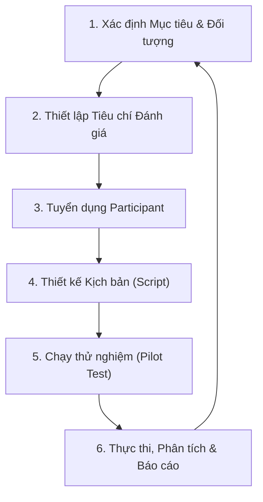

# Usability Testing — Tài liệu Lý thuyết

**Tổng quan toàn diện: Khái niệm, Phương pháp, Quy trình, Đo lường & Đạo đức nghiên cứu**

---

## Mục lục

1. [Usability là gì? Ba trụ cột theo ISO 9241-11](#1-usability-là-gì-ba-trụ-cột-theo-iso-9241-11)
2. [Định nghĩa Usability Testing & Ba thành phần cốt lõi](#2-định-nghĩa-usability-testing--ba-thành-phần-cốt-lõi)
3. [Phân biệt Usability Testing với các loại kiểm thử khác](#3-phân-biệt-usability-testing-với-các-loại-kiểm-thử-khác)
4. [Phân loại Usability Testing theo hai trục](#4-phân-loại-usability-testing-theo-hai-trục)
5. [Quy trình thực hiện Usability Testing](#5-quy-trình-thực-hiện-usability-testing)
6. [Tám phương pháp thu thập dữ liệu](#6-tám-phương-pháp-thu-thập-dữ-liệu)
7. [Các Metric đo lường Usability](#7-các-metric-đo-lường-usability)
8. [Đánh giá mức độ nghiêm trọng của lỗi (Severity)](#8-đánh-giá-mức-độ-nghiêm-trọng-của-lỗi-severity)
9. [Nielsen's 10 Usability Heuristics & Context of Use](#9-nielsens-10-usability-heuristics--context-of-use)
10. [Kiểm thử trên thiết bị di động (Mobile Usability)](#10-kiểm-thử-trên-thiết-bị-di-động-mobile-usability)
11. [Viết Issue Report & Recommendation hiệu quả](#11-viết-issue-report--recommendation-hiệu-quả)
12. [Đạo đức nghiên cứu & Quyền riêng tư (Research Ethics)](#12-đạo-đức-nghiên-cứu--quyền-riêng-tư-research-ethics)
13. [Bảng thuật ngữ (Glossary)](#13-bảng-thuật-ngữ-glossary)

---

## 1. Usability là gì? Ba trụ cột theo ISO 9241-11

**Usability** (tính khả dụng, hay còn gọi là "khả năng sử dụng được") là một thuộc tính chất lượng mô tả mức độ dễ dàng mà một người dùng cụ thể có thể sử dụng một sản phẩm để đạt được mục tiêu của họ. Đây **không phải** là một khái niệm mơ hồ kiểu "dùng thấy thích" — mà là một thuộc tính có thể đo lường được, đã được chuẩn hóa quốc tế.

Theo tiêu chuẩn **ISO 9241-11** (tiêu chuẩn quốc tế về Ergonomics — công thái học tương tác người-máy), Usability được định nghĩa là:

> "Mức độ mà một sản phẩm có thể được sử dụng bởi những người dùng cụ thể để đạt được các mục tiêu cụ thể một cách hiệu quả (effective), hiệu suất (efficient) và hài lòng (satisfying) trong một ngữ cảnh sử dụng cụ thể (context of use)."

Định nghĩa này chỉ ra ba trụ cột (ba thành phần) không thể tách rời của Usability:

| Trụ cột                        | Ý nghĩa                                                                                             | Câu hỏi đánh giá                                                | Chỉ số tham khảo                                                                     |
| ------------------------------ | --------------------------------------------------------------------------------------------------- | --------------------------------------------------------------- | ------------------------------------------------------------------------------------ |
| **Effectiveness** (Hiệu quả)   | Mức độ **chính xác và đầy đủ** khi người dùng hoàn thành được mục tiêu đề ra.                       | Người dùng có hoàn thành đúng và đủ tác vụ được giao không?     | Task completion rate (tỷ lệ hoàn thành), số lỗi phát sinh, độ chính xác của kết quả. |
| **Efficiency** (Hiệu suất)     | **Nguồn lực** (thời gian, công sức, thao tác) mà người dùng phải bỏ ra so với kết quả đạt được.     | Mất bao lâu, cần bao nhiêu bước, bao nhiêu nỗ lực nhận thức?    | Time on task (thời gian thực hiện), số lần click/chạm, số lần cần trợ giúp.          |
| **Satisfaction** (Sự hài lòng) | Phản ứng **thể chất, nhận thức và cảm xúc** của người dùng khi trải nghiệm, so với kỳ vọng ban đầu. | Trải nghiệm có dễ chịu, đáng tin cậy, không gây khó chịu không? | SUS, thang đo hài lòng (satisfaction rating), phản hồi định tính.                    |

> **Lưu ý quan trọng**: Ba trụ cột này có liên quan mật thiết với nhau nhưng **không thay thế được cho nhau**. Một hệ thống có thể rất Effective (người dùng luôn hoàn thành được việc) nhưng lại kém Efficient (mất quá nhiều bước) hoặc kém Satisfaction (người dùng thấy khó chịu dù vẫn xong việc). Do đó, để đánh giá đầy đủ độ khả dụng của một sản phẩm, cần xem xét đồng thời cả ba khía cạnh, không chỉ dựa vào một chỉ số duy nhất.

---

## 2. Định nghĩa Usability Testing & Ba thành phần cốt lõi

**Usability Testing** (Kiểm thử khả dụng) là một **phương pháp nghiên cứu người dùng (user research method)**, trong đó người tham gia thực hiện các tác vụ thực tế trên sản phẩm, còn người điều phối quan sát hành vi và thu thập dữ liệu về cách họ tương tác. Điểm cốt yếu phân biệt Usability Testing với các hình thức kiểm thử khác (sẽ trình bày ở Mục 3) là: **đối tượng thực hiện kiểm thử là người dùng thật (hoặc đại diện cho người dùng thật)**, chứ không phải chuyên gia kiểm thử (tester) hay kỹ sư phần mềm.

### Ba thành phần cốt lõi

1. **Facilitator (Người điều phối)**: Người hướng dẫn phiên kiểm thử. Vai trò chính là **hướng dẫn và quan sát**, tuyệt đối **không được dẫn dắt** hay gợi ý câu trả lời/thao tác cho người dùng (vì làm vậy sẽ làm sai lệch kết quả — hiện tượng gọi là _facilitator bias_ hay _moderator bias_).
2. **Tasks (Tác vụ)**: Các hoạt động thực tế mà người dùng cần hoàn thành trên sản phẩm, được thiết kế mô phỏng đúng những gì họ sẽ làm ngoài đời thực (ví dụ: "Tìm và mua một đôi giày size 41").
3. **Participant (Người tham gia)**: Người đại diện cho nhóm người dùng mục tiêu (target user) của sản phẩm — không phải người ngẫu nhiên, mà được tuyển chọn (recruit) theo tiêu chí phù hợp với đối tượng thực tế sẽ dùng sản phẩm.

### Mục tiêu chính của Usability Testing

- Phát hiện các điểm gây **nhầm lẫn (confusion)**, **lỗi thao tác (error)**, và **rào cản (friction/blocker)** trong luồng sử dụng (user flow).
- Đo lường định lượng (quantitative) và định tính (qualitative) các chỉ số hiệu quả, hiệu suất, sự hài lòng đã nêu ở Mục 1.
- Kiểm chứng các **giả định thiết kế (design assumptions)** trước khi đầu tư nguồn lực lớn vào phát triển và sản xuất quy mô lớn.

### Phạm vi áp dụng

Usability Testing có thể được áp dụng ở bất kỳ giai đoạn nào của vòng đời sản phẩm — từ **bản phác thảo trên giấy (paper prototype)**, bản dựng tương tác được (interactive mockup), cho đến **hệ thống đã hoàn thiện đang vận hành thực tế (live production system)**. Thử nghiệm càng sớm, chi phí sửa lỗi thiết kế càng thấp.

---

## 3. Phân biệt Usability Testing với các loại kiểm thử khác

Rất nhiều khái niệm kiểm thử phần mềm dễ bị nhầm lẫn với Usability Testing vì đều liên quan đến giao diện hoặc trải nghiệm người dùng. Điểm khác biệt cốt lõi nằm ở: **ai là người thực hiện kiểm thử** và **câu hỏi mà kiểm thử đó trả lời**.

- **Functional Testing (Kiểm thử chức năng)**: Do tester/kỹ sư thực hiện, nhằm xác minh chức năng có chạy đúng theo tài liệu đặc tả hay không, thường cho kết quả nhị phân Pass/Fail.
  - _Khác biệt_: Một chức năng vượt qua kiểm thử chức năng (Pass — chạy đúng logic) vẫn hoàn toàn có thể khó tìm thấy, khó hiểu, hoặc khó sử dụng đối với người dùng thật. Functional Testing trả lời câu hỏi "nó có chạy đúng không", còn Usability Testing trả lời câu hỏi "người dùng có dùng được nó không".

- **UAT — User Acceptance Testing (Kiểm thử chấp nhận người dùng)**: Do đại diện phía khách hàng/doanh nghiệp thực hiện, nhằm xác nhận hệ thống có đáp ứng đúng nhu cầu kinh doanh đã thỏa thuận hay không — về bản chất trả lời câu hỏi "Có chấp nhận nghiệm thu sản phẩm này không?"
  - _Khác biệt_: UAT thường kiểm tra ở mức "đủ tiêu chí nghiệm thu hợp đồng", trong khi Usability Testing đào sâu tìm kiếm các vấn đề tương tác trực quan, tinh vi hơn nhiều trong toàn bộ quá trình trải nghiệm — kể cả khi hệ thống đã "đạt nghiệm thu".

- **Accessibility Testing (Kiểm thử khả năng tiếp cận)**: Đảm bảo người khuyết tật (khiếm thị, khiếm thính, hạn chế vận động...) có thể tiếp cận và sử dụng sản phẩm tương đương với người dùng thông thường, thường đối chiếu theo chuẩn WCAG.
  - _Khác biệt_: Accessibility Testing tập trung riêng vào các **rào cản tiếp cận** (ví dụ: độ tương phản màu, khả năng điều hướng bằng bàn phím, tương thích với screen reader). Có giao thoa với Usability (một sản phẩm khó tiếp cận thường cũng khó sử dụng) nhưng hai khái niệm không đồng nhất hoàn toàn — một sản phẩm có thể "tiếp cận được" về mặt kỹ thuật (đạt chuẩn WCAG) nhưng vẫn khó dùng về mặt trải nghiệm tổng thể.

- **UI Testing (Kiểm thử giao diện)**: Đảm bảo giao diện hiển thị đúng với đặc tả/thiết kế đồ họa (đúng màu, đúng font, đúng bố cục).
  - _Khác biệt_: "Đúng thiết kế" không đồng nghĩa với "dễ hiểu" hay "phù hợp với mô hình nhận thức (mental model)" của người dùng. Một giao diện có thể hiển thị hoàn hảo theo file thiết kế nhưng người dùng vẫn không biết phải bấm vào đâu.

- **A/B Testing**: So sánh hiệu quả của hai (hoặc nhiều) biến thể thiết kế trên một tập metric định lượng định sẵn (ví dụ: tỷ lệ chuyển đổi — conversion rate), thực hiện trên số lượng lớn người dùng thật đang dùng sản phẩm thật.
  - _Khác biệt_: A/B Testing cho biết **biến thể nào tốt hơn về mặt con số**, nhưng thường không giải thích đầy đủ **lý do tại sao** — thiếu đi phần insight định tính (qualitative insight) mà Usability Testing cung cấp. Hai phương pháp này thường được dùng bổ trợ cho nhau: Usability Testing giúp tìm ra "vì sao", A/B Testing giúp xác nhận "cái nào tốt hơn" trên diện rộng.

---

## 4. Phân loại Usability Testing theo hai trục

Usability Testing thường được phân loại theo hai trục độc lập, tạo thành một ma trận 2×2 gồm 4 hình thức triển khai cơ bản:

**Trục 1 — Địa điểm (Location)**

1. **Remote Testing (Từ xa)**: Người tham gia thực hiện phiên kiểm thử từ xa, trên chính thiết bị và trong môi trường cá nhân của họ (nhà, văn phòng...).
   - _Ưu điểm_: Tiết kiệm chi phí đi lại/thuê phòng lab, dễ mở rộng quy mô (scale) để test với nhiều người ở nhiều vùng địa lý khác nhau, hành vi người dùng tự nhiên hơn vì họ ở trong môi trường quen thuộc.
   - _Nhược điểm_: Khó quan sát các phản ứng phi ngôn ngữ tinh tế, khó kiểm soát chất lượng đường truyền/thiết bị.
2. **In-Person Testing (Trực tiếp)**: Thực hiện tại phòng lab vật lý (usability lab) hoặc trực tiếp gặp gỡ người tham gia.
   - _Ưu điểm_: Dễ quan sát ngôn ngữ cơ thể (body language), các phản ứng nhỏ (facial expression, hesitation), và kiểm soát hoàn toàn thiết bị/môi trường kiểm thử (ánh sáng, tiếng ồn, phiên bản phần mềm).
   - _Nhược điểm_: Chi phí cao hơn, khó mở rộng quy mô, người dùng có thể hành xử khác với môi trường tự nhiên của họ (hiệu ứng Hawthorne — thay đổi hành vi khi biết mình đang bị quan sát).

**Trục 2 — Mức độ điều phối (Moderation)**

1. **Moderated Testing (Có điều phối)**: Có một người điều phối (facilitator) hướng dẫn trực tiếp, đặt các câu hỏi thăm dò (probing questions) theo thời gian thực trong lúc người dùng thực hiện tác vụ.
   - _Phù hợp cho_: Luồng thao tác phức tạp, prototype chưa hoàn thiện (cần người điều phối giải thích các phần chưa dựng xong), giúp thu thập insight rất sâu vì có thể hỏi ngay "vì sao bạn làm vậy" tại đúng thời điểm xảy ra hành vi.
2. **Unmoderated Testing (Không điều phối)**: Người tham gia tự mình hoàn thành tác vụ thông qua một công cụ hỗ trợ tự động (ghi lại màn hình, giọng nói, thao tác), không có người điều phối theo dõi trực tiếp.
   - _Phù hợp cho_: Cần kết quả nhanh, linh hoạt về thời gian (participant tự chọn giờ làm), loại bỏ được định kiến người điều phối (moderator bias — hiện tượng người dùng cố gắng làm hài lòng người quan sát), lý tưởng cho nhịp độ phát triển sản phẩm theo mô hình Agile (cần vòng lặp phản hồi nhanh).

Bốn hình thức trên có thể kết hợp tự do (ví dụ: Remote + Moderated qua video call, hoặc In-person + Unmoderated bằng cách để người dùng tự làm trong phòng lab mà không có ai quan sát trực tiếp), tùy theo mục tiêu, ngân sách và giai đoạn của dự án.

---

## 5. Quy trình thực hiện Usability Testing

Một quy trình Usability Testing chuẩn gồm 6 bước, được thực hiện tuần hoàn (kết quả của một vòng test thường dẫn đến việc lặp lại quy trình cho vòng tiếp theo sau khi thiết kế được cải tiến):

### Giải thích chi tiết từng bước

1. **Xác định Mục tiêu & Đối tượng (Objectives & Target Users)**: Trước khi test, cần trả lời rõ: "Chúng ta đang cố gắng tìm hiểu/giải quyết vấn đề gì?" và "Ai là người dùng mục tiêu cần đại diện trong bài test?". Mục tiêu mơ hồ ("test xem app có tốt không") sẽ dẫn đến một bài test không tập trung và khó rút ra kết luận hữu ích.

2. **Thiết lập Tiêu chí Đánh giá (Success Criteria / Benchmark)**: Đặt ra các ngưỡng định lượng cụ thể để biết khi nào kết quả được coi là "đạt" — ví dụ: tỷ lệ hoàn thành tối thiểu (completion rate), thời gian tối đa cho phép (time on task), hoặc điểm số hài lòng tối thiểu (SEQ, SUS — xem Mục 7).

3. **Tuyển dụng Participant (Recruitment)**: Tìm và mời người tham gia đúng đối tượng mục tiêu, thường thông qua một bảng câu hỏi sàng lọc (**screener**) để lọc ra những người phù hợp tiêu chí (độ tuổi, tần suất sử dụng sản phẩm tương tự, mức độ am hiểu công nghệ...).

4. **Thiết kế Kịch bản (Script Design)**: Soạn các câu hỏi giới thiệu trung lập (không gợi ý đáp án) và các tác vụ (task) cụ thể mà người dùng sẽ thực hiện. Câu hỏi/tác vụ cần được diễn đạt theo **mục tiêu (goal)** thay vì hướng dẫn từng bước, để không dẫn dắt hành vi tự nhiên của người dùng (ví dụ: nên viết "Hãy mua một đôi giày size 41" thay vì "Hãy bấm vào mục Giày, sau đó chọn size 41").

5. **Chạy thử nghiệm sơ bộ (Pilot Test)**: Chạy thử toàn bộ kịch bản với 1 (hoặc một vài) người trước khi triển khai chính thức, nhằm phát hiện các vấn đề trong chính bản thân kịch bản test (câu hỏi khó hiểu, thiếu dữ liệu test, task quá dễ/quá khó) và điều chỉnh trước khi tốn công sức chạy với số đông người tham gia.

6. **Thực thi, Phân tích & Báo cáo (Execution, Analysis & Reporting)**: Chạy chính thức với toàn bộ người tham gia đã tuyển, ghi nhận dữ liệu bằng các phương pháp ở Mục 6, sau đó tổng hợp các phát hiện (finding), đánh giá mức độ nghiêm trọng (Mục 8), và viết báo cáo kèm đề xuất cải tiến (Mục 11).

### Ví dụ minh họa áp dụng quy trình (Luồng Checkout trên Mobile)

Để cụ thể hóa 6 bước trên, dưới đây là một ví dụ minh họa hoàn chỉnh, áp dụng cho một tình huống điển hình: kiểm thử luồng thanh toán (checkout) trên ứng dụng di động, với mục tiêu giảm tỷ lệ bỏ giỏ hàng.

1. **Mục tiêu & Đối tượng**: Giảm tỷ lệ bỏ giỏ hàng (cart abandonment). Đối tượng: người dùng 20–35 tuổi, có tần suất mua sắm trực tuyến từ 2 lần/tháng trở lên.
2. **Tiêu chí (Benchmark)**: Completion rate ≥ 85%, Time on task ≤ 3 phút, điểm SEQ ≥ 5.5/7.
3. **Tuyển dụng**: Dùng bảng câu hỏi sàng lọc (screener, ví dụ qua Google Forms) hỏi về tần suất mua hàng và thiết bị ưu tiên sử dụng.
4. **Kịch bản**: Thiết kế câu hỏi giới thiệu trung lập. Tác vụ chính: _"Mua 1 đôi giày size 41, thêm vào giỏ hàng và tiến hành thanh toán."_
5. **Pilot Test**: Chạy thử với 1 người trước. Phát hiện: người dùng không biết lấy thông tin thẻ thanh toán thử nghiệm (test card) ở đâu → điều chỉnh lại nội dung kịch bản để cung cấp thông tin này rõ ràng hơn.
6. **Phân tích**: Tổng hợp các lỗi phát hiện được, kèm mức độ nghiêm trọng. Ví dụ phát hiện: 3/5 người dùng không thấy được nút thanh toán (CTA — Call To Action) vì bị khuất bên dưới màn hình (đánh giá Severity 3 — xem Mục 8) → đề xuất chuyển nút này sang dạng "sticky footer" (thanh cố định dưới đáy màn hình, luôn hiển thị dù cuộn trang).

---

## 6. Tám phương pháp thu thập dữ liệu

Trong quá trình chạy Usability Testing, có nhiều kỹ thuật khác nhau để thu thập dữ liệu về hành vi và suy nghĩ của người dùng. Mỗi phương pháp có ưu — nhược điểm riêng, thường được kết hợp với nhau để bù trừ hạn chế lẫn nhau:

1. **Think-Aloud Protocol**: Người dùng được yêu cầu nói ra thành tiếng mọi suy nghĩ trong đầu khi thực hiện tác vụ (ví dụ: "Tôi đang tìm nút thanh toán... à đây rồi, nhưng không chắc nó có hoạt động không").
   - _Ưu điểm_: Giúp hiểu rõ lỗi phát sinh từ đâu (do thiếu thông tin, do hiểu nhầm nhãn nút...), chi phí thực hiện thấp.
   - _Nhược điểm_: Đòi hỏi người dùng phải làm quen với việc "vừa làm vừa nói" (không tự nhiên với nhiều người), có thể làm chậm tốc độ thao tác thật.

2. **Observation (Quan sát)**: Facilitator quan sát trực tiếp hành vi thực tế của người dùng (cử chỉ, nét mặt, tốc độ thao tác) để ghi nhận toàn bộ quá trình mà không cần người dùng phải tường thuật.
   - _Nhược điểm_: Dữ liệu quan sát dễ bị ảnh hưởng bởi yếu tố môi trường bên ngoài và diễn giải chủ quan của người quan sát.

3. **User Interview (Phỏng vấn người dùng)**: Phỏng vấn sâu, thường thực hiện sau khi người dùng hoàn thành buổi test, nhằm làm rõ suy nghĩ, cảm xúc của họ ở từng giai đoạn đã trải qua.
   - _Nhược điểm_: Người dùng có thể quên các chi tiết nhỏ đã xảy ra trong lúc thao tác (hiện tượng "recall bias" — sai lệch do nhớ lại).

4. **Survey (Khảo sát)**: Thu thập cảm nhận bằng các bộ câu hỏi chuẩn hóa đã được kiểm chứng khoa học (CSAT, SEQ, SUS — xem chi tiết ở Mục 7).
   - _Ưu điểm_: Thực hiện nhanh, dễ mở rộng quy mô (scale) cho nhiều người tham gia.
   - _Nhược điểm_: Kết quả dễ sai lệch nếu câu hỏi được thiết kế kém (ví dụ: câu hỏi mang tính dẫn dắt).

5. **Screen Recording (Ghi hình màn hình)**: Ghi lại toàn bộ thao tác trên màn hình để lưu vết chính xác vị trí click, hành động cuộn chuột/vuốt màn hình.
   - _Hạn chế_: Chỉ cho biết hành vi "đã làm như thế nào" mà không tự nó giải thích được lý do "tại sao" người dùng làm vậy — cần kết hợp với Think-Aloud hoặc Interview để hiểu động cơ.

6. **Heatmap (Bản đồ nhiệt)**: Công cụ trực quan hóa mật độ click/cuộn chuột trên một trang, thể hiện bằng màu sắc (vùng càng "nóng" — đỏ/cam — càng được tương tác nhiều).
   - _Hạn chế_: Cho biết "vùng nào được chú ý nhiều" nhưng không giải thích được động cơ hành động đằng sau.

7. **Card Sorting (Sắp xếp thẻ bài)**: Người dùng được đưa cho một tập các "thẻ" đại diện cho nội dung/chức năng, và được yêu cầu tự phân loại, gom nhóm chúng theo cách họ thấy hợp lý — dùng để thiết kế cấu trúc menu/danh mục.
   - _Ứng dụng_: Giúp hiểu **mô hình nhận thức (mental model)** của người dùng về cách các thông tin nên được tổ chức, nhưng kết quả mang tính gợi ý tham khảo, không phải một đáp án chính xác tuyệt đối.

8. **Tree Testing (Kiểm thử cây)**: Người dùng được yêu cầu tìm một mục tiêu cụ thể trong một cấu trúc dạng cây văn bản thuần túy (không có giao diện đồ họa, chỉ có danh sách menu dạng chữ) — dùng để xác minh tính hợp lý của **kiến trúc thông tin (Information Architecture — IA)** mà không bị ảnh hưởng bởi yếu tố hình ảnh/thiết kế.

---

## 7. Các Metric đo lường Usability

Các chỉ số đo lường Usability được chia thành hai nhóm: **Metric Hành vi (Behavioral)** — đo dựa trên hành động thực tế quan sát được, và **Metric Thái độ (Attitudinal)** — đo dựa trên cảm nhận chủ quan mà người dùng tự báo cáo.

### A. Metric Hành vi (Behavioral Metrics)

- **Task Completion Rate (Tỷ lệ hoàn thành tác vụ)**: Số người hoàn thành tác vụ thành công chia cho tổng số người tham gia. Ngưỡng tối thiểu thường được chấp nhận là **78%**. Đối với các hệ thống có rủi ro cao (y tế, tài chính — nơi lỗi thao tác có thể gây hậu quả nghiêm trọng), yêu cầu thường phải đạt từ **95%–99%**.
- **Time on Task (Thời gian thực hiện)**: Thời gian trung bình để hoàn thành một tác vụ. Lưu ý về mặt thống kê: số liệu này **không theo phân phối chuẩn** (thường lệch phải — một vài người mất rất nhiều thời gian sẽ kéo trung bình cộng lên cao một cách sai lệch). Vì vậy, khuyến nghị:
  - Với cỡ mẫu **nhỏ hơn 25 người**: dùng **trung bình hình học (Geometric Mean)** — cách tính trung bình bằng cách nhân các giá trị rồi khai căn bậc n, giúp giảm ảnh hưởng của các giá trị ngoại lai (outlier).
  - Với cỡ mẫu **từ 25 người trở lên**: có thể dùng **trung vị (Median)** — giá trị nằm giữa khi sắp xếp toàn bộ dữ liệu theo thứ tự.
- **Error Rate (Tỷ lệ lỗi)**: Ghi nhận số lỗi phát sinh trong quá trình thực hiện, được phân làm hai loại có bản chất khác nhau:
  - _Slip (Lỗi trượt tay)_: Lỗi thao tác **vô tình**, xảy ra dù người dùng đã hiểu đúng cách dùng (ví dụ: bấm nhầm nút kế bên do khoảng cách hai nút quá sát nhau) — thường do vấn đề thiết kế vật lý/bố cục.
  - _Mistake (Lỗi nhận thức)_: Lỗi do người dùng **hiểu sai** cách thức hoạt động của hệ thống (ví dụ: tưởng rằng bấm nút X sẽ lưu tạm, nhưng thực ra nó xóa luôn dữ liệu) — thường do hệ thống cần cải thiện nhãn (label) hoặc cách ánh xạ (mapping) giữa hành động và kết quả.
- **AOI — Area of Interest (Khu vực quan tâm)**: Đo lường số lần và thời gian người dùng tương tác/nhìn vào các khu vực thiết yếu trên giao diện, thường kết hợp với công cụ theo dõi mắt (eye-tracking) hoặc heatmap.

### B. Metric Thái độ (Attitudinal Metrics)

- **CSAT — Customer Satisfaction (Sự hài lòng khách hàng)**: Đo lường mức độ hài lòng chung của người dùng, hoặc hài lòng cụ thể sau mỗi tác vụ/phiên làm việc, thường bằng một câu hỏi đơn giản kiểu "Bạn hài lòng như thế nào với trải nghiệm vừa rồi?".
- **SEQ — Single Ease Question (Câu hỏi độ dễ đơn giản)**: Một câu hỏi duy nhất đo lường độ dễ dàng của tác vụ, được hỏi ngay sau khi người dùng vừa thực hiện xong: _"Tác vụ này khó hay dễ đối với bạn?"_ — sử dụng thang đo Likert từ 1 (rất khó) đến 7 (rất dễ).
- **SUS — System Usability Scale (Thang đo khả dụng hệ thống)**: Một bộ gồm 10 câu hỏi chuẩn hóa (được công bố bởi John Brooke năm 1986), sử dụng thang đo Likert từ 1–5 (hoàn toàn không đồng ý → hoàn toàn đồng ý), sau đó quy đổi theo công thức riêng ra điểm tổng trên thang 0–100. Đây là công cụ đo lường usability được sử dụng phổ biến và có độ tin cậy cao nhất trong ngành hiện nay.
  - _Thang điểm SUS tham khảo_:
    - **> 85**: Hạng A — Tuyệt vời (Excellent).
    - **73–85**: Hạng B — Tốt (Good).
    - **52–72**: Hạng C — Trung bình (OK).
    - **< 51**: Hạng D/F — Kém (Poor), bắt buộc phải xem xét thiết kế lại.
- **NPS — Net Promoter Score (Chỉ số đo lường mức độ sẵn sàng giới thiệu)**: Đo lường mức độ sẵn sàng giới thiệu sản phẩm cho người khác qua câu hỏi "Trên thang điểm 0–10, bạn sẵn sàng giới thiệu sản phẩm này cho bạn bè/đồng nghiệp đến mức nào?". Người trả lời được phân thành ba nhóm:
  - **Promoter (Người ủng hộ)**: chấm 9–10 điểm.
  - **Passive (Người trung lập)**: chấm 7–8 điểm.
  - **Detractor (Người phản đối)**: chấm 0–6 điểm.
  - Công thức: `NPS = %Promoter − %Detractor` (kết quả nằm trong khoảng từ −100 đến +100).

---

## 8. Đánh giá mức độ nghiêm trọng của lỗi (Severity)

Sau khi phát hiện các vấn đề (issue) trong quá trình test, cần xếp hạng mức độ nghiêm trọng để ưu tiên xử lý. Thang đo Severity phổ biến trong Usability Testing gồm 5 mức (0–4):

| Mức độ | Phân loại              | Ý nghĩa & Hành động cần thiết                                                                                                                                   |
| ------ | ---------------------- | --------------------------------------------------------------------------------------------------------------------------------------------------------------- |
| **0**  | Không phải lỗi         | Không đủ bằng chứng/dữ liệu để xác nhận đây là một vấn đề khả dụng thực sự (có thể chỉ là hành vi cá biệt của một người dùng).                                  |
| **1**  | Cosmetic (Thẩm mỹ)     | Bất tiện rất nhỏ về mặt thị giác hoặc bố cục, không ảnh hưởng đến khả năng hoàn thành tác vụ. Nên sửa khi có thời gian rảnh.                                    |
| **2**  | Minor (Nhỏ)            | Gây khó khăn/bất tiện nhẹ nhưng người dùng vẫn tự tìm được cách vượt qua. Độ ưu tiên sửa chữa thấp.                                                             |
| **3**  | Major (Nghiêm trọng)   | Làm chậm đáng kể tiến trình của người dùng, khiến họ mắc nhiều lỗi hoặc có nguy cơ thất bại tác vụ. Cần ưu tiên khắc phục sớm.                                  |
| **4**  | Catastrophe (Thảm họa) | Chặn hoàn toàn luồng tác vụ quan trọng, gây mất mát dữ liệu hoặc khiến hệ thống không thể phục hồi trạng thái. Bắt buộc phải sửa trước khi phát hành (release). |

---

## 9. Nielsen's 10 Usability Heuristics & Context of Use

### 9.1. Mười nguyên tắc Usability của Jakob Nielsen

Đây là bộ nguyên tắc kiểm tra khả dụng (heuristic evaluation) được sử dụng rộng rãi nhất trong ngành, do Jakob Nielsen và Rolf Molich phát triển (1990, hoàn thiện năm 1994). Bộ nguyên tắc này cho phép chuyên gia đánh giá nhanh một giao diện mà **không cần** người dùng thật, bằng cách đối chiếu với 10 quy tắc kinh nghiệm sau:

1. **Visibility of system status (Hiển thị trạng thái hệ thống)**: Hệ thống luôn phải cho người dùng biết chuyện gì đang xảy ra, thông qua phản hồi phù hợp trong thời gian hợp lý. Ví dụ: hiển thị thanh tiến trình (progress bar) khi tải tệp; hiển thị thông báo "Đã lưu thành công".
2. **Match between system and the real world (Tương thích với thế giới thực)**: Sử dụng ngôn ngữ, khái niệm quen thuộc với người dùng đời thường, thay vì thuật ngữ kỹ thuật nội bộ. Ví dụ: dùng từ "Giỏ hàng" thay vì tên bảng dữ liệu kỹ thuật như "Cart_DB_Table".
3. **User control and freedom (Quyền kiểm soát và tự do của người dùng)**: Cung cấp "lối thoát khẩn cấp" rõ ràng khi người dùng chọn nhầm chức năng — tính năng hoàn tác (Undo), hủy bỏ (Cancel), nút thoát dễ tìm thấy.
4. **Consistency and standards (Tính nhất quán và tuân theo tiêu chuẩn)**: Cùng một hành động/biểu tượng phải luôn mang cùng một ý nghĩa xuyên suốt hệ thống. Ví dụ: icon thùng rác luôn có nghĩa là "Xóa" ở mọi màn hình.
5. **Error prevention (Phòng ngừa lỗi)**: Thiết kế chủ động ngăn lỗi xảy ra trước khi nó có cơ hội xảy ra, thay vì để lỗi xảy ra rồi mới hiển thị thông báo. Ví dụ: vô hiệu hóa (disable) nút Gửi/Xác nhận khi thông tin trên biểu mẫu chưa hợp lệ.
6. **Recognition rather than recall (Nhận diện hơn là ghi nhớ)**: Giảm gánh nặng ghi nhớ (cognitive load) của người dùng bằng cách hiển thị các tùy chọn có sẵn để họ nhận ra, thay vì bắt họ phải nhớ và tự gõ lại. Ví dụ: gợi ý lịch sử tìm kiếm gần đây, hiển thị nhãn văn bản kèm biểu tượng.
7. **Flexibility and efficiency of use (Linh hoạt và hiệu quả sử dụng)**: Cung cấp các lối tắt (phím tắt, tùy biến giao diện) cho người dùng thành thạo (power user), trong khi vẫn giữ trải nghiệm dễ dùng cho người mới.
8. **Aesthetic and minimalist design (Thẩm mỹ và thiết kế tối giản)**: Loại bỏ thông tin không liên quan hoặc hiếm khi cần thiết, vì mỗi đơn vị thông tin thừa sẽ cạnh tranh sự chú ý với các thông tin thực sự quan trọng.
9. **Help users recognize, diagnose, and recover from errors (Hỗ trợ nhận diện, chẩn đoán và khắc phục lỗi)**: Thông báo lỗi cần diễn đạt bằng ngôn ngữ tự nhiên, dễ hiểu, chỉ rõ vấn đề và gợi ý cách khắc phục. Ví dụ: hiển thị "Mật khẩu cần tối thiểu 8 ký tự" thay vì mã lỗi kỹ thuật chung chung như "Error 400 Bad Request".
10. **Help and documentation (Trợ giúp và tài liệu hướng dẫn)**: Dù thiết kế đã tốt, vẫn nên có tài liệu hỗ trợ dễ tìm kiếm, ngắn gọn, tập trung đúng vào tác vụ người dùng đang thực hiện. Ví dụ: các ô tooltip giải thích ngắn gọn cạnh các trường nhập liệu phức tạp.

### 9.2. Context of Use (Ngữ cảnh sử dụng)

Theo tiêu chuẩn ISO 9241-11 (đã nhắc ở Mục 1), các chỉ số khả dụng (ví dụ: "tỷ lệ hoàn thành 90%") **chỉ thực sự có ý nghĩa và giá trị tham chiếu khi được đặt trong một ngữ cảnh sử dụng cụ thể**. Nói cách khác, một con số usability không có ý nghĩa tuyệt đối — nó luôn cần đi kèm với bối cảnh đo lường nó. Ngữ cảnh sử dụng gồm 4 thành phần:

- **Users (Người dùng)**: Đặc điểm nhân khẩu học, năng lực nhận thức, kinh nghiệm sử dụng công nghệ của đối tượng được test.
- **Goals & Tasks (Mục tiêu & Tác vụ)**: Mục tiêu và chi tiết các bước thực hiện của tác vụ kiểm thử.
- **Resources (Nguồn lực)**: Các thiết bị phần cứng, phần mềm hỗ trợ và điều kiện kỹ thuật đi kèm khi thực hiện tác vụ.
- **Environment (Môi trường)**: Môi trường vật lý (ánh sáng, tiếng ồn), môi trường xã hội, và môi trường kỹ thuật (mạng, thiết bị) nơi diễn ra thử nghiệm.

---

## 10. Kiểm thử trên thiết bị di động (Mobile Usability)

### Tại sao cần kiểm thử đa thiết bị?

Một luồng thao tác dễ dàng trên màn hình Desktop (sử dụng chuột và bàn phím vật lý, không gian hiển thị rộng) hoàn toàn có thể gây ra những lỗi nghiêm trọng và sự ức chế cho người dùng khi tương tác trên màn hình nhỏ của điện thoại di động. Vì vậy, việc đánh giá khả dụng cần được thực hiện riêng biệt trên từng loại thiết bị, chứ không thể suy diễn kết quả từ Desktop sang Mobile.

### So sánh các khía cạnh giao diện: Desktop vs. Mobile vs. Tablet

- **Phương thức nhập liệu (Input Method)**: Desktop dùng chuột/bàn phím vật lý và có trạng thái rê chuột (hover state) ↔ Mobile dùng tương tác chạm bằng ngón tay (thường dùng một tay) và hoàn toàn không có hover ↔ Tablet dùng chạm cảm ứng hoặc bút stylus/bàn phím rời.
- **Không gian hiển thị**: Desktop rộng rãi, cho phép chia nhiều cột thông tin mật độ cao ↔ Mobile không gian hẹp, bắt buộc phải ưu tiên hiển thị nội dung cốt lõi ↔ Tablet ở mức trung gian (vẫn đòi hỏi kích thước vùng chạm lớn).
- **Thanh điều hướng (Navigation)**: Desktop dùng menu ngang hoặc thanh bên (sidebar) lớn ↔ Mobile dùng thanh điều hướng dưới cùng (bottom navigation) hoặc menu dạng "hamburger" (biểu tượng 3 gạch ngang) ↔ Tablet dùng sidebar hoặc chế độ chia đôi màn hình (split view).
- **Rủi ro khả dụng đặc trưng**: Desktop dễ bị rối mắt do chứa quá nhiều thông tin cùng lúc ↔ Mobile có nguy cơ nút quá nhỏ khó chạm, bàn phím ảo che mất biểu mẫu, hoặc cuộn trang quá dài ↔ Tablet dễ mắc lỗi thiết kế "lửng" (chỉ đơn giản phóng to giao diện mobile hoặc thu nhỏ giao diện desktop mà không tối ưu lại bố cục riêng cho tablet).

### Bốn lỗi giao diện di động phổ biến (Mobile UI Bugs)

1. **Touch target quá nhỏ (Vùng chạm quá nhỏ)**: Kích thước ngón tay người dùng không chính xác như con trỏ chuột, dễ bấm trượt sang vùng lân cận. Khuyến nghị: kích thước vùng chạm của nút bấm tối thiểu phải đạt **48px × 48px**, kèm khoảng cách đệm (spacing) đủ rộng giữa các nút để tránh bấm nhầm.
2. **Cỡ chữ khó đọc**: Font chữ quá nhỏ, độ tương phản thấp hoặc đoạn văn bản quá dài làm tăng tải nhận thức (cognitive load), đặc biệt gây khó khăn khi sử dụng ngoài trời dưới ánh nắng gắt.
3. **Bàn phím ảo che mất nội dung**: Khi người dùng kích hoạt bàn phím ảo (virtual keyboard) để nhập liệu, bàn phím tự động đẩy giao diện lên, có thể che mất trường đang nhập, nút Xác nhận (Submit), hoặc thông báo lỗi nằm bên dưới.
4. **Tràn bố cục (Layout overflow)**: Các bảng dữ liệu hoặc nút bấm quá dài bị tràn ra ngoài viền màn hình, tạo ra thanh cuộn ngang không mong muốn, gây mất thẩm mỹ và có thể che khuất thông tin quan trọng.

---

## 11. Viết Issue Report & Recommendation hiệu quả

### Issue Report là gì?

**Issue Report (Báo cáo vấn đề)** là một bản ghi có cấu trúc, mô tả chi tiết về một vấn đề cụ thể được phát hiện trong quá trình kiểm thử, khiến người dùng gặp trở ngại, thực hiện sai thao tác, hoặc từ bỏ tác vụ. Một báo cáo hữu ích cần **tránh nhận xét chung chung** (kiểu "giao diện chưa đẹp" hay "form khó dùng") mà phải được xây dựng dựa trên dữ liệu thực tế quan sát được.

### Cấu trúc chuẩn của một Issue Report

1. **Title (Tiêu đề)**: Ngắn gọn, mô tả trực tiếp vấn đề chính.
2. **Context (Ngữ cảnh)**: Vấn đề xảy ra ở tác vụ nào, trên màn hình nào, dùng thiết bị và trình duyệt gì.
3. **Problem Description (Mô tả vấn đề)**: Người dùng gặp khó khăn ở bước nào, họ đã hiểu nhầm hoặc thao tác sai như thế nào.
4. **Evidence (Bằng chứng)**: Đường dẫn ảnh chụp màn hình (screenshot), mốc thời gian trong video ghi hình (video timestamp), trích dẫn phát biểu của người dùng (user quote), hoặc số liệu đo lường cụ thể.
5. **Violated Heuristic (Nguyên tắc bị vi phạm)**: Vi phạm nguyên tắc khả dụng nào (ví dụ: Nielsen's Heuristics — Mục 9, hoặc chuẩn Mobile — Mục 10).
6. **Impact & Severity (Tác động & Mức độ nghiêm trọng)**: Tác động của lỗi (làm chậm thao tác, gây lỗi thao tác, hay khiến người dùng bỏ cuộc hoàn toàn) và điểm Severity tương ứng (thang 0–4, xem Mục 8).
7. **Recommendation (Đề xuất)**: Giải pháp thiết kế hoặc kỹ thuật **cụ thể** để khắc phục triệt để vấn đề.

> **Công thức mô tả vấn đề gợi ý**: _"Khi [ngữ cảnh cụ thể], người dùng [hành vi quan sát được], dẫn đến [ảnh hưởng/hậu quả]."_

### Cách viết Recommendation hiệu quả

Một đề xuất tốt phải **cụ thể (specific)** và **có thể hành động được (actionable)** — nghĩa là người nhận báo cáo (thường là designer/developer) có thể bắt tay vào thực hiện ngay mà không cần phải tự suy diễn thêm.

| Cách viết chung chung / Yếu (Kém hiệu quả)  | Cách viết cụ thể, Actionable / Tốt (Đạt yêu cầu)                                                                                                                               |
| ------------------------------------------- | ------------------------------------------------------------------------------------------------------------------------------------------------------------------------------ |
| _"Làm cho nút bấm rõ ràng hơn."_            | _"Thay đổi nhãn nút CTA thành 'Tiếp tục thanh toán', neo cố định ở sticky footer trên thiết bị di động, và tăng độ tương phản của màu nền nút."_                               |
| _"Sửa lại thông báo lỗi."_                  | _"Hiển thị thông báo lỗi bằng màu đỏ ngay bên dưới trường nhập Mật khẩu, ghi rõ nội dung: mật khẩu cần tối thiểu 8 ký tự và có ít nhất 1 chữ số."_                             |
| _"Thiết kế lại cấu trúc menu cho dễ dùng."_ | _"Đưa mục 'Lịch sử đơn hàng' ra menu cấp 1, hiển thị trực tiếp trong trang Quản lý tài khoản (vì số liệu phân tích cho thấy đây là mục được người dùng tìm kiếm nhiều nhất)."_ |

---

## 12. Đạo đức nghiên cứu & Quyền riêng tư (Research Ethics)

Khi thực hiện kiểm thử khả dụng với người dùng thật, nhóm nghiên cứu bắt buộc phải tuân thủ các nguyên tắc đạo đức nghiên cứu (research ethics) và bảo vệ quyền riêng tư (privacy) của người tham gia — đây không chỉ là vấn đề "tốt bụng" mà là một yêu cầu chuyên môn bắt buộc trong nghiên cứu người dùng.

### Tiêu chuẩn đạo đức (Ethics Checklist)

- **Tự nguyện (Voluntary participation)**: Người tham gia hoàn toàn có quyền đồng ý tham gia hoặc từ chối thực hiện buổi kiểm thử vào bất kỳ thời điểm nào.
- **Minh bạch (Transparency)**: Giải thích rõ ràng mục đích thử nghiệm, thời lượng dự kiến, và các loại dữ liệu sẽ được thu thập (ghi hình màn hình, ghi âm giọng nói...) — thường thông qua một biểu mẫu đồng ý (Informed Consent Form).
- **Không gây hại (Do no harm)**: Tránh thiết kế các tác vụ gây căng thẳng tâm lý quá mức, hoặc tạo ra các rủi ro liên quan đến tài chính, thông tin cá nhân thật của người tham gia.
- **Tôn trọng (Respect)**: Luôn duy trì thái độ cởi mở, không phán xét hay đổ lỗi khi người dùng thao tác sai. **Nguyên tắc cốt lõi cần ghi nhớ: lỗi luôn nằm ở thiết kế của sản phẩm, không bao giờ nằm ở người dùng.**
- **Bảo mật (Confidentiality)**: Chỉ thu thập những dữ liệu thực sự cần thiết cho nghiên cứu. Tiến hành ẩn danh hóa danh tính người tham gia trong báo cáo (dùng mã số ẩn danh như P01, P02 thay vì tên thật).
- **Quyền rút lui (Right to withdraw)**: Người tham gia có quyền yêu cầu dừng phiên kiểm thử ngay lập tức giữa chừng mà không cần đưa ra bất kỳ lý do nào.

### Quy định khi tiến hành ghi âm / ghi hình

- Bắt buộc phải có sự đồng ý rõ ràng (Informed Consent Form) trước khi bấm nút ghi âm hoặc quay phim màn hình.
- Yêu cầu người dùng đóng tất cả các tab trình duyệt chứa thông tin nhạy cảm, ẩn các thông báo cá nhân trước khi họ chia sẻ màn hình.
- Chỉ sử dụng tài khoản thử nghiệm chuyên dụng và bộ dữ liệu giả lập (dummy data), không sử dụng tài khoản thật của người dùng.
- Tạm dừng ghi hình ngay lập tức nếu bắt buộc người dùng phải nhập các thông tin bảo mật thật (mật khẩu cá nhân, mã OTP...).
- Che mờ hoặc mã hóa (masking) các thông tin nhạy cảm trên ảnh chụp/video trước khi chia sẻ báo cáo rộng rãi trong tổ chức.

---

## 13. Bảng thuật ngữ (Glossary)

| Thuật ngữ                         | Giải thích                                                                                                                          |
| --------------------------------- | ----------------------------------------------------------------------------------------------------------------------------------- |
| **Usability**                     | Tính khả dụng — mức độ dễ dàng mà một sản phẩm có thể được dùng để đạt mục tiêu.                                                    |
| **Facilitator/Moderator**         | Người điều phối buổi kiểm thử, hướng dẫn và quan sát mà không dẫn dắt câu trả lời.                                                  |
| **Participant**                   | Người tham gia kiểm thử, đại diện cho nhóm người dùng mục tiêu.                                                                     |
| **Task**                          | Tác vụ — hành động cụ thể mà người tham gia được yêu cầu thực hiện trong buổi test.                                                 |
| **Moderator bias**                | Sai lệch kết quả do người điều phối vô tình gợi ý/ảnh hưởng đến hành vi của người tham gia.                                         |
| **Mental model**                  | Mô hình nhận thức — cách người dùng hình dung/tưởng tượng hệ thống nên hoạt động như thế nào.                                       |
| **Screener**                      | Bảng câu hỏi sàng lọc dùng để tuyển chọn người tham gia đúng đối tượng mục tiêu.                                                    |
| **Pilot test**                    | Buổi chạy thử nghiệm quy mô nhỏ (thường 1 người) trước khi triển khai chính thức, để phát hiện lỗi trong kịch bản test.             |
| **Think-aloud protocol**          | Kỹ thuật yêu cầu người dùng nói ra thành tiếng suy nghĩ của họ trong lúc thao tác.                                                  |
| **Heatmap**                       | Bản đồ nhiệt — biểu diễn trực quan mật độ tương tác (click, cuộn) bằng màu sắc.                                                     |
| **Card sorting**                  | Kỹ thuật cho người dùng tự phân loại, gom nhóm nội dung để thiết kế cấu trúc menu.                                                  |
| **Tree testing**                  | Kỹ thuật kiểm tra kiến trúc thông tin bằng cách yêu cầu người dùng tìm mục tiêu trong cấu trúc cây văn bản thuần túy.               |
| **Information Architecture (IA)** | Kiến trúc thông tin — cách tổ chức, phân loại và gắn nhãn nội dung trong một hệ thống.                                              |
| **Completion rate**               | Tỷ lệ hoàn thành — phần trăm người tham gia hoàn thành tác vụ thành công.                                                           |
| **Time on task**                  | Thời gian thực hiện một tác vụ.                                                                                                     |
| **Slip**                          | Lỗi trượt tay — lỗi thao tác vô tình dù đã hiểu đúng cách dùng.                                                                     |
| **Mistake**                       | Lỗi nhận thức — lỗi do hiểu sai cách hệ thống hoạt động.                                                                            |
| **SUS (System Usability Scale)**  | Thang đo khả dụng hệ thống, gồm 10 câu hỏi chuẩn hóa, quy đổi ra điểm 0–100.                                                        |
| **SEQ (Single Ease Question)**    | Câu hỏi đơn lẻ đo độ dễ của một tác vụ ngay sau khi hoàn thành, thang điểm 1–7.                                                     |
| **CSAT (Customer Satisfaction)**  | Chỉ số đo mức độ hài lòng của khách hàng.                                                                                           |
| **NPS (Net Promoter Score)**      | Chỉ số đo mức độ sẵn sàng giới thiệu sản phẩm cho người khác.                                                                       |
| **Severity**                      | Mức độ nghiêm trọng của một lỗi/vấn đề, đánh giá theo thang 0–4.                                                                    |
| **Heuristic evaluation**          | Đánh giá khả dụng dựa trên đối chiếu với các nguyên tắc kinh nghiệm (heuristics) đã được kiểm chứng, không cần người dùng thật.     |
| **Context of use**                | Ngữ cảnh sử dụng — bối cảnh gồm Users, Goals & Tasks, Resources, Environment, giúp một chỉ số usability có ý nghĩa tham chiếu.      |
| **Touch target**                  | Vùng chạm — kích thước khu vực có thể chạm được của một phần tử giao diện trên thiết bị cảm ứng.                                    |
| **Cognitive load**                | Tải nhận thức — mức độ nỗ lực tư duy mà người dùng phải bỏ ra để hiểu và sử dụng một giao diện.                                     |
| **Issue report**                  | Báo cáo vấn đề — bản ghi có cấu trúc mô tả một vấn đề usability cụ thể được phát hiện.                                              |
| **Informed Consent Form**         | Biểu mẫu đồng ý tham gia nghiên cứu, trong đó người tham gia được thông báo đầy đủ về mục đích và cách dữ liệu của họ được sử dụng. |
| **Hawthorne effect**              | Hiệu ứng thay đổi hành vi khi người dùng biết mình đang bị quan sát, khiến hành vi kém tự nhiên hơn bình thường.                    |
