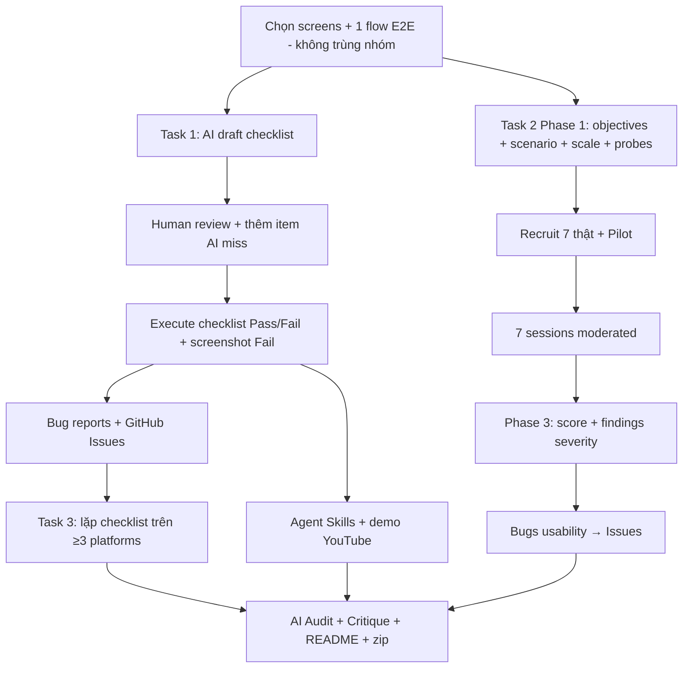

Using **requirement-analysis** + ngữ cảnh **usability-evaluation** để tách yêu cầu HW03 thành phạm vi, ràng buộc, deliverable và tiêu chí chấm.

---

# Phân tích yêu cầu HW03 – GUI & Usability

- **Module:** `HW03-GUI-USABILITY` (bài tập, không phải FR chức năng của SUT)
- **Requirement ID:** `HW03-AI`
- **SUT:** EShop (`https://github.com/ttbhanh/eshop-sut`)
- **Hình thức:** Cá nhân · **Thời lượng ước lượng:** 10 giờ · **Nộp:** Moodle (report)
- **Bloom-AI:** G9.3 (Analyse) + G9.4 (Collaborate) · AI Policy: Open (bắt buộc AI Audit Report)

---

## 1. Mục tiêu học tập (Learning Outcomes)

| # | Outcome |
|---|--------|
| 1 | Thiết kế & áp dụng GUI checklist + đánh giá usability dựa trên yêu cầu UI của SUT |
| 2 | Thu thập & phân tích phản hồi usability từ người dùng thật |
| 3 | Cross-browser / cross-platform trên web frontend và (tuỳ chọn) mobile app |
| 4 | Thể hiện năng lực Bloom-AI G9.3 / G9.4 |

---

## 2. Phạm vi SUT & Interface Aspects

### Functional pools (tham chiếu, không phải trọng tâm HW03)

| Pool | Nội dung | FR |
|------|----------|-----|
| A | Auth, Categories, Products | FR-01 … FR-06 |
| B | Cart & Checkout | FR-07 … FR-11 |
| C | Web Admin | FR-12 … FR-19 |
| D | Mobile App | (không liệt kê FR cụ thể trong đề) |

### Interface Aspects (trọng tâm HW03 — dùng trong checklist)

| IA ID | Aspect | Ghi chú |
|-------|--------|---------|
| IA-01 | General UI standards | Chuẩn UI chung |
| IA-02 | Forms | Form, validation, label… |
| IA-03 | Navigation | Điều hướng, menu, breadcrumb… |
| IA-04 | Feedback / state | Loading, error, empty, success… |

Đây là **aspect giao diện** để gắn vào checklist, **không** phải FR chức năng có số như FR-01.

---

## 3. Scope Selection (ràng buộc chọn phạm vi)

| Field | Data Type | Constraints | Notes |
|-------|-----------|-------------|-------|
| Screen(s) cho GUI checklist | Set of screens | Tối thiểu **1 màn hình**; khuyến nghị **nhiều màn** để đạt >40 item có ý nghĩa | Ví dụ: Home, Cart, Checkout, Admin Dashboard, Mobile |
| End-to-end flow cho usability | 1 flow | Đúng **một** flow E2E → trở thành task scenario Task 2 | Ví dụ: Sign-up → Add to cart → Checkout + coupon |
| Trùng nhóm | Boolean | Trong nhóm: **không** được trùng primary screen checklist **và** không trùng usability flow | Ràng buộc phối hợp nhóm |

**Business rules (chọn phạm vi):**
- Checklist: 1 screen được phép nhưng dễ nông / lặp → nên cover nhiều screen.
- Usability: chỉ 1 flow E2E; participants thực hiện đúng flow đó.
- Không trùng selection với thành viên khác trong nhóm.

---

## 4. Task 1 — GUI Checklist (30 điểm)

### Input / Artefacts cần tạo

| Field | Data Type | Constraints | Notes |
|-------|-----------|-------------|-------|
| Checklist items | List | **> 40** items; cover **đủ 4 IA** (IA-01…IA-04) | Excel + báo cáo Markdown |
| Nguồn item | AI + Human | Bắt buộc: AI generate ban đầu → human review → **tự thêm** item AI bỏ sót | Mỗi item tự thêm: giải thích *vì sao AI miss* |
| Execution status | Enum | Mỗi item: `Passed` / `Failed` | Có cột Notes |
| Notes (Failed) | Text | Bắt buộc lý do fail khi Failed | — |
| Screenshots | Image | Chỉ gắn cho item **Failed** | — |
| Bug reports | Markdown + GitHub Issues | Mọi bug phát hiện → report + Issue; screenshot trên Issue | — |

### Business Rules

- Phải review bài giảng GUI checklist trước khi làm.
- **AI-First có kỷ luật:** không prompt một phát “generate checklist + find usability problems”; phải dẫn AI theo từng bước kỹ thuật đã học.
- Human review bắt buộc — nộp raw AI output không chấp nhận.
- Item AI hay miss (ví dụ): accessibility, RTL, dark mode — chỉ là gợi ý; được tự thêm aspect khác.
- Bug vừa ghi trong Markdown report vừa mở GitHub Issue (có screenshot).

### Expected Outcomes

- **Success:** Checklist >40, cover IA-01…IA-04, có phần AI + phần human-added kèm lý do miss, đã execute Passed/Failed, Failed có Notes + screenshot, bug đã lên GitHub Issues.
- **Failure / mất điểm:** <40 items; thiếu IA; không review AI; không explain items tự thêm; không execute / không screenshot Failed; bug không lên Issues.

---

## 5. Task 2 — Usability Evaluation (40 điểm) — trọng số cao nhất

### Phase 1 — Plan & prepare

| Field | Data Type | Constraints | Notes |
|-------|-----------|-------------|-------|
| Objectives | 1–n testable questions | Rõ ràng học được gì từ flow | Ví dụ: bottleneck navigation, confidence |
| Task scenario | Goal-oriented text | **Goal + ràng buộc**, **không** hướng dẫn từng bước click | Ví dụ: “Tìm áo mùa đông < 500.000₫ và checkout bằng coupon” |
| Scale | SUS \| UEQ-S \| Custom | Custom chỉ khi có **justification** viết rõ | Hoàn thành **sau mỗi session** |
| Probe questions | Open-ended | Tối thiểu 4 nhóm: **clarity, error recovery, speed, trust** | Hỏi sau scale |
| Participants | 7 người thật | Ngoài lớp HW03; contact Zalo/email/phone **che 4 số giữa**; TA có thể gọi **2 người** | Ưu tiên non-IT / non-tester |
| Pilot | 1 người | Không tính vào 7 chính; dùng để refine scenario/timing/tool | Trước sessions thật |

### Phase 2 — Conduct (7 sessions)

| Rule | Chi tiết |
|------|----------|
| Framing | Test sản phẩm, không test người; think-aloud |
| Intervention | Trung lập; chỉ can thiệp khi **stuck hoàn toàn**; không hint dẫn |
| Evidence | Screen (+ audio nếu consent); note friction, errors, hesitations, frustration |
| Close | Scale → probe questions |

### Phase 3 — Analyse & report

- Chấm SUS/UEQ-S trên 7 participants.
- Gom pain points; tách **bug đơn lẻ** vs **vấn đề thiết kế hệ thống**.
- Ưu tiên theo severity (blocker hoàn thành task vs cosmetic).
- Bug thật → Markdown + GitHub Issues + screenshot.

### Anti-cheat (Task 2)

| Constraint | Hệ quả |
|------------|--------|
| Danh sách 7 người **thật**, có thể verify | Fake / mạo danh → **0 điểm Task 2** |
| TA gọi ngẫu nhiên 2 participants | Impersonation = 0 Task 2 |

### Expected Outcomes

- **Success:** Plan đầy đủ + pilot + 7 session thật + scale + probes + phân tích severity + findings + bugs trên Issues; participants verify được.
- **Failure:** Fabricate participants/session data; scenario kiểu walkthrough từng bước; thiếu scale/probes; không phân tích.

---

## 6. Task 3 — Cross-Browser / Cross-Platform (20 điểm)

| Field | Data Type | Constraints | Notes |
|-------|-----------|-------------|-------|
| Platforms | ≥ 3 | Thực hiện lại **Task 1** trên ≥3 platform | — |
| Tool | BrowserStack / LambdaTest (ưu tiên) | Trial hết → Sauce Labs / CrossBrowserTesting / **thiết bị thật** | Tự xin trial |
| Web browsers | Chrome, Firefox, Safari **hoặc** Android Chrome | Cover web frontend | — |
| Expo Go | Optional platform | Được **thay 1** trong 3 platform (vd. thay Safari); **không** chỉ là bonus | Mobile app SUT |
| Screenshot watermark | Overlay | Mỗi screenshot: **username dạng student email** | Anti-cheat: phải hiện student ID + full name trên form/ảnh theo §11 |

**Business rules:**
- Ảnh phải thấy rõ browser/OS/device **và** localhost URL của SUT (khi dùng device thật / tool thay thế).
- Watermark / identity trên screenshot là bằng chứng chống gian lận — **không được AI generate / fabricate**.

---

## 7. Agent Skills (10 điểm)

| Field | Constraints | Notes |
|-------|-------------|-------|
| Skills | Khuyến khích build skill tái sử dụng GUI checklist + usability | Submit kèm demo |
| Demo | Video YouTube end-to-end dùng skill trên 1 screen/flow đầy đủ | Link trong submission |

---

## 8. Deliverables bắt buộc (Submission)

**Filename:** `<StudentID>_HW03_AI_GUIUsability_<SelfAssessedGrade>.zip`  
Ví dụ: `25127001_HW03_AI_GUIUsability_090.zip` · SelfAssessedGrade ∈ `[000, 100]` (3 chữ số)

| # | Nội dung trong .zip |
|---|---------------------|
| 1 | Main report (Markdown + PDF): GUI checklist + usability evaluation |
| 2 | Bug report + screenshot trên GitHub Issues |
| 3 | AI Critique + AI Audit Report (Markdown + PDF) |
| 4 | Git commit log (text) |
| 5 | Excel checklist (>40) + test summary |
| 6 | Usability evidence: scenario, notes, SUS/UEQ-S, findings theo severity, recordings (nếu có), bảng 7 participants |
| 7 | Cross-platform screenshots |
| 8 | `README.md`: bảng self-assessment + test summary (số screen/flow, items designed/executed/pass/fail, bugs, participants, demo videos) |
| 9 | Tài liệu hỗ trợ khác |

**Quy định cứng:**
- Nộp trễ: **không cho phép**.
- Thiếu bất kỳ document bắt buộc: **0 điểm**.
- Copy bài / copy prompt: **0 điểm cả hai bên**.

---

## 9. AI Audit Report & AI Critique (Mandatory)

### AI Audit (Appendix)

Với mỗi tương tác AI ghi:
- Tên tool · Ngày giờ · Prompt · Output AI  

Nếu không dùng AI: khai báo rõ *"I do not use any AI help in this exercise."*

### AI Critique (200–300 từ)

Trả lời: AI sai/bias/thiếu ở đâu? Vì sao miss? Học được nguyên tắc gì khi collaborate với AI?

### Guiding principles (áp dụng toàn bài)

1. **AI-First có kỷ luật** — dẫn AI từng bước kỹ thuật, không black-box một prompt.
2. **Human review** — chịu trách nhiệm kết quả.
3. **AI Audit log** đầy đủ (khuyến khích skill tự log).
4. **Documentation** dạng text (Markdown).
5. **Quality over completion** — chấm theo chất lượng checklist, usability design/analysis, bugs, screenshots, participant list, links.

---

## 10. Git Commit Log & Oral Defense

| Yêu cầu | Chi tiết |
|---------|----------|
| Git | **1 commit / mỗi bước** quy trình (checklist design, execution, bug logging, mỗi usability session, analysis…) → nộp log dạng text |
| Oral defense | ~30% SV ngẫu nhiên; 5–7 phút tuần sau deadline |

---

## 11. Ma trận điểm (Assessment)

| No. | Criteria | Điểm |
|-----|----------|------|
| 1 | Task 1 — GUI Checklist (design + execution + bug report) | **30** |
| 2 | Task 2 — Usability Evaluation (scenario + 7 sessions + analysis) | **40** |
| 3 | Task 3 — Cross-Browser / Cross-Platform (≥ 3 platforms) | **20** |
| 4 | Agent Skills | **10** |
| | **Total** | **100** |

---

## 12. Rủi ro / “điểm chết” cần tránh

| Rủi ro | Hệ quả |
|--------|--------|
| Fabricate 7 participants | 0 Task 2 (TA gọi xác minh) |
| Fabricate cross-platform screenshots / thiếu identity | Vi phạm anti-cheat §11 |
| Thiếu bất kỳ file bắt buộc trong zip | **0 toàn bài** |
| Nộp trễ | Không nhận |
| Raw AI không review / checklist nông / trùng flow trong nhóm | Mất chất lượng / điểm |
| Scenario usability kiểu step-by-step | Không đúng yêu cầu goal-oriented → giảm giá trị Task 2 |

---

## 13. Luồng làm việc đề xuất (map yêu cầu → thứ tự)

---

## 14. Expected Outcomes (toàn bài)

- **Success:** Đủ 3 task + skills (nếu muốn 100), evidence thật (participants + screenshots có identity), AI audit/critique, git log theo bước, zip đúng format, README self-assess.
- **Failure nghiêm trọng:** Thiếu document → 0; fake participants/screenshots → 0 Task 2 / anti-cheat; copy → 0.

---

Nếu bạn muốn bước tiếp theo, có thể chọn: (1) chốt screen + flow cụ thể cho nhóm bạn, hoặc (2) generate Phase 1 usability plan / skeleton checklist theo IA-01…IA-04 cho các màn đã chọn.