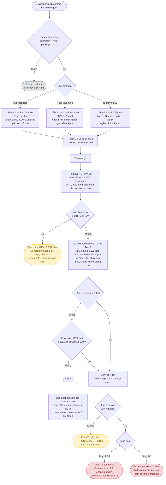

# Task 3 — Đề xuất mô hình Continuous Performance Testing (G9.6 — Disrupt)

> Mọi ngưỡng và quyết định lọc dưới đây bắt nguồn từ số liệu thật đã đo ở Task 1 (`23127211_Execution_Report.md`) và 8 lỗi đọc số liệu tìm ra ở Task 2 (`23127211_Analysis_Report.md`), không phải con số suy đoán.

---

## Yêu cầu 1 — Theo dõi commit/PR và tự quyết định có chạy performance test hay không

### Trigger nào quyết định chạy

Ba tín hiệu, kết hợp AND/OR như sau — chỉ chạy khi **cả hai** điều kiện dưới đây đúng:

```yaml
on:
  pull_request:
    paths: ["backend/**", "**/*.sql", "backend/package*.json"]
  push:
    branches: [main]
    paths: ["backend/**", "**/*.sql", "backend/package*.json"]
  schedule:
    - cron: "0 19 * * *"   # 02:00 giờ VN — không cần path filter, luôn chạy
```

1. **Lọc theo đường dẫn thay đổi** — chỉ chạy nếu commit chạm `backend/**`, một file `.sql`, hoặc `package*.json`. Một commit chỉ sửa `README.md` hay frontend không kích hoạt gì.
   - **Cố ý đưa `package-lock.json` vào danh sách lọc**, dù không ai "sửa code": nâng version `sqlite3` hay `express` có thể làm sập hiệu năng mà không đụng một dòng logic nào — đây là loại regression dễ lọt lưới nhất nếu chỉ lọc theo thư mục source.
2. **Loại sự kiện quyết định chạy tầng nào** (chi tiết ở Yêu cầu 3) — Pull Request → tầng nhẹ; push vào `main` → tầng baseline; lịch nightly → tầng đầy đủ, không cần path filter vì đằng nào cũng chỉ chạy 1 lần/đêm.

### Vì sao không chạy full test mọi lúc

Bộ test đầy đủ của Task 1 tốn **Load 5 phút + Stress 11 phút + Spike 2 phút + Soak 15 phút ≈ 33 phút**. Gắn vào mỗi PR sẽ vi phạm nguyên tắc PR pipeline phải phản hồi nhanh (< 10 phút) để không chặn dòng chảy công việc của developer.

---

## Yêu cầu 2 — So sánh p95 với baseline và tự động phát hiện regression

### Baseline lấy từ đâu

**Nguồn:** trung vị (median) của p95 từ **7 lần chạy gần nhất**, **không lấy từ 1 lần chạy duy nhất**. Dùng median thay vì mean vì mean bị 1 lần chạy nhiễu kéo lệch — bằng chứng: chính p95 của bài Load thật dao động 68–163 ms giữa các cửa sổ 60 giây liên tiếp *dù tải không đổi* (xem bảng bên dưới), một outlier có thể kéo mean lệch hẳn.

**Quan trọng — baseline phải tách riêng theo từng tầng, không dùng chung một baseline cho mọi mức tải.** Tầng 1 (PR) chạy 10 VU, tầng 2 (merge) chạy 50 VU — độ lớn response time ở hai mức tải này khác nhau về bản chất, nên so p95 của tầng 1 với baseline tính từ dữ liệu tầng 2 là so sai đối tượng (apples-to-oranges). Mỗi tầng giữ **baseline riêng, tính từ chính lịch sử chạy của tầng đó**:

- `performance-testing/baselines/tier1-smoke-10vu.json` — cập nhật sau mỗi lần tầng 1 PASS trên `main`.
- `performance-testing/baselines/tier2-load-50vu.json` — cập nhật sau mỗi lần tầng 2 PASS.

**Giới hạn cần nêu rõ (chưa kiểm chứng bằng số liệu thật):** biên độ nhiễu ±43% dùng để chọn ngưỡng 1,25 ở mục dưới đây được đo **ở mức 50 VU** (dữ liệu tầng 2), không phải ở 10 VU (tầng 1). Bài Task 1 không có lần chạy nào ở đúng 10 VU để đo lại biên độ nhiễu riêng cho tầng đó. Ngưỡng 1,25 áp dụng cho tầng 1 trong tài liệu này **là một giả định ngoại suy, chưa được đo thực nghiệm** — phải xác nhận lại bằng cách chạy tầng 1 ở chế độ chỉ-ghi-nhận trong 2–4 tuần đầu (đã nêu ở mục "Rủi ro tổ chức") trước khi tin tưởng con số này cho baseline 10 VU.

**Bắt buộc tính p95 từ raw `.jtl`, cấm đọc HTML dashboard.** Đây là điểm khác biệt cốt lõi so với một pipeline perf test thông thường, và là bài học đắt nhất từ Task 2:

| File | Số sample | p95 dashboard | p95 raw log | Lệch |
|---|---|---|---|---|
| Load | 6 966 | 129 ms | 129 ms | 0 % |
| Spike | 16 427 | 10 008 ms | 10 008 ms | 0 % |
| **Stress** | **39 658** | **4 699 ms** | **3 603 ms** | **+30 %** |

Nguyên nhân: JMeter chỉ tính percentile trên **20 000 sample cuối** (`jmeter.reportgenerator.statistic_window = 20000`), và cái bẫy này **chỉ xuất hiện khi vượt ngưỡng đó** — không có cảnh báo nào trên dashboard. Một pipeline đọc thẳng dashboard sẽ, tuỳ ngẫu nhiên số sample của lần chạy, có lúc đúng có lúc sai 30% mà không ai biết.

Vì vậy bước tính p95 phải dùng công cụ tự viết (`performance-testing/tools/ground_truth.py`), làm đúng 3 việc:
1. Lọc bỏ row Transaction Controller (nếu không sẽ đếm gấp đôi số request — 13 982 row cho 6 966 request thật ở bài Load).
2. Gom label động (`PUT /api/orders/${order_id}/cancel` sinh ra hàng nghìn label riêng, mỗi label 1 sample).
3. Chỉ lấy khoảng steady-state (`allThreads` ổn định ở mức đỉnh) — p95 toàn file của Stress là 3 603 ms nhưng ở giai đoạn tải đỉnh là 6 244 ms, cao hơn **73%**.

### Lưu ở đâu

Hai file JSON nhỏ (một mỗi tầng), commit thẳng vào repo (không cần hạ tầng ngoài):

```
performance-testing/baselines/tier1-smoke-10vu.json
performance-testing/baselines/tier2-load-50vu.json
```

```json
{
  "endpoint_group": "checkout-workflow",
  "updated_at": "2026-08-20T02:00:00+07:00",
  "sample_count": 7,
  "p95_ms_window": [112, 118, 96, 134, 105, 129, 121],
  "baseline_p95_ms": 118,
  "commit_sha": "7f0d46c"
}
```

Cập nhật (append rồi cắt còn 7 phần tử) **chỉ sau khi tầng tương ứng PASS** trên `main` — nếu một lần chạy bị đánh dấu flaky hoặc không tin cậy (xem dưới), **không** đưa vào baseline để tránh baseline bị kéo trôi bởi số liệu xấu.

**Quyền ghi lại vào repo — chi tiết hay bị bỏ sót.** `GITHUB_TOKEN` mặc định của Actions không có quyền `push` trở lại nhánh, đặc biệt với sự kiện `pull_request` từ fork (quyền chỉ là `read`). Job cập nhật baseline (chỉ chạy ở tầng 2/3, sau khi đã merge vào `main`, không chạy trên PR) cần khai báo rõ:

```yaml
permissions:
  contents: write     # cho phep job commit lai file baseline

jobs:
  update-baseline:
    if: github.ref == 'refs/heads/main'   # chi chay tren main, khong chay tren PR
    steps:
      - uses: actions/checkout@v4
        with:
          token: ${{ secrets.BASELINE_BOT_TOKEN }}   # PAT/bot token rieng, khong dung GITHUB_TOKEN mac dinh
      - run: |
          # ghi ket qua vao performance-testing/baselines/*.json
          git config user.name "perf-baseline-bot"
          git commit -am "chore: update perf baseline [skip ci]"
          git push
```

Dùng `[skip ci]` trong commit message để tránh vòng lặp workflow tự kích hoạt chính nó. Nếu không cấp đúng quyền, job này **fail âm thầm** (thường chỉ thấy lỗi 403 ẩn trong log, không chặn merge vì job chạy sau khi đã merge) — baseline sẽ đứng yên mãi mãi mà không ai để ý.

### Ngưỡng nào coi là regression, và vì sao chọn ngưỡng đó

**Ngưỡng fail: `p95 hiện tại > baseline × 1,25`** (chậm đi hơn 25%). Ngưỡng cảnh báo, không chặn: vượt `× 1,15`.

**Vì sao 1,25, không phải một con số tròn nghe hay:** lấy từ chính biên độ nhiễu tự nhiên đo được. Ở bài Load thật, p95 theo cửa sổ 60 giây liên tiếp (cùng 50 VU, cùng tải):

| Cửa sổ | p95 |
|---|---|
| 60–120 s | 78 ms |
| 120–180 s | 68 ms |
| 180–240 s | 163 ms |
| 240–300 s | 149 ms |

Dao động tự nhiên từ 68 → 163 ms tức là **±43% quanh trung bình ~115 ms** — hoàn toàn không có gì thay đổi ngoài nhiễu máy dùng chung. Ngưỡng 1,25 (25%) nằm **trong** dải nhiễu quan sát được, nghĩa là công thức này **sẽ vẫn còn báo động giả** trên đúng hạ tầng đã đo — số liệu này tự nó chỉ ra ngưỡng "an toàn tuyệt đối" phải > 1,43, nhưng ngưỡng đó lại quá lỏng để bắt được regression thật. Đây là đánh đổi có chủ đích, giải quyết bằng cơ chế **chạy lại 1 lần** (bên dưới) thay vì nới ngưỡng tới mức vô dụng.

> **Trên self-hosted runner cố định** (khuyến nghị, xem Yêu cầu 3), biên độ nhiễu sẽ hẹp hơn nhiều vì không còn cạnh tranh tài nguyên với các tiến trình khác trên cùng máy — lúc đó nên siết ngưỡng còn 1,10–1,15.

**Chống flaky bằng chạy lại một lần:** vượt ngưỡng lần 1 ⇒ chạy lại đúng 1 lần trên cùng commit. Chỉ FAIL nếu **cả hai lần** đều vượt. Vượt lần 1, không vượt lần 2 ⇒ đánh dấu flaky, không chặn merge, nhưng cũng không cập nhật baseline.

**Loại trừ nhiễu do lỗi client-side trước khi so sánh:** Task 2 cho thấy 95,1% lỗi của bài Spike là `ConnectTimeoutException`/`SocketException` phía JMeter, không phải backend từ chối. Nếu tỷ lệ lỗi client-side trong một lần chạy vượt 20% tổng lỗi ⇒ đánh dấu **kết quả không tin cậy** (generator/hạ tầng CI có vấn đề), không dùng để so sánh regression, gửi cảnh báo riêng cho đội vận hành thay vì chặn merge.

**Reset dữ liệu trước mỗi lần đo:** Task 1 để lại bằng chứng cụ thể cho việc này là bắt buộc — bug `BUG-CART-001` cho thấy giỏ hàng in-memory phình tới 24 692 phần tử và không hề được giải phóng giữa các lần chạy, khiến response `GET /api/cart` nặng gấp 7 868 lần bình thường. Nếu không reset DB (`DROP TABLE` + reseed, `database.js` đã hỗ trợ sẵn) trước mỗi lần đo, baseline sẽ trôi dần theo trạng thái tích luỹ chứ không phản ánh chất lượng code.

---

## Yêu cầu 3 — Tích hợp CI/CD mà không làm chậm feedback loop

### Ba tầng theo ngân sách thời gian

| Tầng | Kích hoạt | Cấu hình | Thời lượng | Có chặn merge? |
|---|---|---|---|---|
| **1 — Perf Smoke** | Mỗi PR chạm `backend/**` | 10 VU × 90 s, luồng e2e đầy đủ, think-time = 0 | ~3 phút | Có, nhưng chỉ chặn khi lỗi HTTP thật (không phải client-side) vượt 5% |
| **2 — Load Baseline** | Push/merge vào `main` | 50 VU × 5 phút (đúng `23127211_Load_20260814.jmx`) | ~8 phút | Không chặn merge (đã merge rồi) — chỉ cập nhật baseline hoặc mở issue tự động nếu regression |
| **3 — Bộ đầy đủ** | Nightly 02:00 | Load + Stress bậc thang + Spike + Soak 15 phút | ~45 phút | Không chặn gì — chạy async, kết quả vào báo cáo hàng ngày |

### Cách không làm chậm feedback loop của developer

1. **Tầng 1 chạy song song với các job khác của PR** (unit test, lint), không nối tiếp — tổng thời gian PR pipeline vẫn do job dài nhất quyết định, không cộng dồn.
2. **Tầng 1 cố tình dùng tải rất nhẹ (10 VU)**, không phải để đo năng lực mà chỉ để bắt regression thô (chậm gấp 2–3 lần). Ở 10 VU, nhiễu do máy CI dùng chung cũng nhỏ hơn hẳn.
3. **Tầng 2 và 3 chạy sau khi đã merge**, hoàn toàn nằm ngoài đường găng mà developer phải chờ. Nếu tầng 2 phát hiện regression, hành động là **tự động mở GitHub Issue** kèm số liệu (giống `git revert` — Case 2 trong xử lý sự cố sau merge), không phải chặn ngược.
4. **Self-hosted runner cố định** thay vì GitHub-hosted runner chia sẻ: giảm biến thiên do tài nguyên dùng chung, đồng thời tránh chi phí phút chạy vượt hạn mức Free tier.
5. **Không chạy Stress/Spike/Soak trong đường PR** — ba loại này vốn có mục đích tìm điểm gãy, không phải quality gate nhanh; nhốt hoàn toàn trong tầng nightly.

---

## Flow chart — toàn bộ luồng



---

## Trade-off

### Chi phí vận hành (compute + thời gian chờ)

| Khoản | Ước tính | Ghi chú |
|---|---|---|
| Thời gian máy mỗi PR (tầng 1) | +3 phút, chạy song song nên **không cộng vào thời gian chờ của developer** nếu unit/lint đã ≥3 phút | Với 20 PR/ngày ⇒ ~1 giờ máy/ngày |
| Thời gian máy mỗi lần merge (tầng 2) | +8 phút, chạy sau merge, **không chặn ai** | |
| Nightly (tầng 3) | 45 phút/đêm | ~23 giờ máy/tháng |
| **Tổng compute** | **~50–60 giờ/tháng** | Vượt hạn mức Free 2 000 phút/tháng của GitHub Actions ⇒ cần self-hosted runner hoặc trả phí |
| Công xây dựng ban đầu | ~2–3 ngày | Viết workflow, script tính p95 từ raw log, cơ chế baseline JSON, cấu hình quyền ghi (bot token) |
| Bảo trì pipeline | ~2 giờ/tháng | Tinh chỉnh ngưỡng, xử lý flaky, dọn baseline khi đổi hạ tầng |
| **Bảo trì self-hosted runner** | **~3–4 giờ/tháng** | Vá bảo mật OS, dọn dung lượng đĩa (log/report tích luỹ), cập nhật Java/Node/JMeter trên runner, theo dõi runner có "chết" không (khác với GitHub-hosted, không ai tự động thay máy hỏng) |

**Cách giảm nếu ngân sách hẹp:** bỏ tầng 1 (perf test trên PR), chỉ giữ tầng 2 + 3. Đánh đổi: regression lọt vào `main` trước khi bị bắt, xử lý bằng `git revert` thay vì chặn từ đầu — chấp nhận được với team nhỏ, tần suất commit thấp.

### Rủi ro false alarm

| Nguồn | Mức độ | Cách giảm đã đưa vào thiết kế |
|---|---|---|
| Runner CI chia sẻ, hiệu năng dao động | **Cao nhất** — bằng chứng thật: p95 dao động ±43% giữa các cửa sổ dù tải không đổi | Self-hosted runner cố định; so tương đối với baseline chứ không dùng ngưỡng tuyệt đối; chạy lại 1 lần trước khi fail |
| Generator quá tải bị hiểu nhầm là SUT chậm | Cao — 95,1% lỗi Spike thật sự là lỗi JMeter, không phải backend | Nhánh tách lỗi client-side (>20% ⇒ đánh dấu không tin cậy, không gate) |
| Dữ liệu tích luỹ giữa các lần chạy | Trung bình — đã đo cụ thể: giỏ hàng phình 24 692 phần tử nếu không reset | Reset DB về seed sạch trước mỗi lần đo |
| Sai lệch của chính công cụ đo (không phải nhiễu ngẫu nhiên) | Âm thầm nhưng nguy hiểm nhất — dashboard sai p95 tới 30% mà không cảnh báo | Tính p95 từ raw `.jtl`, cấm đọc dashboard |
| Ngưỡng 1,25 nằm trong dải nhiễu thật (68–163 ms) | Trung bình — đã thừa nhận ở Yêu cầu 2, không che giấu | Chạy lại 1 lần; baseline dùng median 7 lần thay vì 1 lần |

### False negative — cái mô hình này **không** bắt được

- **Regression nhỏ hơn 25%** lọt qua gate; nhiều commit mỗi commit chậm 10% sẽ tích luỹ mà không lần nào bị chặn riêng lẻ. Giảm thiểu bằng theo dõi xu hướng baseline theo tháng, không chỉ nhìn từng lần.
- **Vấn đề chỉ lộ ở tải cao** không bị bắt ở tầng 1/2 (chỉ 10–50 VU) — phải chờ nightly.
- **Vấn đề chỉ lộ với dữ liệu lớn**: DB seed chỉ 5 sản phẩm; một truy vấn thiếu index sẽ không bị bắt ở quy mô này (đúng kết luận Task 2 rằng "thêm index cho `products.name`" là ảo tưởng trên bộ dữ liệu hiện tại).
- **Nút thắt tầng kết nối** (đã tìm thấy ở `BUG-API-001`, `Connect` p95 = 5 005 ms khi 500 VU đột biến) chỉ lộ ở tải đột biến lớn — không xuất hiện ở tầng 1 (10 VU) hay tầng 2 (50 VU ổn định).

### Rủi ro tổ chức

Rủi ro lớn nhất không nằm ở kỹ thuật: nếu pipeline báo động giả vài lần liên tiếp, developer học được cách bỏ qua nó và nó thành trang trí. Vì vậy vận hành theo nguyên tắc **thà bỏ lọt vài regression nhỏ còn hơn chặn nhầm** ở giai đoạn đầu — bật gate tầng 1 chỉ sau 2–4 tuần chạy ở chế độ **chỉ ghi nhận, không chặn**, đủ để đo phân bố nhiễu thật của chính hạ tầng CI đang dùng thay vì tin vào con số 1,25 suy ra từ máy cá nhân.
