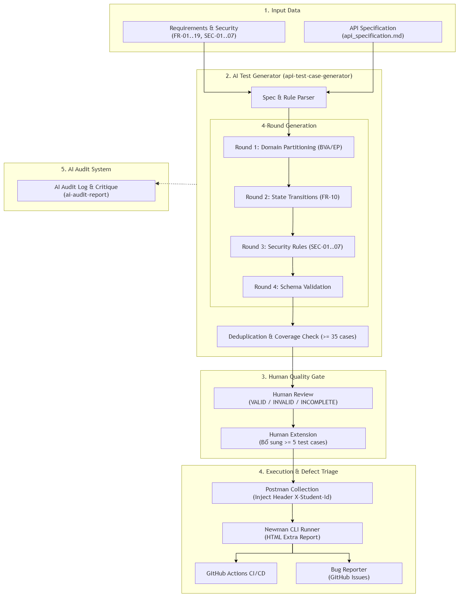

# Báo cáo chính — HW06 Kiểm thử API

## Mục lục

- [Thông tin sinh viên](#thông-tin-sinh-viên)
- [1. Giới thiệu và phạm vi](#1-giới-thiệu-và-phạm-vi)
- [2. Phương pháp và oracle](#2-phương-pháp-và-oracle)
- [3. API 1 — FR-04](#3-api-1--fr-04-put-apiusersme)
- [4. API 2 — FR-09](#4-api-2--fr-09-post-apiapply-coupon)
- [5. API 3 — FR-17](#5-api-3--fr-17-post-apiadmincoupons)
- [6. Tổng hợp kết quả](#6-tổng-hợp-kết-quả)
- [7. Tính năng Postman](#7-tính-năng-postman-đã-sử-dụng)
- [8. CI/CD](#8-cicd)
- [9. AI-driven API test generator](#9-thiết-kế-ai-driven-api-test-generator)
- [10. Bằng chứng thực thi](#10-bằng-chứng-thực-thi-và-chống-gian-lận)
- [11. AI Critique](#11-nhận-xét-phê-bình-ai--200300-từ)
- [12. Hạn chế](#12-hạn-chế-và-quyết-định-chất-lượng)
- [13. Kết luận](#13-kết-luận)
- [Phụ lục và liên kết](#phụ-lục-và-liên-kết)

## Thông tin sinh viên

| Mục                 | Nội dung                                                                                          |
| ------------------- | ------------------------------------------------------------------------------------------------- |
| Họ và tên           | Mạch Quốc Tấn                                                                                     |
| MSSV                | 23127115                                                                                          |
| Môn học             | Kiểm thử phần mềm                                                                                 |
| Bài tập             | HW06 — AI-driven API Testing                                                                      |
| SUT                 | EShop                                                                                             |
| Repository          | [yuran1811/hcmus-sw-testing--eshop-sut](https://github.com/yuran1811/hcmus-sw-testing--eshop-sut) |
| Nhánh thực hiện     | `hw6/23127115-mqtan`                                                                              |
| Ngày thực thi chính | 22/08/2026                                                                                        |

## 1. Giới thiệu và phạm vi

Bài tập kiểm thử ba API backend thuộc ba nhóm chức năng khác nhau:

| Pool | Requirement                   | Endpoint                  | Mục tiêu                                                             |
| ---- | ----------------------------- | ------------------------- | -------------------------------------------------------------------- |
| A    | FR-04 — Quản lý hồ sơ cá nhân | `PUT /api/users/me`       | Cập nhật đúng trường được phép, bảo vệ danh tính và dữ liệu nhạy cảm |
| B    | FR-09 — Áp dụng mã giảm giá   | `POST /api/apply-coupon`  | Kiểm tra điều kiện coupon, công thức tiền và contract đầu vào/đầu ra |
| C    | FR-17 — Quản lý mã giảm giá   | `POST /api/admin/coupons` | Kiểm tra quyền admin, validation, uniqueness và trạng thái coupon    |

Mỗi API đi qua cùng pipeline: sinh test case bằng AI theo bốn vòng, human review, bổ sung case human, thực thi Postman/Newman và báo cáo bug. Bộ cuối gồm **145 test case**, trong đó **126 case AI sinh** và **19 case human bổ sung**.

## 2. Phương pháp và oracle

### 2.1 Quy trình sinh test bằng AI

Codex được cung cấp FR, SEC và API specification. Việc sinh test được chia thành bốn vòng:

1. Domain Partition: miền hợp lệ, không hợp lệ, null/thiếu, boundary và kiểu dữ liệu.
2. State Transition: trạng thái trước/sau, request lặp, rollback, sequence và concurrency.
3. Security: authentication, authorization, IDOR, mass assignment, injection, XSS, prototype pollution và dữ liệu nhạy cảm.
4. Schema Validation: status, JSON schema, exact field, kiểu dữ liệu và error contract.

Prompt, thời điểm và kết quả AI được lưu tại [AI_Audit_Report.md](./ai-report/AI_Audit_Report.md). Danh sách review đầy đủ nằm tại [Generated_API_Test_Suites_Review_List.md](./ai-report/Generated_API_Test_Suites_Review_List.md).

### 2.2 Human review

Mỗi case AI được gán một trong ba nhãn:

- **VALID:** mục tiêu và oracle có căn cứ từ FR/SEC/API specification.
- **INCOMPLETE:** ý tưởng phù hợp nhưng specification chưa đủ để chốt status, schema hoặc hậu điều kiện.
- **INVALID:** không áp dụng hoặc trái specification.

Các case INCOMPLETE được giữ nhãn review gốc để phản ánh giới hạn đầu ra AI; trước khi chạy, execution contract và fixture bổ sung oracle có thể kiểm chứng. Không có case INVALID trong ba suite.

### 2.3 Môi trường thực thi

- SUT: `http://127.0.0.1:3100`.
- Fixture service: `http://127.0.0.1:3001`.
- Công cụ: Postman, Newman 6, Node.js 22, Windows.
- Mọi request được collection-level pre-request script gắn `X-Student-Id: 23127115`.
- Fixture reset seed, snapshot trạng thái, kiểm tra hậu điều kiện và teardown giữa các iteration.

## 3. API 1 — FR-04 `PUT /api/users/me`

### 3.1 Generate with AI

AI sinh **44 case**:

| Kỹ thuật          | AI sinh | Human bổ sung |   Tổng |
| ----------------- | ------: | ------------: | -----: |
| Domain Partition  |      22 |             0 |     22 |
| State Transition  |       5 |             3 |      8 |
| Security          |      12 |             4 |     16 |
| Schema Validation |       5 |             0 |      5 |
| **Tổng**          |  **44** |         **7** | **51** |

### 3.2 Audit

| Nhãn        | Số lượng |
| ----------- | -------: |
| VALID       |       20 |
| INCOMPLETE  |       24 |
| INVALID     |        0 |
| **Tổng AI** |   **44** |

Các case INCOMPLETE chủ yếu liên quan min/max length, trim/null, partial update, status validation và exact schema chưa được specification mô tả đầy đủ. Sau review, oracle được chốt trong execution contract, đồng thời bổ sung GET hậu kiểm và snapshot user/role.

### 3.3 Extend

Bảy case human được bổ sung:

- `FR04-USRME-SEC-013`: Authorization scheme Basic/Token.
- `FR04-USRME-SEC-014`: prototype pollution.
- `FR04-USRME-SEC-015`: IDOR qua các alias `id/userId/user_id`.
- `FR04-USRME-SEC-016`: nhóm unknown sensitive fields.
- `FR04-USRME-ST-006`: validation lỗi không được thay đổi trường hợp lệ.
- `FR04-USRME-ST-007`: hai request liên tiếp phải giữ ownership.
- `FR04-USRME-ST-008`: retry sau timeout.

AI bỏ sót vì prompt ban đầu thiên về payload đơn và happy path; các alias định danh, atomicity và retry cần phân tích state sâu hơn.

### 3.4 Execute

| Chỉ số            | Kết quả |
| ----------------- | ------: |
| Test case         |      51 |
| Pass              |       0 |
| Fail              |      51 |
| Assertion failure |     168 |

Cả 51 iteration bị đánh dấu Fail vì GET hậu kiểm luôn lộ `password`; một số flow cập nhật chính vẫn đúng nhưng cùng thất bại ở assertion bảo mật dùng chung.

- [Test run](../tests/test-runs/api/FR04_PUT_api_users_me/FR04_PUT_api_users_me_test_run.md)
- [Newman HTML](../tests/test-runs/api/reports/FR04_PUT_api_users_me_2026-08-22T16-07-51-183Z.html)
- [Test case Excel](../tests/test-cases/api/FR04_PUT_api_users_me/FR04_PUT_api_users_me_test_cases.xlsx)

### 3.5 Report bugs

| Bug           | Severity | Mô tả                                           | Issue                                                                       |
| ------------- | -------- | ----------------------------------------------- | --------------------------------------------------------------------------- |
| BUG-USRME-001 | Critical | GET profile lộ password/reset token             | [#330](https://github.com/yuran1811/hcmus-sw-testing--eshop-sut/issues/330) |
| BUG-USRME-002 | Critical | Mass assignment cho phép nâng role              | [#331](https://github.com/yuran1811/hcmus-sw-testing--eshop-sut/issues/331) |
| BUG-USRME-003 | Major    | Thiếu validation và cập nhật không nguyên tử    | [#332](https://github.com/yuran1811/hcmus-sw-testing--eshop-sut/issues/332) |
| BUG-USRME-004 | Major    | Sai Content-Type gây 500/HTML và lộ stack trace | [#333](https://github.com/yuran1811/hcmus-sw-testing--eshop-sut/issues/333) |
| BUG-USRME-005 | Major    | Partial update làm trường không gửi thành null  | [#334](https://github.com/yuran1811/hcmus-sw-testing--eshop-sut/issues/334) |

## 4. API 2 — FR-09 `POST /api/apply-coupon`

### 4.1 Generate with AI

| Kỹ thuật          | AI sinh | Human bổ sung |   Tổng |
| ----------------- | ------: | ------------: | -----: |
| Domain Partition  |      22 |             0 |     22 |
| State Transition  |       5 |             3 |      8 |
| Security          |       8 |             3 |     11 |
| Schema Validation |       5 |             0 |      5 |
| **Tổng**          |  **40** |         **6** | **46** |

### 4.2 Audit

| Nhãn        | Số lượng |
| ----------- | -------: |
| VALID       |       18 |
| INCOMPLETE  |       22 |
| INVALID     |        0 |
| **Tổng AI** |   **40** |

Khoảng trống chính là format code, coercion số, exact status/schema và semantics usage. Review xác nhận endpoint này chỉ tính toán discount, không tự cập nhật `coupon_usage`; vì vậy case concurrency mong đợi hai response 200 và Issue #347 trước đây đã được đóng là false positive.

### 4.3 Extend

Sáu case human gồm:

- `SEC-009`: hai request tính toán đồng thời tại biên usage.
- `SEC-010`: kết hợp tampering discount/trạng thái.
- `SEC-011`: ký tự điều khiển và encoded payload.
- `ST-006`: request bị từ chối không làm thay đổi usage.
- `ST-007`: phép tính không tự tăng lượt dùng.
- `ST-008`: boundary `expired_at`.

AI bỏ sót vì thường kiểm tra endpoint đơn lẻ, ít kết hợp payload và chưa mô hình hóa rõ ranh giới giữa phép tính với thay đổi trạng thái.

### 4.4 Execute

| Chỉ số            | Kết quả |
| ----------------- | ------: |
| Test case         |      46 |
| Pass              |      20 |
| Fail              |      26 |
| Assertion failure |      70 |

- [Test run](../tests/test-runs/api/FR09_POST_api_apply_coupon/FR09_POST_api_apply_coupon_test_run.md)
- [Newman HTML](../tests/test-runs/api/reports/FR09_POST_api_apply_coupon_2026-08-22T16-08-24-818Z.html)
- [Test case Excel](../tests/test-cases/api/FR09_POST_api_apply_coupon/FR09_POST_api_apply_coupon_test_cases.xlsx)

### 4.5 Report bugs

| Bug                 | Severity | Mô tả                                    | Issue                                                                       |
| ------------------- | -------- | ---------------------------------------- | --------------------------------------------------------------------------- |
| BUG-APPLYCOUPON-001 | Critical | Không bắt buộc JWT hợp lệ                | [#335](https://github.com/yuran1811/hcmus-sw-testing--eshop-sut/issues/335) |
| BUG-APPLYCOUPON-002 | Critical | Tính discount/final amount sai           | [#336](https://github.com/yuran1811/hcmus-sw-testing--eshop-sut/issues/336) |
| BUG-APPLYCOUPON-003 | Major    | Chấp nhận total_amount sai kiểu          | [#337](https://github.com/yuran1811/hcmus-sw-testing--eshop-sut/issues/337) |
| BUG-APPLYCOUPON-004 | Minor    | Hết lượt dùng trả 400 thay vì 409        | [#338](https://github.com/yuran1811/hcmus-sw-testing--eshop-sut/issues/338) |
| BUG-APPLYCOUPON-005 | Major    | Tổng tiền bằng minimum bị từ chối        | [#339](https://github.com/yuran1811/hcmus-sw-testing--eshop-sut/issues/339) |
| BUG-APPLYCOUPON-006 | Minor    | Code sai định dạng trả 404 thay vì 400   | [#345](https://github.com/yuran1811/hcmus-sw-testing--eshop-sut/issues/345) |
| BUG-APPLYCOUPON-007 | Major    | Chấp nhận field ngoài contract/tampering | [#346](https://github.com/yuran1811/hcmus-sw-testing--eshop-sut/issues/346) |

## 5. API 3 — FR-17 `POST /api/admin/coupons`

### 5.1 Generate with AI

| Kỹ thuật          | AI sinh | Human bổ sung |   Tổng |
| ----------------- | ------: | ------------: | -----: |
| Domain Partition  |      25 |             0 |     25 |
| State Transition  |       5 |             3 |      8 |
| Security          |       6 |             3 |      9 |
| Schema Validation |       6 |             0 |      6 |
| **Tổng**          |  **42** |         **6** | **48** |

### 5.2 Audit

| Nhãn        | Số lượng |
| ----------- | -------: |
| VALID       |       18 |
| INCOMPLETE  |       24 |
| INVALID     |        0 |
| **Tổng AI** |   **42** |

Các case INCOMPLETE tập trung vào format/length code, coercion số, status/schema tạo thành công, percent tối đa, date và semantics delete. Execution contract chốt oracle có thể chạy, nhưng nhãn review gốc được giữ để thể hiện giới hạn specification và AI.

### 5.3 Extend

Sáu case human:

- `SEC-007`: prototype pollution và unknown-field batch.
- `SEC-008`: hai admin tạo đồng thời cùng code.
- `SEC-009`: giả mạo `admin_id/created_by/user_id`.
- `ST-006`: validation fail không tạo dữ liệu một phần.
- `ST-007`: create → list → apply.
- `ST-008`: create → delete → recreate.

AI bỏ sót vì prompt ban đầu chủ yếu kiểm tra field độc lập và state tuyến tính, chưa ép phân tích atomicity, ownership alias và chuỗi cross-API.

### 5.4 Execute

| Chỉ số            | Kết quả |
| ----------------- | ------: |
| Test case         |      48 |
| Pass              |       2 |
| Fail              |      46 |
| Assertion failure |     147 |

- [Test run](../tests/test-runs/api/FR17_POST_api_admin_coupons/FR17_POST_api_admin_coupons_test_run.md)
- [Newman HTML](../tests/test-runs/api/reports/FR17_POST_api_admin_coupons_2026-08-22T16-08-46-471Z.html)
- [Test case Excel](../tests/test-cases/api/FR17_POST_api_admin_coupons/FR17_POST_api_admin_coupons_test_cases.xlsx)

### 5.5 Report bugs

| Bug                 | Severity | Mô tả                                | Issue                                                                       |
| ------------------- | -------- | ------------------------------------ | --------------------------------------------------------------------------- |
| BUG-ADMINCOUPON-001 | Critical | User thường gọi được API admin       | [#340](https://github.com/yuran1811/hcmus-sw-testing--eshop-sut/issues/340) |
| BUG-ADMINCOUPON-002 | Major    | Thiếu validation dữ liệu coupon      | [#341](https://github.com/yuran1811/hcmus-sw-testing--eshop-sut/issues/341) |
| BUG-ADMINCOUPON-003 | Minor    | Tạo thành công trả 200 thay vì 201   | [#342](https://github.com/yuran1811/hcmus-sw-testing--eshop-sut/issues/342) |
| BUG-ADMINCOUPON-004 | Major    | Code trùng gây 500 và lộ lỗi SQLite  | [#343](https://github.com/yuran1811/hcmus-sw-testing--eshop-sut/issues/343) |
| BUG-ADMINCOUPON-005 | Minor    | JWT bị chỉnh sửa trả 403 thay vì 401 | [#344](https://github.com/yuran1811/hcmus-sw-testing--eshop-sut/issues/344) |

## 6. Tổng hợp kết quả

| Chỉ số                       | FR-04 | FR-09 | FR-17 | Tổng |
| ---------------------------- | ----: | ----: | ----: | ---: |
| AI sinh                      |    44 |    40 |    42 |  126 |
| VALID                        |    20 |    18 |    18 |   56 |
| INCOMPLETE đã bổ sung oracle |    24 |    22 |    24 |   70 |
| INVALID                      |     0 |     0 |     0 |    0 |
| Human bổ sung                |     7 |     6 |     6 |   19 |
| Test case cuối               |    51 |    46 |    48 |  145 |
| Pass                         |     0 |    20 |     2 |   22 |
| Fail                         |    51 |    26 |    46 |  123 |
| Assertion failure            |   168 |    70 |   147 |  385 |
| Bug hợp lệ                   |     5 |     7 |     5 |   17 |

Theo severity: **5 Critical, 8 Major, 4 Minor**.

## 7. Tính năng Postman đã sử dụng

| Tính năng              | Cách sử dụng/bằng chứng                                        |
| ---------------------- | -------------------------------------------------------------- |
| Workspace              | `HW06 API Testing - 23127115`                                  |
| Collections/folders    | Ba collection, chia setup/main/special/verify/teardown         |
| Environment/variables  | `baseUrl`, `studentId`, token động và biến iteration           |
| Secret variables       | Token cloud để rỗng; credential chỉ giữ local                  |
| Pre-request script     | Gắn và log `X-Student-Id: 23127115` cho mọi request            |
| Data-driven            | 51 + 46 + 48 iteration từ ba JSON data file                    |
| Dynamic authentication | Login setup lưu token user/admin                               |
| Test scripts           | Status, schema, security, formula, state, response time        |
| Saved example/mock     | Response example cho coupon mock                               |
| Mock Server            | `HW06 Coupon Mock - 23127115`                                  |
| Monitor                | Lịch hằng ngày; run thành công 1 request/1 assertion/0 failure |
| Newman                 | HTML, JSON và result mapping cho full run                      |

Chi tiết và ảnh: [postman-features-used.md](../tests/test-runs/api/postman-features-used.md).

## 8. CI/CD

Workflow `.github/workflows/hw06-newman-ci.yml` chạy trên nhánh `hw6/23127115-mqtan`, dùng Ubuntu, Node.js 22 và Newman 6. Pipeline có smoke contract và full regression 145 case; artifact được upload kể cả khi regression phát hiện defect.

| Run                          | Commit                                                                                                                | Kết quả        | Actions                                                                                              |
| ---------------------------- | --------------------------------------------------------------------------------------------------------------------- | -------------- | ---------------------------------------------------------------------------------------------------- |
| Tất cả smoke assertions Pass | [`8e7a99e`](https://github.com/yuran1811/hcmus-sw-testing--eshop-sut/commit/8e7a99ec5eb02a7133d5a8fca5e34db70c7ee164) | 5/5 Pass       | [Run 32650809959](https://github.com/yuran1811/hcmus-sw-testing--eshop-sut/actions/runs/32650809959) |
| Chính xác một assertion Fail | [`ab9aa7e`](https://github.com/yuran1811/hcmus-sw-testing--eshop-sut/commit/ab9aa7e1832f3316b6860c7e2863bacec5ad9299) | 4 Pass, 1 Fail | [Run 32650917696](https://github.com/yuran1811/hcmus-sw-testing--eshop-sut/actions/runs/32650917696) |

Chi tiết: [ci-cd-report.md](../tests/test-runs/api/ci-cd-report.md).

## 9. Thiết kế AI-driven API test generator

### 9.1 Mục tiêu

Đầu vào là API specification cùng FR/SEC; đầu ra là test case có nguồn gốc, technique, oracle và trạng thái review. Thiết kế không để AI tự quyết toàn bộ: human gate bắt buộc trước khi xuất suite thực thi.

### 9.2 Luồng xử lý

1. Parse endpoint, method, parameters, schema, authentication và state rules.
2. Sinh từng vòng Domain → State → Security → Schema.
3. Chuẩn hóa ID và loại trùng theo intent/input/oracle.
4. Kiểm tra coverage và truy vết FR/SEC.
5. Human review VALID/INVALID/INCOMPLETE.
6. Bổ sung case human và lý do AI bỏ sót.
7. Xuất Markdown, Postman data/collection và traceability.
8. Chạy Newman, thu evidence và ánh xạ failure về root-cause bug.

### 9.3 Pseudocode

```text
function generateApiSuite(spec, requirements, securityRules):
    model = parseSpecification(spec, requirements, securityRules)
    suite = []

    for round in [DOMAIN, STATE, SECURITY, SCHEMA]:
        prompt = buildRoundPrompt(round, model, suite)
        candidates = callAI(prompt)
        suite += normalizeAndValidate(candidates, round)

    suite = deduplicateByIntentInputOracle(suite)
    coverage = calculateCoverage(suite, model)

    while coverage.hasCriticalGap():
        candidates = callAI(buildGapPrompt(coverage, model))
        suite += normalizeAndValidate(candidates)
        suite = deduplicateByIntentInputOracle(suite)
        coverage = calculateCoverage(suite, model)

    reviewed = humanReview(suite, labels=[VALID, INVALID, INCOMPLETE])
    reviewed = repairInvalidOrIncomplete(reviewed, approvedOracleContract)
    reviewed += collectHumanAddedCases(minimum=5)

    artifacts = exportMarkdownDataAndPostman(reviewed)
    results = runNewman(artifacts, requiredHeader="X-Student-Id")
    bugs = clusterUnexpectedFailuresByRootCause(results)
    return {reviewed, artifacts, results, bugs, coverage}
```

### 9.4 Sơ đồ tự vẽ

Sơ đồ được sinh viên tự thiết kế và vẽ bằng Draw.io. Bản PNG dùng trong báo cáo và source Draw.io có thể chỉnh sửa đều được nộp kèm:



- [Source Draw.io](../.agents/skills/HW6_AI_Test_Generator.drawio)
- [Ảnh PNG](../.agents/skills/HW6_AI_Test_Generator.png)

### 9.5 Video demo Agent Skill

Video minh họa Agent Skill và luồng sinh test API: [YouTube — HW06 AI Test Generator Demo](https://youtu.be/mCW0X0skeoo).

## 10. Bằng chứng thực thi và chống gian lận

- [Postman Console](../tests/test-runs/api/images/postman_console_student_id.png): có dòng `[X-Student-Id] Header set = 23127115`.
- Host Newman là `127.0.0.1`, khớp môi trường local.
- [Ảnh Postman workspace/environment](../tests/test-runs/api/images/postman_collections_with_local_environment.png).
- [Ảnh Monitor](../tests/test-runs/api/images/postman_monitor_success.png).
- [Ảnh Mock Server](../tests/test-runs/api/images/postman_mock_server.png).
- [Ảnh Issues 1](../tests/test-runs/api/images/github_api_bug_issues_01.png) và [Issues 2](../tests/test-runs/api/images/github_api_bug_issues_02.png).
- [Ảnh CI Pass](../tests/test-runs/api/images/github_actions_ci_pass.png) và [CI một failure](../tests/test-runs/api/images/github_actions_ci_one_failure.png).

Sơ đồ generator phải do sinh viên tự vẽ. Newman report, Postman Console và GitHub Actions là output thực thi thật, không được thay thế bằng ảnh tạo bởi AI.

## 11. Nhận xét, phê bình AI — 200–300 từ

Trong bài tập homework 6, về kiểm thử API, việc sử dụng AI giúp em rất nhiều trong việc xây dựng khung sườn để có thể sử dụng về phục vụ cho việc kiểm thử. Với việc sinh ra test cases cho mỗi API em chọn, AI thực hiện rất tốt trong việc đưa ra được số lượng test cases khá đầy đủ, nhưng các test cases đa số sẽ mắc phải vấn đề là tự sinh ra các test oracle, cái chưa được định nghĩa đầy đủ ở trong các tài liệu như đặc tả API hay tài liệu yêu cầu của eshop. Em phải xem xét và cập nhật lại các API sinh ra để phù hợp trong việc sử dụng để xây dựng các bước sau.

AI được em tiếp tục sử dụng để xây dựng các script để thực hiện với Newman, AI thực hiện khá tốt, không cần chỉnh sửa quá nhiều. AI trong bài tập này được em sử dụng là một model của Codex tốt hơn khá nhiều so với các model trước đây em sử dụng là Gemini, nên chất lượng cũng tốt hơn so với trước. Những model này sẽ bị khuyết điểm là tốc độ thực hiện các câu lệnh khá lâu, đôi khi prompt một lần đợi lâu nhưng kết quả không như mong muốn, phải prompt lại nhiều lần và mất thời gian khá nhiều. Vì vậy, em cần phải viết prompt chi tiết hơn, đầy đủ hơn để AI có thể làm đúng theo ý muốn.

Bản độc lập: [AI_Critique.md](./ai-report/AI_Critique.md).

## 12. Hạn chế và quyết định chất lượng

- Specification thiếu một số exact status/schema; execution contract được ghi rõ thay vì che giấu giả định.
- Issue #347 được đóng khi human review xác nhận endpoint FR09 chỉ tính toán; đây là minh chứng quy trình sửa false positive.
- Một test case Fail khi bất kỳ assertion nào sai; không suy diễn 385 assertion failure thành 385 bug.
- Kết quả full run được giữ nguyên để phản ánh defect SUT, không sửa oracle chỉ để làm xanh regression.

## 13. Kết luận

Ba API đã hoàn tất pipeline thiết kế, review, mở rộng, thực thi và báo bug. Bộ 145 case tạo traceability từ FR/SEC tới data-driven Postman, Newman report và 17 bug hợp lệ. AI Critique, sơ đồ Draw.io tự vẽ, source chỉnh sửa và video demo Agent Skill đã được nộp kèm.

## Phụ lục và liên kết

- [AI Audit Report](./ai-report/AI_Audit_Report.md)
- [AI Audit Report PDF](./ai-report/AI_Audit_Report.pdf)
- [AI Critique](./ai-report/AI_Critique.md)
- [AI Critique PDF](./ai-report/AI_Critique.pdf)
- [Sơ đồ AI Test Generator](../.agents/skills/HW6_AI_Test_Generator.png)
- [Video demo Agent Skill](https://youtu.be/mCW0X0skeoo)
- [Git Commit Log](../git_commit_log.txt)
- [Human Review List](./ai-report/Generated_API_Test_Suites_Review_List.md)
- [Test case Excel FR-04](../tests/test-cases/api/FR04_PUT_api_users_me/FR04_PUT_api_users_me_test_cases.xlsx)
- [Test case Excel FR-09](../tests/test-cases/api/FR09_POST_api_apply_coupon/FR09_POST_api_apply_coupon_test_cases.xlsx)
- [Test case Excel FR-17](../tests/test-cases/api/FR17_POST_api_admin_coupons/FR17_POST_api_admin_coupons_test_cases.xlsx)
- [Test Summary](../tests/test-summary/test-summary-report.md)
- [Traceability Matrix](../tests/test-summary/traceability-matrix.md)
- [Execution Summary](../tests/test-runs/api/execution-summary.md)
- [Bug Report Index](../tests/bug-reports/README.md)
- [Postman Features](../tests/test-runs/api/postman-features-used.md)
- [Monitor Evidence](../tests/test-runs/api/monitor-run-evidence.md)
- [CI/CD Report](../tests/test-runs/api/ci-cd-report.md)
