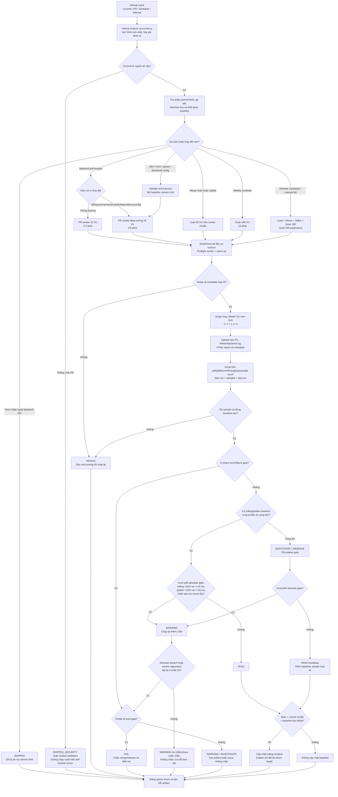

# Sơ đồ luồng kiểm thử hiệu năng liên tục

Sơ đồ này là phần trực quan của đề xuất phiên bản 1.3 trong [continuous-performance-testing.md](./continuous-performance-testing.md). Blueprint GitHub Actions/JMeter CLI nằm tại [continuous-performance-ci-blueprint.md](./continuous-performance-ci-blueprint.md). `Hard gate?` phụ thuộc profile: Load/Soak sau hiệu chỉnh là hard gate; PR smoke ban đầu và Stress/Spike hiện tại là advisory.

## Chú giải trạng thái

- `PASS`: metric đạt gate và không có tín hiệu hồi quy p95.
- `WARNING`: tín hiệu có thể là regression hoặc nhiễu; pipeline xác nhận bằng rerun và yêu cầu theo dõi.
- `WARNING / INVESTIGATE`: vi phạm đã xác nhận trong profile advisory; tạo bằng chứng/issue nhưng chưa chặn.
- `FAIL`: regression p95 lặp lại hoặc error/failure hợp lệ trong profile hard-gate; chặn merge hay release.
- `INVALID`: phép đo không đáng tin do setup, runner, dữ liệu hoặc artifact; không quy kết cho commit.
- `SKIPPED`: commit không ảnh hưởng phạm vi backend API; quyết định bỏ qua vẫn được ghi lại để kiểm toán.
- `SKIPPED_SECURITY`: commit đến từ nguồn không tin cậy nên không được thực thi trên self-hosted runner; chỉ chạy hosted validation hoặc chờ maintainer kích hoạt từ nhánh tin cậy.
- `BOOTSTRAP / OBSERVE`: profile chưa đủ baseline; chỉ dùng absolute/error gate và thu dữ liệu, chưa dùng relative p95 để chặn.
