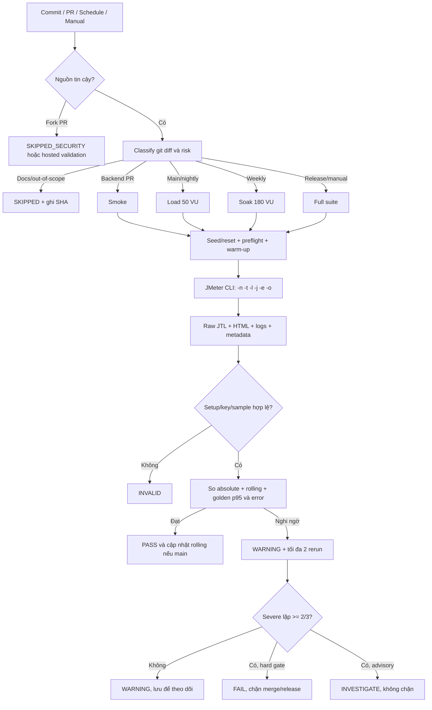

# BÁO CÁO KIỂM THỬ HIỆU NĂNG — ESHOP

## HW05-AI — Performance Testing

| Thuộc tính           | Nội dung                                                                           |
| -------------------- | ---------------------------------------------------------------------------------- |
| Sinh viên            | Mạch Quốc Tấn                                                                      |
| MSSV                 | `23127115`                                                                         |
| SUT                  | EShop — Node.js/Express/SQLite                                                     |
| Workflow             | Checkout with Coupon                                                               |
| Công cụ kiểm thử     | Apache JMeter `5.6.3`                                                              |
| Công cụ giám sát     | Windows Task Manager                                                               |
| Môi trường           | Localhost, `http://localhost:3000`                                                 |
| Nhánh thực hiện      | `hw5/23127115-mqtan`                                                               |
| Repository công khai | <https://github.com/yuran1811/hcmus-sw-testing--eshop-sut/tree/hw5/23127115-mqtan> |
| Ngày chạy chính thức | Load/Stress/Spike: `2026-08-13`; Soak: `2026-08-15`                                |
| Video Task 1         | <https://youtu.be/l4fiLiSnpyI>                                                     |
| Video Agent Skill    | <https://youtu.be/MjByvUU5z4k>                                                     |

> **Tuyên bố sử dụng AI:** Tôi sử dụng công cụ AI cho các nhiệm vụ được ghi trong [AI Audit Report](./ai-report/AI_Audit_Report.md). Mọi test plan, số liệu và kết luận trong báo cáo này đã được đối chiếu với mã nguồn, raw JTL và bằng chứng thực thi; các nội dung chưa triển khai hoặc chưa có bằng chứng được ghi rõ là đề xuất hoặc giới hạn.

## Mục lục

1. [Tóm tắt điều hành](#1-tóm-tắt-điều-hành)
2. [Mục tiêu, phạm vi và phương pháp](#2-mục-tiêu-phạm-vi-và-phương-pháp)
3. [Môi trường và bằng chứng](#3-môi-trường-và-bằng-chứng)
4. [Nhiệm vụ 1 — Thiết kế và thực thi kiểm thử với AI](#4-nhiệm-vụ-1--thiết-kế-và-thực-thi-kiểm-thử-với-ai)
5. [Kết quả thực thi và ngưỡng endurance](#5-kết-quả-thực-thi-và-ngưỡng-endurance)
6. [Nhiệm vụ 2 — Phân tích AI và săn lỗi hiểu sai](#6-nhiệm-vụ-2--phân-tích-ai-và-săn-lỗi-hiểu-sai)
7. [Đề xuất tối ưu hóa đã human-review](#7-đề-xuất-tối-ưu-hóa-đã-human-review)
8. [Vấn đề hiệu năng và giới hạn nghiên cứu](#8-vấn-đề-hiệu-năng-và-giới-hạn-nghiên-cứu)
9. [Kết luận — Nhiệm vụ 3: kiểm thử hiệu năng liên tục](#9-kết-luận--nhiệm-vụ-3-kiểm-thử-hiệu-năng-liên-tục)
10. [Agent Skills và Bloom-AI](#10-agent-skills-và-bloom-ai)
11. [AI Critique](#11-ai-critique)
12. [AI Audit, Git log và truy vết](#12-ai-audit-git-log-và-truy-vết)
13. [Tự đánh giá và checklist nộp bài](#13-tự-đánh-giá-và-checklist-nộp-bài)

## 1. Tóm tắt điều hành

Bài kiểm thử sử dụng cùng một workflow E2E gồm 7 request để bao phủ ba nhóm endpoint bắt buộc: auth-heavy, read-heavy và transactional. Ba test plan chính thức có tên đúng quy ước, dùng dữ liệu CSV và ba listener khác nhau. Các plan được AI tạo bản đầu, sau đó được sửa về công thức tổng giỏ hàng, JSON extractor, fail-fast assertion, cấu trúc XML tương thích JMeter CLI và mô hình tải Stress theo bốn stage cộng dồn.

Kết quả chính từ raw JTL:

- **Load 50 VU:** baseline sạch, `5,996` samples, `0%` lỗi, p95 `25 ms`.
- **Stress đến 200 VU:** `138,180` samples, 41 Duration Assertion failures, p95 `259 ms`; failure bắt đầu ở phút 12 và tail latency còn cao tới phút 17.
- **Spike 100 VU:** p95 của phần lớn phân phối chỉ `40.25 ms`, nhưng có 34 failures, 7 samples trên `5,000 ms` và max `481,450 ms`; vì vậy đây không phải một run sạch.
- **Soak 180 VU:** `0%` lỗi, p95 `20 ms`, whole-run throughput `104.725 rps`; lát sau ramp-up đạt khoảng `119.385 rps` và ổn định. Đây là ngưỡng bảo thủ được chọn.
- **Soak 230 VU:** `0%` lỗi, p95 raw toàn run `35 ms`, p99 `84 ms`, nhưng late-run p95 lên `94 ms`; đây là upper-bound cảnh báo chứ chưa phải failure point.

Task 2 xác định sáu lỗi/thiếu sót quan trọng trong cách AI đọc dashboard và diễn giải raw JTL. Các đề xuất tối ưu hóa chỉ được giữ lại khi phù hợp với stack Node.js/Express/SQLite; connection pool kiểu server database **không áp dụng trực tiếp** cho SQLite, còn horizontal scaling khi cart vẫn in-memory và JVM heap tuning bị loại khỏi kế hoạch trực tiếp.

Task 3 đề xuất GitHub Actions quan sát commit, phân loại thay đổi theo rủi ro, chạy JMeter CLI theo profile và gắn cờ regression p95 bằng rolling + golden baseline. Đây là **blueprint**, chưa phải pipeline đã triển khai.

## 2. Mục tiêu, phạm vi và phương pháp

### 2.1. Mục tiêu

1. Thiết kế và chạy Load, Stress, Spike bằng JMeter trên cùng một workflow E2E.
2. Dùng CSV để tạo workload có dữ liệu, tránh account lockout và coupon usage limit làm sai kết quả.
3. Đo response time, p95/p99, error rate, throughput và quan sát tài nguyên backend.
4. Chạy soak 10–15 phút ở nhiều mức tải để xác định ngưỡng ổn định thực nghiệm trên phần cứng local.
5. Dùng AI phân tích kết quả, sau đó kiểm tra lại bằng raw JTL và mã nguồn.
6. Đề xuất mô hình kiểm thử hiệu năng liên tục theo dõi commit và regression p95.

### 2.2. Workflow và ánh xạ endpoint

```text
POST /api/login
  -> GET /api/categories
  -> GET /api/products?search=${keyword}
  -> POST /api/cart
  -> POST /api/apply-coupon
  -> POST /api/checkout
  -> GET /api/orders/my-orders
```

| Nhóm          | Endpoint                    | Vai trò trong workflow                 |
| ------------- | --------------------------- | -------------------------------------- |
| Auth-heavy    | `POST /api/login`           | Xác thực, lấy JWT và `user_id`         |
| Read-heavy    | `GET /api/categories`       | Đọc danh mục                           |
| Read-heavy    | `GET /api/products?search=` | Tìm sản phẩm theo keyword từ CSV       |
| Transactional | `POST /api/cart`            | Ghi trạng thái giỏ hàng                |
| Transactional | `POST /api/apply-coupon`    | Kiểm tra coupon và tính `final_amount` |
| Transactional | `POST /api/checkout`        | Tạo đơn hàng                           |
| Read-heavy    | `GET /api/orders/my-orders` | Đọc sau ghi để xác minh workflow       |

Luồng được phân biệt với các luồng khác bằng nghiệp vụ checkout **có coupon**, trong đó `POST /api/apply-coupon` là bước đặc trưng. Tài liệu phạm vi đầy đủ: [performance_test_scope.md](./docs/test-report/performance_test_scope.md).

### 2.3. Phương pháp đo

Raw JTL là nguồn canonical. Báo cáo HTML được dùng để trực quan hóa, không thay thế raw log khi có chênh lệch.

- `elapsed`: response time hoàn tất sample, dùng tính average và percentile.
- `Latency`: thời gian đến byte đầu tiên; không được dùng thay `elapsed`.
- `success != true`: được tính là failure kể cả `responseCode=200`.
- `duration = (max(timeStamp) - min(timeStamp)) / 1000`.
- `whole-run throughput = samples / duration`.
- Percentile được tính trên toàn bộ `elapsed` bằng nội suy tuyến tính.
- Minute-window được tạo từ `timeStamp - min(timeStamp)` để phát hiện degradation theo thời gian.

Chi tiết phương pháp và số liệu theo sampler nằm trong [jtl-analysis.md](./docs/test-report/jtl-analysis.md).

## 3. Môi trường và bằng chứng

### 3.1. Phần cứng

| Hạng mục    | Giá trị                                                                                      |
| ----------- | -------------------------------------------------------------------------------------------- |
| Hostname    | `QUOCTAN`                                                                                    |
| OS          | Windows 11 Pro 64-bit, build `26200`                                                         |
| Máy         | Lenovo `21BV000SUS`                                                                          |
| CPU         | Intel Core i7-1260P thế hệ 12                                                                |
| Logical CPU | `16`                                                                                         |
| RAM         | `16 GB`                                                                                      |
| DirectX     | DirectX 12                                                                                   |
| Bằng chứng  | [hardware-dxdiag.png](./tests/2-test-runs/checkout-with-coupon/hardware/hardware-dxdiag.png) |

Mọi kết quả trong báo cáo là benchmark localhost trên máy này. Chúng là regression reference cho cùng môi trường, không phải SLO production.

### 3.2. Ma trận artifact

| Artifact            | Bằng chứng                                                                                                                                            | Trạng thái           |
| ------------------- | ----------------------------------------------------------------------------------------------------------------------------------------------------- | -------------------- |
| Load JMX            | [23127115_Load_20260813.jmx](./tests/1-test-plans/checkout-with-coupon/23127115_Load_20260813.jmx)                                                    | Có                   |
| Stress JMX          | [23127115_Stress_20260813.jmx](./tests/1-test-plans/checkout-with-coupon/23127115_Stress_20260813.jmx)                                                | Có                   |
| Spike JMX           | [23127115_Spike_20260813.jmx](./tests/1-test-plans/checkout-with-coupon/23127115_Spike_20260813.jmx)                                                  | Có                   |
| Soak JMX            | [23127115_Soak_20260815.jmx](./tests/1-test-plans/checkout-with-coupon/23127115_Soak_20260815.jmx)                                                    | Có                   |
| CSV và seed script  | [test-data](./tests/1-test-plans/checkout-with-coupon/test-data/), [seed_perf_users.js](./tests/1-test-plans/checkout-with-coupon/seed_perf_users.js) | Có                   |
| Raw JTL             | [2-test-runs](./tests/2-test-runs/checkout-with-coupon/)                                                                                              | Có 6 file chính thức |
| HTML dashboard      | `load/stress/spike/html-report` và `soak/html-report-*`                                                                                               | Có                   |
| Resource screenshot | Load, Stress, Spike và 6 ảnh Soak mid/late                                                                                                            | Có                   |
| Hardware screenshot | `hardware/hardware-dxdiag.png`                                                                                                                        | Có                   |
| Human review        | [jtl-analysis-review.md](./ai-report/task2/jtl-analysis-review.md)                                                                                    | Có                   |
| Optimization review | [optimization-recommendations-review.md](./ai-report/task2/optimization-recommendations-review.md)                                                    | Có                   |
| Continuous testing  | Proposal, flow chart và CI blueprint                                                                                                                  | Có ở mức thiết kế    |
| Video demo          | [Task 1](https://youtu.be/l4fiLiSnpyI), [Agent Skill](https://youtu.be/MjByvUU5z4k)                                                                   | Unlisted, tiếng Việt |

## 4. Nhiệm vụ 1 — Thiết kế và thực thi kiểm thử với AI

### 4.1. Quy trình AI-first có human review

Quy trình không dùng một prompt tổng quát duy nhất. AI được dẫn dắt theo các bước: chọn scope → sinh dữ liệu → thiết kế ba plan → review/sửa JMX → thiết kế soak → chạy thật và cập nhật bằng chứng. Prompt, model, thời gian, output và phần sinh viên giữ/sửa được ghi theo từng tương tác trong [AI Audit Report](./ai-report/AI_Audit_Report.md).

| Bước      | AI hỗ trợ                                             | Kiểm tra/quyết định của sinh viên                           |
| --------- | ----------------------------------------------------- | ----------------------------------------------------------- |
| Scope     | Phân loại endpoint và dựng workflow 7 bước            | Kiểm tra response shape/status code bằng source và chạy thử |
| Dữ liệu   | Tính sizing 300 users, tạo CSV và seed script         | Dùng coupon `PERFTEST`, `max_uses_per_user=9999`            |
| JMX       | Sinh Load/Stress/Spike với timer, assertion, listener | Sửa payload, extractor, XML và staged stress                |
| Soak      | Tạo plan parameterized 12 phút                        | Đổi dải chạy thành 130/180/230 VU và chạy thật              |
| Phân tích | Tính metric và đề xuất threshold                      | Tính lại raw, kiểm failure rows và minute-window            |

### 4.2. Dữ liệu hướng dữ liệu

`users.csv` có 300 dòng, dùng chung pool theo round-robin, gồm:

| Cột                     | Mục đích                                     |
| ----------------------- | -------------------------------------------- |
| `email`, `password`     | Login bằng tài khoản test đã seed            |
| `product_id`, `keyword` | Chọn/tìm sản phẩm                            |
| `quantity`              | Tính `cart_total = product_price × quantity` |
| `coupon_code`           | Dùng coupon `PERFTEST`                       |
| `shipping_address`      | Payload checkout                             |

`keywords.csv` chứa năm keyword và `coupons.csv` mô tả coupon chuyên dụng; hai file này phục vụ seed/tham chiếu, còn các JMX đọc trực tiếp `users.csv`. Script seed đồng bộ user/coupon vào SQLite trước mỗi scenario. Pool 300 account lớn hơn peak concurrency 230 VU, nhưng `recycle=true` có nghĩa account được dùng lại ở iteration sau khi CSV đi hết; 300 account không đồng nghĩa mỗi iteration toàn run có một account duy nhất. Login thành công reset lockout, và official run vẫn reseed trước từng scenario để loại trạng thái lỗi từ lần debug trước.

### 4.3. Cấu hình ba test plan bắt buộc

| Thuộc tính         |                         Load |                         Stress |                         Spike |
| ------------------ | ---------------------------: | -----------------------------: | ----------------------------: |
| File               | `23127115_Load_20260813.jmx` | `23127115_Stress_20260813.jmx` | `23127115_Spike_20260813.jmx` |
| VU                 |                           50 |  50 → 100 → 150 → 200 cộng dồn |                      100 peak |
| Ramp-up            |                        120 s |                 30 s mỗi stage |                          10 s |
| Start delay        |                            0 |                0/300/600/900 s |                          60 s |
| Duration cấu hình  |                        600 s |                  tối đa 1200 s |          480 s sau delay 60 s |
| Think time         |              `2000 ± 300 ms` |                `1000 ± 200 ms` |                `500 ± 100 ms` |
| Listener khác nhau |            View Results Tree |               Aggregate Report |                Summary Report |

Load tạo baseline bình thường. Stress tăng tải theo stage để quan sát thời điểm suy giảm thay vì chỉ ramp tuyến tính. Spike đưa 100 VU vào trong 10 giây sau idle delay 60 giây để mô phỏng sudden arrival; tổng thời gian tường xấp xỉ 540 giây. Plan Spike hiện chưa có baseline group và pha hạ tải riêng nên không được dùng để tuyên bố recovery time. Ba listener khác loại được lưu trong JMX theo yêu cầu; execution chính thức dùng CLI non-GUI và raw output từ `-l`.

### 4.4. Assertion và dependency

Mỗi bước kiểm tra response code và duration. Các biến quan trọng (`access_token`, `user_id`, `product_id_resp`, `product_name`, `product_price`, `final_amount`, `order_id`) được trích từ response và có `JSR223 Assertion` fail-fast. Cách này ngăn fallback giả làm workflow “pass” khi extractor thất bại.

### 4.5. Những lỗi AI đã tạo hoặc bỏ sót và cách sửa

| ID     | Lỗi/thiếu sót của AI                             | Tác động                     | Sửa trong bản cuối                    | Vì sao AI bỏ sót                                           |
| ------ | ------------------------------------------------ | ---------------------------- | ------------------------------------- | ---------------------------------------------------------- |
| JMX-01 | Gửi `${product_price}` làm `total_amount` coupon | Sai khi `quantity > 1`       | Tính `${cart_total}`                  | AI suy diễn payload từ một sản phẩm thay vì business total |
| JMX-02 | Dùng JSONPath `$.id` cho checkout                | Không lấy được order ID      | Dùng `$.orderId`                      | Response shape thực tế chưa được grounded vào backend      |
| JMX-03 | Có fallback mặc định cho extractor               | Có thể che lỗi workflow      | Bỏ fallback, thêm fail-fast assertion | Draft ưu tiên chạy tiếp hơn tính đúng                      |
| JMX-04 | Stress ramp tuyến tính 200 VU                    | Khó xác định stage suy giảm  | Bốn Thread Group cộng dồn             | Thiếu mô hình quan sát breakpoint                          |
| JMX-05 | JSONPath/plugin/hashTree không tương thích       | JMeter 5.6.3 CLI không parse | Groovy core post-processor, sửa XML   | AI sinh XML theo mẫu không được chạy thật                  |
| JMX-06 | Assertion XML cũ/malformed                       | Plan dừng trước execution    | Chuẩn hóa `stringProp` và layout      | Model không xác minh bằng parser CLI                       |

### 4.6. Cách chạy và reset trạng thái

Ví dụ lệnh canonical:

```bash
node submission/tests/1-test-plans/checkout-with-coupon/seed_perf_users.js

jmeter -n \
  -t submission/tests/1-test-plans/checkout-with-coupon/23127115_Load_20260813.jmx \
  -l submission/tests/2-test-runs/checkout-with-coupon/load/20260813-load-official.jtl \
  -j submission/tests/2-test-runs/checkout-with-coupon/load/20260813-load-official.log \
  -e -o submission/tests/2-test-runs/checkout-with-coupon/load/html-report
```

Account test được reseed trước các official run. Nếu có lockout, reset bằng:

```sql
UPDATE users
SET login_attempts = 0, locked_until = NULL
WHERE email LIKE 'perf_user%@eshop.com';
```

Checkout tạo dữ liệu thật trong database test, vì vậy không dùng dữ liệu production. Khi chạy lại để so sánh regression, cần reset/reseed database, lockout, cart và order state về điều kiện tương đương.

### 4.7. Bằng chứng công cụ và tài nguyên trong cùng khung hình

| Scenario | Ảnh                                                                                                |
| -------- | -------------------------------------------------------------------------------------------------- |
| Load     | [load-resource.png](./tests/2-test-runs/checkout-with-coupon/load/load-resource.png)               |
| Stress   | [stress-resource.png](./tests/2-test-runs/checkout-with-coupon/stress/stress-resource.png)         |
| Spike    | [spike-resource.png](./tests/2-test-runs/checkout-with-coupon/spike/spike-resource.png)            |
| Soak     | [thư mục soak](./tests/2-test-runs/checkout-with-coupon/soak/) — ảnh mid/late cho 130, 180, 230 VU |

Các ảnh cho thấy terminal JMeter và Task Manager lọc `node.exe` trong cùng khung hình. Đây là snapshot, không phải chuỗi telemetry liên tục.

### 4.8. Video demo YouTube

- **Video demo Task 1:** [https://youtu.be/l4fiLiSnpyI](https://youtu.be/l4fiLiSnpyI)
- **Video demo Agent Skill:** [https://youtu.be/MjByvUU5z4k](https://youtu.be/MjByvUU5z4k)

Video Task 1 là bằng chứng thuyết minh tiếng Việt cho quá trình chạy kiểm thử và quan sát tài nguyên. Video Agent Skill minh họa cách sử dụng skill trên workflow endpoint hoàn chỉnh.

## 5. Kết quả thực thi và ngưỡng endurance

### 5.1. Ground truth từ raw JTL

| Scenario       | Duration | Samples | Failures | Error rate | Whole-run throughput | Avg elapsed |      p95 |      p99 |        Max |
| -------------- | -------: | ------: | -------: | ---------: | -------------------: | ----------: | -------: | -------: | ---------: |
| Load 50 VU     | 1276.2 s |   5,996 |        0 |     0.000% |            4.698 rps |    17.41 ms |  25.0 ms | 51.35 ms |   2,360 ms |
| Stress ≤200 VU | 1198.7 s | 138,180 |       41 |  0.029671% |          115.276 rps |    55.98 ms | 259.0 ms | 925.0 ms |   3,486 ms |
| Spike 100 VU   |  718.2 s |  45,436 |       34 |  0.074831% |           63.266 rps |    91.21 ms | 40.25 ms |  68.0 ms | 481,450 ms |
| Soak 130 VU    |  718.3 s |  54,364 |        0 |     0.000% |           75.687 rps |     6.35 ms |  21.0 ms |  28.0 ms |     691 ms |
| Soak 180 VU    |  718.1 s |  75,207 |        0 |     0.000% |          104.725 rps |     6.59 ms |  20.0 ms |  29.0 ms |      71 ms |
| Soak 230 VU    |  718.4 s |  95,747 |        0 |     0.000% |          133.280 rps |    10.96 ms |  35.0 ms |  84.0 ms |     311 ms |

> Bảng này ưu tiên phép tính đã human-review trực tiếp từ raw JTL. Với Soak 230, p95 toàn phiên là `35 ms`, p99 là `84 ms`; p95 ở cửa sổ cuối là `94 ms`.

### 5.2. Load

Load hoàn thành không có failure và có tail latency thấp. Sampler p95 cao nhất là `Step 6 POST checkout` khoảng `29 ms`. Max `2,360 ms` không đại diện cho phần lớn phân phối, nhưng vẫn được lưu để theo dõi. Outcome: **PASS baseline**.

### 5.3. Stress

Stress tạo `41` failure dù tất cả failure này có HTTP `200`: Duration Assertion đánh dấu `success=false` do elapsed vượt `2,000 ms`. Failure tập trung ở Products `17`, My Orders `18`, Categories `6`. Phút 12 có `7,006` requests, 41 failures, error rate `0.585%`, p95 `1,246.75 ms`; p95 vẫn cao ở phút 13–17 rồi giảm về `49 ms` ở phút 18. `apply-coupon` là sampler có p95 cao nhất (`427 ms`) nhưng raw JTL chưa chứng minh nguyên nhân database. Outcome: **WARNING / cần điều tra**, không gọi là clean pass.

### 5.4. Spike

P95 và p99 thấp vì phần lớn samples nhanh, nhưng run có 34 failures. Bảy samples vượt `5,000 ms`; khoảng giây `237.485` có sáu Duration Assertion failures khoảng 480–481 giây và một `SocketException`. Cuối run còn 27 Duration Assertion failures khoảng 2.0–2.2 giây. Vì vậy max `481,450 ms` không phải một outlier vô hại hay chỉ xuất hiện ở cuối run. Outcome: **INVESTIGATION FAILURE**. Artifact hiện chưa chứng minh trực quan recovery trong hai phút bằng chart theo phase.

### 5.5. Endurance/Soak và ngưỡng ổn định

Soak plan chạy 12 phút, ramp-up 180 giây, think time `1500 ± 200 ms` ở ba mức tải.

| Mức tải |                   Sau ramp-up 180–660 s | Tail/late-run                       | Diễn giải           |
| ------- | --------------------------------------: | ----------------------------------- | ------------------- |
| 130 VU  |  `86.292 rps`, p95 `21 ms`, p99 `29 ms` | Ổn định, 0 failure                  | PASS                |
| 180 VU  | `119.385 rps`, p95 `20 ms`, p99 `29 ms` | Late p95 khoảng 19–22 ms, 0 failure | Stable baseline     |
| 230 VU  | `152.192 rps`, p95 `30 ms`, p99 `64 ms` | Late-run p95 lên `94 ms`, 0 failure | Upper-bound warning |

**Ngưỡng chịu tải bền vững bảo thủ:** `180 VUs`, khoảng `119.385 rps` trong lát sau ramp-up; whole-run average là `104.725 rps`. `230 VUs` chưa thất bại nhưng là mức đầu tiên cho thấy tail latency cuối run tăng rõ nên không được chọn làm baseline bảo thủ.

Ảnh Task Manager ở Soak cho thấy process backend chính khoảng `61.3–65.2 MB` ở 180 VU và khoảng `63.1–63.6 MB` ở 230 VU. Do đây chỉ là snapshot, báo cáo chỉ kết luận **mức bộ nhớ backend quan sát cao nhất khoảng 65.2 MB**, không tuyên bố đây là peak RSS tuyệt đối. Ở ảnh 230 VU cuối run, tổng Disk của host đạt `99%` tại thời điểm chụp; đây là tín hiệu môi trường cần theo dõi, không đủ để quy nguyên nhân cho SQLite hay backend nếu chưa có telemetry liên tục.

## 6. Nhiệm vụ 2 — Phân tích AI và săn lỗi hiểu sai

### 6.1. Đầu ra AI và quy trình kiểm chứng

AI ban đầu phân tích sáu JTL, tổng hợp metric, xác định hotspot, đề xuất threshold và optimization. Sinh viên sau đó:

1. tính lại percentile trên `elapsed`;
2. đếm failure bằng `success` thay vì chỉ HTTP status;
3. định vị sample theo `timeStamp`;
4. phân tích minute-window;
5. đối chiếu query/schema trong Node.js/SQLite;
6. tách symptom đo được khỏi giả thuyết nguyên nhân.

Đầu ra AI thô: [jtl-analysis-raw.md](./ai-report/task2/jtl-analysis-raw.md). Human review: [jtl-analysis-review.md](./ai-report/task2/jtl-analysis-review.md). Bản phân tích đã sửa: [jtl-analysis.md](./docs/test-report/jtl-analysis.md).

### 6.2. Misinterpretation hunt

|   # | Claim/cách đọc của AI                       | Giá trị đúng từ raw JTL                                                             | Lỗi và sửa chữa                                        |
| --: | ------------------------------------------- | ----------------------------------------------------------------------------------- | ------------------------------------------------------ |
|   1 | Stress p95 khoảng `53 ms` từ dashboard      | Raw `elapsed` p95 `259 ms`, p99 `925 ms`                                            | Dashboard aggregate không được thay raw percentile     |
|   2 | Spike max ở cuối run                        | Max nằm khoảng giây `237.485`                                                       | AI không tính `timeStamp - min(timeStamp)`             |
|   3 | Spike max là một outlier đơn lẻ             | 34 failures; 7 samples >5,000 ms; 1 SocketException                                 | Phải báo failure episode, không loại khỏi đánh giá     |
|   4 | Stress degradation chỉ ở phút 12            | Failure bắt đầu phút 12; p95 còn cao tới phút 17                                    | Phân biệt first failure window với toàn bộ degradation |
|   5 | Failure “có thể” là assertion/timeout       | Stress 41/41 là Duration Assertion; Spike 33 Duration Assertion + 1 SocketException | Raw `failureMessage` cho phép định lượng chính xác     |
|   6 | `104.725 rps` là steady throughput Soak 180 | Đây là whole-run average có 180 s ramp-up; lát sau ramp-up `119.385 rps`            | Cần ghi nhãn đúng cửa sổ đo                            |

### 6.3. Những phần AI đọc đúng và được giữ

- Tổng sample, failure và whole-run throughput của sáu JTL khớp raw.
- Stress p95 raw `259 ms`, p99 `925 ms`, error rate `0.029671%`.
- Spike p95 `40.25 ms`, p99 `68 ms`, error rate `0.074831%`.
- Soak 180 là baseline bảo thủ hợp lý vì 0 failure và late-run ổn định.
- Soak 230 là upper-bound/warning, chưa phải failure point.
- Threshold phải dùng `elapsed`, không dùng `Latency` thay thế.

### 6.4. Threshold đề xuất sau review

| Scenario |                      Error gate |     p95 |      p99 | Throughput reference | Kết luận hiện tại         |
| -------- | ------------------------------: | ------: | -------: | -------------------: | ------------------------- |
| Load     |              ≤0.5%, mục tiêu 0% | ≤100 ms |  ≤250 ms |               ≥4 rps | PASS                      |
| Stress   | ≤5% exploratory; ≤1% regression | ≤500 ms | ≤1500 ms |             ≥100 rps | WARNING do failure window |
| Spike    | ≤5% exploratory; ≤1% regression | ≤100 ms |  ≤200 ms |              ≥50 rps | Investigation failure     |
| Soak 130 |              ≤0.5%, mục tiêu 0% |  ≤50 ms |  ≤100 ms |    ≥70 rps whole-run | PASS                      |
| Soak 180 |              ≤0.5%, mục tiêu 0% |  ≤50 ms |  ≤100 ms |   ≥100 rps whole-run | Stable baseline           |
| Soak 230 |                             ≤1% | ≤100 ms |  ≤200 ms |   ≥125 rps whole-run | Upper-bound warning       |

Các ngưỡng là reference ban đầu cho cùng hardware, dataset và profile. Cần nhiều clean run để ước lượng variance trước khi dùng làm hard CI gate.

## 7. Đề xuất tối ưu hóa đã human-review

Raw JTL chỉ chứng minh symptom; không chứa query plan, SQLite lock wait, event-loop delay hoặc CPU profile. Vì vậy mọi thay đổi phải được xác nhận bằng `EXPLAIN QUERY PLAN`, profiling và A/B benchmark trên cùng JMX/dataset/hardware.

### 7.1. Đề xuất được giữ lại

| Ưu tiên | Đề xuất                                                | Phân loại sau review           | Điều kiện/xác minh                                          |
| ------: | ------------------------------------------------------ | ------------------------------ | ----------------------------------------------------------- |
|      P0 | Thêm query duration, lock/event-loop/RSS observability | Khả thi                        | Đo trước khi tối ưu                                         |
|      P0 | Parameterize product search                            | Khả thi                        | Sửa security/correctness; không tự làm `%keyword%` nhanh    |
|      P1 | Index `users(email)`                                   | Khả thi có điều kiện           | Kiểm duplicate/uniqueness, query plan và A/B                |
|      P1 | Index `orders(user_id, id DESC)`                       | Khả thi                        | Khớp filter/order; chưa chứng minh table scan               |
|      P1 | Index `coupon_usage(coupon_id, user_id)`               | Khả thi                        | Khớp lookup; benchmark p95/p99                              |
|      P1 | Index `coupons(code, is_active)`                       | Khả thi có điều kiện           | Có thể dư vì `code` đã `UNIQUE`                             |
|      P1 | SQLite WAL + giới hạn `busyTimeout`                    | Khả thi                        | Đo lock/failure/latency trước-sau; timeout có thể tăng wait |
|      P2 | Projection, pagination                                 | Khả thi                        | Cập nhật API/client contract                                |
|      P2 | FTS5 hoặc prefix search                                | Khả thi có điều kiện           | Phụ thuộc dataset, SQLite build và search semantics         |
|      P2 | Prepared statement cho hot path                        | Khả thi                        | Quản lý reset/finalize/concurrency                          |
|      P2 | Cache categories/search có TTL/invalidation            | Khả thi có điều kiện           | Chỉ dùng khi hit rate đủ; đo overhead                       |
|      P2 | Transaction hóa checkout + coupon usage                | Khả thi nhưng thay đổi lớn     | Cập nhật API, rollback/retry và consistency                 |
| Dài hạn | Redis cache hoặc migration PostgreSQL/MySQL            | Khả thi có điều kiện kiến trúc | Không phải quick fix từ JTL hiện tại                        |

### 7.2. Đề xuất ảo giác hoặc không áp dụng trực tiếp đã loại bỏ

| Đề xuất                                                                             | Phân loại                             | Lý do loại khỏi kế hoạch trực tiếp                                                   |
| ----------------------------------------------------------------------------------- | ------------------------------------- | ------------------------------------------------------------------------------------ |
| Connection pool kiểu PostgreSQL/MySQL cho SQLite hiện tại                           | Hallucinated nếu coi là quick fix     | SUT dùng một `sqlite3.Database`; pool không xóa writer serialization/lock contention |
| Horizontal scaling nhiều Node instance khi vẫn dùng SQLite và `userCarts` in-memory | Hallucinated trong kiến trúc hiện tại | Cart không shared và nhiều process vẫn tranh chấp file DB                            |
| JVM heap tuning                                                                     | Hallucinated                          | Backend là Node.js/V8, không phải JVM                                                |

Connection pool trở thành hợp lệ **sau** khi migration sang database server; horizontal scaling chỉ hợp lệ sau khi database và cart/session được đưa vào shared store. Báo cáo đề xuất chi tiết: [optimization-recommendations.md](./docs/test-report/optimization-recommendations.md).

## 8. Vấn đề hiệu năng và giới hạn nghiên cứu

### 8.1. Issue hiệu năng

Báo cáo chi tiết: [ISSUE-CWC-001.md](./tests/3-test-summary/checkout-with-coupon/issue-reports/ISSUE-CWC-001.md). Đã đăng lên GitHub tại [GitHub Issue #293](https://github.com/yuran1811/hcmus-sw-testing--eshop-sut/issues/293): Stress có degradation bắt đầu gần phút 12, p95 minute-window `1,246.75 ms`, 41 Duration Assertion failures. Đây là quan sát hiệu năng mức Medium/P2, cần tiếp tục theo dõi và kiểm chứng trên môi trường độc lập.

### 8.2. Giới hạn

1. Mỗi profile chính chỉ có một official run; chưa có confidence interval hoặc variance từ nhiều lần lặp.
2. Throughput whole-run bị ảnh hưởng bởi ramp-up, stage delay và request hoàn tất muộn.
3. Ảnh Task Manager là snapshot; không phải chuỗi CPU/RSS/disk telemetry liên tục.
4. Raw JTL không cho biết query plan, lock wait, V8 event-loop delay hoặc nguyên nhân request treo.
5. Spike chưa có bằng chứng recovery theo phase trong vòng hai phút.
6. Soak 230 chưa chạm failure point; không thể kết luận 230 VU là maximum capacity.
7. Kết quả localhost không được suy rộng trực tiếp sang production.
8. Mỗi profile chính chỉ có một official run nên baseline CI vẫn cần thêm các clean run lặp lại để ước lượng variance.

## 9. Kết luận — Nhiệm vụ 3: kiểm thử hiệu năng liên tục

### 9.1. Mô hình đề xuất

Mô hình dùng GitHub Actions theo dõi commit/PR/merge/schedule/manual event. `git diff` và risk classifier quyết định profile, còn script Bash dùng chung giữa local và CI chuẩn bị SUT, seed/reset dữ liệu, chạy JMeter non-GUI, phân tích raw JTL, so baseline và publish artifact.

| Trigger/thay đổi                               | Profile đề xuất              | Gate ban đầu                          |
| ---------------------------------------------- | ---------------------------- | ------------------------------------- |
| Docs/out-of-scope                              | Skip nhưng ghi SHA/lý do     | Không chặn                            |
| Backend PR nội bộ                              | Smoke 10–20 VU, 2–5 phút     | Observe/soft gate                     |
| DB/query/auth/transaction/config/dependency PR | Smoke tăng cường             | Soft gate đến khi đủ baseline         |
| Merge main/nightly                             | Load 50 VU                   | Hard gate sau hiệu chỉnh              |
| Weekly                                         | Soak 180 VU                  | Hard gate sau hiệu chỉnh              |
| Release/manual                                 | Load + Stress + Spike + Soak | Load/Soak hard; Stress/Spike advisory |

PR từ fork không chạy code trên self-hosted performance runner; chỉ hosted validation hoặc `SKIPPED_SECURITY`. Job của SHA cũ bị hủy khi commit mới đến, và mỗi runner chỉ chạy một performance job để tránh tranh chấp tài nguyên.

### 9.2. Quy tắc regression p95

Chỉ so sánh khi cùng baseline key: scenario, sampler, JMX hash, dataset hash, backend config, runtime và runner class. Candidate được so với:

- rolling median của 5 run `PASS` gần nhất;
- golden baseline được phê duyệt theo release;
- absolute gate theo scenario/sampler;
- error rate, sample count và late-run trend.

Tín hiệu đáng ngờ dùng điều kiện kép `% + delta_ms`, ví dụ rolling `>20%` và `≥10 ms`, golden `>25%` và `≥15 ms`. Mặc định chạy một lần; chỉ khi `WARNING` mới chạy thêm tối đa hai lần. Severe regression lặp ít nhất `2/3` mới thành `FAIL` đối với hard-gate profile. Setup hoặc metadata sai trả `INVALID`, không đổ lỗi cho commit. Stress/Spike vẫn advisory vì lịch sử hiện có chưa sạch.

### 9.3. Flow chart



Flow đầy đủ: [continuous-performance-flowchart.md](./docs/test-report/continuous-performance-flowchart.md).

### 9.4. Trade-offs

| Đánh đổi                | Lợi ích                  | Chi phí/rủi ro                        | Cách cân bằng                                    |
| ----------------------- | ------------------------ | ------------------------------------- | ------------------------------------------------ |
| Chạy mọi commit         | Phát hiện sớm            | Tốn runner, CI chậm, nhiễu            | Path filter + smoke; suite sâu theo lịch/release |
| Self-hosted cố định     | Baseline ổn định hơn     | Chi phí máy, bảo trì, bảo mật         | Pin image/runtime; trusted-source guard          |
| GitHub-hosted           | Dễ dùng                  | CPU/I/O biến động làm p95 nhiễu       | Chỉ classify/validation/smoke observe            |
| Relative threshold nhạy | Bắt regression nhỏ       | Baseline 20 ms dễ tạo alert do vài ms | Điều kiện kép phần trăm + milliseconds           |
| Rerun                   | Giảm cảnh báo giả        | Chi phí có thể gấp ba                 | Chỉ rerun khi WARNING, không rerun mọi job       |
| Rolling baseline        | Theo kịp thay đổi hợp lệ | Baseline drift                        | Kết hợp golden baseline; chỉ main PASS cập nhật  |
| Stress/Spike hard gate  | Bắt tail/failure         | Known failure làm pipeline luôn đỏ    | Advisory đến khi đóng issue và có ≥5 clean run   |
| Lưu JTL/HTML đầy đủ     | Điều tra được            | Artifact lớn/dữ liệu nhạy cảm         | Retention 30 ngày, không dùng credential thật    |

Chi phí ước lượng: smoke 2–5 phút; Load khoảng 10 phút theo cấu hình; Soak 12 phút; full suite khoảng 50 phút nếu chạy tuần tự. Không chạy song song nhiều profile trên cùng host vì làm mất tính so sánh.

### 9.5. Trạng thái triển khai

Đây là đề xuất thiết kế phiên bản 1.3. Workflow và script chưa được hiện thực/chạy thật. Trước khi bật PR smoke phải tạo Smoke JMX hoặc parameterize Load JMX; không thể truyền `-Jusers` vào Load hiện đang hard-code rồi giả định profile đã thay đổi. Blueprint chi tiết: [continuous-performance-ci-blueprint.md](./docs/test-report/continuous-performance-ci-blueprint.md). Các giới hạn, baseline key, cơ chế rerun 2/3 và trade-offs đã được self-review trực tiếp trong proposal, blueprint và Mục 9 của báo cáo này.

## 10. Agent Skills và Bloom-AI

### 10.1. Agent Skills đã sử dụng/xây dựng trong repository

| Skill                                                                          | Vai trò trong bài                                             |
| ------------------------------------------------------------------------------ | ------------------------------------------------------------- |
| [`perf-scope-planner`](./.agents/skills/perf-scope-planner/SKILL.md)           | Chọn endpoint và thiết kế workflow E2E                        |
| [`perf-data-generator`](./.agents/skills/perf-data-generator/SKILL.md)         | Sizing và sinh dữ liệu CSV/seed                               |
| [`perf-testplan-generator`](./.agents/skills/perf-testplan-generator/SKILL.md) | Thiết kế Load/Stress/Spike/Soak JMX                           |
| [`perf-jtl-analyzer`](./.agents/skills/perf-jtl-analyzer/SKILL.md)             | Tính metric raw, săn misinterpretation và review optimization |
| [`ai-audit-report`](./.agents/skills/ai-audit-report/SKILL.md)                 | Ghi prompt/output/change theo từng tương tác thật             |

Skill tạo tính tái sử dụng cho endpoint group khác: thay scope/CSV/JMX nhưng giữ quy trình ground-truth → AI analysis → human review. Video minh họa Agent Skill: [https://youtu.be/MjByvUU5z4k](https://youtu.be/MjByvUU5z4k).

### 10.2. Bloom-AI

| Mức                | Bằng chứng                                          |
| ------------------ | --------------------------------------------------- |
| G9.2 — Apply       | Dùng skill và AI để tạo scope, data, JMX, soak plan |
| G9.3 — Analyse     | Phân tích raw JTL theo scenario/sampler/time-window |
| G9.4 — Collaborate | Giữ/sửa/loại output AI có ghi trong audit log       |
| G9.6 — Disrupt     | Đề xuất continuous performance model và p95 gate    |

## 11. AI Critique

Trong quá trình phân tích workflow `checkout-with-coupon`, AI đã tính đúng phần lớn số liệu tổng thể nhưng diễn giải sai một số điểm quan trọng. AI dùng giá trị `53 ms` từ JMeter dashboard như p95 của Stress, trong khi percentile tính trực tiếp trên cột `elapsed` của raw JTL là `259 ms` và p99 là `925 ms`. Với Spike, AI đọc max `481450 ms` là outlier ở cuối run; thực tế sample này xuất hiện khoảng giây `237.485`, và toàn run có 34 failures, 7 sample vượt `5000 ms`, gồm một failure episode nghiêm trọng. AI cũng gọi `104.725 rps` của Soak 180 là steady throughput, dù giá trị này bao gồm 180 giây ramp-up và chỉ là whole-run average.

Các lỗi này xuất hiện vì AI dựa quá nhiều vào dashboard aggregate, không truy ngược vị trí sample bằng `timeStamp`, và chưa phân biệt rõ `elapsed`, `Latency` và `success`. AI cũng có xu hướng gọi max lớn là outlier đơn lẻ thay vì kiểm tra số lượng failure và failure message. Tương tự, các đề xuất index/WAL ban đầu dễ bị hiểu thành nguyên nhân đã được chứng minh, dù JTL không chứa query plan, lock wait hay CPU profile.

Nguyên tắc em rút ra là không dùng kết luận hiệu năng từ một giá trị dashboard hoặc một percentile duy nhất. Với mỗi claim, cần tính lại từ raw JTL, kiểm tra `success`, vị trí theo timestamp, failure message và các cửa sổ thời gian. Các đề xuất tối ưu hóa chỉ được xem là hypothesis cho đến khi có `EXPLAIN QUERY PLAN`, profiling hoặc A/B benchmark trên cùng workload.

## 12. AI Audit, Git log và truy vết

### 12.1. AI Audit

Audit hiện có 11 entry, mỗi entry ghi công cụ, timestamp, prompt nguyên văn, output và phần sinh viên giữ/sửa: [AI_Audit_Report.md](./ai-report/AI_Audit_Report.md). Báo cáo không tạo thêm entry giả từ các subtask nội bộ; một prompt thật tương ứng một entry. Trước khi nộp, sinh viên cần đối chiếu lại transcript của các phiên AI cũ để bổ sung những tương tác có thật còn thiếu; không suy đoán timestamp hoặc dựng prompt hồi cứu.

### 12.2. Git commit log liên quan HW05

| Commit    | Ngày       | Nội dung                                        |
| --------- | ---------- | ----------------------------------------------- |
| `3c97063` | 2026-08-13 | Define performance scope và khởi tạo AI audit   |
| `b7b7e5c` | 2026-08-13 | Data seeding và CSV                             |
| `c3e6ee7` | 2026-08-13 | Sinh JMX và setup guide                         |
| `4e9ef12` | 2026-08-13 | Review/cải thiện JMX và setup                   |
| `cefb726` | 2026-08-13 | Cải thiện reusable skills và sync audit         |
| `b453e13` | 2026-08-13 | Harden JMX cho CLI                              |
| `f46133f` | 2026-08-14 | Load evidence                                   |
| `9a26555` | 2026-08-14 | Stress evidence                                 |
| `220928c` | 2026-08-14 | Spike và hardware evidence                      |
| `955beab` | 2026-08-15 | Soak 130 VU evidence                            |
| `d852805` | 2026-08-15 | Soak 230 VU evidence                            |
| `4cf0daf` | 2026-08-15 | Soak 180 VU evidence                            |
| `d4b9e1b` | 2026-08-15 | Finalize soak summary                           |
| `58e72c9` | 2026-08-16 | AI JTL analysis và performance recommendations  |
| `77b9e14` | 2026-08-16 | Human review JTL/optimization                   |
| `493569e` | 2026-08-16 | Continuous performance strategy và CI blueprint |
| `10ee449` | 2026-08-16 | Đồng bộ test summary và traceability Task 2–3   |
| `cc5ddb4` | 2026-08-16 | Tái cấu trúc ai-report và cập nhật critique     |
| `148672c` | 2026-08-16 | Bổ sung Agent Skills và references              |
| `454aa36` | 2026-08-17 | Cải thiện test plan, setup guide và scope       |
| `39f72d5` | 2026-08-17 | Hoàn thiện Task 3 và CI blueprint               |
| `bf970cf` | 2026-08-17 | Liên kết Issue #293 và đồng bộ AI review        |
| `2c3994c` | 2026-08-17 | Cập nhật AI Critique                            |
| `f79be63` | 2026-08-17 | Cập nhật README của Agent Skills                |

Nhật ký first-parent của nhánh được lưu tại [git-commit-log.txt](./git-commit-log.txt) và có thể làm mới sau commit tài liệu cuối bằng:

```bash
git log --date=iso --pretty=format:"%h | %ad | %an | %s"
```

### 12.3. Traceability

Ma trận yêu cầu–test–artifact: [traceability-matrix.md](./tests/3-test-summary/checkout-with-coupon/traceability-matrix.md). Tóm tắt thực thi: [test-summary.md](./tests/3-test-summary/checkout-with-coupon/test-summary.md).

## 13. Tự đánh giá và checklist nộp bài

### 13.1. Tự đánh giá

| STT | Tiêu chí                        | Điểm tối đa | Tự đánh giá | Ghi chú                                                                    |
| --: | ------------------------------- | ----------: | ----------: | -------------------------------------------------------------------------- |
|   1 | Task 1 — Load                   |          20 |          20 | Có plan, CSV, JTL, HTML, ảnh tài nguyên và video                           |
|   2 | Task 1 — Stress                 |          20 |          20 | Có staged plan, raw evidence, human review và GitHub Issue #293            |
|   3 | Task 1 — Spike                  |          20 |          20 | Có plan/bằng chứng/failure analysis; giới hạn recovery được khai báo       |
|   4 | Task 2 — AI analysis + hunt     |          10 |          10 | Có raw output, human review, correct values và optimization classification |
|   5 | Task 3 — Continuous performance |          10 |          10 | Đủ proposal, flow, p95 gate, trade-offs và Bash/CI blueprint               |
|   6 | Agent Skills                    |          10 |          10 | Bảy skill có references và video minh họa                                  |
|     | **Tổng**                        |     **100** |     **100** | Đối chiếu theo assessment template                                         |

Điểm tự đánh giá phản ánh mức độ bao phủ artifact theo assessment template, do tổng các điểm thành phần là 90, em áp dụng quy tắc tam suất để ra được điểm trên thang 100.

### 13.2. Checklist trước khi nộp

| Hạng mục                                            | Trạng thái                                                                                    |
| --------------------------------------------------- | --------------------------------------------------------------------------------------------- |
| Main report Markdown                                | Hoàn thành trong file này                                                                     |
| 3 JMX đúng naming                                   | Có                                                                                            |
| 3 raw JTL + 3 HTML report                           | Có                                                                                            |
| Soak plan, 3 JTL và 3 HTML report                   | Có                                                                                            |
| CSV + seed/reset procedure                          | Có                                                                                            |
| Resource/hardware evidence                          | Có                                                                                            |
| AI analysis + human review                          | Có                                                                                            |
| Optimization feasible/hallucinated review           | Có                                                                                            |
| Continuous performance proposal + flow + trade-offs | Có                                                                                            |
| AI Audit Report Markdown                            | Có 11 entry                                                                                   |
| AI Critique 200–300 từ                              | Có, 283 từ và đồng bộ với Mục 11                                                              |
| Git commit history                                  | Có trong repository và trích tại Mục 12.2                                                     |
| Git log file riêng                                  | Có; cần làm mới sau commit tài liệu cuối                                                      |
| GitHub performance issue                            | Đã đăng tại [Issue #293](https://github.com/yuran1811/hcmus-sw-testing--eshop-sut/issues/293) |
| YouTube test demo                                   | [https://youtu.be/l4fiLiSnpyI](https://youtu.be/l4fiLiSnpyI)                                  |
| YouTube Agent Skill demo                            | [https://youtu.be/MjByvUU5z4k](https://youtu.be/MjByvUU5z4k)                                  |
| README submission + self-assessment                 | Có tại `submission/README.md`                                                                 |

## Tài liệu tham chiếu nội bộ

- [Đề bài HW05](./docs/_requirement/HW05_Performance_Testing_VI.md)
- [Test plan README](./tests/1-test-plans/checkout-with-coupon/README.md)
- [JTL analysis đã review](./docs/test-report/jtl-analysis.md)
- [Optimization recommendations đã lọc](./docs/test-report/optimization-recommendations.md)
- [Continuous performance proposal](./docs/test-report/continuous-performance-testing.md)
- [Continuous performance flow chart](./docs/test-report/continuous-performance-flowchart.md)
- [GitHub Actions/JMeter CLI blueprint](./docs/test-report/continuous-performance-ci-blueprint.md)
- [AI Audit Report](./ai-report/AI_Audit_Report.md)
- [AI Critique nguồn](./ai-report/ai-critique.md)
- [README hồ sơ nộp bài](./README.md)
