# Test plan hiệu năng — Checkout with Coupon

> **Mã số sinh viên:** 23127115
> **Công cụ:** Apache JMeter 5.6+
> **SUT:** eShop backend tại `http://localhost:3000`
> **Luồng:** đăng nhập → xem danh mục → tìm sản phẩm → thêm vào giỏ → áp dụng coupon → checkout → xem đơn hàng
> **Ngày tạo plan:** 2026-08-13; Soak plan: 2026-08-15

Tài liệu này mô tả **cấu hình thực sự đang có trong các file JMX**, lý do chọn từng profile tải, cách dữ liệu được truyền qua bảy request và các giới hạn cần biết khi diễn giải kết quả. Các con số VU và ngưỡng là lựa chọn thực nghiệm cho máy local hiện tại, không phải tuyên bố về năng lực production.

## 1. Mục tiêu kiểm thử

Bộ test plan trả lời bốn câu hỏi khác nhau trên cùng một hành trình nghiệp vụ:

1. **Load:** dưới mức tải thông thường 50 VU, workflow có ổn định và tạo được baseline latency/error/throughput hay không?
2. **Stress:** khi tăng tải theo bậc `50 → 100 → 150 → 200 VU`, hệ thống bắt đầu suy giảm ở bậc nào?
3. **Spike:** khi 100 VU xuất hiện trong 10 giây sau một khoảng chờ, hệ thống phản ứng thế nào trước tải đến đột ngột?
4. **Soak/endurance ngắn:** ở `130/180/230 VU`, hệ thống có giữ ổn định trong 12 phút hay xuất hiện tail-latency/error tăng về cuối lần chạy?

Ba plan bắt buộc Load, Stress và Spike dùng cùng một workflow E2E để so sánh có ý nghĩa. Soak được thêm để hỗ trợ tìm **ngưỡng ổn định bảo thủ**, không thay thế một endurance test kéo dài nhiều giờ.

## 2. Phạm vi và giả định

### 2.1. Trong phạm vi

- Backend Node.js/Express và SQLite chạy local.
- Bảy endpoint thuộc ba nhóm `auth-heavy`, `read-heavy`, `transactional`.
- Correlation giữa các bước: token, user ID, thông tin sản phẩm, tổng giỏ, số tiền sau giảm giá và order ID.
- Kiểm tra mã trạng thái, thời gian tối đa từng request và biến bắt buộc.
- Thu thập JTL thô, JMeter log, HTML report và ảnh tài nguyên backend.

### 2.2. Ngoài phạm vi

- Frontend/browser rendering, CDN, TLS, mạng Internet và tải từ máy phát tải độc lập.
- Hiệu năng production hoặc khả năng horizontal scaling.
- Độ bền nhiều giờ/ngày, memory leak dài hạn và recovery sau khi restart.
- Tính đúng đắn của công thức giảm giá ngoài việc response trả được `final_amount`.

### 2.3. Môi trường làm cơ sở chọn tải

| Thành phần    | Giá trị                                                                                    |
| ------------- | ------------------------------------------------------------------------------------------ |
| CPU           | Intel Core i7-1260P, 16 logical CPUs                                                       |
| RAM           | 16 GB                                                                                      |
| SUT và JMeter | Chạy trên cùng máy                                                                         |
| Database      | SQLite local                                                                               |
| Base URL      | `http://localhost:3000`                                                                    |
| Bằng chứng    | [hardware-dxdiag.png](../../2-test-runs/checkout-with-coupon/hardware/hardware-dxdiag.png) |

Heuristic dùng để định hướng ban đầu là:

```text
suggested_max_VU = min(RAM_GB × 40, logical_CPU × 80)
                 = min(16 × 40, 16 × 80)
                 = 640 VU
```

`640 VU` chỉ là **trần gợi ý để bắt đầu suy luận**, không phải capacity đã đo. Vì JMeter và SUT tranh chấp CPU/RAM trên cùng máy, backend dùng SQLite và workflow có nhiều ghi dữ liệu, các plan chính được chọn thấp hơn đáng kể để hạn chế việc máy phát tải trở thành bottleneck.

## 3. Thành phần bàn giao

```text
checkout-with-coupon/
├── 23127115_Load_20260813.jmx
├── 23127115_Stress_20260813.jmx
├── 23127115_Spike_20260813.jmx
├── 23127115_Soak_20260815.jmx
├── seed_perf_users.js
├── README.md
└── test-data/
    ├── users.csv
    ├── coupons.csv
    └── keywords.csv
```

| File                           | Vai trò                                                                                  |
| ------------------------------ | ---------------------------------------------------------------------------------------- |
| `23127115_Load_20260813.jmx`   | Baseline 50 VU với ramp-up chậm.                                                         |
| `23127115_Stress_20260813.jmx` | Bốn Thread Group built-in tạo tải cộng dồn đến 200 VU, không cần plugin.                 |
| `23127115_Spike_20260813.jmx`  | Khởi phát 100 VU trong 10 giây sau 60 giây delay.                                        |
| `23127115_Soak_20260815.jmx`   | Plan tham số hóa để chạy lại tại 130, 180 và 230 VU.                                     |
| `seed_perf_users.js`           | Seed coupon, tạo lại 300 tài khoản và sinh `users.csv`, `keywords.csv`.                  |
| `test-data/users.csv`          | Nguồn dữ liệu trực tiếp của cả bốn JMX.                                                  |
| `test-data/coupons.csv`        | Nguồn seed coupon cho script; JMX **không đọc trực tiếp** file này.                      |
| `test-data/keywords.csv`       | Danh sách keyword tham chiếu do script sinh; JMX lấy `keyword` trực tiếp từ `users.csv`. |

Kết quả chính thức không lưu cạnh JMX mà đặt trong [`../../2-test-runs/checkout-with-coupon/`](../../2-test-runs/checkout-with-coupon/).

## 4. Vì sao chọn workflow Checkout with Coupon

Một request đơn lẻ không đại diện được hành vi mua hàng và thường bỏ qua chi phí correlation, xác thực, truy vấn lẫn ghi dữ liệu. Workflow này được chọn vì trong một iteration nó tạo đủ ba dạng tải:

| Nhóm endpoint   | Bước                                   | Ý nghĩa hiệu năng                                                                                    |
| --------------- | -------------------------------------- | ---------------------------------------------------------------------------------------------------- |
| `auth-heavy`    | Login                                  | Truy vấn user, kiểm tra lockout, reset trạng thái login và ký JWT.                                   |
| `read-heavy`    | Categories, Products search, My orders | Đọc danh mục/sản phẩm/đơn hàng; search và order history có thể tăng chi phí theo kích thước dữ liệu. |
| `transactional` | Cart, Apply coupon, Checkout           | Thay đổi giỏ in-memory, đọc coupon/usage và ghi order vào SQLite.                                    |

Luồng cũng có phụ thuộc dữ liệu thật: không có token thì không thêm giỏ/checkout; không có sản phẩm thì không tính được tiền; không có `final_amount` thì checkout không hợp lệ. Vì vậy plan kiểm tra cả khả năng đáp ứng lẫn tính toàn vẹn tối thiểu của chuỗi nghiệp vụ.

```mermaid
flowchart LR
    CSV["users.csv"] --> LOGIN["1. Login"]
    LOGIN -->|token, user_id| CAT["2. Categories"]
    CAT --> SEARCH["3. Product search"]
    SEARCH -->|id, name, price| CART["4. Add cart"]
    CART -->|price × quantity| COUPON["5. Apply coupon"]
    COUPON -->|final_amount| CHECKOUT["6. Checkout"]
    CHECKOUT -->|orderId| ORDERS["7. My orders"]
```



## 5. Workflow chi tiết và correlation

| Bước | Request và nhóm                                    | Input/header                                          | Response hoặc biến lấy ra                                           | Assertion                                               | Vì sao cần bước này                                                                           |
| ---- | -------------------------------------------------- | ----------------------------------------------------- | ------------------------------------------------------------------- | ------------------------------------------------------- | --------------------------------------------------------------------------------------------- |
| 1    | `POST /api/login` — auth-heavy                     | JSON `email`, `password` từ CSV                       | Groovy lấy `token → access_token`, `user.id → user_id`              | HTTP `200`, ≤ `5000 ms`, token và user ID không rỗng    | Tạo phiên xác thực thật; đồng thời đi qua logic truy vấn user và account lockout.             |
| 2    | `GET /api/categories` — read-heavy                 | Không cần auth                                        | Danh sách category                                                  | HTTP `200`, ≤ `2000 ms`                                 | Đại diện truy vấn đọc nhỏ, dùng làm mốc so với search/order history.                          |
| 3    | `GET /api/products?search=${keyword}` — read-heavy | Query `keyword` từ CSV                                | Lấy phần tử đầu: `product_id_resp`, `product_name`, `product_price` | HTTP `200`, ≤ `2000 ms`, ba biến không rỗng             | Dùng dữ liệu sản phẩm do backend trả về, tránh payload cart giả lập không liên hệ với search. |
| 4    | `POST /api/cart` — transactional                   | Bearer token; JSON `id`, `name`, `price`, `quantity`  | Groovy tính `cart_total = product_price × quantity`                 | HTTP `200`, ≤ `5000 ms`                                 | Bảo đảm coupon nhận tổng giá trị giỏ, không nhầm giá một sản phẩm với tổng đơn.               |
| 5    | `POST /api/apply-coupon` — transactional           | JSON `code`, `cart_total`, `user_id`                  | Lấy `final_amount`                                                  | HTTP `200`, ≤ `5000 ms`, `final_amount` không rỗng      | Đi qua lookup coupon và kiểm tra usage; tạo đúng số tiền cho checkout.                        |
| 6    | `POST /api/checkout` — transactional, critical     | Bearer token; JSON `final_amount`, `shipping_address` | Lấy `orderId → order_id`                                            | HTTP `200` hoặc `201`, ≤ `5000 ms`, order ID không rỗng | Xác nhận order được ghi thành công; `orderId` khớp response thật trong backend.               |
| 7    | `GET /api/orders/my-orders` — read-heavy           | Bearer token                                          | Danh sách đơn theo user, mới nhất trước                             | HTTP `200`, ≤ `2000 ms`                                 | Kiểm tra đọc sau ghi và tạo tải tăng dần khi bảng orders tích lũy.                            |

Các request dùng `Content-Type: application/json`, `Accept: application/json` và HTTP keep-alive. Header `Authorization: Bearer ${access_token}` chỉ được gắn vào các endpoint backend yêu cầu xác thực: cart, checkout và my-orders.

### 5.1. Vì sao dùng JSR223/Groovy

Backend trả login theo dạng `{ token, user }`, product search là một mảng, coupon trả `final_amount`, còn checkout trả `orderId`. JSR223 PostProcessor đọc đúng các shape này và ghi vào JMeter variables. JSR223 Assertion đánh dấu sampler lỗi nếu biến critical bị thiếu, tránh trường hợp request đầu lỗi nhưng các bước sau vẫn chạy bằng chuỗi rỗng và làm sai nguyên nhân lỗi.

### 5.2. Hai tầng tiêu chí không được nhầm lẫn

- **Assertion trong JMX** đánh giá từng sample: status code, thời gian tối đa `2 s` cho read và `5 s` cho auth/transactional, cùng biến correlation bắt buộc.
- **Acceptance threshold sau run** đánh giá phân phối toàn kịch bản: error rate, p95/p99, throughput và xu hướng theo thời gian.

Một run có thể không vi phạm Duration Assertion nhưng vẫn bị đánh giá suy giảm nếu p95 tăng mạnh so với baseline. Ngược lại, vài outlier vượt Duration Assertion không có nghĩa toàn bộ percentile đều không đạt; cần xem cả JTL theo sampler và theo time window.

## 6. Kiến trúc JMeter dùng chung

| Thành phần                     | Cấu hình                                             | Lý do                                                                                                |
| ------------------------------ | ---------------------------------------------------- | ---------------------------------------------------------------------------------------------------- |
| User variables                 | `BASE_URL=localhost`, `BASE_PORT=3000`               | Tránh lặp host/port trong logic nghiệp vụ.                                                           |
| Loop Controller                | `loops=-1`, scheduler bật                            | VU lặp workflow đến khi hết `duration`; tạo tải liên tục thay vì chỉ chạy một checkout.              |
| CSV Data Set Config            | `test-data/users.csv`, comma, quoted data            | Parameterize account, sản phẩm, quantity, coupon và địa chỉ.                                         |
| CSV sharing                    | `shareMode.all`, recycle `true`, stop thread `false` | Các thread dùng chung cursor để phân phối dòng trước khi quay vòng; không dừng tải khi hết 300 dòng. |
| Gaussian Random Timer          | Khác nhau theo scenario                              | Tạo khoảng nghỉ biến thiên trước mỗi sampler, giảm đồng bộ nhân tạo giữa các VU.                     |
| Response/Duration Assertion    | Có trên cả bảy sampler                               | Phát hiện lỗi chức năng và request chậm ngay trong JTL.                                              |
| JSR223 PostProcessor/Assertion | Login, product, coupon, checkout                     | Correlate dữ liệu động và fail nếu response không đúng shape.                                        |
| Listener                       | Khác nhau giữa Load/Stress/Spike                     | Phục vụ quan sát/debug theo yêu cầu bài; output chuẩn vẫn là CLI JTL.                                |

Timer đặt ở scope Thread Group nên được áp dụng **trước mỗi HTTP sampler**, không chỉ một lần cho toàn workflow. Một iteration bảy bước vì vậy có xấp xỉ bảy khoảng think time. Thiết kế này mô phỏng người dùng dừng giữa các thao tác và chủ động giảm request rate so với benchmark không có think time.

## 7. So sánh bốn profile tải

| Thuộc tính                   | Load                         | Stress                                       | Spike                          | Soak/endurance ngắn               |
| ---------------------------- | ---------------------------- | -------------------------------------------- | ------------------------------ | --------------------------------- |
| File                         | `23127115_Load_20260813.jmx` | `23127115_Stress_20260813.jmx`               | `23127115_Spike_20260813.jmx`  | `23127115_Soak_20260815.jmx`      |
| VU                           | 50                           | 4 nhóm × 50, peak 200                        | 100                            | mặc định 130; đã chạy 130/180/230 |
| Ramp-up                      | 120 s                        | 30 s cho mỗi nhóm                            | 10 s                           | mặc định 180 s                    |
| Delay                        | 0                            | 0/300/600/900 s                              | 60 s                           | mặc định 0 s                      |
| Scheduler duration           | 600 s                        | 1200/900/600/300 s                           | 480 s sau delay                | mặc định 720 s                    |
| Thời gian từ lúc start       | khoảng 600 s                 | khoảng 1200 s                                | khoảng 540 s gồm delay         | khoảng 720 s                      |
| Thời gian ở full VU gần đúng | khoảng 480 s                 | mỗi bậc giữ gần 4.5 phút trước bậc tiếp theo | khoảng 470 s ở/tiến tới 100 VU | khoảng 540 s sau ramp-up          |
| Think time mỗi sampler       | `2000 ms`, range `300`       | `1000 ms`, range `200`                       | `500 ms`, range `100`          | mặc định `1500 ms`, range `200`   |
| Listener trong plan          | View Results Tree            | Aggregate Report                             | Summary Report                 | Summary Report                    |

`ThreadGroup.duration` bao gồm thời gian ramp-up của chính Thread Group. Riêng Spike có `delay=60 s`, nên thời gian tường từ lúc khởi chạy đến khi group kết thúc xấp xỉ `60 + 480 = 540 s`.

## 8. Giải thích lựa chọn từng plan

### 8.1. Load — 50 VU, ramp-up 120 giây

Mục tiêu là tạo baseline ổn định, không tìm điểm gãy. `50 VU` chỉ khoảng `7.8%` trần heuristic 640 VU; mức này được chọn bảo thủ vì load generator và backend chạy chung máy. Ramp-up 120 giây đưa vào trung bình một VU mỗi 2.4 giây, hạn chế burst lúc bắt đầu và giúp phân biệt lỗi startup với hiệu năng steady-state.

Think time 2000/range 300 dài nhất trong ba plan bắt buộc, phù hợp nhịp người dùng bình thường hơn Stress/Spike. Scheduler 600 giây cho khoảng 480 giây sau khi đạt đủ 50 VU, đủ để tạo nhiều vòng workflow và percentile có ý nghĩa trong phạm vi bài tập.

### 8.2. Stress — bốn bậc tải cộng dồn

Stress không dùng một linear ramp thẳng tới 200 VU vì cách đó khó chỉ ra tải bắt đầu suy giảm. Bốn Thread Group built-in bắt đầu lệch nhau và cùng kết thúc gần giây 1200:

| Thời điểm | Nhóm bắt đầu         | Tổng tải mục tiêu sau ramp | Mục đích quan sát                               |
| --------- | -------------------- | -------------------------- | ----------------------------------------------- |
| `0 s`     | Stage 1: 50 VU/30 s  | 50 VU                      | So với Load baseline nhưng think time ngắn hơn. |
| `300 s`   | Stage 2: +50 VU/30 s | 100 VU                     | Kiểm tra latency/error khi gấp đôi concurrency. |
| `600 s`   | Stage 3: +50 VU/30 s | 150 VU                     | Tìm dấu hiệu queueing hoặc SQLite contention.   |
| `900 s`   | Stage 4: +50 VU/30 s | 200 VU                     | Bậc cao nhất của lần chạy hiện tại.             |

Mỗi bậc kéo dài gần năm phút, đủ để chia JTL thành time window và so sánh p95/error/RPS theo stage. Think time 1000/range 200 tạo áp lực cao hơn Load nhưng không giảm về zero, vì zero think time sẽ biến plan thành max-throughput benchmark ít giống hành vi người dùng.

Plan chỉ kết luận được **suy giảm đã quan sát đến 200 VU**. Nếu 200 VU chưa tạo failure point, không được gọi 200 VU là capacity tối đa; muốn tìm điểm gãy phải thêm bậc mới và chạy lại với cùng điều kiện.

### 8.3. Spike — 100 VU trong 10 giây

Plan chờ 60 giây rồi ramp từ 0 lên 100 VU trong 10 giây. Tốc độ xuất hiện tải nhanh hơn Load 12 lần theo thời gian ramp, nhằm tạo sudden arrival. Think time 500/range 100 giữ áp lực cao trong lúc VU hoạt động.

Giới hạn cần ghi rõ: plan hiện tại có **60 giây không tải**, sau đó giữ group 100 VU; nó không có Thread Group baseline 10–20 VU trước spike và không hạ về baseline sau peak. Vì vậy plan đo tốt phản ứng với **khởi phát tải đột ngột**, nhưng chưa đủ để đo recovery time theo định nghĩa baseline → peak → baseline. Muốn đánh giá recovery chính thức cần tạo ba pha riêng hoặc thêm Thread Group baseline chạy xuyên suốt và một spike group ngắn 60–120 giây.

### 8.4. Soak — 130/180/230 VU

Soak dùng cùng workflow nhưng cho phép override bằng JMeter properties:

| Property      | Mặc định | Ý nghĩa                               |
| ------------- | -------: | ------------------------------------- |
| `users`       |      130 | Số VU.                                |
| `rampup`      |      180 | Thời gian ramp-up, giây.              |
| `duration`    |      720 | Tổng scheduler duration, gồm ramp-up. |
| `delay`       |        0 | Delay trước khi group bắt đầu.        |
| `think_mean`  |     1500 | Constant offset của Gaussian timer.   |
| `think_range` |    200.0 | Range/deviation parameter của timer.  |

Ba mức 130, 180, 230 tạo một phép dò ngưỡng có kiểm soát mà không phải sửa JMX giữa các run. `180 VU` được giữ làm baseline ổn định bảo thủ vì có 0 failure và tail latency ổn định; `230 VU` vẫn 0 failure nhưng là mức đầu tiên có cảnh báo tăng tail latency. Điều này chưa chứng minh 230 VU là failure point.

## 9. Dữ liệu kiểm thử

### 9.1. Schema `users.csv`

| Cột                | Nguồn/cách dùng                                                                      | Ví dụ                     |
| ------------------ | ------------------------------------------------------------------------------------ | ------------------------- |
| `email`            | Login; tài khoản đã seed vào SQLite                                                  | `perf_user001@eshop.com`  |
| `password`         | Login                                                                                | `Perf@2026!`              |
| `product_id`       | Giá trị tham chiếu/fallback trong dữ liệu; workflow chính dùng ID từ search response | `1`                       |
| `keyword`          | Query của product search                                                             | `iPhone`                  |
| `quantity`         | Payload cart và phép tính cart total                                                 | `2`                       |
| `coupon_code`      | Payload apply-coupon                                                                 | `PERFTEST`                |
| `shipping_address` | Payload checkout                                                                     | `1 Le Loi St, Q1, TP.HCM` |

Có 300 dòng, nhiều hơn peak concurrency 230 VU. Tuy nhiên do `recycle=true`, cùng tài khoản sẽ được dùng lại ở các iteration sau khi cursor đi hết file. Vì vậy “300 tài khoản” bảo đảm có pool đủ lớn cho concurrency hiện tại, **không có nghĩa mỗi iteration trong toàn run dùng một tài khoản duy nhất**.

### 9.2. Coupon và keyword

`coupons.csv` được `seed_perf_users.js` đọc để xóa rồi seed lại coupon `PERFTEST` vào SQLite. Coupon có hạn xa, minimum amount 0 và giới hạn dùng/user cao để không tạo lỗi nghiệp vụ ngoài mục tiêu hiệu năng. JMX nhận `coupon_code` qua `users.csv`, không mở `coupons.csv`.

`keywords.csv` là file tham chiếu do seed script sinh. Các JMX hiện tại không dùng CSV Data Set thứ hai; mỗi dòng `users.csv` đã chứa keyword tương ứng.

### 9.3. Account lockout

Backend tăng `login_attempts` khi mật khẩu sai và có thể khóa tài khoản. Dữ liệu chính thức dùng mật khẩu đúng; login thành công reset `login_attempts=0` và `locked_until=NULL`. Trước mỗi official run vẫn phải reseed hoặc reset để loại ảnh hưởng từ lần debug/lỗi trước đó.

## 10. Chuẩn bị trước khi chạy

Các lệnh bên dưới dùng **Bash** và phải chạy từ repo root để giữ nguyên các đường dẫn trong tài liệu:

```bash
# 1. Cài/chạy backend theo hướng dẫn setup
# 2. Seed lại 300 users, coupon và CSV
node submission/tests/1-test-plans/checkout-with-coupon/seed_perf_users.js

# 3. Kiểm tra backend phản hồi
curl -fsS http://localhost:3000/api/categories
```

Hướng dẫn môi trường đầy đủ: [docs/\_setup/README.md](../../../docs/_setup/README.md).

Checklist preflight:

- Backend đang lắng nghe ở port 3000.
- `backend/database.sqlite` là database test, không phải dữ liệu cần giữ.
- Seed script kết thúc thành công và `users.csv` có 300 dòng dữ liệu.
- Coupon `PERFTEST` tồn tại và active.
- Thư mục HTML output của lần chạy mới chưa tồn tại hoặc đang rỗng; JMeter từ chối ghi đè thư mục report không rỗng.
- Không có một JMeter run khác dùng cùng backend/SQLite.
- Task Manager/resource monitor đã sẵn sàng để chụp cùng thời điểm chạy.

## 11. Chạy JMeter bằng CLI

JTL do tùy chọn `-l` tạo là **nguồn số liệu chuẩn (canonical)**. File listener trong JMX để trống; các listener chủ yếu phục vụ mở plan bằng GUI/debug và minh họa loại report khác nhau. Không dùng GUI để chạy tải chính thức.

### 11.1. Load

```bash
jmeter -n \
  -t submission/tests/1-test-plans/checkout-with-coupon/23127115_Load_20260813.jmx \
  -l submission/tests/2-test-runs/checkout-with-coupon/load/20260813-load-official.jtl \
  -j submission/tests/2-test-runs/checkout-with-coupon/load/20260813-load-official.log \
  -e -o submission/tests/2-test-runs/checkout-with-coupon/load/html-report/
```

### 11.2. Stress

```bash
jmeter -n \
  -t submission/tests/1-test-plans/checkout-with-coupon/23127115_Stress_20260813.jmx \
  -l submission/tests/2-test-runs/checkout-with-coupon/stress/20260813-stress-official.jtl \
  -j submission/tests/2-test-runs/checkout-with-coupon/stress/20260813-stress-official.log \
  -e -o submission/tests/2-test-runs/checkout-with-coupon/stress/html-report/
```

### 11.3. Spike

```bash
jmeter -n \
  -t submission/tests/1-test-plans/checkout-with-coupon/23127115_Spike_20260813.jmx \
  -l submission/tests/2-test-runs/checkout-with-coupon/spike/20260813-spike-official.jtl \
  -j submission/tests/2-test-runs/checkout-with-coupon/spike/20260813-spike-official.log \
  -e -o submission/tests/2-test-runs/checkout-with-coupon/spike/html-report/
```

### 11.4. Soak tham số hóa

```bash
jmeter -n \
  -Jusers=180 -Jrampup=180 -Jduration=720 -Jthink_mean=1500 -Jthink_range=200.0 \
  -t submission/tests/1-test-plans/checkout-with-coupon/23127115_Soak_20260815.jmx \
  -l submission/tests/2-test-runs/checkout-with-coupon/soak/20260815-soak-180vu.jtl \
  -j submission/tests/2-test-runs/checkout-with-coupon/soak/20260815-soak-180vu.log \
  -e -o submission/tests/2-test-runs/checkout-with-coupon/soak/html-report-180vu/
```

Khi chạy `130 → 180 → 230 VU`, phải seed/reset lại dữ liệu trước từng run và dùng tên JTL/log/HTML riêng. Không ghi đè artifact chính thức đã dùng trong báo cáo.

## 12. Thu thập bằng chứng

Với mỗi scenario:

1. Lưu JTL thô, JMeter log và HTML report.
2. Chụp JMeter/terminal cùng Task Manager hoặc resource monitor của backend.
3. Ghi ngày giờ, commit SUT, JMX, VU, ramp-up, duration và lệnh chạy.
4. Với Soak, chụp ít nhất một ảnh giữa run và một ảnh gần cuối run.
5. Nếu run bị nhiễu bởi startup lỗi, process khác, port conflict hoặc dữ liệu chưa seed, đánh dấu run invalid thay vì trộn vào baseline.

Artifact hiện có được lập chỉ mục trong [README của test runs](../../2-test-runs/README.md) và [traceability matrix](../../3-test-summary/checkout-with-coupon/traceability-matrix.md).

## 13. Cách đánh giá kết quả

### 13.1. Ngưỡng tham chiếu

| Metric                 |         Load |       Stress |                  Spike |                Soak |
| ---------------------- | -----------: | -----------: | ---------------------: | ------------------: |
| Error rate             |       `< 1%` |       `< 5%` |    `< 10%` trong burst |              `≤ 1%` |
| Overall p95 tham chiếu |      `< 2 s` |      `< 5 s` |               `< 10 s` |          `≤ 300 ms` |
| Throughput             | `> 10 req/s` | `> 30 req/s` | Không đặt cổng cố định | So sánh giữa ba mức |

Đây là threshold tham chiếu của bài tập, không phải SLO production đã được product owner phê duyệt. Khi kết luận phải báo cả whole-run và time window sau ramp-up, vì whole-run average chứa giai đoạn tải đang tăng.

### 13.2. Phương pháp đọc theo scenario

- **Load:** dùng làm baseline; xem p95/p99 theo sampler, overall error và throughput sau ramp-up.
- **Stress:** chia JTL theo các cửa sổ gần `0–300`, `300–600`, `600–900`, `900–1200 s`; tìm bậc đầu tiên error hoặc tail latency tăng bền vững.
- **Spike:** tập trung vào thời điểm ngay sau giây 60; đo burst error/outlier. Không kết luận recovery time từ plan hiện tại vì không có pha hạ tải.
- **Soak:** so sánh đầu/giữa/cuối run và lát sau ramp-up; tìm xu hướng p95/p99/error/resource tăng dần thay vì chỉ nhìn một số trung bình.

### 13.3. Kết quả Soak đã quan sát

|    Mức | Samples | Failure | Whole-run throughput |      Avg |   p95 |   p99 | Diễn giải                                              |
| -----: | ------: | ------: | -------------------: | -------: | ----: | ----: | ------------------------------------------------------ |
| 130 VU |  54,364 |       0 |         75.687 req/s |  6.35 ms | 21 ms | 28 ms | Pass.                                                  |
| 180 VU |  75,207 |       0 |        104.724 req/s |  6.59 ms | 20 ms | 30 ms | Ngưỡng ổn định bảo thủ.                                |
| 230 VU |  95,747 |       0 |        133.280 req/s | 10.96 ms | 35 ms | 84 ms | Vẫn pass chức năng, nhưng late-run p95 tăng đến 94 ms. |

Kết luận này chỉ đúng cho workflow, dataset, phần cứng và cấu hình local nêu trên. `230 VU` là vùng cảnh báo, chưa phải điểm gãy. Phân tích đầy đủ nằm trong [test-summary.md](../../3-test-summary/checkout-with-coupon/test-summary.md).

## 14. Reset giữa các lần chạy

Cách ưu tiên là chạy lại seed script vì nó tái tạo đồng thời users, coupon và CSV:

```bash
node submission/tests/1-test-plans/checkout-with-coupon/seed_perf_users.js
```

Nếu chỉ cần xóa lockout mà không muốn seed lại:

```bash
sqlite3 backend/database.sqlite "UPDATE users SET login_attempts = 0, locked_until = NULL WHERE email LIKE 'perf_user%@eshop.com';"
```

Không tự động xóa JTL cũ. Artifact chính thức cần được giữ để truy vết; lần chạy mới phải dùng tên có timestamp/profile khác.

## 15. Human review: AI đã sai hoặc bỏ sót gì

| Vấn đề trong draft/thiết kế ban đầu      | Cách sửa/ghi nhận                                   | Vì sao quan trọng                                          |
| ---------------------------------------- | --------------------------------------------------- | ---------------------------------------------------------- |
| Dùng `product_price` làm `total_amount`  | Tính `cart_total = price × quantity`                | Coupon phải nhận tổng giỏ, không phải đơn giá.             |
| Đọc checkout bằng `$.id`                 | Đổi sang `orderId`                                  | Khớp response thật của backend.                            |
| Có thể tiếp tục khi extractor rỗng       | Thêm JSR223 Assertion fail-fast                     | Tránh lỗi dây chuyền bị gán sai cho request sau.           |
| Stress ramp tuyến tính một lần           | Chuyển thành 4 Thread Group staggered               | Cho phép so sánh theo bậc tải mà không cần plugin.         |
| Mô tả `duration` như steady time         | Ghi rõ duration bao gồm ramp-up                     | Tránh phóng đại thời gian full load.                       |
| Gọi 60 giây đầu Spike là baseline        | Sửa thành idle delay và ghi rõ thiếu recovery phase | Không tuyên bố đo recovery khi plan chưa tạo pha recovery. |
| Giả định máy 8 CPU                       | Đối chiếu DxDiag: 16 logical CPUs, 16 GB RAM        | Lý do chọn VU phải dựa trên bằng chứng phần cứng thật.     |
| Không phân biệt listener và output chuẩn | Chọn CLI `-l` JTL làm canonical                     | Tránh có hai nguồn số liệu mâu thuẫn.                      |

AI dễ bỏ sót các điểm trên khi chỉ nhận mô tả endpoint mà không đọc source/backend response thật hoặc không phân biệt chính xác scheduler semantics của JMeter. Vì vậy bản cuối được đối chiếu với `backend/server.js`, JMX, CSV và JTL thay vì chấp nhận draft AI nguyên trạng.

## 16. Giới hạn và rủi ro diễn giải

1. JMeter và backend chạy cùng máy nên CPU/RAM contention có thể làm kết quả thấp hơn hoặc nhiễu hơn mô hình distributed load.
2. Localhost loại bỏ network latency, TLS và proxy; latency không đại diện production.
3. Cart lưu trong memory và orders tích lũy trong SQLite, nên thứ tự/chất lượng reset có thể ảnh hưởng run sau.
4. `users.csv` recycle qua nhiều iteration; dữ liệu đủ cho concurrency nhưng không bảo đảm account duy nhất suốt run.
5. View Results Tree/Aggregate/Summary listener được bật trong JMX. Khi chạy tải lớn, listener GUI có thể tăng overhead; JTL CLI vẫn là nguồn chuẩn.
6. Spike hiện tại đo sudden start, chưa đo recovery hoàn chỉnh.
7. Soak 12 phút là endurance ngắn dùng dò ngưỡng; không chứng minh không có memory leak dài hạn.
8. Stress dừng ở 200 VU nên nếu chưa failure thì capacity tối đa vẫn chưa biết.
9. Threshold hiện tại là ngưỡng học thuật/thực nghiệm, chưa phải SLA/SLO nghiệp vụ.

## 17. Checklist tái lập và phê duyệt plan

- [x] Tên file theo `{student_id}_{scenario}_{date}.jmx`.
- [x] Load, Stress và Spike dùng cùng workflow bảy bước.
- [x] Workflow bao phủ auth-heavy, read-heavy và transactional.
- [x] Request body/status/response shape được đối chiếu với backend.
- [x] CSV variables khớp placeholder trong JMX.
- [x] Có non-zero think time trong mọi Thread Group.
- [x] Load ramp-up ≥ 60 giây; Spike ramp-up ≤ 15 giây.
- [x] Stress tăng theo stage và không phụ thuộc plugin ngoài.
- [x] Token và dữ liệu động được correlate; biến critical fail-fast khi rỗng.
- [x] Mỗi sampler có status và duration assertion.
- [x] JTL từ CLI `-l` là nguồn canonical.
- [x] Có quy trình seed/reset account lockout.
- [x] Có JTL, HTML, screenshot tài nguyên và bằng chứng phần cứng.

## 18. Tài liệu liên quan

- [Yêu cầu HW05](../../../docs/_requirement/HW05_Performance_Testing_VI.md)
- [Hướng dẫn setup và chạy](../../../docs/_setup/README.md)
- [README artifact chạy](../../2-test-runs/README.md)
- [Tóm tắt kết quả](../../3-test-summary/checkout-with-coupon/test-summary.md)
- [Traceability matrix](../../3-test-summary/checkout-with-coupon/traceability-matrix.md)
- [Phân tích JTL](../../../docs/test-report/jtl-analysis.md)
