# Test Plan — Checkout with Coupon (Luồng mua hàng có mã giảm giá)

> **Student ID:** 23127115  
> **Workflow:** `POST /api/login` → `GET /api/categories` → `GET /api/products?search=` → `POST /api/cart` → `POST /api/apply-coupon` → `POST /api/checkout` → `GET /api/orders/my-orders`  
> **Tool:** Apache JMeter 5.6+  
> **Base URL:** `http://localhost:3000`  
> **Date:** 2026-08-13

---

## Tổng quan

Luồng E2E này mô phỏng hành vi người dùng **mua hàng hoàn chỉnh có áp dụng mã giảm giá**, bao phủ cả 3 nhóm endpoint yêu cầu bởi phạm vi kiểm thử hiệu năng hiện tại:

| Nhóm          | Bước         | Endpoint                                                                        |
| ------------- | ------------ | ------------------------------------------------------------------------------- |
| auth-heavy    | Step 1       | `POST /api/login`                                                               |
| read-heavy    | Step 2, 3, 7 | `GET /api/categories`, `GET /api/products?search=`, `GET /api/orders/my-orders` |
| transactional | Step 4, 5, 6 | `POST /api/cart`, `POST /api/apply-coupon`, `POST /api/checkout`                |

---

## Danh sách file

```
checkout-with-coupon/
├── 23127115_Load_20260813.jmx      ← Test plan Load
├── 23127115_Stress_20260813.jmx    ← Test plan Stress
├── 23127115_Spike_20260813.jmx     ← Test plan Spike
├── 23127115_Soak_20260815.jmx      ← Test plan Soak / Endurance (parameterized)
├── seed_perf_users.js              ← Script seed 300 users vào SQLite
├── README.md                       ← File này
├── test-data/
│   ├── users.csv                   ← 300 rows dữ liệu test (input cho JMeter)
│   ├── coupons.csv                 ← Định nghĩa coupon PERFTEST
│   └── keywords.csv                ← 5 keywords tìm kiếm sản phẩm
└── (run outputs)                  ← Kết quả chính thức được ghi vào `submission/tests/2-test-runs/checkout-with-coupon/`
```

---

## Thông số 4 kịch bản

| Tham số             | Load                         | Stress                         | Spike                         | Soak / Endurance                     |
| ------------------- | ---------------------------- | ------------------------------ | ----------------------------- | ------------------------------------ |
| **File**            | `23127115_Load_20260813.jmx` | `23127115_Stress_20260813.jmx` | `23127115_Spike_20260813.jmx` | `23127115_Soak_20260815.jmx`         |
| **Virtual Users**   | 50                           | 200                            | 100 (peak)                    | 130 mặc định, override `130/180/230` |
| **Ramp-up**         | 120s (tuyến tính)            | 30s cho mỗi stage              | 10s (đột ngột)                | 180s mặc định                        |
| **Delay khởi động** | 0s                           | 0s / 300s / 600s / 900s        | 60s (baseline trước spike)    | 0s mặc định                          |
| **Duration**        | 600s (10 phút)               | 1200s / 900s / 600s / 300s     | 480s (~8 phút tổng)           | 720s (12 phút) mặc định              |
| **Think time**      | 2000ms ±300ms                | 1000ms ±200ms                  | 500ms ±100ms                  | 1500ms ±200ms mặc định               |
| **Listener**        | View Results Tree            | Aggregate Report               | Summary Report                | Summary Report                       |
| **Output file**     | `2-test-runs/.../load/*.jtl` | `2-test-runs/.../stress/*.jtl` | `2-test-runs/.../spike/*.jtl` | `2-test-runs/.../soak/*.jtl`         |

### Lý do chọn tham số

**Load (50 VUs):** Baseline kiểm thử bình thường. Phần cứng giả định 8 CPU / 16 GB RAM → max VU ≈ 640. 50 VU ≈ 8% max, đủ để đo p95/p99 ổn định mà không gây tải.

**Stress (200 VUs peak):** 31% max VU. Kịch bản được đổi sang 4 stage độc lập để tạo tải cộng dồn thực tế hơn:

- Stage 1: 50 VU từ phút 0
- Stage 2: +50 VU từ phút 5
- Stage 3: +50 VU từ phút 10
- Stage 4: +50 VU từ phút 15

Thiết kế này cho phép quan sát rõ điểm bắt đầu suy giảm khi tổng tải tăng từ 50 → 100 → 150 → 200 VU mà không cần plugin ngoài.

**Spike (100 VUs / 10s ramp):** Mô phỏng burst traffic (flash sale). 60s delay để hệ thống ổn định ở mức thấp trước, sau đó 100 VU xuất hiện trong 10s.

**Soak (130-230 VUs / 12 phút):** Dùng để tìm ngưỡng tải ổn định bền theo thời gian trên chính phần cứng local. Plan được parameterized để chạy nhiều mức tải cùng một workflow:

- Run 1: `130 VUs`
- Run 2: `180 VUs`
- Run 3: `230 VUs`

Ngưỡng chịu tải ổn định được xác định là mức cao nhất vẫn giữ `error rate <= 1%`, `overall p95 <= 300 ms`, và không có xu hướng tăng lỗi / tăng latency rõ trong các phút cuối.

---

## Dữ liệu test — CSV Schema

### `test-data/users.csv`

| Cột                | Mô tả                                   | Ví dụ                     |
| ------------------ | --------------------------------------- | ------------------------- |
| `email`            | Email tài khoản test (đã seeded vào DB) | `perf_user001@eshop.com`  |
| `password`         | Mật khẩu (cố định)                      | `Perf@2026!`              |
| `product_id`       | ID sản phẩm fallback (nếu search fail)  | `1`                       |
| `keyword`          | Từ khóa tìm kiếm (dùng cho Step 3)      | `iPhone`                  |
| `quantity`         | Số lượng mua (1 hoặc 2)                 | `2`                       |
| `coupon_code`      | Mã giảm giá (tất cả dùng `PERFTEST`)    | `PERFTEST`                |
| `shipping_address` | Địa chỉ giao hàng                       | `1 Le Loi St, Q1, TP.HCM` |

**300 rows** — đủ cho Stress test 200 VU với margin an toàn 1.5x.  
CSV binding: `shareMode.all` (tất cả VU dùng chung pool, round-robin).

### `test-data/coupons.csv`

| Mã         | Loại    | Giảm | Đơn tối thiểu | Hạn dùng   | Lần/user              |
| ---------- | ------- | ---- | ------------- | ---------- | --------------------- |
| `PERFTEST` | percent | 10%  | 0             | 2099-12-31 | 9999 (không giới hạn) |

> Coupon này được đặc biệt thiết kế để không bị từ chối trong quá trình stress test nhiều iterations.

---

## Workflow chi tiết (7 bước)

```mermaid
flowchart TD
    csv[("CSV users.csv\n(email, password, keyword, quantity, coupon_code, shipping_address)")]

    step1["Step 1: POST /api/login [AUTH-HEAVY]\n• Extract: access_token, user_id\n• Assert: 200 OK, duration < 5000ms"]
    step2["Step 2: GET /api/categories [READ-HEAVY]\n• Assert: 200 OK, duration < 2000ms"]
    step3["Step 3: GET /api/products?search=${keyword} [READ-HEAVY]\n• Extract: product_id_resp, product_name, product_price\n• Assert: 200 OK, duration < 2000ms"]
    step4["Step 4: POST /api/cart [TRANSACTIONAL]\n• Header: Auth Bearer ${access_token}\n• Body: {id, name, price, quantity}\n• Assert: 200 OK, duration < 5000ms"]
    step5["Step 5: POST /api/apply-coupon [TRANSACTIONAL]\n• Body: {code, total_amount: cart_total, user_id}\n• Extract: final_amount\n• Assert: 200 OK, duration < 5000ms"]
    step6["Step 6: POST /api/checkout [TRANSACTIONAL ★ CRITICAL]\n• Header: Auth Bearer ${access_token}\n• Body: {total_amount: final_amount, shipping_address}\n• Extract: order_id from $.orderId\n• Assert: 200/201, duration < 5000ms"]
    step7["Step 7: GET /api/orders/my-orders [READ-HEAVY]\n• Header: Auth Bearer ${access_token}\n• Assert: 200 OK, duration < 2000ms"]

    csv --> step1
    step1 --> step2
    step2 --> step3
    step3 --> step4
    step4 --> step5
    step5 --> step6
    step6 --> step7
```



---

## Chạy test

> **Yêu cầu:** Backend đang chạy + dữ liệu đã seed. Xem hướng dẫn đầy đủ tại [`docs/_setup/README.md`](/submission/docs/_setup/README.md).

```bash
# Phải chạy từ thư mục gốc repo (để đường dẫn CSV tương đối hoạt động)

# Load Test
jmeter -n \
  -t submission/tests/1-test-plans/checkout-with-coupon/23127115_Load_20260813.jmx \
  -l submission/tests/2-test-runs/checkout-with-coupon/load/20260813-load-official.jtl \
  -e -o submission/tests/2-test-runs/checkout-with-coupon/load/html-report/

# Stress Test
jmeter -n \
  -t submission/tests/1-test-plans/checkout-with-coupon/23127115_Stress_20260813.jmx \
  -l submission/tests/2-test-runs/checkout-with-coupon/stress/20260813-stress-official.jtl \
  -e -o submission/tests/2-test-runs/checkout-with-coupon/stress/html-report/

# Spike Test
jmeter -n \
  -t submission/tests/1-test-plans/checkout-with-coupon/23127115_Spike_20260813.jmx \
  -l submission/tests/2-test-runs/checkout-with-coupon/spike/20260813-spike-official.jtl \
  -e -o submission/tests/2-test-runs/checkout-with-coupon/spike/html-report/

# Soak Test (default 130 VUs / 12 minutes)
jmeter -n \
  -Jusers=130 -Jrampup=180 -Jduration=720 -Jthink_mean=1500 -Jthink_range=200.0 \
  -t submission/tests/1-test-plans/checkout-with-coupon/23127115_Soak_20260815.jmx \
  -l submission/tests/2-test-runs/checkout-with-coupon/soak/20260815-soak-130vu.jtl \
  -e -o submission/tests/2-test-runs/checkout-with-coupon/soak/html-report-130vu/

# Soak threshold runs from repo root
node submission/tests/1-test-plans/checkout-with-coupon/seed_perf_users.js
jmeter -n \
  -Jusers=130 -Jrampup=180 -Jduration=720 -Jthink_mean=1500 -Jthink_range=200.0 \
  -t submission/tests/1-test-plans/checkout-with-coupon/23127115_Soak_20260815.jmx \
  -l submission/tests/2-test-runs/checkout-with-coupon/soak/20260815-soak-130vu.jtl

node submission/tests/1-test-plans/checkout-with-coupon/seed_perf_users.js
jmeter -n \
  -Jusers=180 -Jrampup=180 -Jduration=720 -Jthink_mean=1500 -Jthink_range=200.0 \
  -t submission/tests/1-test-plans/checkout-with-coupon/23127115_Soak_20260815.jmx \
  -l submission/tests/2-test-runs/checkout-with-coupon/soak/20260815-soak-180vu.jtl

node submission/tests/1-test-plans/checkout-with-coupon/seed_perf_users.js
jmeter -n \
  -Jusers=230 -Jrampup=180 -Jduration=720 -Jthink_mean=1500 -Jthink_range=200.0 \
  -t submission/tests/1-test-plans/checkout-with-coupon/23127115_Soak_20260815.jmx \
  -l submission/tests/2-test-runs/checkout-with-coupon/soak/20260815-soak-230vu.jtl
```

### Cách đọc kết quả soak để tìm ngưỡng chịu tải

1. Chạy tuần tự `130 → 180 → 230 VUs`, seed lại dữ liệu trước mỗi run.
2. Mỗi run chụp ít nhất 2 ảnh resource:
   - phút `4-5`
   - phút `10-11`
3. Tạo HTML report sau khi run xong:

```bash
jmeter -g submission/tests/2-test-runs/checkout-with-coupon/soak/20260815-soak-130vu.jtl \
  -o submission/tests/2-test-runs/checkout-with-coupon/soak/html-report-130vu/
```

4. So sánh 3 mức tải:
   - `error rate <= 1%`
   - `overall p95 <= 300 ms`
   - không có minute-window nào vượt `3% error`
   - không có xu hướng latency tăng dần ở 1/3 cuối run
5. Mức cao nhất còn đạt các tiêu chí trên là **ngưỡng chịu tải ổn định thực nghiệm** của phần cứng cho workflow này.

### Kết quả soak thực tế đã xác nhận

- `130 VUs`: `54,364` samples, `0` failures, `75.687 req/s`, `avg 6.35 ms`, `p95 21 ms`, `p99 28 ms`
- `180 VUs`: `75,207` samples, `0` failures, `104.724 req/s`, `avg 6.59 ms`, `p95 20 ms`, `p99 30 ms`
- `230 VUs`: `95,747` samples, `0` failures, `133.280 req/s`, `avg 10.96 ms`, `p95 75 ms`, `p99 144 ms`

Kết luận cuối:

- `180 VUs` là ngưỡng ổn định bảo thủ cho môi trường localhost hiện tại.
- `230 VUs` vẫn pass chức năng với `0%` lỗi, nhưng là mức đầu tiên tăng tail latency rõ rệt.

---

## Reset sau mỗi lần chạy

### Xóa account lockout

```bash
sqlite3 backend/database.sqlite \
  "UPDATE users SET login_attempts = 0, locked_until = NULL WHERE email LIKE 'perf_user%@eshop.com';"
```

### Xóa file .jtl cũ trong thư mục test-runs (nếu muốn chạy lại từ đầu)

```bash
rm submission/tests/2-test-runs/checkout-with-coupon/load/*.jtl
rm submission/tests/2-test-runs/checkout-with-coupon/stress/*.jtl
rm submission/tests/2-test-runs/checkout-with-coupon/spike/*.jtl
rm submission/tests/2-test-runs/checkout-with-coupon/soak/*.jtl
```

---

## Kết quả mong đợi (Thresholds tham chiếu)

| Metric            | Load (50 VU) | Stress (200 VU) | Spike (100 VU burst) | Soak (130-230 VU)  |
| ----------------- | ------------ | --------------- | -------------------- | ------------------ |
| Error rate        | < 1%         | < 5%            | < 10%                | <= 1%              |
| p95 response time | < 2s         | < 5s            | < 10s                | <= 300ms           |
| Throughput (RPS)  | > 10         | > 30            | — (burst)            | so sanh giua 3 muc |

> Các ngưỡng trên là **tham chiếu ban đầu**. Kết quả thực tế phụ thuộc vào phần cứng. Với bộ artifact hiện tại, `180 VUs` là ngưỡng ổn định bảo thủ, còn `230 VUs` là vùng bắt đầu tăng latency. Xem số liệu tổng hợp cuối trong `submission/tests/3-test-summary/checkout-with-coupon/`.

---

## Known Issues & Human Review Notes

1. **Coupon total fix** — AI draft ban đầu gửi `total_amount = product_price`; bản cuối đã sửa thành `cart_total = product_price × quantity`.
2. **Checkout extractor fix** — AI draft ban đầu dùng `$.id`; bản cuối đã sửa sang `$.orderId` để khớp backend.
3. **Fail-fast extractor assertions** — Bản cuối thêm `JSR223 Assertion` để fail ngay khi không lấy được `access_token`, `user_id`, `product_id_resp`, `product_name`, `product_price`, `final_amount`, hoặc `order_id`.
4. **Stress profile fix** — Stress test không còn dùng linear 200-VU ramp duy nhất; bản cuối dùng 4 stage độc lập để tạo tải cộng dồn 50 → 100 → 150 → 200 VU.
5. **Data accumulation** — Mỗi run vẫn tạo thêm đơn hàng trong DB. Không cần xóa ngay trước run kế tiếp, nhưng phải ghi nhận khi phân tích log và số liệu.
