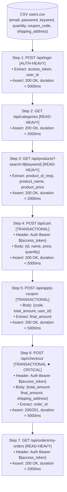

# Test Plan — Checkout with Coupon (Luồng mua hàng có mã giảm giá)

> **Student ID:** 23127115  
> **Workflow:** `POST /api/login` → `GET /api/categories` → `GET /api/products?search=` → `POST /api/cart` → `POST /api/apply-coupon` → `POST /api/checkout` → `GET /api/orders/my-orders`  
> **Tool:** Apache JMeter 5.6+  
> **Base URL:** `http://localhost:3000`  
> **Date:** 2026-08-13

---

## Tổng quan

Luồng E2E này mô phỏng hành vi người dùng **mua hàng hoàn chỉnh có áp dụng mã giảm giá**, bao phủ cả 3 nhóm endpoint yêu cầu bởi HW05:

| Nhóm          | Bước         | Endpoint                                                                        |
| ------------- | ------------ | ------------------------------------------------------------------------------- |
| auth-heavy    | Step 1       | `POST /api/login`                                                               |
| read-heavy    | Step 2, 3, 7 | `GET /api/categories`, `GET /api/products?search=`, `GET /api/orders/my-orders` |
| transactional | Step 4, 5, 6 | `POST /api/cart`, `POST /api/apply-coupon`, `POST /api/checkout`                |

---

## Danh sách file

```
checkout-with-coupon/
├── 23127115_Load_20260813.jmx      ← Test plan Load
├── 23127115_Stress_20260813.jmx    ← Test plan Stress
├── 23127115_Spike_20260813.jmx     ← Test plan Spike
├── seed_perf_users.js              ← Script seed 300 users vào SQLite
├── README.md                       ← File này
├── test-data/
│   ├── users.csv                   ← 300 rows dữ liệu test (input cho JMeter)
│   ├── coupons.csv                 ← Định nghĩa coupon PERFTEST
│   └── keywords.csv                ← 5 keywords tìm kiếm sản phẩm
└── results/                        ← JMeter ghi .jtl và HTML report vào đây
```

---

## Thông số 3 kịch bản

| Tham số             | Load                         | Stress                         | Spike                         |
| ------------------- | ---------------------------- | ------------------------------ | ----------------------------- |
| **File**            | `23127115_Load_20260813.jmx` | `23127115_Stress_20260813.jmx` | `23127115_Spike_20260813.jmx` |
| **Virtual Users**   | 50                           | 200                            | 100 (peak)                    |
| **Ramp-up**         | 120s (tuyến tính)            | 600s (tuyến tính)              | 10s (đột ngột)                |
| **Delay khởi động** | 0s                           | 0s                             | 60s (baseline trước spike)    |
| **Duration**        | 600s (10 phút)               | 1200s (20 phút)                | 480s (~8 phút tổng)           |
| **Think time**      | 2000ms ±300ms                | 1000ms ±200ms                  | 500ms ±100ms                  |
| **Listener**        | View Results Tree            | Aggregate Report               | Summary Report                |
| **Output file**     | `results/load.jtl`           | `results/stress.jtl`           | `results/spike.jtl`           |

### Lý do chọn tham số

**Load (50 VUs):** Baseline kiểm thử bình thường. Phần cứng giả định 8 CPU / 16 GB RAM → max VU ≈ 640. 50 VU ≈ 8% max, đủ để đo p95/p99 ổn định mà không gây tải.

**Stress (200 VUs):** 31% max VU. Ramp-up 600s để quan sát hệ thống chịu tải tăng dần. Chạy đến khi error rate > 5% hoặc p99 > 10s thì ghi lại ngưỡng đó.

**Spike (100 VUs / 10s ramp):** Mô phỏng burst traffic (flash sale). 60s delay để hệ thống ổn định ở mức thấp trước, sau đó 100 VU xuất hiện trong 10s.

---

## Dữ liệu test — CSV Schema

### `test-data/users.csv`

| Cột                | Mô tả                                   | Ví dụ                     |
| ------------------ | --------------------------------------- | ------------------------- |
| `email`            | Email tài khoản test (đã seeded vào DB) | `perf_user001@eshop.com`  |
| `password`         | Mật khẩu (cố định)                      | `Perf@2026!`              |
| `product_id`       | ID sản phẩm fallback (nếu search fail)  | `1`                       |
| `keyword`          | Từ khóa tìm kiếm (dùng cho Step 3)      | `iPhone`                  |
| `quantity`         | Số lượng mua (1 hoặc 2)                 | `2`                       |
| `coupon_code`      | Mã giảm giá (tất cả dùng `PERFTEST`)    | `PERFTEST`                |
| `shipping_address` | Địa chỉ giao hàng                       | `1 Le Loi St, Q1, TP.HCM` |

**300 rows** — đủ cho Stress test 200 VU với margin an toàn 1.5x.  
CSV binding: `shareMode.all` (tất cả VU dùng chung pool, round-robin).

### `test-data/coupons.csv`

| Mã         | Loại    | Giảm | Đơn tối thiểu | Hạn dùng   | Lần/user              |
| ---------- | ------- | ---- | ------------- | ---------- | --------------------- |
| `PERFTEST` | percent | 10%  | 0             | 2099-12-31 | 9999 (không giới hạn) |

> Coupon này được đặc biệt thiết kế để không bị từ chối trong quá trình stress test nhiều iterations.

---

## Workflow chi tiết (7 bước)



---

## Chạy test

> **Yêu cầu:** Backend đang chạy + dữ liệu đã seed. Xem hướng dẫn đầy đủ tại [`docs/_setup/README.md`](/submission/docs/_setup/README.md).

```bash
# Phải chạy từ thư mục gốc repo (để đường dẫn CSV tương đối hoạt động)

# Load Test
jmeter -n \
  -t submission/tests/1-test-plans/checkout-with-coupon/23127115_Load_20260813.jmx \
  -l submission/tests/1-test-plans/checkout-with-coupon/results/load.jtl \
  -e -o submission/tests/1-test-plans/checkout-with-coupon/results/load-report/

# Stress Test
jmeter -n \
  -t submission/tests/1-test-plans/checkout-with-coupon/23127115_Stress_20260813.jmx \
  -l submission/tests/1-test-plans/checkout-with-coupon/results/stress.jtl \
  -e -o submission/tests/1-test-plans/checkout-with-coupon/results/stress-report/

# Spike Test
jmeter -n \
  -t submission/tests/1-test-plans/checkout-with-coupon/23127115_Spike_20260813.jmx \
  -l submission/tests/1-test-plans/checkout-with-coupon/results/spike.jtl \
  -e -o submission/tests/1-test-plans/checkout-with-coupon/results/spike-report/
```

---

## Reset sau mỗi lần chạy

### Xóa account lockout

```bash
sqlite3 backend/database.sqlite \
  "UPDATE users SET login_attempts = 0, locked_until = NULL WHERE email LIKE 'perf_user%@eshop.com';"
```

### Xóa file .jtl cũ (nếu muốn chạy lại từ đầu)

```bash
rm submission/tests/1-test-plans/checkout-with-coupon/results/*.jtl
```

---

## Kết quả mong đợi (Thresholds tham chiếu)

| Metric            | Load (50 VU) | Stress (200 VU) | Spike (100 VU burst) |
| ----------------- | ------------ | --------------- | -------------------- |
| Error rate        | < 1%         | < 5%            | < 10%                |
| p95 response time | < 2s         | < 5s            | < 10s                |
| Throughput (RPS)  | > 10         | > 30            | — (burst)            |

> Các ngưỡng trên là **tham chiếu ban đầu**. Kết quả thực tế phụ thuộc vào phần cứng. Xem báo cáo trong `submission/docs/test-report/` sau khi chạy.

---

## Known Issues & Human Review Notes

1. **Login response JSON path** — JMX dùng `$.token` và `$.user.id`. Cần verify bằng Postman vì spec không ghi rõ.
2. **Checkout status code** — Assertion dùng OR (200 hoặc 201). Xác nhận trước khi run.
3. **Stress test ramp-up** — ThreadGroup tuyến tính, không phải stepped. Để có stepped ramp-up cần plugin _Ultimate Thread Group_.
4. **Data accumulation** — Mỗi run tạo `50 VU × N iterations` đơn hàng trong DB. Không cần xóa trước khi chạy tiếp nhưng nên biết để phân tích kết quả.
