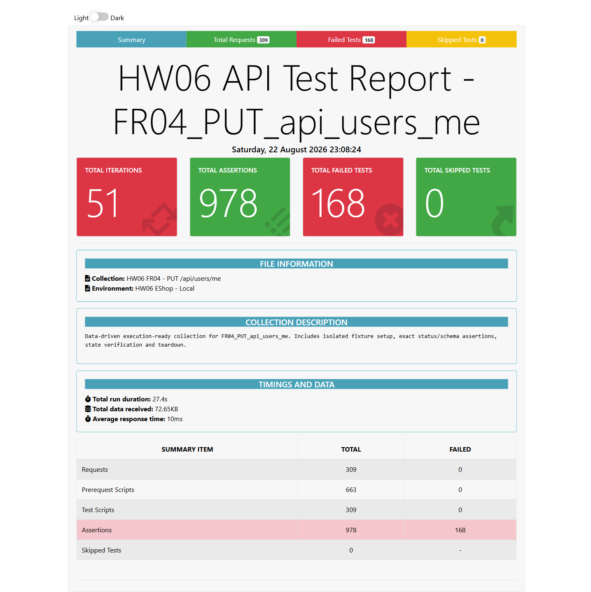

- **Test Cases:** FR04-USRME-DP-004, DP-010 đến DP-016, SC-004, ST-006
- **Test Script File:** [FR04 Postman Collection](../../../test-runs/api/FR04_PUT_api_users_me/FR04_PUT_api_users_me.postman_collection.json)

## Requirement liên quan

FR-04

## Environment

Newman, Node.js 22.20.0, OS: Windows, URL: http://127.0.0.1:3100, X-Student-Id: 23127115

# BUG-USRME-003: Cập nhật hồ sơ thiếu validation dữ liệu đầu vào

**API / Endpoint:** `PUT /api/users/me`  
**FR liên quan:** FR-04  
**Test_ID liên quan:** `FR04-USRME-DP-004`, `DP-010` đến `DP-016`, `SC-004`, `ST-006`  
**Severity:** Medium

## Mô tả

API trả `200` và lưu tên rỗng/whitespace, số điện thoại sai định dạng hoặc null. Có 25 case mong đợi 400 nhưng nhận 200; request không hợp lệ vẫn thay đổi dữ liệu đã lưu.

## Request đại diện

```http
PUT http://127.0.0.1:3100/api/users/me
Authorization: Bearer <user-token>
X-Student-Id: 23127115
Content-Type: application/json

{"name":"","phone":"0912345678","shipping_address":"1 A"}
```

## Expected result

Trả lỗi 400, không thay đổi hồ sơ. Phone phải bắt đầu bằng 0 và có 10–11 chữ số.

## Actual result

```json
{ "message": "Profile updated" }
```

Status `200`; database lưu dữ liệu không hợp lệ hoặc làm mất giá trị cũ.

## Evidence



## Tác động

Dữ liệu hồ sơ bị hỏng và request bị từ chối theo đặc tả vẫn gây side effect.

## Đề xuất

Validate toàn bộ input trước khi UPDATE và không thay đổi trạng thái khi validation thất bại.

## GitHub Issue

Chưa tạo — cần đăng issue thật và bổ sung URL.
