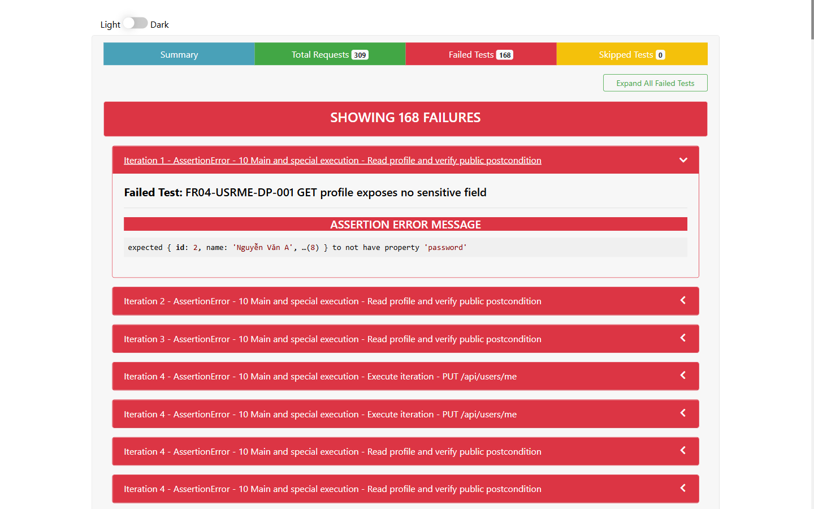

- **Test Cases:** FR04-USRME-DP-007
- **Test Script File:** [FR04 Postman Collection](../../../test-runs/api/FR04_PUT_api_users_me/FR04_PUT_api_users_me.postman_collection.json)

## Requirement liên quan

FR-04

## Environment

Newman, Node.js 22.20.0, OS: Windows, URL: http://127.0.0.1:3100, X-Student-Id: 23127115

# BUG-USRME-005: Partial update làm mất dữ liệu của trường không được gửi

**API / Endpoint:** `PUT /api/users/me`  
**FR liên quan:** FR-04  
**Test_ID liên quan:** FR04-USRME-DP-007  
**Severity:** Medium

## Mô tả

Khi request chỉ gửi trường `name`, API cập nhật tên thành công nhưng đồng thời ghi `phone` và `shipping_address` thành `null`. Các trường bị bỏ qua trong partial update phải giữ nguyên giá trị trước đó.

## Request đại diện

```http
PUT http://127.0.0.1:3100/api/users/me
Authorization: Bearer <valid-user-token>
X-Student-Id: 23127115
Content-Type: application/json

{"name":"Chỉ cập nhật tên"}
```

## Expected result

Trả `200`; `name` đổi thành `Chỉ cập nhật tên`; `phone` vẫn là `0912345678` và `shipping_address` vẫn là `Seed Address`.

## Actual result

Trả `200` với `{"message":"Profile updated"}`; GET kiểm tra sau đó cho thấy `phone: null` và `shipping_address: null`.

## Evidence



## Tác động

Một thao tác sửa riêng tên làm mất số điện thoại và địa chỉ giao hàng đã lưu, có thể khiến checkout thất bại hoặc giao sai thông tin.

## Đề xuất

Xây dựng câu UPDATE động theo allow-list hoặc dùng giá trị hiện tại cho field `undefined`; chỉ ghi `null` khi contract cho phép client chủ động xóa trường.

## GitHub Issue

https://github.com/yuran1811/hcmus-sw-testing--eshop-sut/issues/334
