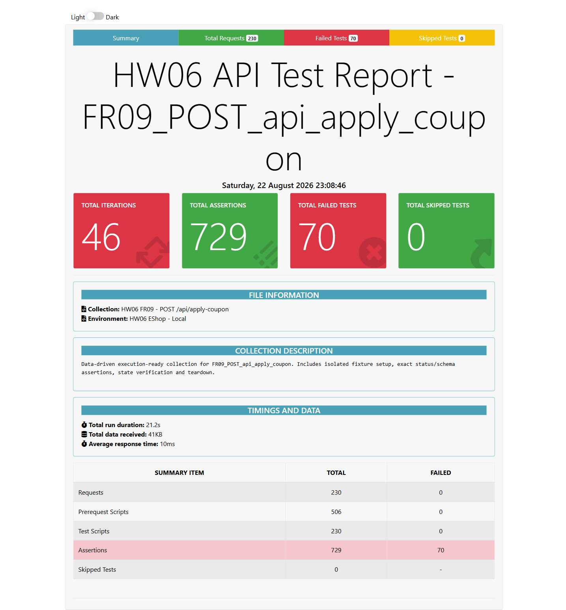

- **Test Cases:** FR09-APPLY-DP-001, SC-001, ST-007 và các case tính tiền tương đương
- **Test Script File:** [FR09 Postman Collection](../../../test-runs/api/FR09_POST_api_apply_coupon/FR09_POST_api_apply_coupon.postman_collection.json)

## Requirement liên quan

FR-09

## Environment

Newman, Node.js 22.20.0, OS: Windows, URL: http://127.0.0.1:3100, X-Student-Id: 23127115

# BUG-APPLYCOUPON-002: Công thức giảm giá coupon trả số âm và final amount sai

**API / Endpoint:** `POST /api/apply-coupon`  
**FR liên quan:** FR-09  
**Test_ID liên quan:** Đại diện `FR09-APPLY-DP-001`, `SC-001`, `ST-007`  
**Severity:** High

## Request đại diện

```http
POST http://127.0.0.1:3100/api/apply-coupon
Authorization: Bearer <user-token>
X-Student-Id: 23127115
Content-Type: application/json

{"code":"SAVE10","total_amount":500000,"user_id":2}
```

## Expected result

Với SAVE10: `discount_amount = 50000`, `final_amount = 450000`, đều hữu hạn và không âm.

## Actual result

```json
{ "discount_amount": -4500000, "final_amount": 5000000 }
```

Newman ghi nhận công thức sai lặp lại ở các response áp dụng coupon thành công.

## Evidence



## Tác động

Tổng tiền thanh toán bị tính sai nghiêm trọng, có thể gây thiệt hại tài chính.

## Đề xuất

Áp dụng đúng công thức theo loại coupon, kiểm tra đơn vị và chặn kết quả âm/không hữu hạn.

## GitHub Issue

Chưa tạo — cần đăng issue thật và bổ sung URL.
