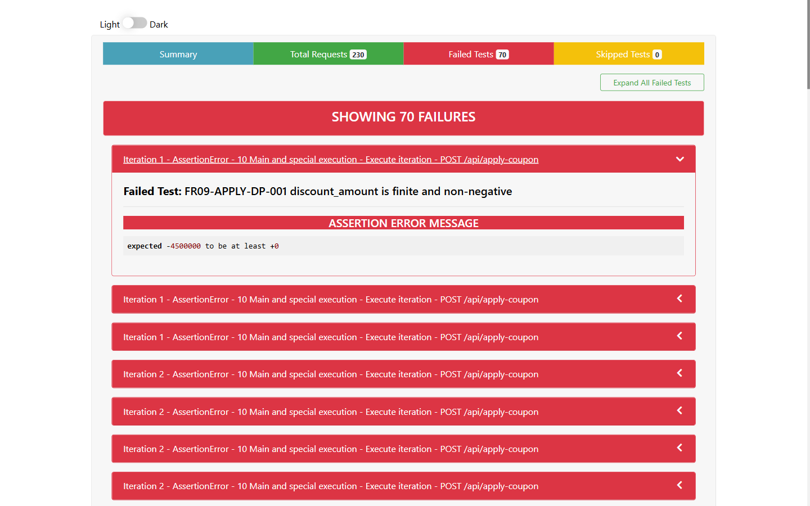

- **Test Cases:** FR09-APPLY-ST-002, FR09-APPLY-ST-004
- **Test Script File:** [FR09 Postman Collection](../../../test-runs/api/FR09_POST_api_apply_coupon/FR09_POST_api_apply_coupon.postman_collection.json)

## Requirement liên quan

FR-09

## Environment

Newman, Node.js 22.20.0, OS: Windows, URL: http://127.0.0.1:3100, X-Student-Id: 23127115

# BUG-APPLYCOUPON-004: Hết lượt dùng trả sai HTTP status

**API / Endpoint:** `POST /api/apply-coupon`  
**FR liên quan:** FR-09  
**Test_ID liên quan:** FR09-APPLY-ST-002, FR09-APPLY-ST-004  
**Severity:** Minor

## Mô tả

Khi người dùng đã đạt `max_uses_per_user`, request hợp lệ về cú pháp nhưng xung đột với trạng thái hiện tại. API trả 400 thay vì 409 theo execution contract.

## Request đại diện

```http
POST http://127.0.0.1:3100/api/apply-coupon
Authorization: Bearer <valid-user-token>
X-Student-Id: 23127115
Content-Type: application/json

{"code":"SAVE10","total_amount":500000,"user_id":2}
```

## Expected result

Sau khi SAVE10 đã dùng đủ một lần, trả `409 Conflict` và không tăng usage.

## Actual result

Trả `400 Bad Request` với `{"error":"Bạn đã sử dụng mã này 1 lần (đã đạt giới hạn)"}`. VIP100 ở lần thứ ba cũng trả 400.

## Evidence



## Tác động

Client không phân biệt được dữ liệu request sai với xung đột trạng thái, dẫn đến xử lý lỗi/retry không chính xác.

## Đề xuất

Trả 409 cho trường hợp đạt giới hạn sử dụng và giữ nguyên error schema hiện tại.

## GitHub Issue

https://github.com/yuran1811/hcmus-sw-testing--eshop-sut/issues/338
