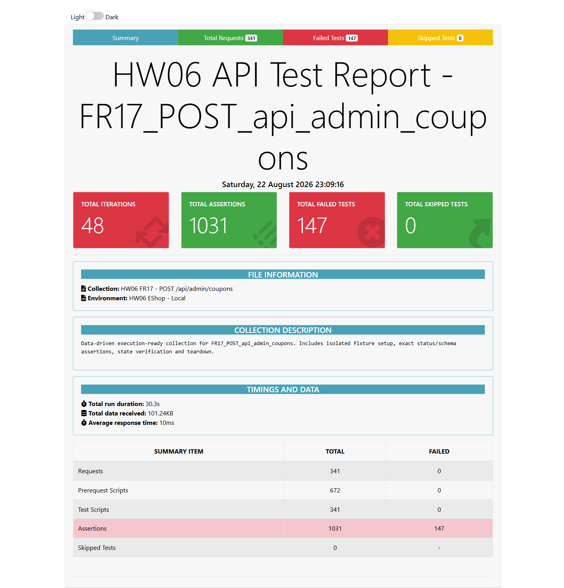

- **Test Cases:** 11 case tạo coupon hợp lệ, đại diện FR17-ADMINCOUP-DP-001
- **Test Script File:** [FR17 Postman Collection](../../../test-runs/api/FR17_POST_api_admin_coupons/FR17_POST_api_admin_coupons.postman_collection.json)

## Requirement liên quan

FR-17

## Environment

Newman, Node.js 22.20.0, OS: Windows, URL: http://127.0.0.1:3100, X-Student-Id: 23127115

# BUG-ADMINCOUPON-003: Tạo coupon thành công trả sai HTTP status

**API / Endpoint:** `POST /api/admin/coupons`  
**FR liên quan:** FR-17  
**Test_ID liên quan:** FR17-ADMINCOUP-DP-001 và 10 case create hợp lệ khác  
**Severity:** Minor

## Mô tả

Mọi request tạo coupon hợp lệ được kiểm tra đều tạo bản ghi nhưng trả 200 thay vì 201 theo contract của thao tác tạo tài nguyên.

## Request đại diện

```http
POST http://127.0.0.1:3100/api/admin/coupons
Authorization: Bearer <valid-admin-token>
X-Student-Id: 23127115
Content-Type: application/json

{"code":"TET2026","type":"percent","discount_value":15,"min_order_amount":200000,"expired_at":"2099-01-31","max_uses_per_user":1}
```

## Expected result

Trả `201 Created` cùng ID coupon mới.

## Actual result

Trả `200 OK` với `{"message":"Coupon created","id":5}`.

## Evidence



## Tác động

Vi phạm API contract và làm client/test/monitor dựa vào semantics HTTP đánh dấu sai kết quả.

## Đề xuất

Đổi response của nhánh INSERT thành `res.status(201).json(...)` và giữ nguyên schema thành công.

## GitHub Issue

https://github.com/yuran1811/hcmus-sw-testing--eshop-sut/issues/342
