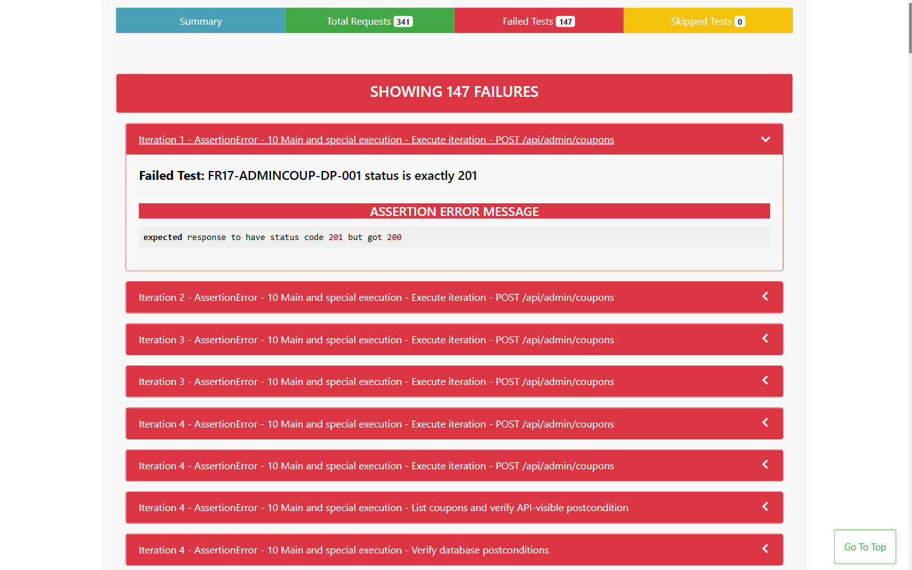

- **Test Cases:** FR17-ADMINCOUP-SEC-003
- **Test Script File:** [FR17 Postman Collection](../../../test-runs/api/FR17_POST_api_admin_coupons/FR17_POST_api_admin_coupons.postman_collection.json)

## Requirement liên quan

FR-17, SEC-02

## Environment

Newman, Node.js 22.20.0, OS: Windows, URL: http://127.0.0.1:3100, X-Student-Id: 23127115

# BUG-ADMINCOUPON-005: JWT không hợp lệ bị phân loại sai thành lỗi phân quyền

**API / Endpoint:** `POST /api/admin/coupons`  
**FR liên quan:** FR-17, SEC-02  
**Test_ID liên quan:** FR17-ADMINCOUP-SEC-003  
**Severity:** Minor

## Mô tả

JWT có chữ ký bị chỉnh sửa không xác thực được nhưng API trả 403. Đây là lỗi xác thực credential nên contract yêu cầu 401; 403 dành cho danh tính đã xác thực nhưng thiếu quyền.

## Request đại diện

```http
POST http://127.0.0.1:3100/api/admin/coupons
Authorization: Bearer <tampered-admin-token>
X-Student-Id: 23127115
Content-Type: application/json

{"code":"TAMPER","type":"fixed","discount_value":10000,"min_order_amount":0,"expired_at":"2099-01-31","max_uses_per_user":1}
```

## Expected result

Trả `401 Unauthorized`, body JSON có trường `error`; không tạo coupon.

## Actual result

Trả `403 Forbidden` với `{"error":"Forbidden"}`.

## Evidence



## Tác động

Client không phân biệt được token cần làm mới/đăng nhập lại với tài khoản thật sự thiếu quyền.

## Đề xuất

Middleware xác thực trả 401 cho token thiếu, sai chữ ký, hết hạn hoặc malformed; chỉ kiểm tra role và trả 403 sau khi token hợp lệ.

## GitHub Issue

https://github.com/yuran1811/hcmus-sw-testing--eshop-sut/issues/344
