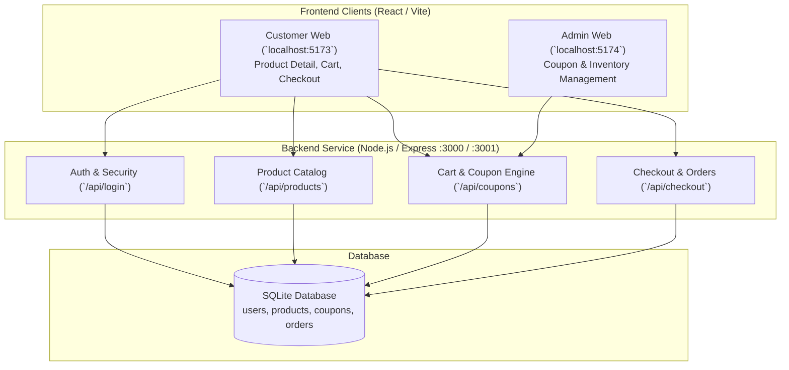
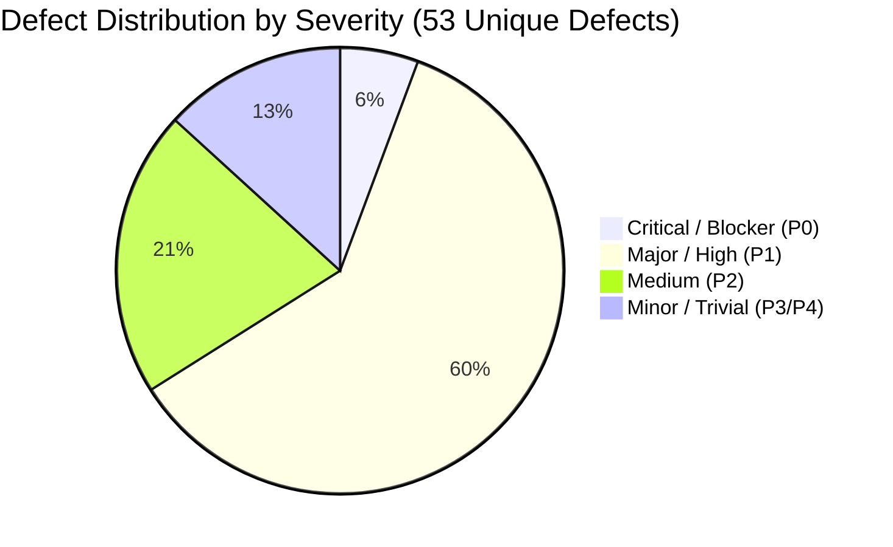

# Test Summary Report

| Document Information | Details |
| :--- | :--- |
| **Project Name** | EShop Vietnamese E-Commerce Platform |
| **Document Title** | Consolidated Test Summary Report (HW02 – HW05) |
| **Version** | 1.0.0 |
| **Author** | Ngô Nguyễn Thế Khoa (Student ID: `23127065`) |
| **Course** | CS423 / CSC13003 – Software Testing |
| **Date** | August 17, 2026 |
| **Repository** | [`yuran1811/hcmus-sw-testing--hw`](https://github.com/yuran1811/hcmus-sw-testing--hw) |
| **Template Standard** | [SoftwareTestingHelp Test Summary Report Standard](https://www.softwaretestinghelp.com/test-summary-report-template-download-sample/) |

---

## 1. Purpose of the Document

The purpose of this **Test Summary Report** is to provide a formal, consolidated overview of all quality assurance and testing activities conducted on the **EShop** application across four iterative evaluation cycles (**Homework 02 through Homework 05**). 

This document summarizes the testing scope, test methodologies, execution metrics, identified defects, environment configurations, lessons learned, and recommendations to assist management and technical stakeholders in assessing product stability, compliance, and release readiness.

---

## 2. Application Overview

**EShop** is a web-based e-commerce platform tailored for Vietnamese online retail. It provides full customer-facing shopping workflows alongside an administrative back-office management portal.

The core modules evaluated across testing cycles include:
1. **User Authentication & Authorization (`FR-01`, `SEC-04`)**: JWT-based session handling, role enforcement, and login lockout controls.
2. **Product Catalog & Detail (`FR-06`, `FR-08`, `FR-23`, `FR-24`)**: Product viewing, pricing, breadcrumb navigation, and quantity selection.
3. **Cart Operations (`FR-07`, `FR-20`)**: Line item addition, quantity modification, price calculations, and responsive mobile rendering.
4. **Coupon & Discount Engine (`FR-09`, `FR-17`, `FR-21`, `FR-22`)**: Percentage/fixed promo application, minimum order thresholds, and administrative CRUD operations.
5. **Checkout & Order Creation (`FR-08`)**: Order finalization, customer address input, and transaction recording.

---

## 3. Testing Scope

### 3.1 In-Scope
The testing program covered functional, UI/UX, cross-browser compatibility, automated regression, and non-functional performance testing:

- **Functional Black-Box Testing (HW02)**: Equivalence Partitioning (EP) and 3-Value Boundary Value Analysis (BVA) on Product Detail (`FR-06`), Coupons (`FR-09`), Admin Coupons (`FR-17`), and Mobile Cart (`FR-20`).
- **GUI & Usability Inspection (HW03)**: Visual standards, form elements, accessibility, responsive behavior (320px to 1920px), and 7 moderated think-aloud usability sessions evaluated via SUS (System Usability Scale) and UEQ-S.
- **Cross-Browser Multi-Platform Testing (HW03 & HW04)**: Execution across 3 major rendering engines: Google Chrome (Blink), Mozilla Firefox (Gecko), and Apple WebKit (Safari compatibility) on macOS Apple Silicon.
- **Automated End-to-End Regression Matrix (HW04)**: Data-Driven Playwright test suites (TypeScript) executing 36 logical cases across 3 browsers (108 automated runs).
- **Performance, Stress, Spike & Soak Testing (HW05)**: Apache JMeter CLI execution modeling the core user journey (`Login → Search → Checkout`) under Load (20 users), Stress (80 users), Spike (150 users), and Endurance (40 users for 10 min).

### 3.2 Out-of-Scope
- Real external payment gateway integrations (e.g., live MoMo / VNPay banking APIs).
- Native iOS / Android compiled mobile applications.
- Full vulnerability penetration testing (DDoS, SQL injection fuzzing beyond input validation).
- Multi-region distributed cloud network latency profiling.

### 3.3 Items Not Tested / Environmental Constraints
- Real multi-tenant cloud concurrency (testing was performed on isolated local server instances at `:3000` / `:3001` with clean SQLite database seeds).
- Hardware failure clustering (redundancy/failover testing was not performed due to single-node SQLite architecture).

---

## 4. Test Metrics & Traceability Matrix

### 4.1 Overall Test Execution Metrics

| Cycle / Assignment | Focus Domain & Methodology | Planned Test Cases | Executed Test Cases | Passed Cases | Failed Cases | Pass Rate | Total Executions |
| :--- | :--- | :---: | :---: | :---: | :---: | :---: | :---: |
| **HW02** | Domain Testing & Boundary Value Analysis | 83 | 83 | 56 | 27 | **67.47%** | 83 |
| **HW03** | GUI Checklist & Usability Matrix | 85 | 85 | 52 | 33 | **61.18%** | 255 |
| **HW04** | Playwright Multi-Browser Matrix | 36 | 36 | 18 | 18 | **50.00%** | 108 |
| **HW05** | JMeter Performance & Stress Profiles | 17 | 17 | 16 | 1 | **94.12%** | 57,212 |
| **Total** | | **221** | **221** | **142** | **79** | **64.25%** | **57,658** |

### 4.2 Defect Severity & Distribution Summary

| Module / Requirement Area | Total Defects | Critical / Blocker | Major / High | Medium | Minor / Trivial | Key Defect Link Example |
| :--- | :---: | :---: | :---: | :---: | :---: | :--- |
| **Product Detail (`FR-06`)** | 5 | 0 | 4 | 1 | 0 | [Issue #23](https://github.com/yuran1811/hcmus-sw-testing--hw/issues/23) (First Click Ignored) |
| **Cart Operations (`FR-07`, `FR-20`)** | 16 | 1 | 9 | 4 | 2 | [Issue #9](https://github.com/yuran1811/hcmus-sw-testing--hw/issues/9) (No Quantity Controls) |
| **Discount Coupons (`FR-09`)** | 7 | 1 | 4 | 2 | 0 | [Issue #27](https://github.com/yuran1811/hcmus-sw-testing--hw/issues/27) (Calculation Error) |
| **Coupon Admin (`FR-17`, `FR-22`)** | 19 | 1 | 12 | 3 | 3 | [Issue #30](https://github.com/yuran1811/hcmus-sw-testing--hw/issues/30) (Negative Discount) |
| **Authentication & Performance (`FR-01`)** | 6 | 0 | 3 | 1 | 2 | [Issue #31](https://github.com/yuran1811/hcmus-sw-testing--hw/issues/31) (Account Lockout) |
| **Total** | **53** | **3** | **32** | **11** | **7** | |

---

### 4.3 HW02 — Domain Testing & Boundary Value Analysis (83 Test Cases)

| Requirement | Test Case | Result | Bug Issue | Status |
| ----------- | --------------------- | ------ | ------------------------------------------------------------------------------------------------------------- | ------ |
| FR-06 | TC-PRODUCT-DETAIL-001 | Fail | [[BUG][Product Detail] - Missing Category Name](https://github.com/yuran1811/hcmus-sw-testing--eshop-sut/issues/62) | Run |
| FR-06 | TC-PRODUCT-DETAIL-002 | Pass | | Run |
| FR-06 | TC-PRODUCT-DETAIL-003 | Pass | | Run |
| FR-06 | TC-PRODUCT-DETAIL-004 | Fail | [[BUG][Product Detail] - Must double-click to 'add to cart'; No badge/toast indicates the 'add to cart' action](https://github.com/yuran1811/hcmus-sw-testing--eshop-sut/issues/63) | Run |
| FR-06 | TC-PRODUCT-DETAIL-005 | Fail | [[BUG][Product Detail] - Product with invalid quantity still be added to cart](https://github.com/yuran1811/hcmus-sw-testing--eshop-sut/issues/64) | Run |
| FR-06 | TC-PRODUCT-DETAIL-006 | Fail | [[BUG][Product Detail] - Product with invalid quantity still be added to cart](https://github.com/yuran1811/hcmus-sw-testing--eshop-sut/issues/64) | Run |
| FR-06 | TC-PRODUCT-DETAIL-007 | Fail | [[BUG][Product Detail] - Product with invalid quantity still be added to cart](https://github.com/yuran1811/hcmus-sw-testing--eshop-sut/issues/64) | Run |
| FR-06 | TC-PRODUCT-DETAIL-008 | Fail | [[BUG][Product Detail] - Product with invalid quantity still be added to cart](https://github.com/yuran1811/hcmus-sw-testing--eshop-sut/issues/64) | Run |
| FR-06 | TC-PRODUCT-DETAIL-009 | Fail | [[BUG][Product Detail] - Product with invalid quantity still be added to cart](https://github.com/yuran1811/hcmus-sw-testing--eshop-sut/issues/64) | Run |
| FR-06 | TC-PRODUCT-DETAIL-010 | Pass | | Run |
| FR-06 | TC-PRODUCT-DETAIL-011 | Pass | | Run |
| FR-08 | TC-PRODUCT-DETAIL-012 | Fail | [[BUG][Product Detail] - Un-auth user can add to cart](https://github.com/yuran1811/hcmus-sw-testing--eshop-sut/issues/65) | Run |
| FR-23 | TC-PRODUCT-DETAIL-013 | Fail | [[BUG][Product Detail] - Missing breadcrumb](https://github.com/yuran1811/hcmus-sw-testing--eshop-sut/issues/66) | Run |
| FR-24 | TC-PRODUCT-DETAIL-014 | Pass | | Run |
| FR-21 | TC-PRODUCT-DETAIL-015 | Pass | | Run |
| FR-09 | TC-COUPON-001 | Fail | [[BUG][Coupon] - SAVE10 make the final price too high (wrong calculation)](https://github.com/yuran1811/hcmus-sw-testing--eshop-sut/issues/67) | Run |
| FR-09 | TC-COUPON-002 | Fail | [[BUG][Coupon] - BIGBUY be rejected at its threshold](https://github.com/yuran1811/hcmus-sw-testing--eshop-sut/issues/69) | Run |
| FR-09 | TC-COUPON-003 | Pass | | Run |
| FR-09 | TC-COUPON-004 | Pass | | Run |
| FR-09 | TC-COUPON-005 | Pass | | Run |
| FR-09 | TC-COUPON-006 | Pass | | Run |
| FR-09 | TC-COUPON-007 | Pass | | Run |
| FR-09 | TC-COUPON-008 | Fail | [[BUG][Coupon] - Un-auth user can apply the coupon](https://github.com/yuran1811/hcmus-sw-testing--eshop-sut/issues/97) | Run |
| FR-09 | TC-COUPON-009 | Pass | | Run |
| FR-09 | TC-COUPON-010 | Pass | | Run |
| FR-09 | TC-COUPON-011 | Pass | | Run |
| FR-09 | TC-COUPON-012 | Fail | [[BUG][Coupon] - BIGBUY be rejected at its threshold](https://github.com/yuran1811/hcmus-sw-testing--eshop-sut/issues/69) | Run |
| FR-09 | TC-COUPON-013 | Fail | [[BUG][Coupon] - SAVE10 make the final price too high (wrong calculation)](https://github.com/yuran1811/hcmus-sw-testing--eshop-sut/issues/67) | Run |
| FR-09 | TC-COUPON-014 | Pass | | Run |
| FR-09 | TC-COUPON-015 | Pass | | Run |
| FR-21 | TC-COUPON-016 | Pass | | Run |
| FR-21 | TC-COUPON-017 | Pass | | Run |
| FR-21 | TC-COUPON-018 | Pass | | Run |
| FR-17 | TC-COUPON-ADMIN-001 | Pass | | Run |
| FR-17 | TC-COUPON-ADMIN-002 | Pass | | Run |
| FR-17 | TC-COUPON-ADMIN-003 | Pass | | Run |
| FR-17 | TC-COUPON-ADMIN-004 | Pass | | Run |
| FR-17 | TC-COUPON-ADMIN-005 | Fail | [[BUG][Coupon Admin] - Allow to create coupon with type="invalid"](https://github.com/yuran1811/hcmus-sw-testing--eshop-sut/issues/98) | Run |
| FR-17 | TC-COUPON-ADMIN-006 | Fail | [[BUG][Coupon Admin] - Allow to create coupon with discount_value=0](https://github.com/yuran1811/hcmus-sw-testing--eshop-sut/issues/99) | Run |
| FR-17 | TC-COUPON-ADMIN-007 | Fail | [[BUG][Coupon Admin] - Allow to create coupon with discount_value<0](https://github.com/yuran1811/hcmus-sw-testing--eshop-sut/issues/100) | Run |
| FR-17 | TC-COUPON-ADMIN-008 | Pass | | Run |
| FR-17 | TC-COUPON-ADMIN-009 | Fail | [[BUG][Coupon Admin] - Allow to create coupon with invalid expired_at](https://github.com/yuran1811/hcmus-sw-testing--eshop-sut/issues/101) | Run |
| FR-17 | TC-COUPON-ADMIN-010 | Fail | [[BUG][Coupon Admin] - Allow to create coupon with min_order_amount<0](https://github.com/yuran1811/hcmus-sw-testing--eshop-sut/issues/102) | Run |
| FR-17 | TC-COUPON-ADMIN-011 | Fail | [[BUG][Coupon Admin] - Allow to create coupon with max_uses_per_user=0](https://github.com/yuran1811/hcmus-sw-testing--eshop-sut/issues/103) | Run |
| FR-17 | TC-COUPON-ADMIN-012 | Fail | [[BUG][Coupon Admin] - Allow to create coupon with max_uses_per_user<0](https://github.com/yuran1811/hcmus-sw-testing--eshop-sut/issues/104) | Run |
| FR-17 | TC-COUPON-ADMIN-013 | Pass | | Run |
| FR-17 | TC-COUPON-ADMIN-014 | Fail | [[BUG][Coupon Admin] - Delete non-exist coupon still get status 200](https://github.com/yuran1811/hcmus-sw-testing--eshop-sut/issues/105) | Run |
| FR-17 | TC-COUPON-ADMIN-015 | Pass | | Run |
| FR-17 | TC-COUPON-ADMIN-016 | Pass | | Run |
| FR-17 | TC-COUPON-ADMIN-017 | Fail | [[BUG][Coupon Admin] - Non-admin user can create coupon](https://github.com/yuran1811/hcmus-sw-testing--eshop-sut/issues/106) | Run |
| FR-17 | TC-COUPON-ADMIN-018 | Pass | | Run |
| FR-17 | TC-COUPON-ADMIN-019 | Pass | | Run |
| FR-17 | TC-COUPON-ADMIN-020 | Pass | | Run |
| FR-17 | TC-COUPON-ADMIN-021 | Pass | | Run |
| FR-17 | TC-COUPON-ADMIN-022 | Pass | | Run |
| FR-17 | TC-COUPON-ADMIN-023 | Pass | | Run |
| FR-17 | TC-COUPON-ADMIN-024 | Pass | | Run |
| FR-17 | TC-COUPON-ADMIN-025 | Fail | [[BUG][Coupon Admin] - Allow to create coupon without code field](https://github.com/yuran1811/hcmus-sw-testing--eshop-sut/issues/109) | Run |
| FR-17 | TC-COUPON-ADMIN-026 | Pass | | Run |
| FR-20 | TC-CART-MOBILE-001 | Pass | | Run |
| FR-20 | TC-CART-MOBILE-002 | Pass | | Run |
| FR-20 | TC-CART-MOBILE-003 | Pass | | Run |
| FR-20 | TC-CART-MOBILE-004 | Pass | | Run |
| FR-20 | TC-CART-MOBILE-005 | Pass | | Run |
| FR-20 | TC-CART-MOBILE-006 | Pass | | Run |
| FR-20 | TC-CART-MOBILE-007 | Pass | | Run |
| FR-20 | TC-CART-MOBILE-008 | Pass | [[BUG][Cart Mobile] - Edit quantity directly in cart cause bad quantity counting](https://github.com/yuran1811/hcmus-sw-testing--eshop-sut/issues/114) | Run |
| FR-20 | TC-CART-MOBILE-009 | Pass | | Run |
| FR-20 | TC-CART-MOBILE-010 | Pass | | Run |
| FR-20 | TC-CART-MOBILE-011 | Pass | [[BUG][Cart Mobile] - Edit quantity directly in cart cause bad quantity counting](https://github.com/yuran1811/hcmus-sw-testing--eshop-sut/issues/114) | Run |
| FR-20 | TC-CART-MOBILE-012 | Pass | | Run |
| FR-20 | TC-CART-MOBILE-013 | Pass | | Run |
| FR-20 | TC-CART-MOBILE-014 | Pass | [[BUG][Cart Mobile] - No confirm dialog on removing item from cart](https://github.com/yuran1811/hcmus-sw-testing--eshop-sut/issues/115) | Run |
| FR-20 | TC-CART-MOBILE-015 | Pass | | Run |
| FR-20 | TC-CART-MOBILE-016 | Pass | | Run |
| FR-20 | TC-CART-MOBILE-017 | Pass | | Run |
| FR-20 | TC-CART-MOBILE-018 | Pass | | Run |
| FR-20 | TC-CART-MOBILE-019 | Pass | | Run |
| FR-20 | TC-CART-MOBILE-020 | Pass | [[BUG][Cart Mobile] - Edit quantity directly in cart cause bad quantity counting](https://github.com/yuran1811/hcmus-sw-testing--eshop-sut/issues/114) | Run |
| FR-20 | TC-CART-MOBILE-021 | Pass | [[BUG][Cart Mobile] - Edit quantity directly in cart cause bad quantity counting](https://github.com/yuran1811/hcmus-sw-testing--eshop-sut/issues/114) | Run |
| FR-20 | TC-CART-MOBILE-022 | Fail | [[BUG][Cart Mobile] - Total label not display correctly](https://github.com/yuran1811/hcmus-sw-testing--eshop-sut/issues/116) | Run |
| FR-20 | TC-CART-MOBILE-023 | Fail | [[BUG][Cart Mobile] - Cart Badge count the number of different items, not the total quantity](https://github.com/yuran1811/hcmus-sw-testing--eshop-sut/issues/117) | Run |
| FR-20 | TC-CART-MOBILE-024 | Fail | [[BUG][Cart Mobile] - No illustration on empty state](https://github.com/yuran1811/hcmus-sw-testing--eshop-sut/issues/118) | Run |

---

### 4.4 HW03 — GUI Checklist & Usability Testing (85 Items)

| Requirement | Test Case | Result | Bug Issue | Status |
| ----------- | --------- | ------ | --------- | ------ |
| FR-23 | CART-GUI-001 | Pass | | Run |
| FR-23 | CART-GUI-002 | Fail | [[BUG-CART-01] Cart page lacks the required page heading and breadcrumb](https://github.com/yuran1811/hcmus-sw-testing--hw/issues/2) | Run |
| FR-23 | CART-GUI-003 | Fail | [[BUG-CART-01] Cart page lacks the required page heading and breadcrumb](https://github.com/yuran1811/hcmus-sw-testing--hw/issues/2) | Run |
| FR-23 | CART-GUI-004 | Fail | [[BUG-CART-02] Cart navigation has no active state or quantity badge](https://github.com/yuran1811/hcmus-sw-testing--hw/issues/3) | Run |
| FR-23 | CART-GUI-005 | Fail | [[BUG-CART-02] Cart navigation has no active state or quantity badge](https://github.com/yuran1811/hcmus-sw-testing--hw/issues/3) | Run |
| FR-21 | CART-GUI-006 | Pass | | Run |
| FR-21 | CART-GUI-007 | Pass | | Run |
| FR-21 | CART-GUI-008 | Pass | | Run |
| FR-07 | CART-GUI-009 | Pass | | Run |
| FR-07 | CART-GUI-010 | Fail | [[BUG-CART-05] Empty cart state has no icon or illustration](https://github.com/yuran1811/hcmus-sw-testing--hw/issues/4) | Run |
| FR-07 | CART-GUI-011 | Pass | | Run |
| FR-07 | CART-GUI-012 | Pass | | Run |
| FR-21 | CART-GUI-013 | Pass | | Run |
| FR-07 | CART-GUI-014 | Pass | | Run |
| FR-07 | CART-GUI-015 | Fail | [[BUG-CART-09] Cart table uses the wrong unit-price column label](https://github.com/yuran1811/hcmus-sw-testing--hw/issues/6) | Run |
| IA-01 | CART-GUI-016 | Pass | | Run |
| FR-07 | CART-GUI-017 | Pass | | Run |
| FR-07 | CART-GUI-018 | Pass | | Run |
| FR-07 | CART-GUI-019 | Pass | | Run |
| FR-07 | CART-GUI-020 | Fail | [[BUG-CART-11] Cart total is labeled Tổng tạm tính instead of Tổng cộng](https://github.com/yuran1811/hcmus-sw-testing--hw/issues/7) | Run |
| FR-07 | CART-GUI-021 | Fail | [[BUG-CART-12] Adding the same product creates duplicate cart rows](https://github.com/yuran1811/hcmus-sw-testing--hw/issues/8) | Run |
| FR-07 | CART-GUI-022 | Fail | [[BUG-CART-13] Cart provides no controls for changing item quantity](https://github.com/yuran1811/hcmus-sw-testing--hw/issues/9) | Run |
| FR-07 | CART-GUI-023 | Fail | [[BUG-CART-13] Cart provides no controls for changing item quantity](https://github.com/yuran1811/hcmus-sw-testing--hw/issues/9) | Run |
| FR-07 | CART-GUI-024 | Fail | [[BUG-CART-13] Cart provides no controls for changing item quantity](https://github.com/yuran1811/hcmus-sw-testing--hw/issues/9) | Run |
| FR-07 | CART-GUI-025 | Fail | [[BUG-CART-13] Cart provides no controls for changing item quantity](https://github.com/yuran1811/hcmus-sw-testing--hw/issues/9) | Run |
| IA-01 | CART-GUI-026 | Pass | | Run |
| SEC-04 | CART-GUI-027 | Pass | | Run |
| FR-24 | CART-GUI-028 | Fail | [[BUG-CART-16] Removing a cart item bypasses the required confirmation dialog](https://github.com/yuran1811/hcmus-sw-testing--hw/issues/10) | Run |
| FR-24 | CART-GUI-029 | Fail | [[BUG-CART-16] Removing a cart item bypasses the required confirmation dialog](https://github.com/yuran1811/hcmus-sw-testing--hw/issues/10) | Run |
| FR-24 | CART-GUI-030 | Pass | | Run |
| FR-24 | CART-GUI-031 | Pass | | Run |
| FR-24 | CART-GUI-032 | Fail | [[BUG-CART-16] Removing a cart item bypasses the required confirmation dialog](https://github.com/yuran1811/hcmus-sw-testing--hw/issues/10) | Run |
| FR-23 | CART-GUI-033 | Pass | | Run |
| FR-08 | CART-GUI-034 | Pass | | Run |
| FR-08 | CART-GUI-035 | Pass | | Run |
| IA-02 | CART-GUI-036 | Pass | | Run |
| IA-04 | CART-GUI-037 | Pass | | Run |
| IA-01 | CART-GUI-038 | Fail | [[BUG-CART-20] Cart table overflows the 320px mobile viewport](https://github.com/yuran1811/hcmus-sw-testing--hw/issues/11) | Run |
| IA-01 | CART-GUI-039 | Pass | | Run |
| IA-01 | CART-GUI-040 | Pass | | Run |
| IA-01 | CART-GUI-041 | Pass | | Run |
| IA-03 | CART-GUI-042 | Pass | | Run |
| IA-02 | CART-GUI-043 | Fail | [[BUG-CART-06] Cart focus indicator is not visibly exposed](https://github.com/yuran1811/hcmus-sw-testing--hw/issues/5) | Run |
| IA-02 | CART-GUI-044 | Fail | [[BUG-CART-21] Repeated cart action controls do not identify their product](https://github.com/yuran1811/hcmus-sw-testing--hw/issues/12) | Run |
| IA-01 | CART-GUI-045 | Fail | [[BUG-CART-01] Cart page lacks the required page heading and breadcrumb](https://github.com/yuran1811/hcmus-sw-testing--hw/issues/2) | Run |
| IA-01 | CART-GUI-046 | Pass | | Run |
| IA-01 | CART-GUI-047 | Pass | | Run |
| IA-01 | CART-GUI-048 | Fail | [[BUG-CART-24] Customer frontend declares English instead of Vietnamese document language](https://github.com/yuran1811/hcmus-sw-testing--hw/issues/13) | Run |
| IA-01 | CART-GUI-049 | Pass | | Run |
| IA-04 | CART-GUI-050 | Pass | | Run |
| FR-12 | COUPON-GUI-001 | Pass | | Run |
| FR-12 | COUPON-GUI-002 | Pass | | Run |
| FR-12 | COUPON-GUI-003 | Pass | | Run |
| FR-17 | COUPON-GUI-004 | Pass | | Run |
| IA-01 | COUPON-GUI-005 | Fail | [[BUG-COUPON-03] Coupon screen title uses the wrong heading level](https://github.com/yuran1811/hcmus-sw-testing--hw/issues/14) | Run |
| IA-01 | COUPON-GUI-006 | Fail | [[BUG-COUPON-04] Admin navigation mixes English and Vietnamese labels](https://github.com/yuran1811/hcmus-sw-testing--hw/issues/15) | Run |
| FR-21 | COUPON-GUI-007 | Pass | | Run |
| FR-17 | COUPON-GUI-008 | Pass | | Run |
| FR-17 | COUPON-GUI-009 | Pass | | Run |
| FR-17 | COUPON-GUI-010 | Pass | | Run |
| FR-17 | COUPON-GUI-011 | Pass | | Run |
| FR-17 | COUPON-GUI-012 | Pass | | Run |
| FR-17 | COUPON-GUI-013 | Pass | | Run |
| FR-17 | COUPON-GUI-014 | Pass | | Run |
| IA-04 | COUPON-GUI-015 | Fail | [[BUG-COUPON-08] Empty coupon table has no explanatory state](https://github.com/yuran1811/hcmus-sw-testing--hw/issues/16) | Run |
| FR-22 | COUPON-GUI-016 | Fail | [[BUG-COUPON-09] Coupon form lacks visible labels and required markers](https://github.com/yuran1811/hcmus-sw-testing--hw/issues/17) | Run |
| FR-17 | COUPON-GUI-017 | Pass | | Run |
| FR-17 | COUPON-GUI-018 | Pass | | Run |
| FR-17 | COUPON-GUI-019 | Fail | [[BUG-COUPON-11] Coupon form omits discount and expiry boundary validation](https://github.com/yuran1811/hcmus-sw-testing--hw/issues/18) | Run |
| FR-17 | COUPON-GUI-020 | Fail | [[BUG-COUPON-11] Coupon form omits discount and expiry boundary validation](https://github.com/yuran1811/hcmus-sw-testing--hw/issues/18) | Run |
| FR-17 | COUPON-GUI-021 | Pass | | Run |
| FR-17 | COUPON-GUI-022 | Fail | [[BUG-COUPON-11] Coupon form omits discount and expiry boundary validation](https://github.com/yuran1811/hcmus-sw-testing--hw/issues/18) | Run |
| FR-17 | COUPON-GUI-023 | Pass | | Run |
| FR-22 | COUPON-GUI-024 | Fail | [[BUG-COUPON-12] Duplicate coupon exposes a SQLite error in a browser alert](https://github.com/yuran1811/hcmus-sw-testing--hw/issues/19) | Run |
| FR-22 | COUPON-GUI-025 | Fail | [[BUG-COUPON-12] Duplicate coupon exposes a SQLite error in a browser alert](https://github.com/yuran1811/hcmus-sw-testing--hw/issues/19) | Run |
| SEC-04 | COUPON-GUI-026 | Pass | | Run |
| FR-24 | COUPON-GUI-027 | Fail | [[BUG-COUPON-14] Coupon deletion has no confirmation dialog](https://github.com/yuran1811/hcmus-sw-testing--hw/issues/20) | Run |
| FR-24 | COUPON-GUI-028 | Fail | [[BUG-COUPON-14] Coupon deletion has no confirmation dialog](https://github.com/yuran1811/hcmus-sw-testing--hw/issues/20) | Run |
| FR-24 | COUPON-GUI-029 | Pass | | Run |
| FR-24 | COUPON-GUI-030 | Fail | [[BUG-COUPON-14] Coupon deletion has no confirmation dialog](https://github.com/yuran1811/hcmus-sw-testing--hw/issues/20) | Run |
| IA-01 | COUPON-GUI-031 | Pass | | Run |
| IA-02 | COUPON-GUI-032 | Pass | | Run |
| IA-02 | COUPON-GUI-033 | Pass | | Run |
| IA-02 | COUPON-GUI-034 | Fail | [[BUG-COUPON-17] Coupon delete buttons have ambiguous accessible names](https://github.com/yuran1811/hcmus-sw-testing--hw/issues/21) | Run |
| IA-04 | COUPON-GUI-035 | Pass | | Run |

---

### 4.5 HW04 — Playwright Automated E2E Regression Matrix (36 Cases × 3 Browsers)

| Requirement | Test Case | Result | Bug Issue | Status |
| ----------- | --------------------- | ------ | ------------------------------------------------------------------------------------------------------------- | ------ |
| FR-06 | TC-PRODUCT-DETAIL-001 | Fail | [[BUG][Issue #22] Product category is missing](https://github.com/yuran1811/hcmus-sw-testing--hw/issues/22) | Run |
| FR-06 | TC-PRODUCT-DETAIL-002 | Pass | | Run |
| FR-06 | TC-PRODUCT-DETAIL-003 | Pass | | Run |
| FR-06 | TC-PRODUCT-DETAIL-004 | Fail | [[BUG][Issue #23] First add-to-cart click is ignored](https://github.com/yuran1811/hcmus-sw-testing--hw/issues/23) | Run |
| FR-06 | TC-PRODUCT-DETAIL-005 | Fail | [[BUG][Issue #24] Invalid quantities have no validation](https://github.com/yuran1811/hcmus-sw-testing--hw/issues/24) | Run |
| FR-06 | TC-PRODUCT-DETAIL-006 | Fail | [[BUG][Issue #24] Invalid quantities have no validation](https://github.com/yuran1811/hcmus-sw-testing--hw/issues/24) | Run |
| FR-06 | TC-PRODUCT-DETAIL-007 | Fail | [[BUG][Issue #24] Invalid quantities have no validation](https://github.com/yuran1811/hcmus-sw-testing--hw/issues/24) | Run |
| FR-06 | TC-PRODUCT-DETAIL-008 | Fail | [[BUG][Issue #24] Invalid quantities have no validation](https://github.com/yuran1811/hcmus-sw-testing--hw/issues/24) | Run |
| FR-06 | TC-PRODUCT-DETAIL-009 | Fail | [[BUG][Issue #24] Invalid quantities have no validation](https://github.com/yuran1811/hcmus-sw-testing--hw/issues/24) | Run |
| FR-06 | TC-PRODUCT-DETAIL-010 | Pass | | Run |
| FR-06 | TC-PRODUCT-DETAIL-011 | Pass | | Run |
| FR-06 | TC-PRODUCT-DETAIL-012 | Fail | [[BUG][Issue #25] Guest add-to-cart has no authentication gate](https://github.com/yuran1811/hcmus-sw-testing--hw/issues/25) | Run |
| FR-09 | TC-COUPON-001 | Fail | [[BUG][Issue #27] Percentage calculation returns impossible totals](https://github.com/yuran1811/hcmus-sw-testing--hw/issues/27) | Run |
| FR-09 | TC-COUPON-002 | Fail | [[BUG][Issue #28] Exact minimum threshold is rejected](https://github.com/yuran1811/hcmus-sw-testing--hw/issues/28) | Run |
| FR-09 | TC-COUPON-003 | Pass | | Run |
| FR-09 | TC-COUPON-004 | Pass | | Run |
| FR-09 | TC-COUPON-005 | Pass | | Run |
| FR-09 | TC-COUPON-006 | Pass | | Run |
| FR-09 | TC-COUPON-007 | Pass | | Run |
| FR-09 | TC-COUPON-008 | Fail | [[BUG][Issue #26] Guest can apply a coupon](https://github.com/yuran1811/hcmus-sw-testing--hw/issues/26) | Run |
| FR-09 | TC-COUPON-012 | Fail | [[BUG][Issue #28] Exact minimum threshold is rejected](https://github.com/yuran1811/hcmus-sw-testing--hw/issues/28) | Run |
| FR-09 | TC-COUPON-013 | Fail | [[BUG][Issue #27] Percentage calculation returns impossible totals](https://github.com/yuran1811/hcmus-sw-testing--hw/issues/27) | Run |
| FR-09 | TC-COUPON-014 | Pass | | Run |
| FR-09 | TC-COUPON-015 | Pass | | Run |
| FR-17 | TC-COUPON-ADMIN-001 | Pass | | Run |
| FR-17 | TC-COUPON-ADMIN-002 | Pass | | Run |
| FR-17 | TC-COUPON-ADMIN-003 | Pass | | Run |
| FR-17 | TC-COUPON-ADMIN-006 | Fail | [[BUG][Issue #30] Zero and negative discounts are accepted](https://github.com/yuran1811/hcmus-sw-testing--hw/issues/30) | Run |
| FR-17 | TC-COUPON-ADMIN-007 | Fail | [[BUG][Issue #30] Zero and negative discounts are accepted](https://github.com/yuran1811/hcmus-sw-testing--hw/issues/30) | Run |
| FR-17 | TC-COUPON-ADMIN-008 | Pass | | Run |
| FR-17 | TC-COUPON-ADMIN-010 | Fail | [[BUG][Issue #29] Negative minimum order amount is accepted](https://github.com/yuran1811/hcmus-sw-testing--hw/issues/29) | Run |
| FR-17 | TC-COUPON-ADMIN-011 | Pass | | Run |
| FR-17 | TC-COUPON-ADMIN-012 | Pass | | Run |
| FR-17 | TC-COUPON-ADMIN-020 | Pass | | Run |
| FR-17 | TC-COUPON-ADMIN-022 | Pass | | Run |
| FR-17 | TC-COUPON-ADMIN-024 | Pass | | Run |

---

### 4.6 HW05 — Apache JMeter Performance & Resilience Testing (17 Scenarios & Samplers)

| Requirement | Test Case | Result | Bug Issue | Status |
| ----------- | --------------------- | ------ | ------------------------------------------------------------------------------------------------------------- | ------ |
| PERF-LOAD | TC-PERF-LOAD-WORKFLOW | Pass | | Run |
| PERF-LOAD | TC-PERF-LOAD-AUTH | Pass | | Run |
| PERF-LOAD | TC-PERF-LOAD-SEARCH | Pass | | Run |
| PERF-LOAD | TC-PERF-LOAD-CHECKOUT | Pass | | Run |
| PERF-STRESS | TC-PERF-STRESS-WORKFLOW | Pass | | Run |
| PERF-STRESS | TC-PERF-STRESS-AUTH | Pass | | Run |
| PERF-STRESS | TC-PERF-STRESS-SEARCH | Pass | | Run |
| PERF-STRESS | TC-PERF-STRESS-CHECKOUT | Pass | | Run |
| PERF-SPIKE | TC-PERF-SPIKE-WORKFLOW | Pass | | Run |
| PERF-SPIKE | TC-PERF-SPIKE-AUTH | Pass | | Run |
| PERF-SPIKE | TC-PERF-SPIKE-SEARCH | Pass | | Run |
| PERF-SPIKE | TC-PERF-SPIKE-CHECKOUT | Pass | | Run |
| PERF-SOAK | TC-PERF-SOAK-WORKFLOW | Pass | | Run |
| PERF-SOAK | TC-PERF-SOAK-RESOURCE | Pass | | Run |
| AUTH-SEC | TC-PERF-AUTH-LOCKOUT | Fail | [[BUG-HW05-01][Issue #31] Login locks after 2 failures instead of 3](https://github.com/yuran1811/hcmus-sw-testing--hw/issues/31) | Run |
| CI-CPT | TC-CPT-SMOKE-GATE | Pass | | Run |
| CI-CPT | TC-CPT-DRIFT-GATE | Pass | | Run |

---

## 5. Types of Testing Performed

### 5.1 Domain Testing & Boundary Value Analysis (HW02)
- **Equivalence Partitioning (EP)**: Modeled valid and invalid inputs across discrete variable boundaries (e.g., valid IDs, non-numeric strings, negative amounts, out-of-range discount percentages).
- **3-Value BVA**: Verified values directly on boundaries (**ON**), immediately outside valid partitions (**OFF**), and inside partitions (**IN**).

### 5.2 GUI & Usability Testing (HW03)
- **Checklist Inspection**: Audited 85 interface items covering IA-01 (General UI), IA-02 (Forms), IA-03 (Navigation), and IA-04 (Feedback).
- **Moderated Think-Aloud Usability Study**: Conducted with 7 external participants executing an end-to-end purchasing workflow. Scored via **System Usability Scale (SUS)** yielding **66.8 / 100** (Grade C / Marginal).

### 5.3 Cross-Browser & Multi-Platform Matrix (HW03 & HW04)
- Verified visual rendering and functional behavior across **Chromium / Blink**, **Mozilla Firefox / Gecko**, and **Apple WebKit** engines on macOS Apple Silicon.
- All 33 GUI bugs and 9 automated defects exhibited 100% reproducible cross-engine consistency.

### 5.4 Automated End-to-End Regression Testing (HW04)
- **Data-Driven Architecture**: Implemented with Playwright and TypeScript, decoupled external JSON fixtures in `test-data/`, parameterized test iterations, and multiple assertion patterns (native HTML5 validity, DOM visibility, math computations, and URL states).

### 5.5 Performance, Load, Stress, Spike & Soak Testing (HW05)
- Evaluated system scalability using Apache JMeter CLI across 4 concurrency models:
  1. **Load Test**: 20 users, ramp 20s, duration 120s &rarr; 1,460 workflows, 12.17 wf/s throughput, p95 1,851 ms.
  2. **Stress Test**: 80 users, ramp 40s, duration 120s &rarr; 5,323 workflows, 44.37 wf/s throughput, p95 550 ms.
  3. **Spike Test**: 150 users, ramp 2s, duration 60s &rarr; 34,980 workflows, 582.61 wf/s throughput, p95 362 ms.
  4. **Endurance / Soak Test**: 40 users, ramp 30s, duration 600s (10 min) &rarr; 15,449 workflows, 25.75 wf/s throughput, p95 1,859 ms, 0% errors, stable memory/CPU profile.

---

## 6. Test Environment & Tools

| Category | Component / Tool | Version / Specification | Role in Testing |
| :--- | :--- | :--- | :--- |
| **Hardware** | MacBook Pro (MacBookPro17,1) | Apple M1 (8 cores), 16 GB RAM | Local execution host |
| **Operating System** | macOS Sequoia | 26.6.1 (Darwin 25G76) | Execution environment |
| **Runtime & Language** | Node.js / TypeScript | Node v22.23.1, TypeScript 5.4 | SUT runtime & automation scripts |
| **Application Server** | Express.js | Express 5.2.1 | HTTP REST backend on `:3000` / `:3001` |
| **Database** | SQLite3 | SQLite 3.x embedded | Relational datastore with seeded fixtures |
| **Frontend Framework** | React / Vite | React 18.x, Vite 5.x | Client SPA (`:5173`) & Admin Portal (`:5174`) |
| **Browsers Tested** | Chromium, Firefox, WebKit | Playwright bundled engines + Safari / Firefox Dev | Cross-browser execution matrix |
| **Automation Tools** | Playwright & Newman | Playwright 1.45+, Newman CLI | E2E browser & API automation |
| **Performance Tools** | Apache JMeter | Version 5.6.3 (OpenJDK 26.0.2) | Non-functional load & stress testing |
| **Defect Tracking** | GitHub Issues API | GitHub REST API | Centralized bug lifecycle management |

---

## 7. Lessons Learned

1. **Locator Resilience & Semantic Selectors**:
   - Relying on `getByLabel` failed initially because the SUT rendered input elements without programmatic `id`/`for` association. Adapting locators to semantic roles (`getByRole`) and form-relative scopes created robust, non-brittle tests.
2. **Keystroke Emulation vs. Direct Value Filling**:
   - Calling `.fill("abc")` on HTML5 `input[type=number]` threw driver-level exceptions. Emulating authentic user keystrokes (`pressSequentially`) allowed proper validation of the frontend's rejection behavior.
3. **Transaction Metrics vs. Raw HTTP Sampler Counts**:
   - AI tools initially hallucinated metric conclusions by equating individual HTTP request samplers (e.g., 34,836 checkouts) with parent transaction workflows (34,980). Rigorous human review ensured that parent `Transaction Controller` metrics were used for accurate workflow throughput reporting.
4. **Database State & Concurrency in SQLite**:
   - Running destructive tests against dirty databases caused cascading false positives. Isolating the test SUT instance on port `3001` with clean seeding per execution run was crucial for reliable performance benchmarking.

---

## 8. Recommendations

1. **Immediate High-Priority Bug Fixes**:
   - **Fix Discount Arithmetic (`BUG-06`, `Issue #27`)**: Correct the discount multiplier logic in `POST /api/checkout` to prevent percentage coupons from inflating the final total.
   - **Enforce Authentication Gates (`BUG-04`, `BUG-08`, `Issue #25`, `#26`)**: Block unauthenticated guest users from applying discount coupons or executing cart mutations.
   - **Input Validation Sanitization (`BUG-09–#15`, `Issue #29`, `#30`)**: Implement strict schema validation (e.g., Zod / Joi) on the Coupon Admin API to reject zero/negative discount values and negative minimum amounts.
   - **Fix Account Lockout Logic (`BUG-HW05-01`, `Issue #31`)**: Fix the failed attempt increment from $+2$ to $+1$ so that users are locked out only after 3 consecutive failures.
2. **UX & Frontend Enhancements**:
   - Provide immediate visual feedback (toast/badge counter updates) upon adding products to the cart.
   - Add inline item quantity modifiers (`+` / `-` controls) inside the cart interface (`BUG-CART-13`).
   - Add explicit modal confirmation dialogs prior to destructive row removals.
3. **Architecture & CI/CD Enhancements**:
   - Integrate the Continuous Performance Testing (CPT) smoke gate into the pull request pipeline to detect latency regressions ($p95 > 10\%$) before merging.

---

## 9. Best Practices

- **Decoupled Data-Driven Fixtures**: Separating test data into external JSON/CSV files allowed independent scaling of test datasets without touching spec code.
- **Repeatable Automated Matrix Execution**: The automated script `run-matrix.mjs` orchestrated full 3-feature $\times$ 3-browser execution with labeled HTML reports, trace attachments, and error context extraction.
- **Automated Agent Skills**: Developed specialized `.agents/skills` (`gui-checklist-runner`, `build-playwright-assignment`, and `performance-test-auditor`) to standardize QA workflows across manual, automated, and performance testing.
- **Strict Oracles & Defect Retention**: Rather than modifying assertions to force green test reports, strict expected criteria were preserved to capture genuine SUT defects with verifiable screenshot/video evidence.

---

## 10. Exit Criteria

| Exit Criterion | Target Requirement | Actual Status | Compliance Assessment |
| :--- | :--- | :---: | :---: |
| **Test Case Execution** | 100% of planned test cases executed | 100% (221 / 221 cases executed) | **MET** |
| **Automated Matrix Execution** | All 108 browser runs attempted | 108 / 108 attempted across 3 browsers | **MET** |
| **Critical Defect Resolution** | 0 Open Critical / Blocker (P0) defects | 3 P0 defects remain open in SUT | **NOT MET** (Known SUT bugs) |
| **Major Defect Resolution** | $\le 2$ Open Major (P1) defects | 32 P1 defects documented with issues | **NOT MET** (Action plan created) |
| **Performance Reliability** | 0% error rate under peak load (150 users) | 0.00% error rate across 57,212 transactions | **MET** |
| **Performance Latency** | $p95 \le 2,000\text{ ms}$ on core transaction | $p95 = 1,851\text{ ms}$ (Load), $362\text{ ms}$ (Spike) | **MET** |

---

## 11. Conclusion / Sign-Off

### Sign-Off Recommendation: **CONDITIONAL / NOT APPROVED FOR PRODUCTION GO-LIVE**

While the non-functional throughput and latency metrics under heavy load (up to 150 concurrent users) demonstrated excellent backend stability with **0.00% error rates**, the functional testing and automated regression suites uncovered **53 defects**—including **3 Critical/Blocker** and **32 Major** issues.

Critical business logic errors (such as coupon calculations multiplying final totals, absence of cart quantity controls, and authentication gate bypasses) pose significant financial and user-experience risks. 

**Sign-off Decision**: The QA team recommends **withholding production release** until all P0/P1 defects logged in GitHub Issues [#22 through #31](https://github.com/yuran1811/hcmus-sw-testing--hw/issues) are resolved, deployed to staging, and verified via the automated Playwright and JMeter regression suites.

---

## 12. Definitions, Acronyms, and Abbreviations

| Term / Acronym | Definition |
| :--- | :--- |
| **BVA** | Boundary Value Analysis — Black-box test technique focusing on values at the boundaries of input domains. |
| **CPT** | Continuous Performance Testing — Automated performance regression testing embedded into CI/CD pipelines. |
| **DDT** | Data-Driven Testing — Test architecture where test inputs and expected outputs are decoupled in external data files. |
| **EP** | Equivalence Partitioning — Dividing input data into valid and invalid partitions assumed to be processed similarly. |
| **E2E** | End-to-End Testing — Testing a complete application flow from UI to backend and database. |
| **JMX / JTL** | JMeter XML Test Plan / JMeter Text Log (data format for performance test results). |
| **JWT** | JSON Web Token — Compact, URL-safe token used for authenticated REST API sessions. |
| **SUT** | System Under Test — The specific software application being evaluated (EShop). |
| **SUS** | System Usability Scale — Standardized 10-item Likert scale measuring perceived system usability. |
| **UEQ-S** | User Experience Questionnaire (Short) — Survey measuring pragmatic and hedonic software quality. |
| **p95 / p99** | 95th / 99th Percentile — Response time below which 95% / 99% of requests are completed. |
| **RTM** | Requirements Traceability Matrix — Grid mapping business requirements to test cases and defect issues. |
