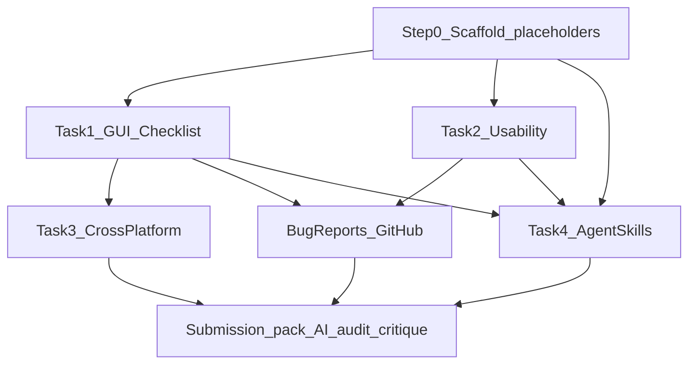

# Kế hoạch HW03 — SV 23127152 (Login + Profile)

> Trạng thái: **Task 1–3 Done · Submission pack zip Ready** — còn điền YouTube demo (Skills) nếu muốn đủ 10đ.  
> Overview: Scaffold `tests-23127152/` theo cấu trúc bài mẫu `tests/` (placeholder rõ tên file), rồi triển khai HW03 cho Login (`/login`) + Profile (`/profile`): Task 1 checklist, Task 2 usability flow Login→Profile, Task 3 cross-platform, Task 4 Agent Skills + phụ lục nộp bài.

## Checklist tiến độ

| ID | Việc | Trạng thái |
|----|------|------------|
| step0-scaffold | Scaffold tree + placeholder files + README self-assess skeleton | **Done** |
| task1-design | GUI checklist Login + Profile (>40, IA-01..04, critical review) | **Done** (65 items) |
| task1-execute | Execute checklist, screenshots Failed, sprint-1 report, bugs + GitHub Issues | **Done** (Excel 65 rows; Issues #137–#156) |
| task2-phase1 | Usability Phase 1: `01-plan/` (test-plan + instruments + recruitment), P00 template | **Done** |
| task2-conduct-analyse | Pilot + 7 real sessions + findings-report (human data only) | **Done** (P01–P07 từ Survey-23127152.xlsx; P00 không có phiếu; Phase 3 F-01…F-05) |
| task3-cross | Platform-matrix ≥3, screenshots + watermark `23127152@hcmus.edu.vn` | **Done Chrome+Firefox** (cửa sổ browser thật); Safari thủ công còn lại |
| task4-skills-pack | Skill demo video + AI audit/critique + commit_log + Excel + Moodle zip | **Partial** — audit/critique/Excel/zip Done; **thiếu YouTube demo** |

---

## Quyết định phạm vi (đã chốt)

| Hạng mục | Giá trị |
|----------|---------|
| MSSV | `23127152` |
| Primary screens (Task 1) | **Login** `/login` + **Profile** `/profile` |
| Usability flow (Task 2) | **U-01**: Đăng nhập → mở Profile → cập nhật Họ tên / SĐT / Địa chỉ thành công (FR-02 + FR-04) |
| Watermark ảnh | `23127152@hcmus.edu.vn` |
| SUT | `./scripts/run.sh` → user web `http://localhost:5173/` |
| Tham chiếu quy trình | Bài mẫu SV 23127211 trong `tests/` + skills trong `.agents/skills/` |
| Workspace bài làm | Toàn bộ artefacts mới nằm trong `tests-23127152/` — **không ghi đè** `tests/` |

Login hiện có nhiều điểm “đắt” cho checklist (tiêu đề “Đăng Ký”, label Username vs email, password `type="text"`, nút “Sign In”, `tabIndex`, forgot dùng `<a href>`). Profile: form cập nhật + validation SĐT + `alert` feedback + lịch sử đơn — đủ IA-01…IA-04 trên 2 màn để vượt >40 item.



---

## Step 0 — Setup folder structure + placeholder (làm trước)

Tạo cây thư mục và file stub (header + `TODO` / `CHƯA THỰC HIỆN`). Checklist/bug/test-runs tham khảo `tests/`; **usability dùng layout phase riêng** (`01-plan` / `02-conduct` / `03-analyse`), không copy phẳng `tests/usability/U-01/`.

```
tests-23127152/
  plan.md                            # file này
  README.md                          # self-assess table + test summary (đề §14)
  checklist/
    login/checklist_login.md
    profile/checklist_profile.md
  bug-reports/
    login/.gitkeep
    profile/.gitkeep
    screenshots/.gitkeep
  test-runs/
    sprint-1-gui-execution.md        # execute checklist Login+Profile
    sprint-2-cross-browser-com.md    # item COM cần 2 engine (nếu có)
  usability/
    README.md
    U-01-login-profile/              # khác tests/usability/U-01 — tách theo phase
      README.md
      01-plan/
        test-plan.md
        instruments.md               # SUS + probes (tách riêng)
        recruitment-tracker.md
      02-conduct/
        pilot/P00.md
        participants/P01.md … P07.md
        evidence/                    # recordings
      03-analyse/
        aggregate-results.md
        findings-report.md
  cross-platform/
    platform-matrix.md
    screenshots/.gitkeep
  ai-audit/
    ai_audit_report.md
    ai_critique.md
  submission/
    commit_log.txt
    gui_checklist_report.md
    usability_evaluation_report.md
    CHECKLIST_EXCEL_PLACEHOLDER.md   # nhắc export Excel >40 rows (đề bắt buộc .xlsx)
```

**Quy ước đặt tên (khớp mẫu 23127211):**

- Checklist ID: `LOGIN-VIS-01`, `PROFILE-VAL-02`, … (prefix màn hình)
- Bug: `BUG-LOGIN-001.md`, `BUG-PROFILE-001.md`; ảnh `BUG-LOGIN-001-short-desc.png`
- Usability: flow code `U-01`; session `P00`…`P07`
- Cross-platform ảnh: `chrome_<ID>_<desc>.png`, watermark `23127152@hcmus.edu.vn`

Mỗi placeholder checklist/usability copy khung từ skill templates:

- `.agents/skills/gui-checklist-builder/assets/checklist_template.md`
- `.agents/skills/usability-evaluation-builder/assets/`
- `.agents/skills/cross-platform-testing-tracker/assets/platform_matrix_template.md`
- `.agents/skills/bug-reporting/templates/bug_report.md`

`README.md` gốc trong `tests-23127152/` ghi: MSSV, screens, flow U-01, bảng self-assess 30/40/20/10, và trạng thái từng deliverable (`Placeholder` → `Done`).

---

## Task 1 — GUI Checklist (30đ)

**Cách làm (AI-First có kỷ luật, giống bài mẫu):**

1. Chạy SUT: `./scripts/run.sh`, mở `http://localhost:5173/login` và `/profile` (profile cần login trước — seed `test@eshop.com` / `Test1234!` nếu còn đúng seed).
2. Gọi skill `.agents/skills/gui-checklist-builder/SKILL.md` **hai lần** (hoặc một invocation với 2 screens theo thứ tự): Login rồi Profile.
   - 4 pass IA-01→IA-04 mỗi màn; inventory DOM từ source `frontend-web/src/pages/Login.jsx` + `Profile.jsx` + live UI.
   - Critical review: bổ sung item AI miss + lý do WPI/NLU/MBS.
   - Mục tiêu: **tổng >40** trên cả 2 file (khuyến nghị ~25–35/màn để không nông).
3. **Execute** (không để AI tự bịa Pass/Fail):
   - Chromium/Playwright MCP hoặc tay; điền `Passed`/`Failed` + `Notes` khi Fail.
   - Screenshot **chỉ Failed** → `bug-reports/screenshots/`.
   - Ghi run report → `test-runs/sprint-1-gui-execution.md` (mẫu: `tests/test-runs/sprint-1-test-run.md`).
4. **Bug reports**: skill `bug-reporting` → `BUG-LOGIN-*.md` / `BUG-PROFILE-*.md`; mở GitHub Issues + đính ảnh (bắt buộc đề).
5. Export Excel >40 rows + cột Status/Notes → đặt cạnh submission (file thật, không fabricate kết quả).
6. Viết `submission/gui_checklist_report.md` tóm tắt coverage IA + thống kê Pass/Fail.

**Commit git từng bước** (đề §12): scaffold → checklist design → execution → từng cụm bug.

---

## Task 2 — Usability Evaluation (40đ)

Flow cố định **U-01 = Login → Profile → cập nhật hồ sơ**.

1. Skill `.agents/skills/usability-evaluation-builder/SKILL.md` **Phase 1 only** → ghi vào `usability/U-01-login-profile/01-plan/`:
   - `test-plan.md`: objectives, scenario goal-oriented, start/success/failure.
   - `instruments.md`: **SUS** + probes Clarity / Error recovery / Speed / Trust.
   - `recruitment-tracker.md`: 7 + pilot — **chỉ placeholder đến khi có người thật**.
2. Phase 2 → `02-conduct/`: pilot `pilot/P00.md` (không aggregate); 7 session `participants/P01`…`P07`; recordings vào `evidence/`.
3. Phase 3 → `03-analyse/`: `aggregate-results.md` + `findings-report.md` severity 0–4; bugs → Issues.
4. Tổng hợp `submission/usability_evaluation_report.md`.

**Không bao giờ** AI điền tên/SĐT/session giả.

---

## Task 3 — Cross-Browser / Cross-Platform (20đ)

1. Skill `cross-platform-testing-tracker`: chọn **đúng 3 platform** — mặc định kế hoạch: **Chrome, Firefox, Android Chrome** (nếu có Mac Safari thì Safari thay Android Chrome -> chốt sài Mac Safari). Tool: BrowserStack/LambdaTest trial; hết trial → máy thật + URL localhost trong khung hình.
2. Không chạy lại cả 70+ item: lọc item platform-sensitive từ checklist Login/Profile (COM/RES/ACC, form render, layout) → `cross-platform/platform-matrix.md`.
3. Chụp evidence thật; overlay watermark bằng script skill (`StudentID@hcmus.edu.vn` → `23127152@hcmus.edu.vn`) → `cross-platform/screenshots/`.
4. Bug lệch platform → bug report riêng + Issues.
5. Thực hiện tự động với Chrome và Firefox, và lên kịch bản để test safari manually (đồng bộ với chrome và firefox)

---

## Task 4 — Agent Skills (10đ) + phụ lục bắt buộc

1. **Skills**: tái sử dụng / tinh chỉnh skills đã có trong `.agents/skills/` (gui-checklist-builder, usability-evaluation-builder, bug-reporting, ai-audit-logger, cross-platform-testing-tracker). Ghi trong README đường dẫn skill + prompt đã dùng.
2. **Demo video** YouTube end-to-end (checklist 1 màn hoặc 1 flow usability) — link trong `README.md`.
3. **AI Audit**: mỗi phiên AI → append `ai-audit/ai_audit_report.md` (skill `ai-audit-logger`); không dùng AI thì khai báo đúng câu đề.
4. **AI Critique** 200–300 từ → `ai-audit/ai_critique.md`.
5. **commit_log.txt**: export `git log` các commit HW03.
6. Đóng gói zip Moodle: `23127152_HW03_AI_GUIUsability_<SSS>.zip` (Markdown+PDF reports, Excel, evidence, README self-assess).

---

## Thứ tự thực thi đề xuất (khi bắt đầu làm)

1. Scaffold placeholders + README trạng thái
2. Task 1 design (2 checklist) → human review
3. Task 1 execute + bugs + Issues
4. Task 2 Phase 1 templates
5. Task 4 skills demo song song khi đã có 1 màn checklist chạy được
6. Task 2 pilot + 7 sessions + Phase 3 (block bởi người thật)
7. Task 3 matrix + ảnh watermark
8. AI critique + commit log + zip

---

## Ranh giới AI / human (tránh 0 điểm)

| AI được làm | Human bắt buộc |
|-------------|----------------|
| Scaffold, checklist design, plan usability, matrix, bug template, audit log | Execute Pass/Fail thật, screenshot Fail, 7 participants, session logs, cross-platform runs, GitHub Issues, video demo, Excel cuối |
