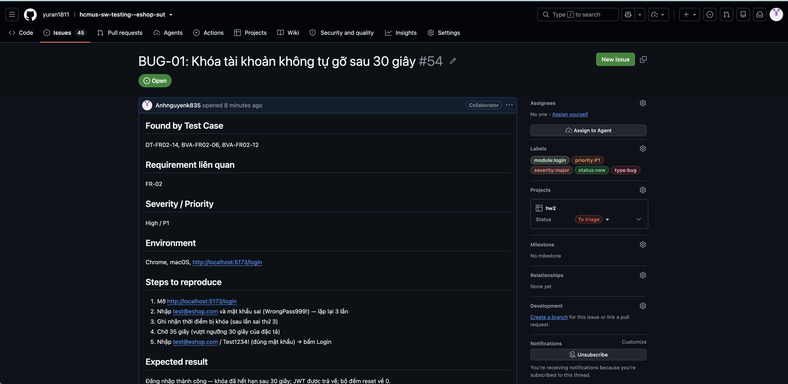
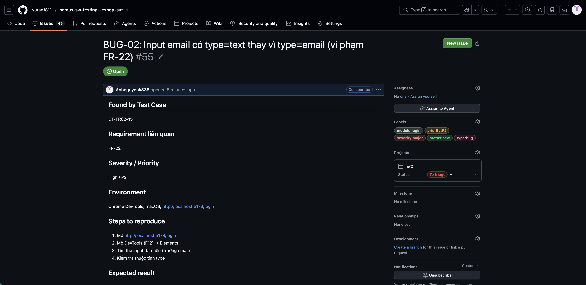
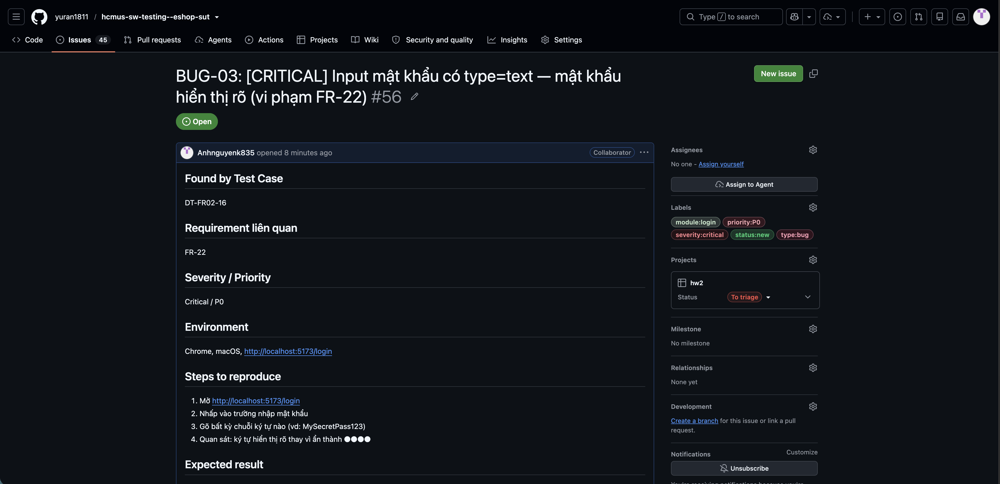
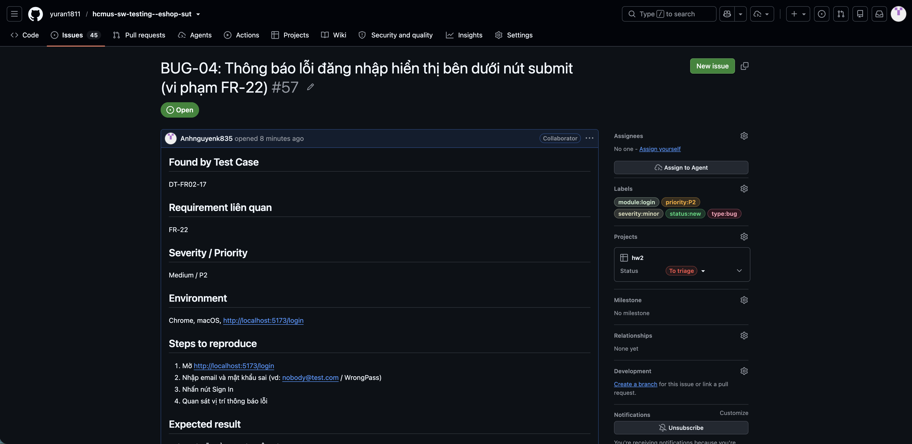
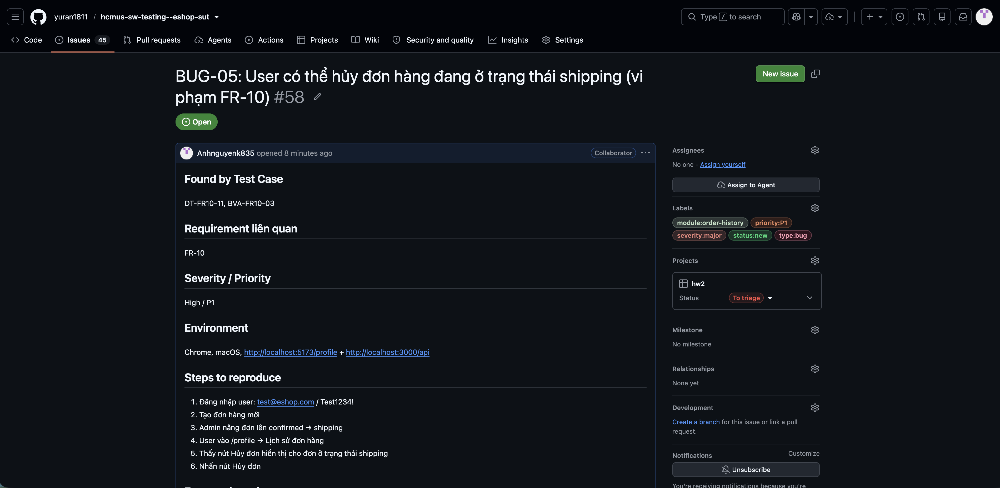
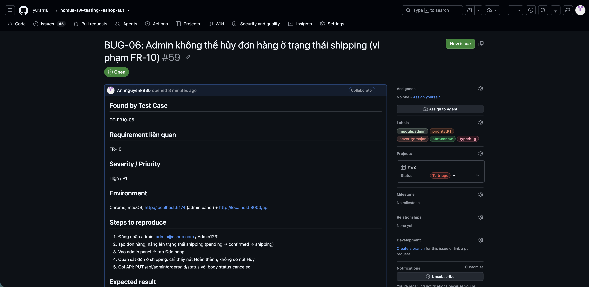
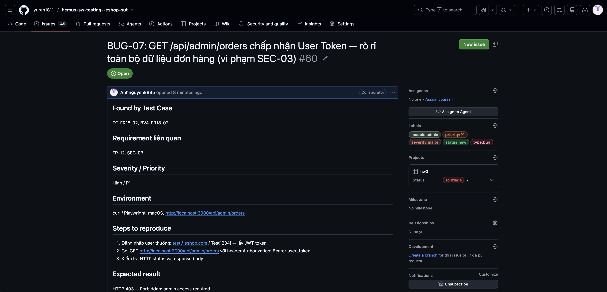
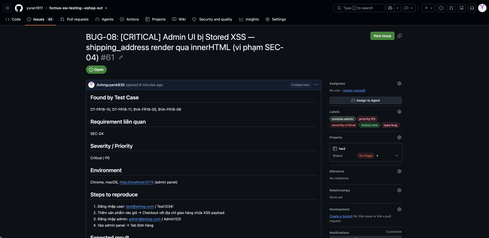

# Bug Report — HW02 Tổng hợp Lỗi

---

| | |
|---|---|
| **Họ Tên** | Nguyễn Tuấn Anh |
| **MSSV** | 23127152 |
| **Phương pháp kiểm thử** | Domain Testing (Equivalence Partitioning) + Boundary Value Analysis |
| **Công cụ** | Claude Code (claude-sonnet-4-6) |

---

## Tóm tắt tổng quan

| Mã | Feature | Severity | Priority | TC liên quan | Trạng thái |
|----|---------|:--------:|:--------:|:------------:|:----------:|
| [BUG-01](#bug-01--khóa-tài-khoản-không-tự-gỡ-sau-30-giây) | FR-02 Login | Major | P1 | DT-FR02-14, BVA-FR02-06 | 🔴 Mở |
| [BUG-02](#bug-02--input-email-có-typetext-thay-vì-typeemail) | FR-02 Login | Major | P2 | DT-FR02-15 | 🔴 Mở |
| [BUG-03](#bug-03--input-mật-khẩu-có-typetext--mật-khẩu-hiển-thị-rõ) | FR-02 Login | **Critical** | **P0** | DT-FR02-16 | 🔴 Mở |
| [BUG-04](#bug-04--thông-báo-lỗi-hiển-thị-dưới-nút-submit) | FR-02 Login | Minor | P2 | DT-FR02-17 | 🔴 Mở |
| [BUG-05](#bug-05--user-có-thể-hủy-đơn-hàng-đang-ở-trạng-thái-shipping) | FR-10 Order State | Major | P1 | DT-FR10-11, BVA-FR10-03 | 🔴 Mở |
| [BUG-06](#bug-06--admin-không-thể-hủy-đơn-hàng-ở-trạng-thái-shipping) | FR-10 Order State | Major | P1 | DT-FR10-06 | 🔴 Mở |
| [BUG-07](#bug-07--get-apiadminorders-chấp-nhận-user-token--idor) | FR-18 Admin | Major | P1 | DT-FR18-02, BVA-FR18-02 | 🔴 Mở |
| [BUG-08](#bug-08--stored-xss-qua-shipping_address-trong-admin-ui) | FR-18 Admin | **Critical** | **P0** | DT-FR18-10, BVA-FR18-06 | 🔴 Mở |

---

## BUG-01 — Khóa tài khoản không tự gỡ sau 30 giây

| Trường | Nội dung |
|--------|---------|
| **Mã lỗi** | BUG-01 |
| **Severity / Priority** | Major / P1 |
| **Feature** | FR-02 — Đăng nhập & Khóa tài khoản |
| **Spec tham chiếu** | §FR-02: _"Hệ thống sẽ tạm khóa tài khoản trong **30 giây**"_ |
| **TC liên quan** | DT-FR02-14, BVA-FR02-06, BVA-FR02-12 |
| **Ngày phát hiện** | 2026-06-28 |

### Mô tả

Sau khi tài khoản bị khóa do 3 lần đăng nhập sai liên tiếp, hệ thống **không tự gỡ khóa sau 30 giây**. Tài khoản vẫn bị khóa dù chờ 35–40+ giây, vi phạm đặc tả FR-02. Hậu quả: tài khoản bị khóa vĩnh viễn cho đến khi restart server.

### Các bước tái hiện

1. Truy cập `http://localhost:5173/login`
2. Nhập `test@eshop.com` + mật khẩu sai → submit — lặp **3 lần**
3. Ghi nhận thời điểm bị khóa sau lần sai thứ 3
4. Chờ **35 giây** (> ngưỡng 30s)
5. Nhập `test@eshop.com / Test1234!` (đúng) → submit

### Kết quả mong đợi

Đăng nhập **thành công** — khóa đã hết hạn; JWT trả về; bộ đếm reset về 0.

### Kết quả thực tế

Đăng nhập **thất bại** — _"Đăng nhập thất bại. Vui lòng kiểm tra lại."_ dù đã chờ 38 giây.

### Screenshot



### Tác động

- Tài khoản bị khóa vĩnh viễn sau 3 lần nhập sai — phải liên hệ hỗ trợ hoặc restart server
- Có thể bị lợi dụng để DoS tài khoản cụ thể: kẻ tấn công cố tình nhập sai 3 lần để khóa account người khác

---

## BUG-02 — Input email có `type="text"` thay vì `type="email"`

| Trường | Nội dung |
|--------|---------|
| **Mã lỗi** | BUG-02 |
| **Severity / Priority** | Major / P2 |
| **Feature** | FR-02 — Đăng nhập / FR-22 — UI Form |
| **Spec tham chiếu** | §FR-22: _"Input email phải có thuộc tính `type="email"`"_ |
| **TC liên quan** | DT-FR02-15 |
| **Ngày phát hiện** | 2026-06-28 |

### Mô tả

Trường nhập email trên `/login` có `type="text"` thay vì `type="email"`. Trình duyệt không validate định dạng email phía client, bàn phím mobile không hiện `@`.

### Các bước tái hiện

1. Truy cập `http://localhost:5173/login`
2. Mở DevTools → Elements
3. Kiểm tra `<input>` đầu tiên (trường email)

### Kết quả mong đợi

```html
<input type="email" ... />
```

### Kết quả thực tế

```html
<input type="text" class="w-full border p-2 rounded" required="" />
```

### Screenshot



### Tác động

- Browser không validate định dạng email trước submit
- Mobile keyboard không hiện ký tự `@` tự động
- Vi phạm accessibility cho form đăng nhập

---

## BUG-03 — Input mật khẩu có `type="text"` — mật khẩu hiển thị rõ

| Trường | Nội dung |
|--------|---------|
| **Mã lỗi** | BUG-03 |
| **Severity / Priority** | **Critical** / **P0** |
| **Feature** | FR-02 — Đăng nhập / FR-22 — UI Form |
| **Spec tham chiếu** | §FR-22: _"Input mật khẩu phải có `type="password"`"_ |
| **TC liên quan** | DT-FR02-16 |
| **Ngày phát hiện** | 2026-06-28 |

### Mô tả

Trường nhập mật khẩu trên `/login` có `type="text"` — **mật khẩu hiển thị dưới dạng plain text** khi nhập. Bất kỳ ai nhìn vào màn hình đều đọc được mật khẩu. Đây là lỗi bảo mật cơ bản nhất.

### Các bước tái hiện

1. Truy cập `http://localhost:5173/login`
2. Nhấp vào trường "Mật khẩu"
3. Gõ bất kỳ chuỗi ký tự nào (vd: `MySecretPass123`)
4. Quan sát: ký tự hiển thị rõ thay vì bị che bởi `●`

### Kết quả mong đợi

```html
<input type="password" ... />   <!-- ký tự: ●●●●●●● -->
```

### Kết quả thực tế

```html
<input type="text" class="w-full border p-2 rounded" required="" />
<!-- ký tự: MySecretPass123 — hiển thị rõ -->
```

### Screenshot



### Tác động

- **Shoulder surfing:** Bất kỳ ai gần màn hình (quán cà phê, văn phòng) đều thấy mật khẩu
- Camera giám sát, screen recording tự động capture mật khẩu
- Password manager không nhận dạng field → không tự điền
- Vi phạm FR-22 và tiêu chuẩn bảo mật web cơ bản

---

## BUG-04 — Thông báo lỗi hiển thị dưới nút submit

| Trường | Nội dung |
|--------|---------|
| **Mã lỗi** | BUG-04 |
| **Severity / Priority** | Minor / P2 |
| **Feature** | FR-02 — Đăng nhập / FR-22 — UI Form |
| **Spec tham chiếu** | §FR-22: _"Thông báo lỗi phải hiển thị **phía trên** nút submit"_ |
| **TC liên quan** | DT-FR02-17 |
| **Ngày phát hiện** | 2026-06-28 |

### Mô tả

Thông báo lỗi đăng nhập render **bên dưới** nút "Sign In" thay vì phía trên. Đo lường DOM: thông báo lỗi `top=517px`, nút submit `top=425px` → lệch 92px xuống phía dưới.

### Kết quả mong đợi

```
[Email input     ]
[Password input  ]
Đăng nhập thất bại...   ← phải ở đây (trên nút)
[    Sign In     ]
```

### Kết quả thực tế

```
[Email input     ]
[Password input  ]
[    Sign In     ]
Đăng nhập thất bại...   ← thực tế ở đây (dưới nút)
```

### Screenshot



### Tác động

- Người dùng dễ bỏ qua thông báo sau khi bấm nút
- Vi phạm FR-22 về bố cục form đăng nhập
- UX kém, đặc biệt trên màn hình nhỏ

---

## BUG-05 — User có thể hủy đơn hàng đang ở trạng thái `shipping`

| Trường | Nội dung |
|--------|---------|
| **Mã lỗi** | BUG-05 |
| **Severity / Priority** | Major / P1 |
| **Feature** | FR-10 — Order State Machine |
| **Spec tham chiếu** | §FR-10: _"Khi đơn ở `shipping`, User không được phép hủy"_ |
| **TC liên quan** | DT-FR10-11, BVA-FR10-03 |
| **Ngày phát hiện** | 2026-06-28 |

### Mô tả

UI và backend đều cho phép user hủy đơn hàng đang ở `shipping`:
- **UI:** Nút "Hủy đơn" hiển thị trên `/profile` cho đơn `shipping`
- **API:** `PUT /api/orders/:id/cancel` trả về HTTP 200 + hủy đơn thành công

### Các bước tái hiện

1. Đăng nhập user: `test@eshop.com / Test1234!`
2. Tạo đơn hàng mới
3. Admin nâng đơn: `pending → confirmed → shipping`
4. User vào `/profile` → Lịch sử đơn hàng
5. **Thấy nút "Hủy đơn"** cho đơn `shipping`
6. Nhấn nút → Đơn bị hủy thành công

### Kết quả mong đợi

- Nút "Hủy đơn" **ẩn** cho đơn `shipping`
- API `PUT /api/orders/:id/cancel` trả về **HTTP 4xx**

### Kết quả thực tế

- Nút "Hủy đơn" **hiển thị**
- API: HTTP 200 `{"message":"Order canceled successfully"}`
- Đơn chuyển `shipping → canceled`

### Screenshot



### Tác động

- Giao hàng viên đang trên đường nhưng đơn bị hủy trong hệ thống
- Trạng thái vật lý và hệ thống không đồng bộ → thiệt hại vật chất, uy tín
- **Ghi chú:** Kết hợp với BUG-06 — logic actor bị hoán đổi

---

## BUG-06 — Admin không thể hủy đơn hàng ở trạng thái `shipping`

| Trường | Nội dung |
|--------|---------|
| **Mã lỗi** | BUG-06 |
| **Severity / Priority** | Major / P1 |
| **Feature** | FR-10 — Order State Machine |
| **Spec tham chiếu** | §FR-10: _"Admin có thể hủy đơn ở **bất kỳ** trạng thái nào"_ |
| **TC liên quan** | DT-FR10-06 |
| **Ngày phát hiện** | 2026-06-28 |

### Mô tả

Admin không thể hủy đơn ở `shipping` dù đặc tả cho phép:
- **Admin UI:** Không có nút "Hủy" — chỉ có nút "Hoàn thành"
- **Admin API:** `PUT /api/admin/orders/:id/status {"status":"canceled"}` → HTTP 400

### Các bước tái hiện

1. Đăng nhập admin: `admin@eshop.com / Admin123!`
2. Nâng đơn lên `shipping`
3. Admin panel → Tab "Đơn hàng" → chỉ thấy nút "Hoàn thành"
4. Gọi API: `PUT /api/admin/orders/:id/status {"status":"canceled"}` → HTTP 400

### Kết quả mong đợi

- Admin UI hiển thị nút "Hủy" cho đơn `shipping`
- API trả về HTTP 200; đơn chuyển sang `canceled`

### Kết quả thực tế

- Không có nút "Hủy" trong admin UI
- HTTP 400: `{"error":"Invalid state transition from shipping to canceled"}`

### Screenshot



### Phân tích root cause

BUG-05 và BUG-06 là biểu hiện "hoán đổi actor" trong logic kiểm tra quyền:
- User **được** hủy từ `shipping` (sai — BUG-05)
- Admin **không được** hủy từ `shipping` (sai — BUG-06)

Backend thiếu `shipping → canceled` trong `VALID_TRANSITIONS` cho admin, nhưng lại không block endpoint user cancel từ `shipping`.

### Tác động

- Admin mất khả năng xử lý sự cố đơn đang vận chuyển (hàng hỏng, địa chỉ sai, khách từ chối nhận)
- Mọi đơn `shipping` buộc phải hoàn tất — không có luồng ngoại lệ

---

## BUG-07 — `GET /api/admin/orders` chấp nhận User Token (IDOR)

| Trường | Nội dung |
|--------|---------|
| **Mã lỗi** | BUG-07 |
| **Severity / Priority** | Major / P1 |
| **Feature** | FR-18 — Admin Order Management |
| **Spec tham chiếu** | §SEC-03: _"API Admin phải yêu cầu `role = 'admin'` trong token"_ |
| **TC liên quan** | DT-FR18-02, BVA-FR18-02 |
| **Ngày phát hiện** | 2026-06-28 |
| **OWASP** | A01:2021 — Broken Access Control |

### Mô tả

`GET /api/admin/orders` chỉ kiểm tra sự tồn tại của JWT mà **không kiểm tra role**. Bất kỳ user đã đăng nhập nào đều lấy được toàn bộ đơn hàng của mọi khách hàng trong hệ thống.

```
no token  → HTTP 401 ✅
user token → HTTP 200 + 84 records ❌ (BUG-07)
admin token → HTTP 200 ✅
```

### Tái hiện bằng curl

```bash
USER_TOKEN=$(curl -s -X POST http://localhost:3000/api/login \
  -H 'Content-Type: application/json' \
  -d '{"email":"test@eshop.com","password":"Test1234!"}' | jq -r .token)

curl -s http://localhost:3000/api/admin/orders \
  -H "Authorization: Bearer $USER_TOKEN" | jq length
# Output: 84  ← toàn bộ đơn hàng của mọi user
```

### Kết quả mong đợi

HTTP **403** `{"error":"Forbidden: admin access required"}`

### Kết quả thực tế

HTTP **200** + mảng 84+ records, mỗi record có: `user_id`, `total_amount`, `shipping_address`, `status`

### Screenshot



### Fix đề xuất

```javascript
// Hiện tại (sai):
if (!token || !verifyJWT(token)) return res.status(401).json(...)

// Cần sửa:
const decoded = verifyJWT(token);
if (!decoded) return res.status(401).json(...);
if (decoded.role !== 'admin') return res.status(403).json({ error: 'Forbidden' });
```

### Tác động

- **Data breach:** Địa chỉ nhà, số tiền giao dịch của tất cả khách hàng bị lộ
- **Privacy violation:** Vi phạm least privilege — user đọc được thông tin user khác
- Kết hợp với BUG-08 tạo attack chain hoàn chỉnh

---

## BUG-08 — Stored XSS qua `shipping_address` trong Admin UI

| Trường | Nội dung |
|--------|---------|
| **Mã lỗi** | BUG-08 |
| **Severity / Priority** | **Critical** / **P0** |
| **Feature** | FR-18 — Admin Order Management |
| **Spec tham chiếu** | §SEC-04: _"Dữ liệu user nhập phải được escape khi hiển thị — không dùng `innerHTML` trực tiếp"_ |
| **TC liên quan** | DT-FR18-10, DT-FR18-11, BVA-FR18-05, BVA-FR18-06 |
| **Ngày phát hiện** | 2026-06-28 |
| **OWASP** | A03:2021 — Injection (Stored XSS) |

### Mô tả

Admin UI render trường `shipping_address` (do user nhập khi checkout) trực tiếp qua `innerHTML`/`dangerouslySetInnerHTML`. Payload XSS được lưu vào DB khi user checkout và **thực thi mỗi khi admin mở trang orders**.

| Payload | Kết quả |
|---------|---------|
| `<b>Địa chỉ test</b>` | Text render in đậm |
| `` | `alert()` bắn ngay |
| `<script>alert(1)</script>` | Script thực thi |
| `` | Cookie admin bị lộ |

### Các bước tái hiện

1. User checkout với địa chỉ:
   ```
   
   ```
2. Admin đăng nhập vào `localhost:5174`
3. Vào tab "Đơn hàng"
4. **`alert()` bắn ngay lập tức** với cookie của admin

### Kết quả mong đợi

Địa chỉ hiển thị literal text: ``

### Kết quả thực tế

JavaScript thực thi; `alert()` bắn với cookie của admin session.

### Screenshot



### Fix đề xuất

```jsx
// Code lỗi:
<td dangerouslySetInnerHTML={{ __html: order.shipping_address }} />

// Fix đúng (React):
<td>{order.shipping_address}</td>

// Fix đúng (JS thuần):
tdElement.textContent = order.shipping_address;
```

### Attack Chain với BUG-07

```
User A checkout với XSS payload trong shipping_address
       ↓
Payload lưu vào DB
       ↓
Admin mở trang orders → script thực thi
       ↓
Script đánh cắp document.cookie (JWT admin)
       ↓
User A dùng admin token gọi toàn bộ admin API (BUG-07 amplify)
       ↓
Full system compromise
```

### Tác động

- **Session hijacking:** Đánh cắp JWT admin → kiểm soát hoàn toàn hệ thống
- **Data exfiltration:** Đọc toàn bộ database qua admin API
- **Escalation:** Kết hợp BUG-07 tạo attack chain hoàn chỉnh chỉ từ quyền user thường

---

## Phân tích tổng thể

### Phân bố theo feature

| Feature | Bugs | Severity cao nhất |
|---------|:----:|:-----------------:|
| FR-02 Login | 4 | Critical (BUG-03) |
| FR-10 Order State | 2 | Major |
| FR-18 Admin | 2 | Critical (BUG-08) |
| Mobile | 0 | — |

### Ưu tiên sửa chữa

| Ưu tiên | Bug | Lý do |
|:-------:|-----|-------|
| 🔴 P0 — Ngay lập tức | BUG-08 | Attack vector đang hoạt động — admin session bị lộ |
| 🔴 P0 — Ngay lập tức | BUG-03 | Mật khẩu plain text — vi phạm bảo mật cơ bản |
| 🟠 P1 — Sớm | BUG-07 | IDOR — rò rỉ PII toàn bộ khách hàng |
| 🟠 P1 — Sớm | BUG-01 | Tài khoản bị khóa vĩnh viễn |
| 🟠 P1 — Sớm | BUG-05, BUG-06 | Logic cancel bị hoán đổi |
| 🟢 P2 — Thường | BUG-02, BUG-04 | UX / accessibility |

