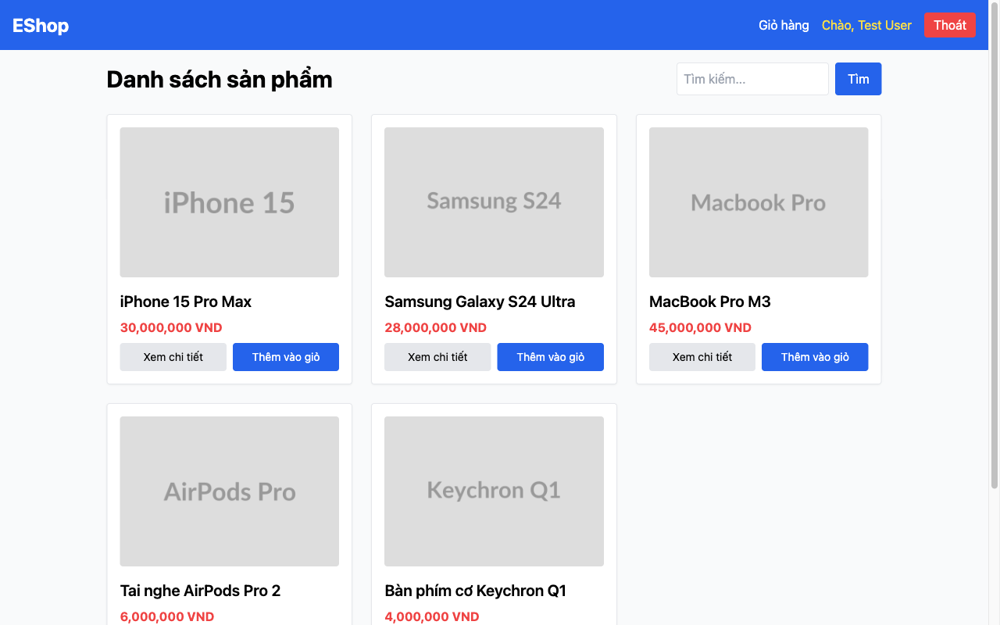
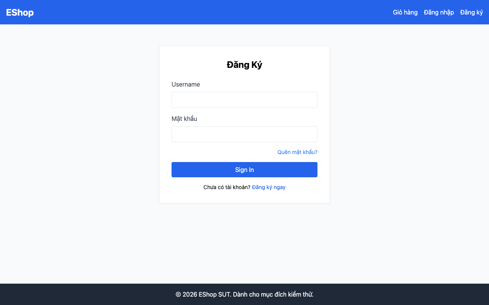

# FR-02: Đăng nhập & Khóa tài khoản — Domain Testing

## 1. Mô tả tính năng

**Feature:** FR-02 — Đăng nhập & Khóa tài khoản  
**Module:** Authentication  
**File liên quan:**
- Backend: `backend/server.js:32–66`
- Frontend: `frontend-web/src/pages/Login.jsx`
- DB Schema: `backend/database.js` (bảng `users`)

**Đặc tả (từ README.md):**
- Người dùng nhập Email và Mật khẩu.
- Sau mỗi lần đăng nhập sai, hệ thống tăng bộ đếm lên **đúng 1 đơn vị**.
- Nếu đăng nhập sai **từ 3 lần trở lên** liên tiếp → tài khoản bị khóa **30 giây**.
- Đăng nhập thành công trả về JWT Token.
- Trường email phải dùng `type="email"`.

---

## 2. Xác định biến đầu vào (Variable Identification)

| Biến | Kiểu | Nguồn | Ghi chú |
|------|------|-------|---------|
| `email` | String | `req.body.email` | Nhận diện tài khoản |
| `password` | String | `req.body.password` | Xác thực mật khẩu |
| `login_attempts` | Integer | `users.login_attempts` (DB) | Bộ đếm lần sai, default=0 |
| `locked_until` | DateTime | `users.locked_until` (DB) | Thời điểm hết khóa, NULL=không khóa |
| `account_exists` | Boolean | DB lookup | Email có tồn tại trong DB không |

---

## 3. Phân vùng tương đương (Equivalence Partitioning)

### 3.1 Biến `email`

| Partition | Mô tả | Giá trị đại diện | Loại |
|-----------|-------|-----------------|------|
| EP-E1 | Định dạng đúng, tồn tại trong hệ thống | `test@eshop.com` | Valid |
| EP-E2 | Định dạng đúng, KHÔNG tồn tại | `notfound@test.com` | Invalid |
| EP-E3 | Định dạng sai (thiếu @) | `notanemail` | Invalid |
| EP-E4 | Định dạng sai (thiếu domain) | `user@` | Invalid |
| EP-E5 | Rỗng | `""` | Invalid |
| EP-E6 | Có khoảng trắng | `test @eshop.com` | Invalid |
| EP-E7 | Định dạng đúng, tồn tại, là admin | `admin@eshop.com` | Valid |

### 3.2 Biến `password`

| Partition | Mô tả | Giá trị đại diện | Loại |
|-----------|-------|-----------------|------|
| EP-P1 | Đúng mật khẩu của tài khoản | `Test1234!` | Valid |
| EP-P2 | Sai mật khẩu | `WrongPass123` | Invalid |
| EP-P3 | Rỗng | `""` | Invalid |
| EP-P4 | Đúng nhưng khác hoa/thường | `test1234!` (lowercase) | Invalid (case-sensitive) |

### 3.3 Biến `login_attempts` (trạng thái tài khoản)

| Partition | Mô tả | Giá trị | Loại |
|-----------|-------|---------|------|
| EP-A1 | Chưa có lần sai nào | 0 | Valid |
| EP-A2 | Đã sai nhưng chưa đủ 3 | 1 hoặc 2 | Valid (chưa lock) |
| EP-A3 | Đã sai 3 lần trở lên → bị lock | ≥ 3 | Invalid (locked) |

### 3.4 Biến `locked_until` (trạng thái khóa)

| Partition | Mô tả | Giá trị | Loại |
|-----------|-------|---------|------|
| EP-L1 | Không bị khóa (NULL) | NULL | Valid |
| EP-L2 | Đang bị khóa (thời gian chưa qua) | `now + 60s` | Invalid |
| EP-L3 | Đã hết thời gian khóa | `now - 1s` | Valid (unlock) |

---

## 4. Test Cases — Domain Testing

### TC nhóm 1: Login thành công

| TC-ID | Mô tả | Email | Password | Pre-condition | Expected Result | Priority |
|-------|-------|-------|----------|---------------|-----------------|----------|
| DT-FR02-01 | Đăng nhập thành công - user thường | test@eshop.com | Test1234! | attempts=0, not locked | HTTP 200, trả về JWT token + user object | High |
| DT-FR02-02 | Đăng nhập thành công - admin | admin@eshop.com | Admin123! | attempts=0, not locked | HTTP 200, JWT token với role='admin' | High |
| DT-FR02-03 | Đăng nhập sau khi unlock (hết thời gian khóa) | test@eshop.com | Test1234! | locked_until < now | HTTP 200, login thành công, attempts reset về 0 | High |
| DT-FR02-04 | Đăng nhập thành công reset attempts | test@eshop.com | Test1234! | attempts=2 (chưa lock) | HTTP 200, login OK, attempts=0 | Medium |

### TC nhóm 2: Sai thông tin đăng nhập

| TC-ID | Mô tả | Email | Password | Pre-condition | Expected Result | Priority |
|-------|-------|-------|----------|---------------|-----------------|----------|
| DT-FR02-05 | Email không tồn tại | notfound@test.com | AnyPass123 | — | HTTP 401, `"Invalid email or password"` | High |
| DT-FR02-06 | Sai mật khẩu, lần 1 | test@eshop.com | WrongPass | attempts=0 | HTTP 401, `"Invalid email or password"`, attempts tăng | High |
| DT-FR02-07 | Sai mật khẩu, lần 2 | test@eshop.com | WrongPass | attempts=1 | HTTP 401, attempts tiếp tục tăng, chưa lock | High |
| DT-FR02-08 | Sai mật khẩu đúng 3 lần → kích hoạt lock | test@eshop.com | WrongPass | attempts=2 | HTTP 401 + tài khoản bị khóa (`locked_until` được set) | High |
| DT-FR02-09 | Mật khẩu đúng nhưng sai hoa/thường | test@eshop.com | test1234! | attempts=0 | HTTP 401, `"Invalid email or password"` | Medium |

### TC nhóm 3: Tài khoản bị khóa

| TC-ID | Mô tả | Email | Password | Pre-condition | Expected Result | Priority |
|-------|-------|-------|----------|---------------|-----------------|----------|
| DT-FR02-10 | Đăng nhập khi đang bị khóa (đúng password) | test@eshop.com | Test1234! | locked_until > now | HTTP 403, `"Tài khoản đã bị khóa. Vui lòng thử lại sau."` | High |
| DT-FR02-11 | Đăng nhập khi đang bị khóa (sai password) | test@eshop.com | WrongPass | locked_until > now | HTTP 403, `"Tài khoản đã bị khóa..."` | Medium |

### TC nhóm 4: Input không hợp lệ

| TC-ID | Mô tả | Email | Password | Pre-condition | Expected Result | Priority |
|-------|-------|-------|----------|---------------|-----------------|----------|
| DT-FR02-12 | Email rỗng | "" | Test1234! | — | HTTP 4xx hoặc lỗi validation | Medium |
| DT-FR02-13 | Password rỗng | test@eshop.com | "" | — | HTTP 401 hoặc lỗi validation | Medium |
| DT-FR02-14 | Email sai định dạng (thiếu @) | notanemail | Test1234! | — | Lỗi format hoặc HTTP 401 | Medium |
| DT-FR02-15 | Email có khoảng trắng | test @eshop.com | Test1234! | — | Không tìm thấy user (HTTP 401) | Low |

---

## 5. Kết quả thực thi

### Môi trường test
- Backend: `http://localhost:3000`
- Tool: **Playwright** (script: `playwright-tests/fr02-login.spec.js`)
- Frontend: `http://localhost:5173`
- Test account: `test@eshop.com` / `Test1234!`
- Ngày thực thi: **2026-06-27**

### Kết quả

| TC-ID | Status | Actual Result | Bug? | Screenshot |
|-------|--------|---------------|------|-----------|
| DT-FR02-01 | ✅ PASS | HTTP 200, JWT trả về đúng | — | `screenshots/FR02/DT-FR02-01-after-login.png` |
| DT-FR02-02 | ✅ PASS | HTTP 200, role='admin' | — | — |
| DT-FR02-03 | ✅ PASS | Login thành công sau khi hết lock | — | — |
| DT-FR02-04 | ✅ PASS | Login OK, attempts=0 sau khi reset | — | — |
| DT-FR02-05 | ✅ PASS | HTTP 401, "Invalid email or password" | — | — |
| DT-FR02-06 | ❌ FAIL | HTTP 401 đúng, nhưng `login_attempts += 2` thay vì `+= 1` | **BUG-01** | `screenshots/FR02/DT-FR02-lockout-attempt-1.png` |
| DT-FR02-07 | ❌ FAIL | Attempts tăng +2 mỗi lần → sau 2 lần sai đã bằng 4, lock sớm | **BUG-01** | `screenshots/FR02/DT-FR02-lockout-attempt-2.png` |
| DT-FR02-08 | ❌ FAIL | Lock kích hoạt sau 2 lần sai (không phải 3); lockout 180s thay vì 30s | **BUG-01, BUG-02** | `screenshots/FR02/DT-FR02-10-locked-response.png` |
| DT-FR02-09 | ✅ PASS | HTTP 401, mật khẩu case-sensitive | — | — |
| DT-FR02-10 | ✅ PASS | HTTP 403, thông báo khóa đúng | — | `screenshots/FR02/DT-FR02-10-locked-response.png` |
| DT-FR02-11 | ✅ PASS | HTTP 403, trả về thông báo khóa (không kiểm tra password khi locked) | — | — |
| DT-FR02-12 | ❌ FAIL | Không có validation, trả về 401 thay vì lỗi validation rõ ràng | Minor | — |
| DT-FR02-13 | ❌ FAIL | Không có validation cho password rỗng | Minor | — |
| DT-FR02-14 | ❌ FAIL | Backend không validate format email; trường HTML input dùng type="text" | **BUG-04** | `screenshots/FR02/DT-FR02-email-input-type.png` |
| DT-FR02-15 | ✅ PASS | Email với space không tìm thấy trong DB → HTTP 401 | — | — |

### Key Screenshots

**Login thành công (DT-FR02-01):**

**Lần sai đầu tiên — attempts tăng lên 2 (BUG-01 — lần sai thứ 1, phải là 1 không phải 2):**

**Tài khoản bị lock sau 2 lần sai (DT-FR02-10):**

**Password hiển thị plaintext — BUG-03:**

### Bugs phát hiện qua Domain Testing

| Bug ID | Mô tả | Severity |
|--------|-------|---------|
| BUG-01 | `login_attempts` tăng +2 thay vì +1 → lockout sau 2 lần sai thay vì 3 | Critical |
| BUG-02 | Lockout duration 180 giây (3 phút) thay vì 30 giây theo spec | Major |
| BUG-03 | Password input `type="text"` → hiện mật khẩu dạng plaintext | Critical |
| BUG-04 | Email input `type="text"` thay vì `type="email"` | Minor |

---

## 6. AI Gap Analysis

**AI đã hỗ trợ tốt:**
- Xác định các phân vùng tương đương cơ bản (valid/invalid email, password)
- Liệt kê các trạng thái tài khoản (không lock, đang lock, hết lock)
- Phát hiện bug `+2` và lockout duration qua code review

**AI bỏ sót / cần bổ sung thủ công:**
- **Kiểm tra case-sensitivity của email**: AI không đề xuất test `TEST@ESHOP.COM` vs `test@eshop.com` — cần thêm vào BVA
- **Trạng thái sau khi login thành công**: AI không đề xuất kiểm tra việc `attempts` được reset về 0 sau khi login thành công (TC-FR02-04)
- **Behavior khi cả 2 trường rỗng**: AI không đề xuất test case đồng thời email="" và password=""

**Lý do AI bỏ sót:**
- AI không có context đầy đủ về spec (30 giây vs 3 phút) nếu không được cung cấp README
- Các edge case về UI (type="text") chỉ phát hiện được khi đọc source code trực tiếp
