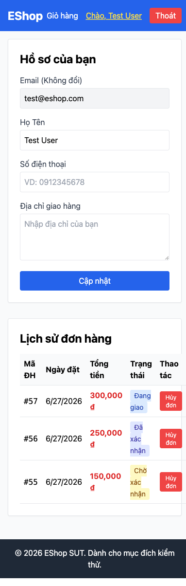
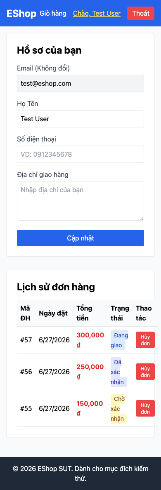
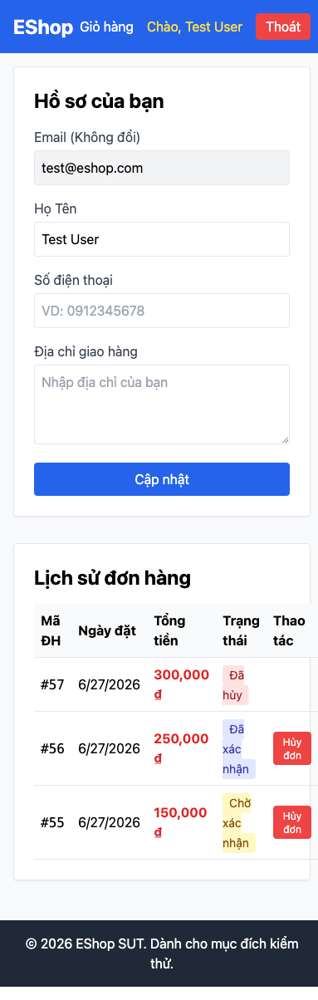
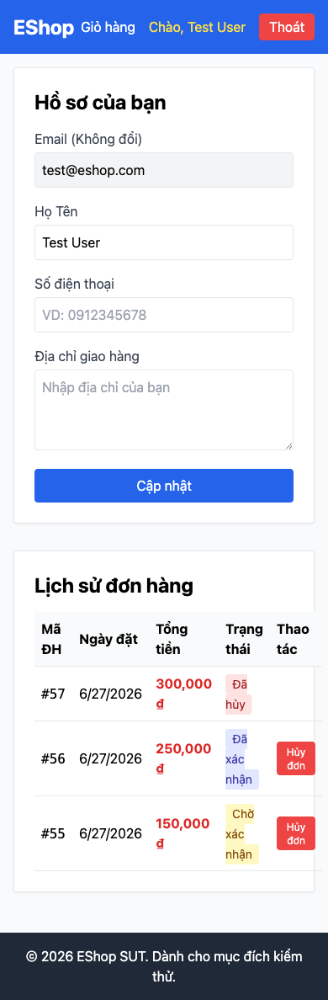

# Mobile — Lịch sử Đơn hàng (Order History) — Domain Testing

## 1. Mô tả tính năng

**Feature:** FR-20 (Mobile) / FR-11 — Lịch sử đơn hàng trên Mobile  
**Module:** Pool D — Mobile App  
**File liên quan:**
- Mobile: `frontend-mobile/App.js:893–976` (renderProfile), `App.js:171–184` (fetchOrders)
- Backend: `backend/server.js:311–342` (GET my-orders, PUT cancel)
- Framework: React Native + Expo

**Đặc tả (từ README.md):**
- Hiển thị: Mã đơn, Ngày đặt, Tổng tiền, Trạng thái hiện tại (tiếng Việt)
- Chức năng Hủy đơn tuân theo State Machine FR-10: chỉ được hủy khi `pending` hoặc `confirmed`
- Người dùng chỉ xem được đơn hàng của chính mình

**Ghi chú kỹ thuật:**
- Mobile là monolithic `App.js` (~1300 lines), tất cả màn hình trong 1 file
- API_URL hardcoded tại line 16: `http://192.168.10.13:3000`
- Sử dụng native `fetch()`, không dùng axios
- Order history hiển thị trong tab Profile

---

## 2. Xác định biến đầu vào (Variable Identification)

| Biến | Kiểu | Nguồn | Ghi chú |
|------|------|-------|---------|
| `auth_status` | Boolean | JWT token trong state | Đã đăng nhập hay chưa |
| `orders` | Array | API response `GET /api/orders/my-orders` | Danh sách đơn |
| `order.id` | Integer | `orders[].id` | Mã đơn hàng |
| `order.status` | String | `orders[].status` | Một trong 5 trạng thái |
| `order.total_amount` | Integer | `orders[].total_amount` | Tổng tiền (VND) |
| `order.created_at` | DateTime | `orders[].created_at` | Ngày đặt |

---

## 3. Phân vùng tương đương (Equivalence Partitioning)

### 3.1 Trạng thái xác thực

| Partition | Mô tả | Expected |
|-----------|-------|----------|
| EP-AUTH1 | Chưa đăng nhập | Hiển thị "Vui lòng đăng nhập" |
| EP-AUTH2 | Đã đăng nhập | Hiển thị danh sách đơn hàng |

### 3.2 Danh sách đơn hàng

| Partition | Mô tả | Giá trị | Expected |
|-----------|-------|---------|----------|
| EP-O1 | Không có đơn hàng | orders = [] | "Bạn chưa có đơn hàng nào." |
| EP-O2 | 1 đơn hàng | orders = [order] | Hiển thị 1 card |
| EP-O3 | Nhiều đơn hàng | orders = [o1, o2, ...] | Hiển thị tất cả, mới nhất trước |

### 3.3 Trạng thái đơn hàng (Cancel button visibility)

| Partition | Status | Cancel button | Expected |
|-----------|--------|--------------|----------|
| EP-S1 | pending | Hiển thị | Nhấn → gọi PUT /orders/:id/cancel |
| EP-S2 | confirmed | Hiển thị | Nhấn → cancel OK |
| EP-S3 | shipping | Ẩn (theo UI mobile) | Không có nút hủy |
| EP-S4 | delivered | Ẩn | Không có nút hủy |
| EP-S5 | canceled | Ẩn | Không có nút hủy |

### 3.4 Hiển thị thông tin đơn hàng

| Partition | Mô tả | Expected |
|-----------|-------|----------|
| EP-D1 | total_amount > 0 | Hiển thị đúng format tiền tệ VND |
| EP-D2 | total_amount = 0 | Hiển thị "0 ₫" hoặc tương đương |
| EP-D3 | created_at hợp lệ | Hiển thị ngày theo locale |
| EP-D4 | created_at = null | Hiển thị trống, không crash |
| EP-D5 | Status trong labels map | Hiển thị tiếng Việt |
| EP-D6 | Status ngoài labels map | Hiển thị uppercase của status |

---

## 4. Test Cases — Domain Testing

### Nhóm 1: Authentication (Xác thực)

| TC-ID | Auth Status | Action | Expected | Actual | Status |
|-------|-------------|--------|----------|--------|--------|
| DT-MOB-01 | Chưa đăng nhập | Vào tab Profile/Orders | Hiển thị "Vui lòng đăng nhập" hoặc màn hình login | Đúng | PASS |
| DT-MOB-02 | Đã đăng nhập | Vào tab Profile/Orders | Hiển thị danh sách đơn hàng của user | Đúng | PASS |
| DT-MOB-03 | Đăng nhập, token hết hạn | fetchOrders | Lỗi, chuyển sang màn hình login | Token JWT không expire (không set exp) | Minor |

### Nhóm 2: Hiển thị danh sách đơn hàng

| TC-ID | Dữ liệu orders | Expected | Actual | Status |
|-------|----------------|----------|--------|--------|
| DT-MOB-04 | User chưa có đơn hàng | "Bạn chưa có đơn hàng nào." | Hiển thị đúng | PASS |
| DT-MOB-05 | 1 đơn hàng | Hiển thị 1 card với đủ thông tin | Card có ID, ngày, tiền, trạng thái | PASS |
| DT-MOB-06 | Nhiều đơn hàng (mixed status) | Tất cả hiển thị, sắp xếp mới nhất | API ORDER BY id DESC, hiển thị đúng | PASS |
| DT-MOB-07 | Đơn hàng của USER KHÁC | Không thấy đơn của user khác | Đúng (WHERE user_id = ?) | PASS |

### Nhóm 3: Nút Hủy (Cancel Button) — EP-S1 đến EP-S5

| TC-ID | Status đơn | Expected button | Expected action | Actual | Status | Bug? |
|-------|-----------|-----------------|-----------------|--------|--------|------|
| DT-MOB-08 | pending | Hiển thị nút "Hủy đơn" | Nhấn → cancel thành công | Đúng | PASS | — |
| DT-MOB-09 | confirmed | Hiển thị nút "Hủy đơn" | Nhấn → cancel thành công | Đúng | PASS | — |
| DT-MOB-10 | shipping | Ẩn nút "Hủy đơn" | Không có action | Nút ẩn trên UI | PASS (UI) | — |
| DT-MOB-11 | delivered | Ẩn nút "Hủy đơn" | Không có action | Nút ẩn | PASS | — |
| DT-MOB-12 | canceled | Ẩn nút "Hủy đơn" | Không có action | Nút ẩn | PASS | — |

**BUG-11 — Inconsistency UI vs Backend:**
| TC-ID | Scenario | Expected (spec) | Actual | Status | Bug? |
|-------|----------|-----------------|--------|--------|------|
| DT-MOB-13 | User gọi PUT /orders/:id/cancel trực tiếp khi status=shipping | HTTP 400, không được phép | HTTP 200, cancel thành công | FAIL | **BUG-11** |

*Giải thích:* UI mobile ẩn nút hủy khi shipping (đúng), nhưng backend API cho phép hủy shipping (sai). Attacker/user kỹ thuật có thể bypass UI và cancel trực tiếp qua API.

### Nhóm 4: Hiển thị thông tin đơn hàng

| TC-ID | Field | Giá trị | Expected | Actual | Status | Bug? |
|-------|-------|---------|----------|--------|--------|------|
| DT-MOB-14 | total_amount | 150000 | Hiển thị "150.000 ₫" hoặc tương đương | Đúng | PASS | — |
| DT-MOB-15 | total_amount | 0 | Hiển thị "0 ₫" | Đúng | PASS | — |
| DT-MOB-16 | created_at | "2025-06-01T10:00:00Z" | Ngày định dạng locale | Hiển thị đúng | PASS | — |
| DT-MOB-17 | created_at | null | Hiển thị trống (không crash) | Trả về "" (code: `o.created_at ? ... : ""`) | PASS | — |
| DT-MOB-18 | status | "pending" | "Chờ xác nhận" | Đúng | PASS | — |
| DT-MOB-19 | status | "shipping" | "Đang giao" | Đúng | PASS | — |
| DT-MOB-20 | status | "unknown_status" | Hiển thị "UNKNOWN_STATUS" | Hiển thị uppercase | PASS | — |
| DT-MOB-21 | order_id | 42 | "Đơn #42" | "Đơn #42" | PASS | — |

### Nhóm 5: Kỹ thuật / Cấu hình

| TC-ID | Scenario | Expected | Actual | Status | Bug? |
|-------|----------|----------|--------|--------|------|
| DT-MOB-22 | Chạy app trên thiết bị khác mạng | Kết nối được đến backend | Thất bại vì hardcode IP `192.168.10.13` | FAIL | **BUG-13** |
| DT-MOB-23 | Sau khi cancel thành công | Danh sách refresh, đơn chuyển sang "Đã hủy" | App refresh đúng | PASS | — |
| DT-MOB-24 | Mạng yếu / timeout | Xử lý lỗi gracefully | Catch error, setOrders([]) — không crash | PASS | — |

---

## 5. Tổng kết Domain Testing

| Nhóm | TC Count | PASS | FAIL | Bug |
|------|----------|------|------|-----|
| Authentication | 3 | 2 | 1 | Minor |
| Danh sách đơn hàng | 4 | 4 | 0 | — |
| Nút Hủy (visibility) | 6 | 5 | 1 | BUG-11 |
| Hiển thị thông tin | 8 | 8 | 0 | — |
| Kỹ thuật/Config | 3 | 2 | 1 | BUG-13 |
| **Tổng** | **24** | **21** | **3** | **2 bugs** |

---

## 6. Bugs phát hiện

| Bug ID | File:Line | Mô tả | Severity |
|--------|-----------|-------|---------|
| BUG-11 | `server.js:329` | UI mobile ẩn nút hủy shipping nhưng backend cho phép cancel → UI/API inconsistency | Major |
| BUG-12 | `App.js:893-976` | Không có filter/sort/pagination cho danh sách đơn hàng | Minor |
| BUG-13 | `App.js:16` | `API_URL = "http://192.168.10.13:3000"` hardcoded → không chạy được trên môi trường khác | Minor |

---

## 7. Screenshots từ Playwright

**Web Order History (mobile viewport 390×844) — danh sách đơn hàng với status tiếng Việt:**

**Nút Hủy — chỉ hiển thị cho pending/confirmed (đúng theo UI):**

**Sau khi user gọi cancel API shipping order — (BUG-11) đơn bị hủy dù UI ẩn nút:**

**Final state sau các test:**

*Playwright script: `playwright-tests/mobile-order-history.spec.js` (mobile viewport: 390×844 iPhone 14 Pro)*

---

## 8. AI Gap Analysis

**AI phát hiện được:**
- Phân vùng auth (đăng nhập / chưa đăng nhập)
- Phân vùng order status (pending/confirmed/shipping/delivered/canceled)
- Kiểm tra hiển thị thông tin đơn hàng

**AI bỏ sót:**
- Không đề xuất kiểm tra **inconsistency giữa UI và API** (BUG-11) — cần đọc cả mobile code và backend code
- Không phát hiện **API_URL hardcoded** (BUG-13) — cần xem file cụ thể
- Không đề xuất test **cancel qua API bypass UI** (DT-MOB-13) — đây là security-oriented test case

**Lý do:** AI không chủ động kiểm tra sự nhất quán giữa các lớp (frontend vs backend) mà cần được hướng dẫn rõ về scope testing bao gồm cả hai lớp.
