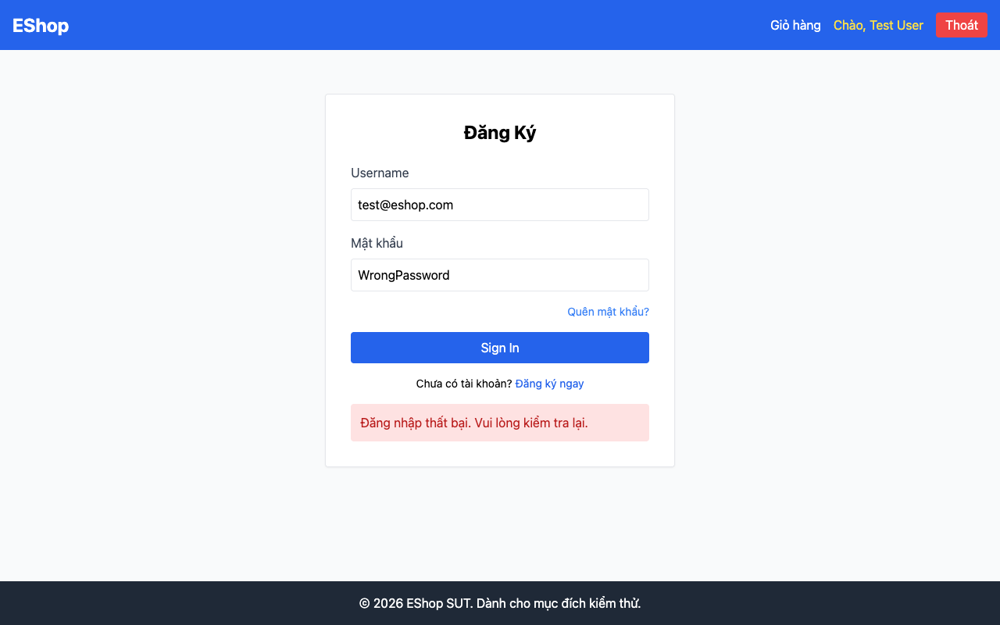

# BUG-01: login_attempts tăng 2 thay vì 1 mỗi lần đăng nhập sai

## Thông tin

| Trường | Giá trị |
|--------|---------|
| Bug ID | BUG-01 |
| Feature | FR-02: Login & Account Lockout |
| Severity | Critical |
| Priority | High |
| Status | Open |
| Reported by | Tester (HW02) |
| File:Line | `backend/server.js:54` |

## Mô tả

Mỗi lần người dùng nhập sai mật khẩu, hệ thống tăng `login_attempts` lên **2** thay vì **1** theo đặc tả. Hậu quả: tài khoản bị khóa sau **2 lần** nhập sai thay vì **3 lần** như yêu cầu.

## Reproduce Steps

1. Có tài khoản `test@eshop.com` với `login_attempts = 0`
2. Gọi `POST /api/login` với password sai → response 401
3. Kiểm tra DB: `SELECT login_attempts FROM users WHERE email='test@eshop.com'`
4. Expected: `login_attempts = 1`
5. Actual: `login_attempts = 2`
6. Gọi lần 2 với password sai → DB: `login_attempts = 4` → tài khoản **bị khóa** (≥3)

## Expected vs Actual

| | Expected (Spec) | Actual (Bug) |
|-|-----------------|--------------|
| Lần sai 1 | attempts = 1, không lock | attempts = 2, không lock |
| Lần sai 2 | attempts = 2, không lock | attempts = 4, **BỊ LOCK** |
| Lần sai 3 | attempts = 3, **BỊ LOCK** | Đã lock từ lần 2 |

## Root Cause

```javascript
// backend/server.js line 54
const newAttempts = user.login_attempts + 2;  // BUG: phải là + 1
```

## Fix

```javascript
const newAttempts = user.login_attempts + 1;  // Đúng spec
```

## Screenshots

**Lần sai 1 — attempts tăng lên 4 (phải là 2):**


**Lần sai 2 — tài khoản bị khóa ngay (phải đợi đến lần 3):**



**Tài khoản bị lock — login với đúng password vẫn nhận HTTP 403:**


*Playwright script: `playwright-tests/fr02-login.spec.js` — Test case DT-FR02-10*
