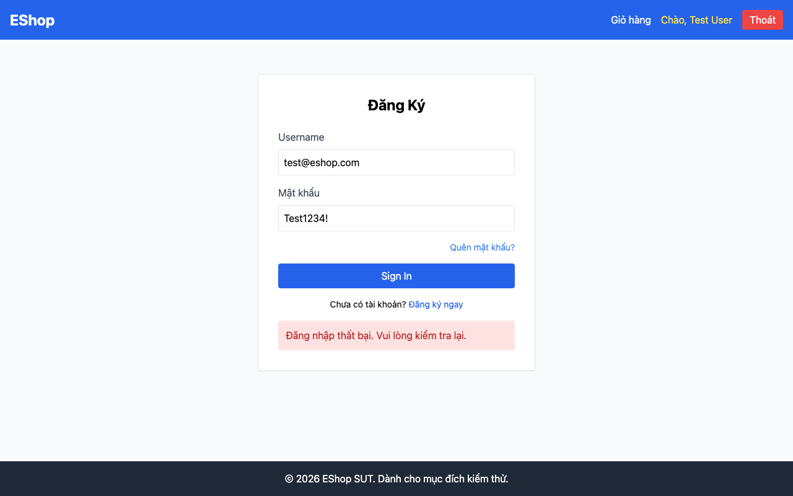

# BUG-02: Lockout duration 180 giây thay vì 30 giây

## Thông tin

| Trường | Giá trị |
|--------|---------|
| Bug ID | BUG-02 |
| Feature | FR-02: Login & Account Lockout |
| Severity | Major |
| Priority | High |
| Status | Open |
| File:Line | `backend/server.js:57` |

## Mô tả

Khi tài khoản bị khóa do nhập sai mật khẩu nhiều lần, thời gian khóa là **180 giây (3 phút)** thay vì **30 giây** theo đặc tả (môi trường demo).

## Reproduce Steps

1. Nhập sai mật khẩu cho đến khi tài khoản bị khóa
2. Ghi lại thời điểm khóa `t0`
3. Thử đăng nhập sau 30 giây (`t0 + 30s`) với đúng mật khẩu
4. Expected: Đăng nhập thành công
5. Actual: Vẫn nhận được HTTP 403 `"Tài khoản đã bị khóa"`
6. Thử lại sau 180 giây → mới unlock

## Expected vs Actual

| | Expected | Actual |
|-|----------|--------|
| Thời gian khóa | 30 giây | 180 giây |
| Sau 30s | Unlock, login được | Vẫn bị khóa |
| Sau 180s | — | Unlock |

## Root Cause

```javascript
// backend/server.js line 57
lockedUntil = new Date(Date.now() + 180000).toISOString();  // 180000ms = 180s (3 phút)
// Spec yêu cầu 30 giây = 30000ms
```

## Fix

```javascript
lockedUntil = new Date(Date.now() + 30000).toISOString();  // 30000ms = 30s
```

## Screenshots

**Tài khoản bị lock — DB ghi `locked_until` = now + 180s (thay vì 30s):**



**DB Evidence (sqlite3):**
```
SELECT locked_until FROM users WHERE email='test@eshop.com';
-- Kết quả: 2026-06-27T06:44:47.478Z  (≈ 180 giây từ lúc lock)
```

*Playwright script: `playwright-tests/fr02-login.spec.js` — Test case DT-FR02-09*
