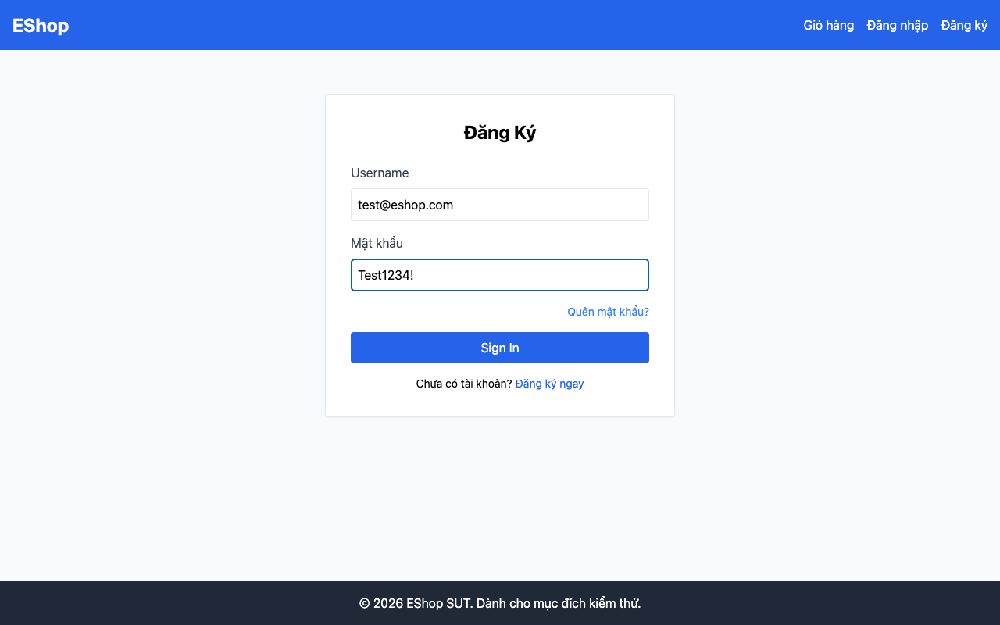

# BUG-05: Mật khẩu lưu và so sánh dạng plaintext (không hash)

## Thông tin

| Trường | Giá trị |
|--------|---------|
| Bug ID | BUG-05 |
| Feature | FR-02: Login & Account Lockout |
| Severity | Critical |
| Priority | High |
| Status | Open |
| File:Line | `backend/server.js:46`, `backend/server.js:22-29` |

## Mô tả

Mật khẩu người dùng được lưu trữ trong database dưới dạng **plaintext** (không mã hóa) và so sánh trực tiếp khi đăng nhập. Đây là lỗ hổng bảo mật nghiêm trọng: nếu database bị lộ, toàn bộ mật khẩu người dùng bị exposed.

## Root Cause

```javascript
// backend/server.js:22-29 — Register: lưu plaintext
db.run("INSERT INTO users (name, email, password) VALUES (?, ?, ?)",
  [name, email, password]  // password lưu thẳng vào DB
);

// backend/server.js:46 — Login: so sánh plaintext
if (user.password === password) {  // So sánh trực tiếp
```

## Expected

```javascript
// Đăng ký: hash trước khi lưu
const bcrypt = require('bcrypt');
const hashedPassword = await bcrypt.hash(password, 10);
db.run("INSERT INTO users ... VALUES (?, ?, ?)", [name, email, hashedPassword]);

// Đăng nhập: so sánh hash
const match = await bcrypt.compare(password, user.password);
if (match) { ... }
```

## Impact

- Nếu database bị leak → tất cả mật khẩu bị lộ
- Vi phạm tiêu chuẩn bảo mật OWASP A02:2021 (Cryptographic Failures)

## Ghi chú

Đây là intentional bug trong SUT demo để sinh viên phát hiện. Trong môi trường production, không bao giờ lưu mật khẩu plaintext.

## Screenshots

**Login form — nhận mật khẩu dưới dạng plaintext trước khi so sánh:**



**DB Evidence — mật khẩu lưu raw trong cột `password`:**
```bash
sqlite3 backend/database.sqlite "SELECT email, password FROM users LIMIT 3"
# admin@eshop.com|Admin123!
# test@eshop.com|Test1234!
# (plaintext, không hash)
```

*Code review: `backend/server.js:22-29` (register) và `server.js:46` (login)*
