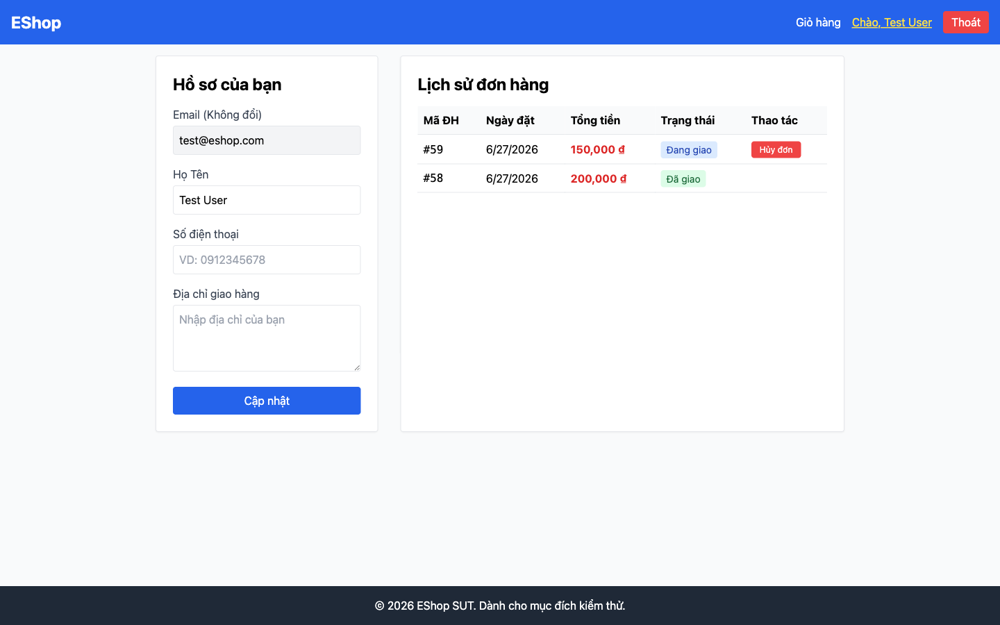
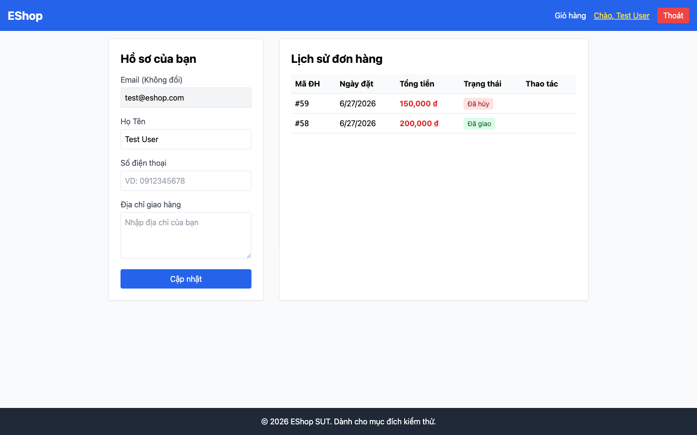

# BUG-07: User có thể hủy đơn hàng đang ở trạng thái shipping

## Thông tin

| Trường | Giá trị |
|--------|---------|
| Bug ID | BUG-07 |
| Feature | FR-10: Order State Machine |
| Severity | Major |
| Priority | High |
| Status | Open |
| File:Line | `backend/server.js:329` |

## Mô tả

Spec quy định: khi đơn hàng ở trạng thái `shipping`, **User không được phép hủy** — chỉ Admin mới có thể thao tác. Tuy nhiên, backend API `/api/orders/:id/cancel` không block được trường hợp này.

UI mobile và web đều ẩn nút "Hủy đơn" khi shipping (đúng), nhưng user có thể bypass UI bằng cách gọi API trực tiếp.

## Reproduce Steps

1. Tạo đơn hàng → Admin chuyển sang `confirmed` → Admin chuyển sang `shipping`
2. Dùng user token: `PUT /api/orders/:id/cancel` (body rỗng)
3. Expected: HTTP 400, "Cannot cancel this order" (vì đang shipping)
4. Actual: HTTP 200, `"Order canceled successfully"`

## Root Cause

```javascript
// backend/server.js:329 — Thiếu check cho shipping
if (order.status === "delivered" || order.status === "canceled") {
  return res.status(400).json({ error: "Cannot cancel this order." });
}
// BUG: Không check order.status === "shipping"
// Kết quả: shipping → canceled được phép (sai spec)
```

## Fix

```javascript
// Phải check cụ thể: chỉ cho phép cancel khi pending hoặc confirmed
if (order.status !== "pending" && order.status !== "confirmed") {
  return res.status(400).json({ error: "Cannot cancel this order." });
}
```

## Impact

User có thể hủy đơn hàng đang trên đường giao — gây confusion cho shipper, cần xử lý đơn hàng trả về bên ngoài hệ thống.

## Screenshots

**Web UI — đơn hàng đang ở trạng thái "Đang giao" (shipping), UI ẩn nút Hủy (đúng):**



**Sau khi user gọi API trực tiếp `PUT /api/orders/:id/cancel` — đơn bị hủy thành công (sai):**



**API Response evidence:**
```json
{
  "test": "BUG-07: User cancel shipping order",
  "request": "PUT /api/orders/:id/cancel (with USER token)",
  "expected": "HTTP 400 \"Cannot cancel shipped order\"",
  "actual": "HTTP 200 — DB status now: canceled"
}
```

*Playwright script: `playwright-tests/fr10-screenshots.spec.js` + `playwright-tests/mobile-order-history.spec.js` DT-MOB-13*
