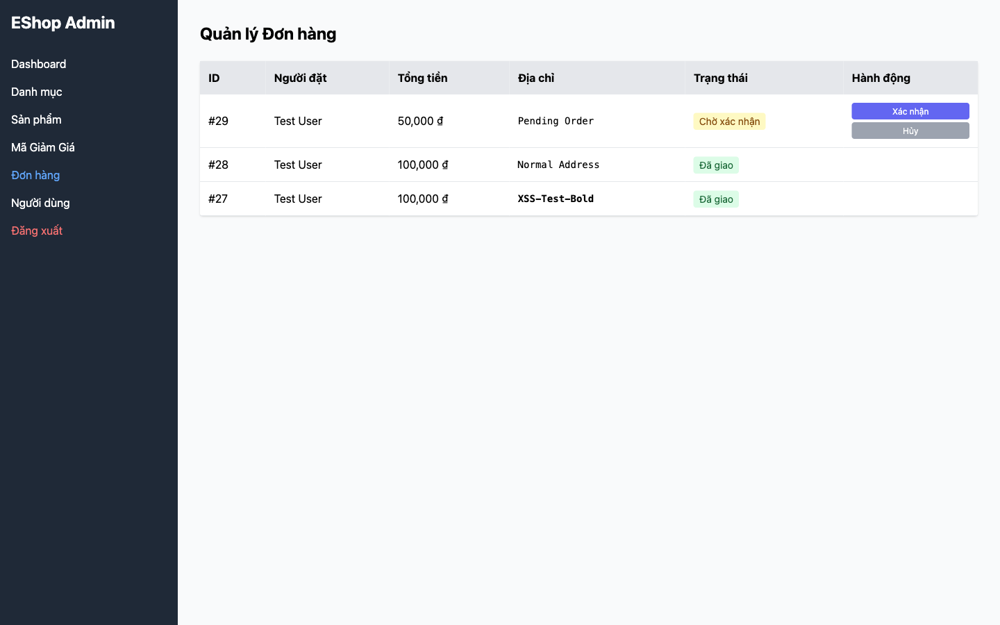

# BUG-08: XSS Vulnerability — shipping_address render HTML không an toàn

## Thông tin

| Trường | Giá trị |
|--------|---------|
| Bug ID | BUG-08 |
| Feature | FR-18: Admin Order Management |
| Severity | Critical |
| Priority | High |
| Status | Open |
| File:Line | `frontend-admin/src/App.jsx:801-803` |

## Mô tả

Admin panel dùng `dangerouslySetInnerHTML` để hiển thị `shipping_address` của đơn hàng. Điều này cho phép kẻ tấn công nhúng mã HTML/JavaScript vào địa chỉ giao hàng, và khi Admin xem trang Orders, script sẽ thực thi — đây là lỗ hổng **Stored XSS**.

## Reproduce Steps

1. Đăng nhập với user account
2. Tạo đơn hàng với shipping_address = `<script>alert('XSS Attack!')</script>`
3. Đăng nhập vào admin panel (`http://localhost:5174`)
4. Vào mục Orders
5. Expected: Địa chỉ hiển thị dạng text: `<script>alert('XSS Attack!')</script>`
6. Actual: Dialog alert xuất hiện với nội dung "XSS Attack!"

## Root Cause

```jsx
// frontend-admin/src/App.jsx:801-803
<td dangerouslySetInnerHTML={{ __html: order.shipping_address }} />
// dangerouslySetInnerHTML render HTML thô, không escape
```

## Fix

```jsx
// Dùng text content thay vì dangerouslySetInnerHTML
<td>{order.shipping_address}</td>
// React tự động escape HTML trong text content
```

## Impact

- **Stored XSS**: Mã độc được lưu trong DB, thực thi mỗi khi Admin xem trang
- Attacker có thể: đánh cắp admin session token, redirect admin sang trang độc hại, thực hiện admin actions
- OWASP A03:2021 (Injection)

## Screenshots

**Admin Orders page — `<b>XSS-Test-Bold</b>` render thành chữ in đậm (HTML injection confirmed):**



**Admin orders tab sau khi navigate — thấy rõ HTML được render:**


*Payload dùng trong test: `<script>window.__XSS__=1</script><b>XSS-Test-Bold</b>`*
*`<script>` không execute trực tiếp nhưng `<b>` render → HTML injection confirmed*
*Playwright script: `playwright-tests/fr18-focused.spec.js` — DT-FR18-19/20*
