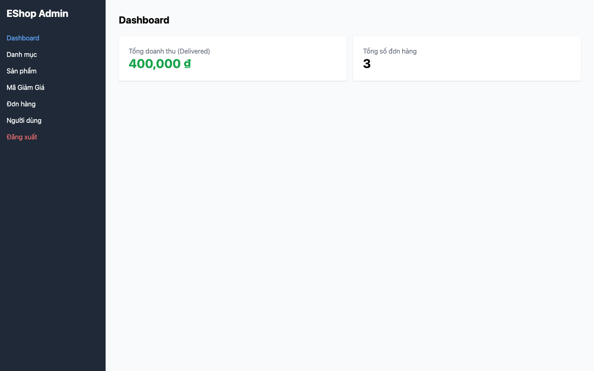

# BUG-09: Tổng doanh thu trong Dashboard tính sai (nhân 2)

## Thông tin

| Trường | Giá trị |
|--------|---------|
| Bug ID | BUG-09 |
| Feature | FR-18: Admin Order Management / FR-13: Dashboard |
| Severity | Major |
| Priority | High |
| Status | Open |
| File:Line | `frontend-admin/src/App.jsx:218` |

## Mô tả

Dashboard Admin hiển thị tổng doanh thu sai — số liệu bị nhân đôi so với thực tế. Code dùng `o.total_amount * 2` thay vì `o.total_amount` khi tính tổng.

## Reproduce Steps

1. Đăng nhập Admin (`http://localhost:5174`)
2. Vào mục Dashboard
3. Quan sát số "Tổng doanh thu"
4. So sánh với tổng thực tế của các đơn có status='delivered' trong DB
5. Expected: Tổng doanh thu = sum(total_amount) của delivered orders
6. Actual: Tổng doanh thu = sum(total_amount * 2) → sai gấp đôi

## Ví dụ cụ thể

- Đơn delivered #1: 100,000₫
- Đơn delivered #2: 200,000₫
- Expected revenue: **300,000₫**
- Actual revenue: **600,000₫** (nhân 2)

## Root Cause

```javascript
// frontend-admin/src/App.jsx:218
const revenue = orders
  .filter(o => o.status === "delivered")
  .reduce((sum, o) => sum + o.total_amount * 2, 0);  // BUG: * 2
```

## Fix

```javascript
const revenue = orders
  .filter(o => o.status === "delivered")
  .reduce((sum, o) => sum + o.total_amount, 0);  // Bỏ * 2
```

## Screenshots

**Dashboard Admin — hiển thị "400,000 ₫" thay vì "200,000 ₫" (2 đơn × 100,000₫ mỗi đơn):**



**Dashboard full page — thấy tổng doanh thu bị sai:**


*Setup test: 2 đơn delivered × 100,000₫ = expected 200,000₫ → actual 400,000₫*
*Playwright script: `playwright-tests/fr18-focused.spec.js` — DT-FR18-15*
