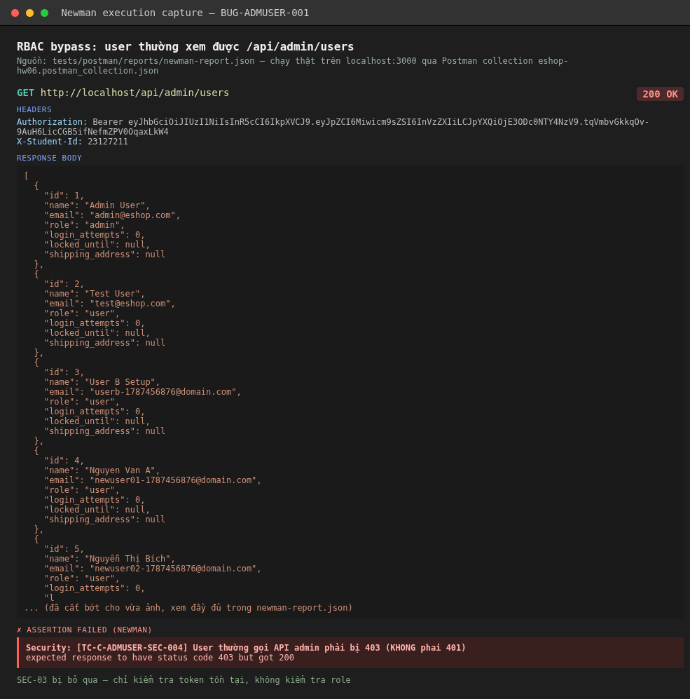

# BUG-ADMUSER-001: GET /api/admin/users không kiểm tra role, user thường vẫn xem được toàn bộ danh sách

## Found by Test Case

TC-C-ADMUSER-SEC-004, TC-C-ADMUSER-SCH-003

## Requirement liên quan

SEC-03 ("API Admin phải kiểm tra `role = 'admin'` trong Token, không chỉ kiểm tra sự tồn tại của Token"), FR-12 (Kiểm soát truy cập)

## Severity / Priority

Critical / P0

## Environment

- Tool: curl / Postman + Newman (`tests/postman/collections/eshop-hw06.postman_collection.json`)
- Backend: Node.js + Express + SQLite, chạy local tại `http://localhost:3000`
- Build: nhánh `hw06/23127211`, commit `47748c1`

## Steps to reproduce

1. Đăng nhập bằng tài khoản **user thường** (`test@eshop.com` / `Test1234!`) qua `POST /api/login`, lấy `token`.
2. Gọi `GET /api/admin/users` kèm header `Authorization: Bearer <token của user thường>`.

```bash
TOKEN=$(curl -s -X POST http://localhost:3000/api/login \
  -H "Content-Type: application/json" \
  -d '{"email":"test@eshop.com","password":"Test1234!"}' | python3 -c "import json,sys;print(json.load(sys.stdin)['token'])")

curl -s -w "\nSTATUS:%{http_code}\n" http://localhost:3000/api/admin/users \
  -H "Authorization: Bearer $TOKEN"
```

## Expected result

Trả về `403 Forbidden` — token hợp lệ (đã xác thực) nhưng role không phải `admin` nên không đủ quyền.

## Actual result

Trả về `200 OK` kèm toàn bộ danh sách người dùng của hệ thống (bao gồm cả tài khoản admin):

```json
STATUS:200
[
  {"id":1,"name":"Admin User","email":"admin@eshop.com","role":"admin", ...},
  {"id":2,"name":"Test User","email":"test@eshop.com","role":"user", ...},
  ...
]
```

## Evidence

- Console output ở trên (chạy trực tiếp trên deployment local, không bịa).
- `tests/postman/reports/newman-report.json` — request `[TC-C-ADMUSER-SEC-004]`, assertion `Security: [TC-C-ADMUSER-SEC-004] User thường gọi API admin phải bị 403 (KHONG phai 401)` FAIL với message `expected response to have status code 403 but got 200`.
- `tests/postman/reports/newman-report.html` — mục "API3 - GET /api/admin/users / SEC - Security".




## Notes

Endpoint chỉ kiểm tra token có hợp lệ hay không (trả 401 khi thiếu/token rác — xem `TC-C-ADMUSER-SEC-001/002`), nhưng **không đọc field `role` trong payload JWT** để chặn user thường. Đây là lỗ hổng bảo mật nghiêm trọng nhất tìm được trong đợt test: bất kỳ user nào đăng ký tài khoản (miễn phí, công khai qua `POST /api/register`) đều có thể xem toàn bộ danh sách người dùng của hệ thống, bao gồm email của tất cả user khác.
