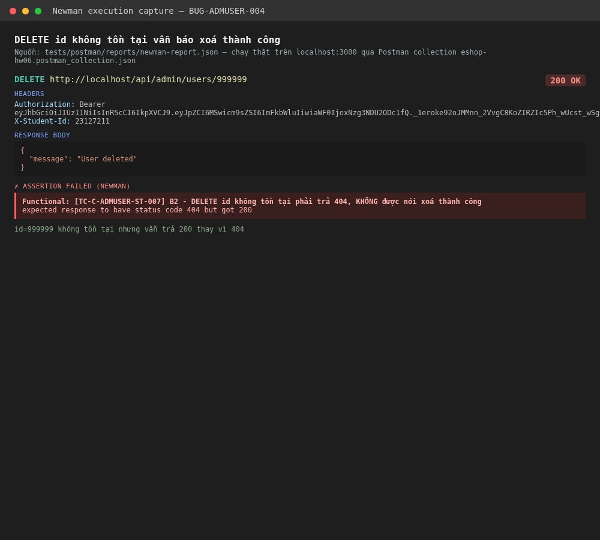

# BUG-ADMUSER-004: DELETE /api/admin/users/:id báo "xoá thành công" ngay cả khi id không tồn tại

## Found by Test Case

TC-C-ADMUSER-ST-007 (mới thêm sau vòng đọc lại code — chuỗi 3 bước: đếm user → DELETE id không tồn tại → đếm lại)

## Requirement liên quan

FR-19 (Quản lý người dùng — Admin xoá người dùng)

## Severity / Priority

Major / P2

## Environment

- Tool: Postman + Newman
- Backend: Node.js + Express, chạy local tại `http://localhost:3000`
- Build: nhánh `hw06/23127211`, commit `47748c1`

## Steps to reproduce

Chạy collection `tests/postman/collections/eshop-hw06.postman_collection.json`, folder `API3 - GET /api/admin/users / XT - [TC-C-ADMUSER-ST-007] DELETE id không tồn tại báo sai thành công`:

1. `GET /api/admin/users` — đếm số user.
2. `DELETE /api/admin/users/999999` (id chắc chắn không tồn tại).
3. `GET /api/admin/users` lại — đếm số user, kỳ vọng không đổi.

## Expected result

Bước 2 trả `404 Not Found` — không có user nào để xoá.

## Actual result

Assertion `Functional: [TC-C-ADMUSER-ST-007] B2 - DELETE id không tồn tại phải trả 404` FAIL — bước 2 trả `200 OK` kèm `{"message":"User deleted"}` như thể đã xoá thành công, dù không có bản ghi nào bị ảnh hưởng.

## Evidence

`tests/postman/reports/newman-report.json` — item `[TC-C-ADMUSER-ST-007] B2 - DELETE user id KHÔNG TỒN TẠI (999999)`, message: `expected response to have status code 404 but got 200`.




## Notes

Nguyên nhân gốc (`backend/server.js` dòng 504-508):

```js
app.delete("/api/admin/users/:id", authenticateToken, (req, res) => {
  db.run("DELETE FROM users WHERE id = ?", [req.params.id], function (err) {
    res.json({ message: "User deleted" });
  });
});
```

Không kiểm tra `err`, không kiểm tra `this.changes === 0` (số dòng thực sự bị ảnh hưởng) trước khi trả response thành công. Đây là bug **response không phản ánh đúng trạng thái thật của hệ thống** — client (frontend admin) sẽ hiển thị thông báo "Xoá thành công" một cách sai lệch, có thể khiến admin tưởng nhầm đã xử lý xong trong khi thực tế không có gì thay đổi (ví dụ do gõ nhầm id, hoặc do race condition với 1 admin khác đã xoá trước đó).
