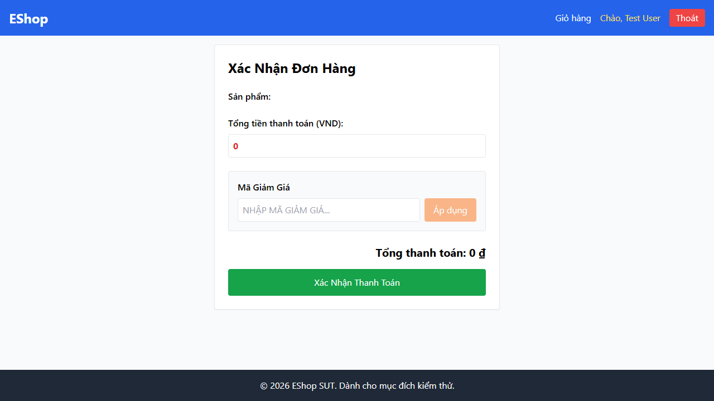

- **Test Cases:** TC-CHECKOUT-012
- **Test Script File:** [checkout-ui.spec.ts](../../../test-runs/automation/scripts/checkout/tests/checkout-ui.spec.ts)

## Requirement liên quan

FR-08 (Thanh toán)

## Environment

Browser: Chromium / Firefox / WebKit, OS: Windows, URL: http://localhost:5173

## Steps to reproduce

1. Thêm sản phẩm vào giỏ hàng và mở trang Checkout.
2. Kiểm tra ô input tổng số tiền `total_amount`.

## Expected result

- Ô hiển thị tổng số tiền phải ở trạng thái Read-Only (không cho phép người dùng thay đổi trực tiếp trên UI).

## Actual result

- Người dùng có thể chỉnh sửa giá trị số tiền trực tiếp vào ô input trước khi nhấn nút Submit Order.

## Evidence

- **TC-CHECKOUT-012 (Giao diện hiển thị tổng tiền cho phép chỉnh sửa):**
  
