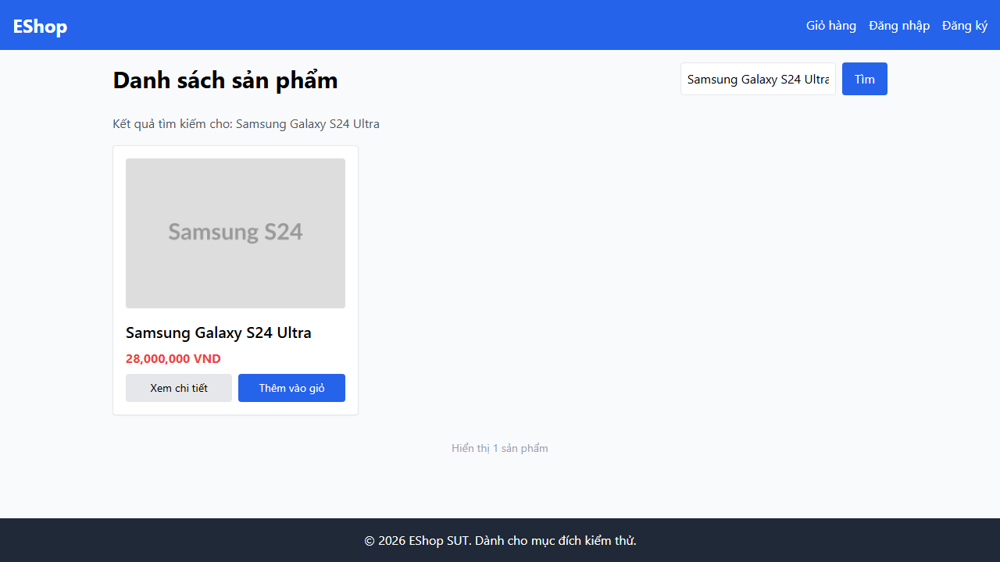

- **Test Cases:** TC-PLAS-007
- **Test Script File:** [plas-ui.spec.ts](../../../test-runs/automation/scripts/product-list-and-search/tests/plas-ui.spec.ts)

## Requirement liên quan

FR-05 (Danh sách sản phẩm & Tìm kiếm)

## Environment

Browser: Chromium / Firefox / WebKit, OS: Windows, URL: http://localhost:5173

## Steps to reproduce

1. Mở trang chủ E-Shop tại `http://localhost:5173`.
2. Kiểm tra phần tử hiển thị giá tiền sản phẩm.

## Expected result

- Giá sản phẩm phải hiển thị ký hiệu tiền tệ chuẩn của Việt Nam là `₫` (ví dụ: `30,000,000₫`).

## Actual result

- Giá sản phẩm hiển thị ký hiệu tiền tệ khác (như `VND` hoặc chữ `đ` thường không gạch chân) thay vì `₫`.

## Evidence

- **TC-PLAS-007 (Kiểm tra giá sản phẩm sai ký hiệu tiền tệ):**
  
