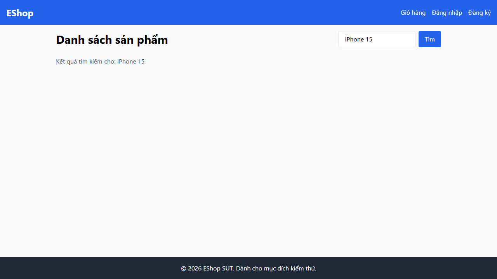

- **Test Cases:** TC-PLAS-010
- **Test Script File:** [plas-ep.spec.ts](../../../test-runs/automation/scripts/product-list-and-search/tests/plas-ep.spec.ts)

## Requirement liên quan

FR-05 (Danh sách sản phẩm & Tìm kiếm)

## Environment

Browser: Chromium / Firefox / WebKit, OS: Windows, URL: http://localhost:5173

## Steps to reproduce

1. Mở trang chủ E-Shop.
2. Nhập từ khóa `"   iPhone   "` (chứa các khoảng trắng thừa ở đầu và cuối) vào ô tìm kiếm và bấm nút Search.

## Expected result

- Hệ thống tự động cắt bỏ khoảng trắng thừa (trim) và thực hiện tìm kiếm từ khóa `"iPhone"`, trả về kết quả sản phẩm iPhone hợp lệ.

## Actual result

- Hệ thống giữ nguyên khoảng trắng thừa để tìm kiếm trong database, dẫn đến việc không tìm thấy kết quả và hiển thị danh sách trống.

## Evidence

### 1. HTTP Request/Response Log
```http
GET /api/products?search=%20%20%20iPhone%20%20%20 HTTP/1.1
Host: localhost:3000

HTTP/1.1 200 OK
Content-Type: application/json

[]
```

### 2. Playwright Test Assertion Log
```bash
[chromium] › tests\plas-ep.spec.ts:250:7 › FR-05 Product List & Search › TC-PLAS-010: Tìm kiếm từ khóa có khoảng trắng thừa

Error: expect(received).toBeGreaterThan(expected)

Expected: > 0
Received: 0

  255 |     const products = page.locator('.product-card');
> 256 |     await expect(products.count()).toBeGreaterThan(0);
      |                                    ^
```

### 3. Screenshot


