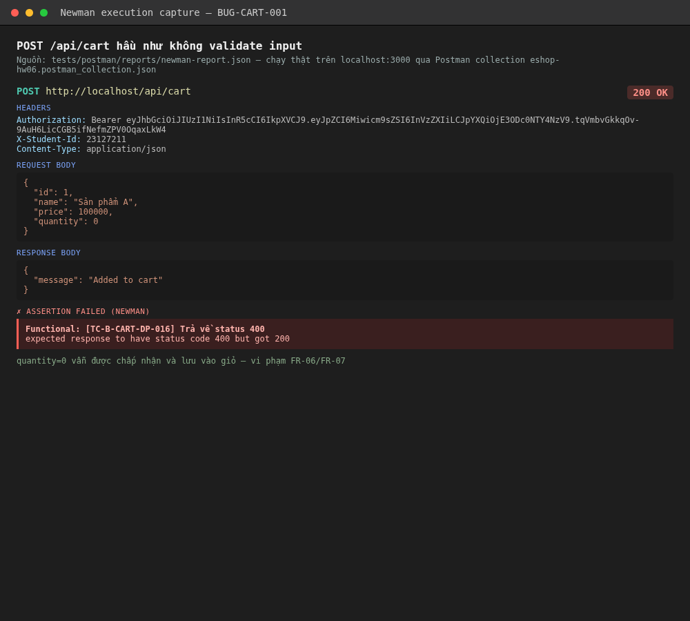

# BUG-CART-001: POST /api/cart không validate input, chấp nhận giá client gửi không đối chiếu DB

## Found by Test Case

TC-B-CART-DP-002, DP-003, DP-004, DP-005, DP-009, DP-010, DP-011, DP-014, DP-015, DP-016, DP-017, DP-018, DP-019, DP-020, DP-021, DP-022, DP-023, SEC-005

## Requirement liên quan

FR-07 (Giỏ hàng), tinh thần FR-08 ("Backend phải tự tính lại tổng tiền; không chấp nhận giá trị `total_amount` do client gửi lên" — áp dụng tương tự cho `price` gửi ở bước thêm giỏ)

## Severity / Priority

Major / P1

## Environment

- Tool: curl / Postman + Newman
- Backend: Node.js + Express + SQLite, chạy local tại `http://localhost:3000`
- Build: nhánh `hw06/23127211`, commit `47748c1`

## Steps to reproduce

**Kịch bản A — giá giả mạo (TC-B-CART-DP-012, quan trọng nhất):**

```bash
TOKEN=$(curl -s -X POST http://localhost:3000/api/login -H "Content-Type: application/json" \
  -d '{"email":"test@eshop.com","password":"Test1234!"}' | python3 -c "import json,sys;print(json.load(sys.stdin)['token'])")

# sản phẩm id=1 giá thật trong DB là 100000đ
curl -s -w "\nSTATUS:%{http_code}\n" -X POST http://localhost:3000/api/cart \
  -H "Content-Type: application/json" -H "Authorization: Bearer $TOKEN" \
  -d '{"id":1,"name":"Sản phẩm A","price":1,"quantity":10}'

curl -s http://localhost:3000/api/cart -H "Authorization: Bearer $TOKEN"
```

**Kịch bản B — quantity âm/0/chuỗi (TC-B-CART-DP-016/017/020):**

```bash
curl -s -w "\nSTATUS:%{http_code}\n" -X POST http://localhost:3000/api/cart \
  -H "Content-Type: application/json" -H "Authorization: Bearer $TOKEN" \
  -d '{"id":1,"name":"Sản phẩm A","price":100000,"quantity":-1}'
```

## Expected result

- Kịch bản A: server phải tự tra giá thật của sản phẩm theo `id` trong DB, KHÔNG dùng `price` client gửi (`price=1`); nếu không đối chiếu được cũng phải từ chối request, không được ghi giá 1đ vào giỏ.
- Kịch bản B: `400` — quantity phải là số nguyên dương.

## Actual result

- Kịch bản A: trả `200`, `GET /api/cart` sau đó xác nhận item được lưu **đúng với `price:1`** — giỏ hàng lưu thẳng giá client gửi, không đối chiếu với giá thật (100000đ) trong bảng `products`.
- Kịch bản B: trả `200`, quantity âm/0/chuỗi vẫn được chấp nhận và lưu nguyên vào giỏ.

## Evidence

- `tests/postman/reports/newman-report.json` — 17 assertion FAIL trong folder `API2 - POST /api/cart / DP - Domain partition`, cùng dạng `expected response to have status code 400 but got 200`.
- Console output kịch bản A ở trên (chạy trực tiếp, không bịa): `GET /api/cart` trả `[{"id":1,"name":"Sản phẩm A","price":1,"quantity":2}]` sau khi POST với `price:1`.




## Notes

**Rủi ro nghiêm trọng nhất** không nằm ở việc thiếu validate kiểu dữ liệu, mà ở việc **server tin hoàn toàn vào `price` do client gửi** thay vì tra cứu giá thật theo `id` sản phẩm. Nếu bước checkout (`POST /api/checkout`, FR-08, không thuộc phạm vi 3 API được chọn của HW06 này) tính tổng tiền dựa trên dữ liệu đã lưu trong giỏ thay vì tính lại từ DB sản phẩm tại thời điểm thanh toán, đây sẽ là lỗ hổng cho phép mua hàng với giá tuỳ ý — **cần audit riêng `POST /api/checkout` để xác nhận có bị ảnh hưởng dây chuyền hay không**.
