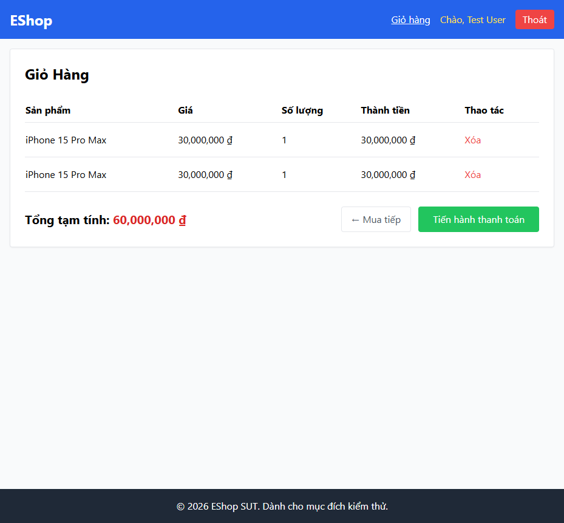

# BUG-CART-002: Thêm lại sản phẩm đã có trong giỏ tạo dòng trùng thay vì cộng dồn số lượng

## Found by Test Case

TC-CART-002

## Requirement liên quan

FR-07 (Giỏ hàng — thêm sản phẩm đã có trong giỏ phải tăng số lượng dòng hiện tại, không tạo dòng mới)

## Severity / Priority

Major / P2

## Environment

- Browser: Chromium, Firefox, WebKit — tái hiện trên cả 3
- OS: Windows 11
- URL: http://localhost:5173/
- Build: nhánh `hw04/23127211`, commit `3d2a86d`

## Steps to reproduce

1. Đăng nhập, ở trang chủ bấm "Thêm vào giỏ" cho sản phẩm A.
2. Bấm "Thêm vào giỏ" cho **cùng sản phẩm A** lần nữa.
3. Mở trang Giỏ hàng.

## Expected result

Giỏ hàng có đúng **1 dòng** cho sản phẩm A, Số lượng = 2.

## Actual result

Giỏ hàng có **2 dòng riêng biệt**, mỗi dòng Số lượng = 1. Xác nhận qua `frontend-web/src/context/CartContext.jsx:8-10`: `addToCart` luôn thực hiện `setCart([...cart, {...product, quantity}])` — push thẳng phần tử mới vào mảng, không tìm dòng có `product.id` trùng để cộng dồn số lượng.

## Evidence

- HTML report: `tests/e2e/reports/html/cart-chromium/index.html` — test `TC-CART-002` (Failed): `expect(cartRows(page)).toHaveCount(1)` nhận count = 2.

## Notes

Test seed qua nút "Thêm vào giỏ" ở trang chủ (không qua trang chi tiết) để bug này lộ ra trực tiếp, tránh bị BUG-CART-001 (clickCount) che khuất.
