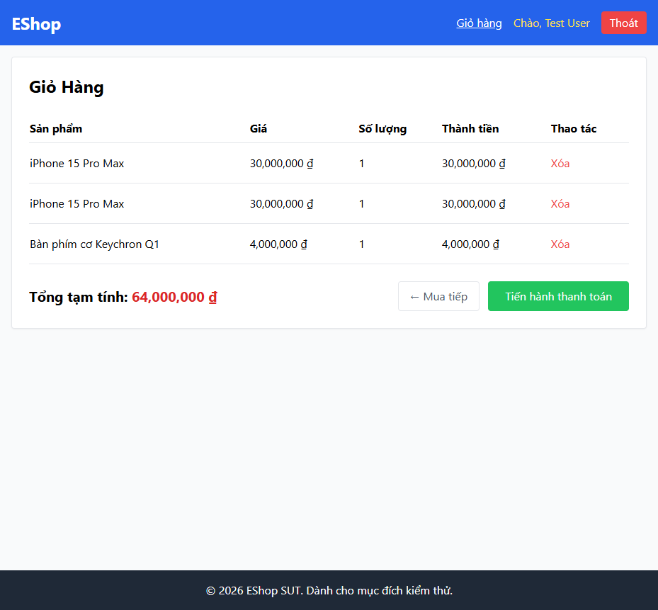

# BUG-CART-003: Bảng giỏ hàng không có nút +/- để chỉnh số lượng

## Found by Test Case

TC-CART-003, TC-CART-004, TC-CART-005

## Requirement liên quan

FR-07 (Giỏ hàng — cột Số lượng phải có nút +/- để chỉnh trực tiếp trên giỏ hàng)

## Severity / Priority

Major / P2

## Environment

- Browser: Chromium, Firefox, WebKit — tái hiện trên cả 3
- OS: Windows 11
- URL: http://localhost:5173/cart
- Build: nhánh `hw04/23127211`, commit `3d2a86d`

## Steps to reproduce

1. Đăng nhập, thêm ít nhất 1 sản phẩm vào giỏ.
2. Mở trang Giỏ hàng, quan sát cột "Số lượng".

## Expected result

Mỗi dòng sản phẩm có nút "+" để tăng và nút "-" để giảm số lượng (nút "-" bị vô hiệu/ẩn khi số lượng = 1 để chặn xuống 0).

## Actual result

Cột "Số lượng" chỉ hiển thị **văn bản thuần**, không có bất kỳ nút bấm nào. Xác nhận qua `frontend-web/src/pages/Cart.jsx:47`: `<td>{item.quantity}</td>` — không có `<button>` nào trong ô này. Toàn bộ 3 hành vi liên quan (tăng, giảm, chặn xuống dưới 1) đều không thể thực hiện được qua UI.

## Evidence

- HTML report: `tests/e2e/reports/html/cart-chromium/index.html` — test `TC-CART-003`, `TC-CART-004`, `TC-CART-005` (Failed): `expect(row.getByRole('button', { name: '+' | '-' })).toHaveCount(1)` nhận count = 0.

## Notes

Test chỉ assert sự tồn tại của nút, không thử click vào locator rỗng, để tránh timeout mù mờ và báo lỗi rõ ràng ngay tại bước phát hiện thiếu element.
