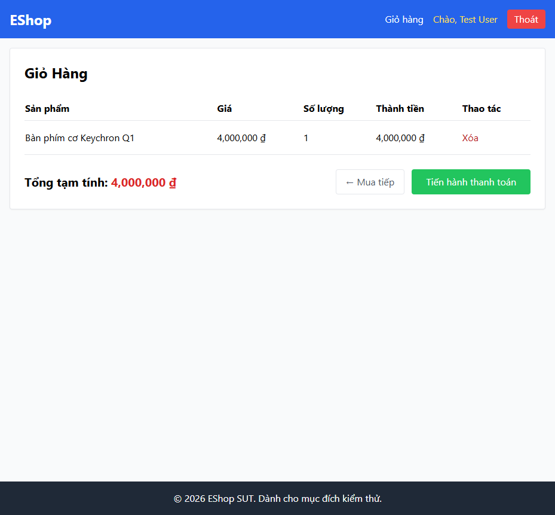

# BUG-CART-004: Xoá sản phẩm khỏi giỏ không có dialog xác nhận

## Found by Test Case

TC-CART-007, TC-CART-008

## Requirement liên quan

FR-07 (Giỏ hàng — phải có dialog xác nhận trước khi xoá sản phẩm khỏi giỏ)

## Severity / Priority

Major / P2

## Environment

- Browser: Chromium, Firefox, WebKit — tái hiện trên cả 3
- OS: Windows 11
- URL: http://localhost:5173/cart
- Build: nhánh `hw04/23127211`, commit `3d2a86d`

## Steps to reproduce

1. Đăng nhập, thêm ít nhất 2 sản phẩm vào giỏ.
2. Bấm nút "Xóa" trên một dòng sản phẩm bất kỳ.

## Expected result

Trình duyệt hiển thị dialog xác nhận ("Bạn có chắc muốn xoá?"); nếu người dùng huỷ (dismiss), sản phẩm phải **giữ nguyên** trong giỏ; nếu đồng ý (accept), sản phẩm mới bị xoá.

## Actual result

Không có bất kỳ dialog xác nhận nào xuất hiện — sản phẩm bị xoá **ngay lập tức** bất kể ý định huỷ hay đồng ý. Xác nhận qua `frontend-web/src/pages/Cart.jsx:50-56`: `onClick={() => removeFromCart(index)}` gọi thẳng hàm xoá, không có `window.confirm()` hay dialog nào bao quanh.

Hệ quả: kịch bản "bấm Xóa nhưng huỷ dialog → dòng phải giữ nguyên" (TC-CART-008) cũng fail thêm ở bước sau — vì không có dialog để "huỷ", sản phẩm luôn bị xoá, số dòng còn lại ít hơn kỳ vọng.

## Evidence

- HTML report: `tests/e2e/reports/html/cart-chromium/index.html` — test `TC-CART-007`, `TC-CART-008` (Failed): `expect.soft(dialogShown).toBe(true)` nhận `false`; ở TC-CART-008 còn thêm lỗi `expect(cartRows(page)).toHaveCount(2)` nhận 1 (sản phẩm vẫn bị xoá dù ý định là "huỷ").

## Notes

Không có giải pháp workaround nào cho người dùng cuối — thao tác xoá là không thể hoàn tác qua UI hiện tại.
