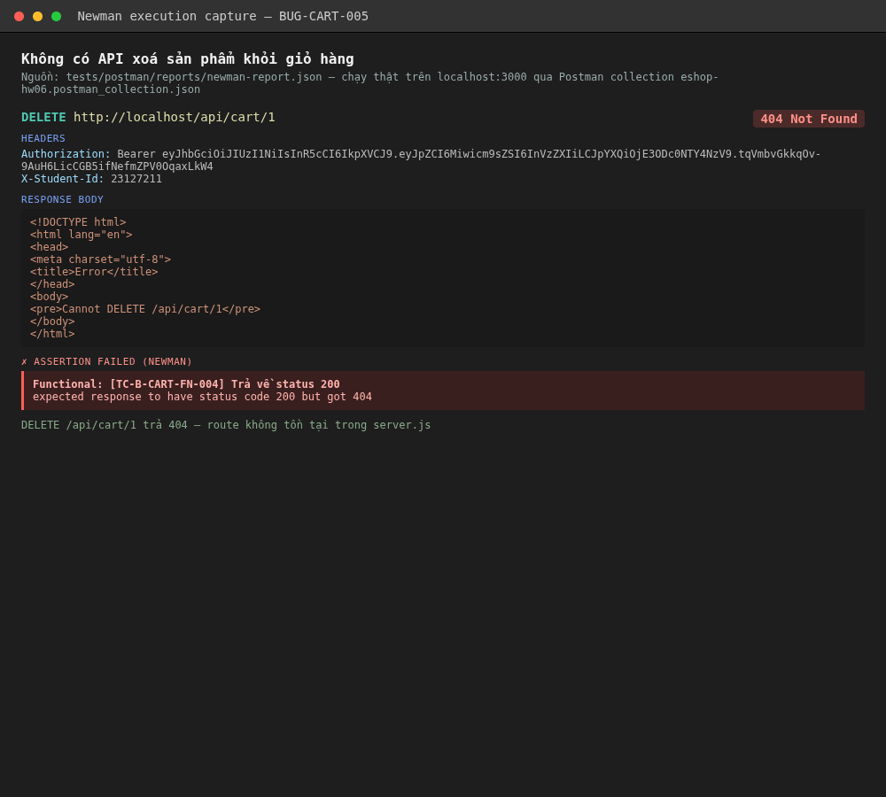

# BUG-CART-005: Không có API nào để xoá / cập nhật số lượng sản phẩm trong giỏ hàng

## Found by Test Case

TC-B-CART-FN-004 (mới thêm sau vòng đọc lại code)

## Requirement liên quan

FR-07 ("Có nút +/- để chỉnh [số lượng]", "Nút **Xóa sản phẩm** phải có dialog xác nhận trước khi thực hiện")

## Severity / Priority

Major / P2

## Environment

- Tool: Postman + Newman
- Backend: Node.js + Express, chạy local tại `http://localhost:3000`
- Build: nhánh `hw06/23127211`, commit `47748c1`

## Steps to reproduce

Chạy collection `tests/postman/collections/eshop-hw06.postman_collection.json` (folder `API2 - POST /api/cart / FN - Happy path / [TC-B-CART-FN-004]`): `DELETE /api/cart/1` với token user hợp lệ.

## Expected result

Tồn tại ít nhất 1 endpoint để xoá 1 item khỏi giỏ (khớp yêu cầu UI FR-07: nút xoá sản phẩm).

## Actual result

Assertion `Functional: [TC-B-CART-FN-004] Trả về status 200` FAIL — request trả `404 Not Found` (route không tồn tại). Đối chiếu `backend/server.js` xác nhận **chỉ có `GET /api/cart` và `POST /api/cart`** — hoàn toàn không có route DELETE/PUT nào cho giỏ hàng.

## Evidence

`tests/postman/reports/newman-report.json` — item `[TC-B-CART-FN-004]`, message: `expected response to have status code 200 but got 404`.

## Notes

Đây là lỗi **thiếu tính năng** (feature gap) hơn là lỗi logic sai — nhưng khiến 2 yêu cầu tường minh của FR-07 (nút +/- và nút xoá) **không thể triển khai được ở frontend** vì backend không có API hỗ trợ. Kết hợp với BUG-CART-002 (không cộng dồn số lượng), người dùng hiện tại **không có cách nào sửa số lượng sản phẩm đã có trong giỏ** — mỗi lần "cộng thêm" chỉ tạo thêm 1 dòng rác mới, và không có cách xoá dòng nào cả.
