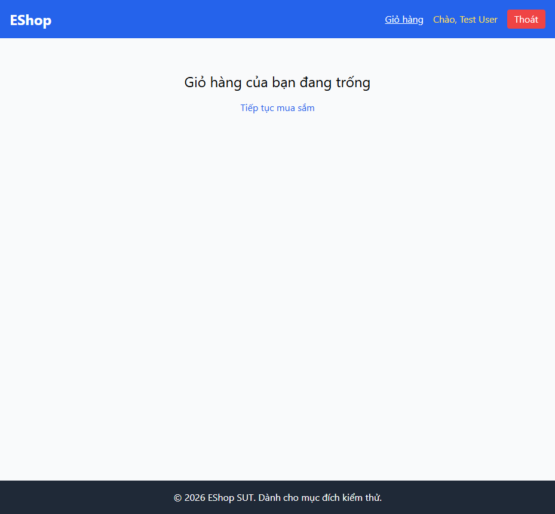

# BUG-CART-006: Trạng thái giỏ hàng rỗng thiếu icon/hình minh hoạ

## Found by Test Case

TC-CART-009

## Requirement liên quan

FR-24 (Empty state phải có icon/hình minh hoạ, không chỉ có chữ)

## Severity / Priority

Minor / P3

## Environment

- Browser: Chromium, Firefox, WebKit — tái hiện trên cả 3
- OS: Windows 11
- URL: http://localhost:5173/cart
- Build: nhánh `hw04/23127211`, commit `3d2a86d`

## Steps to reproduce

1. Đăng nhập, đảm bảo giỏ hàng trống (hoặc xoá hết sản phẩm trong giỏ).
2. Mở trang Giỏ hàng.

## Expected result

Trạng thái rỗng hiển thị kèm icon hoặc hình minh hoạ, cùng với thông báo dạng chữ.

## Actual result

Chỉ hiển thị `<h2>Giỏ hàng của bạn đang trống</h2>` và link "Tiếp tục mua sắm" — không có ``/`<svg>` nào. Xác nhận qua `frontend-web/src/pages/Cart.jsx:20-27`.

## Evidence

- HTML report: `tests/e2e/reports/html/cart-chromium/index.html` — test `TC-CART-009` (soft-fail): `expect.soft(page.locator('main img, main svg')).not.toHaveCount(0)` nhận count = 0.

## Notes

Lỗi cosmetic/UX, độ ưu tiên thấp nhất trong nhóm cart.
