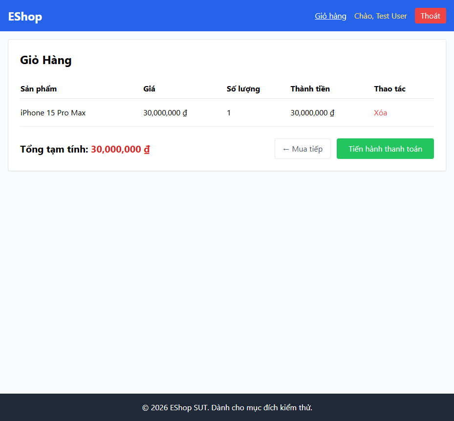

# BUG-CART-007: Nhãn nút "quay lại mua sắm" không nhất quán giữa 2 trạng thái giỏ hàng

## Found by Test Case

Phát hiện qua khảo sát trực tiếp bằng Playwright MCP (điều hướng thật) khi rà soát lại TC-CART-010; không có trong danh sách 13 test case gốc.

## Requirement liên quan

FR-07 (Giỏ hàng — nút quay lại mua sắm phải nhất quán, dùng nhãn "Tiếp tục mua sắm")

## Severity / Priority

Minor / P3

## Environment

- Browser: Chromium (xác minh trực tiếp qua Playwright MCP)
- OS: Windows 11
- URL: http://localhost:5173/cart
- Build: nhánh `hw04/23127211`, commit `3d2a86d`

## Steps to reproduce

1. Đăng nhập, mở trang Giỏ hàng khi **giỏ đang trống** → quan sát nhãn nút quay lại.
2. Thêm 1 sản phẩm vào giỏ, mở lại trang Giỏ hàng khi **giỏ có hàng** → quan sát lại nhãn nút quay lại (nút "← Mua tiếp"/"Tiến hành thanh toán" ở góc dưới bảng).

## Expected result

Nhãn nút quay lại trang chủ giống nhau ở cả 2 trạng thái: **"Tiếp tục mua sắm"**.

## Actual result

- Giỏ **trống**: nút có nhãn đúng **"Tiếp tục mua sắm"** (`frontend-web/src/pages/Cart.jsx:24`).
- Giỏ **có hàng**: nút đổi thành **"← Mua tiếp"** (`Cart.jsx:66-68`) — khác hoàn toàn về mặt văn bản.

Đã xác minh trực tiếp bằng Playwright MCP (đọc toàn bộ danh sách link trên trang ở cả 2 trạng thái):
```
emptyLinks:    ["EShop", "Giỏ hàng", "Chào, Test User", "Tiếp tục mua sắm"]
nonEmptyLinks: ["EShop", "Giỏ hàng", "Chào, Test User", "← Mua tiếp"]
```

## Evidence



- Xác minh trực tiếp qua Playwright MCP `browser_run_code_unsafe` (điều hướng thật, đọc `getByRole('link').allTextContents()`) trong phiên làm việc ngày 2026-08-08.
- HTML report liên quan: `tests/e2e/reports/html/cart-chromium/index.html` — test `TC-CART-010` hiện PASS vì được thiết kế kiểm ở trạng thái giỏ rỗng (nơi nhãn đúng spec) để có thể kiểm được hành vi điều hướng; bug nhãn không nhất quán này vì vậy không tự động lộ ra qua assertion hiện có, mà được ghi nhận riêng qua khảo sát thủ công.

## Notes

Vì TC-CART-010 (theo đúng Preconditions "giỏ có thể có hoặc không có sản phẩm") được thiết kế test ở trạng thái giỏ RỖNG để có thể thực sự kiểm được hành vi điều hướng (nhãn ở trạng thái có hàng không khớp spec nên sẽ luôn fail ngay bước tìm nút nếu test ở trạng thái đó), bug nhãn không nhất quán này hiện chưa có assertion tự động nào theo dõi liên tục. Khuyến nghị bổ sung 1 test case riêng (hoặc soft-assertion) kiểm tra nhãn ở TRẠNG THÁI CÓ HÀNG để tránh regressions trong tương lai.
