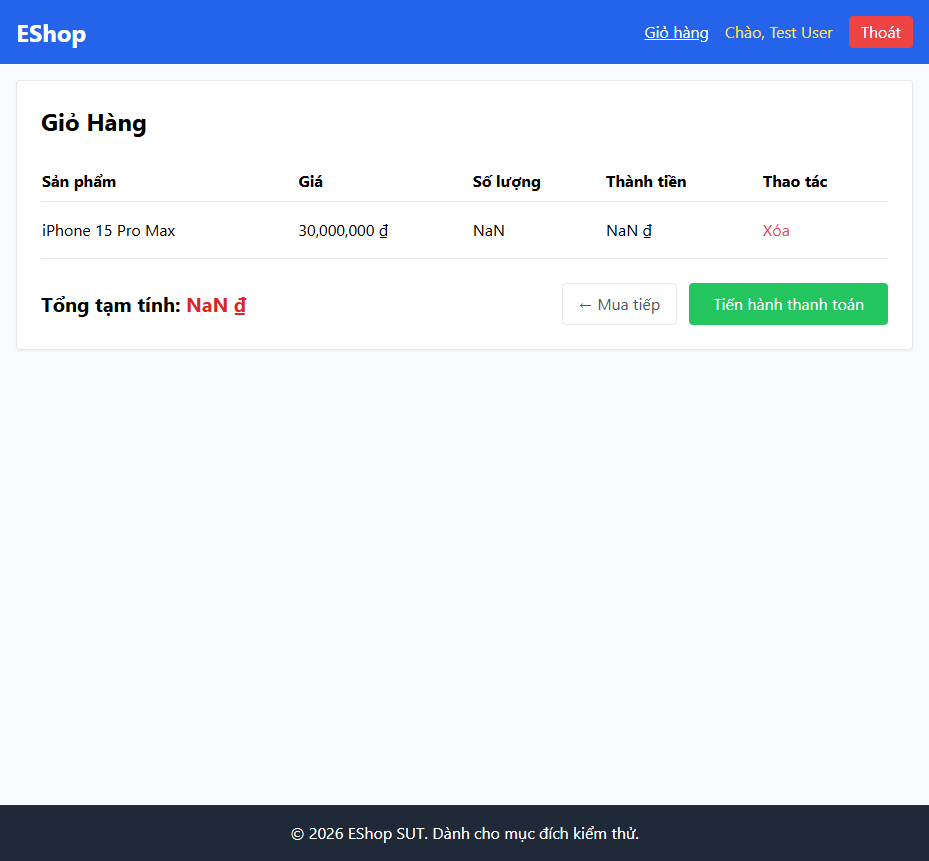

# BUG-CART-008: Ô Số lượng ở trang chi tiết không chặn giá trị 0/âm/rỗng — tạo dòng giỏ hàng hiển thị NaN

## Found by Test Case

TC-CART-011

## Requirement liên quan

FR-06 / FR-07 (Ô Số lượng chỉ nhận số nguyên dương, tối thiểu 1; giỏ hàng không được hiển thị NaN)

## Severity / Priority

Critical / P1

## Environment

- Browser: Chromium, Firefox, WebKit — tái hiện trên cả 3
- OS: Windows 11
- URL: http://localhost:5173/product/:id
- Build: nhánh `hw04/23127211`, commit `3d2a86d`

## Steps to reproduce

1. Mở trang chi tiết một sản phẩm.
2. Lần lượt đặt ô Số lượng = `0`, `-1`, để trống (``), rồi bấm "Thêm vào giỏ hàng" (2 lần, để bù trừ BUG-CART-001).
3. Mở trang Giỏ hàng sau mỗi kịch bản.

## Expected result

Cả 3 giá trị `0`, `-1`, rỗng đều **không hợp lệ** — không được tạo dòng nào trong giỏ hàng.

## Actual result

Cả 3 giá trị đều **được chấp nhận**, tạo ra dòng trong giỏ hàng với dữ liệu hiển thị `NaN`. Xác nhận qua `frontend-web/src/pages/ProductDetail.jsx:56-61`: ô `<input type="number">` không có thuộc tính `min`/`required`; dòng 27 dùng `parseInt(quantity)` — với chuỗi rỗng `parseInt('')` trả về `NaN`, và giá trị `NaN`/số âm vẫn được truyền thẳng vào `addToCart()` mà không có bước validate nào.

## Evidence

- HTML report: `tests/e2e/reports/html/cart-chromium/index.html` — test `TC-CART-011` (Failed, 3 lỗi soft độc lập cho D1/D2/D3): `expect(cartRows(page)).toHaveCount(0)` nhận count = 1 cho cả 3 bộ dữ liệu; kèm nội dung bảng giỏ hàng thực tế ghi nhận được: `"...NaNNaN ₫...Tổng tạm tính: NaN ₫..."`.

## Notes

Ban đầu vòng lặp kiểm 4 bộ dữ liệu (D1-D4) dùng assertion cứng nên dừng ngay ở D1, không kiểm được D2/D3/D4 trong cùng 1 lần chạy — đã sửa sang `expect.soft()` để báo cáo đầy đủ cả 4 kết quả trong 1 lần chạy duy nhất, nhờ đó phát hiện thêm rằng cả D2 (âm) và D3 (rỗng) cũng bị lỗi tương tự D1, không chỉ riêng D1.
