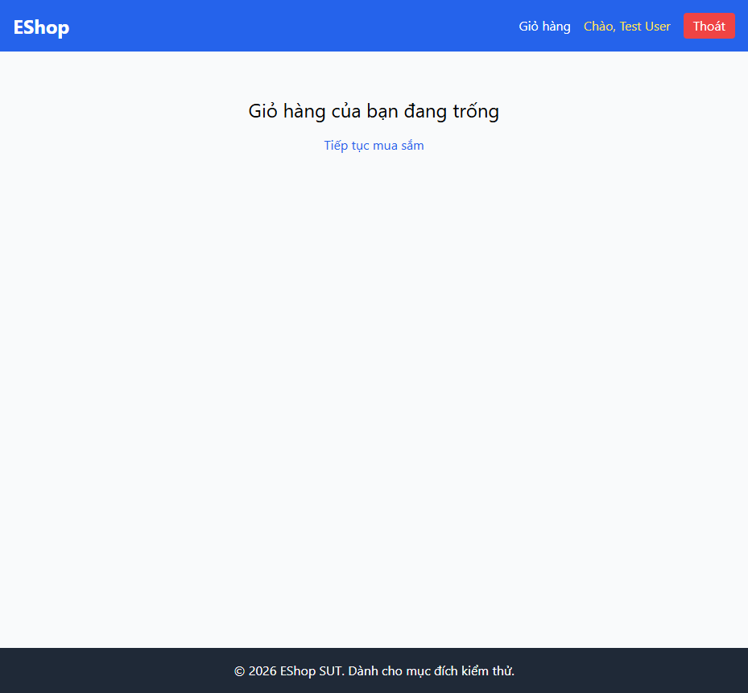

# BUG-CART-009: Giỏ hàng bị mất hoàn toàn sau khi tải lại trang (F5)

## Found by Test Case

TC-CART-013

## Requirement liên quan

FR-07 (Giỏ hàng phải được giữ nguyên sau khi tải lại trang)

## Severity / Priority

Major / P2

## Environment

- Browser: Chromium, Firefox, WebKit — tái hiện trên cả 3
- OS: Windows 11
- URL: http://localhost:5173/cart
- Build: nhánh `hw04/23127211`, commit `3d2a86d`

## Steps to reproduce

1. Thêm ít nhất 2 sản phẩm vào giỏ hàng (không cần đăng nhập).
2. Mở trang Giỏ hàng, xác nhận các dòng sản phẩm hiển thị đúng.
3. Nhấn F5 (reload thật, không phải điều hướng SPA).

## Expected result

Sau khi tải lại trang, giỏ hàng vẫn giữ nguyên các dòng sản phẩm đã thêm.

## Actual result

Sau khi tải lại trang, giỏ hàng **rỗng hoàn toàn** — hiển thị "Giỏ hàng của bạn đang trống". Xác nhận qua `frontend-web/src/context/CartContext.jsx:6`: state giỏ hàng dùng `useState([])` thuần, không có `localStorage`/`sessionStorage` hay bất kỳ cơ chế lưu trữ bền vững nào — mọi `page reload` (full navigation) đều xoá sạch state trong bộ nhớ trình duyệt.

## Evidence

- HTML report: `tests/e2e/reports/html/cart-chromium/index.html` — test `TC-CART-013` (Failed): `expect(page.getByText('Giỏ hàng của bạn đang trống')).toHaveCount(0)` nhận count = 1 (ngược với kỳ vọng) ngay sau `page.reload()`.

## Notes

Bug này còn ảnh hưởng gián tiếp đến toàn bộ cách thiết kế script automation của feature Giỏ hàng: mọi thao tác seed dữ liệu trong các test case khác đều phải điều hướng bằng cách click link trong ứng dụng (SPA navigation), tuyệt đối không được dùng `page.goto()` (vốn luôn là full reload), nếu không giỏ hàng sẽ bị xoá giữa chừng.
