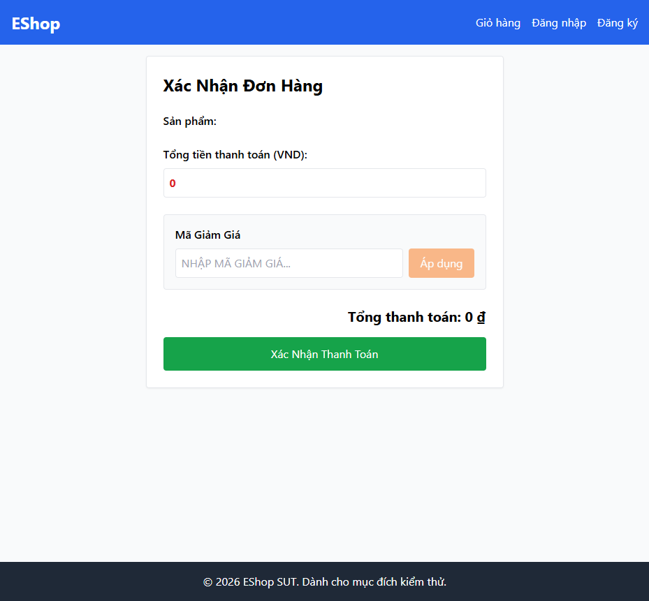

# BUG-CART-010: Route /checkout không có guard — truy cập trực tiếp bằng URL khi chưa đăng nhập vẫn vào được

## Found by Test Case

TC-CART-012

## Requirement liên quan

FR-08 (Checkout — phải chặn truy cập khi chưa đăng nhập)

## Severity / Priority

Critical / P1

## Environment

- Browser: Chromium, Firefox, WebKit — tái hiện trên cả 3
- OS: Windows 11
- URL: http://localhost:5173/checkout
- Build: nhánh `hw04/23127211`, commit `3d2a86d`

## Steps to reproduce

1. Đảm bảo **chưa đăng nhập** (khách vãng lai).
2. Gõ trực tiếp URL `http://localhost:5173/checkout` trên thanh địa chỉ (không qua nút "Tiến hành thanh toán" của giỏ hàng).

## Expected result

Hệ thống chặn truy cập, chuyển hướng về trang Đăng nhập hoặc trang chủ; không hiển thị form thanh toán.

## Actual result

Trang Checkout vẫn render đầy đủ form thanh toán (heading "Xác Nhận Đơn Hàng"). Xác nhận qua `frontend-web/src/App.jsx:58`: route `<Route path="/checkout" element={<Checkout />} />` không có bất kỳ wrapper/guard kiểm tra đăng nhập nào (không giống các route khác); `Checkout.jsx` cũng không tự kiểm tra `user`/`token` để redirect khi component mount.

Lưu ý: nút "Tiến hành thanh toán" trên trang Giỏ hàng (`Cart.jsx:11-16`) CÓ chặn đúng (hiện `alert()` + `navigate('/login')`) — lỗ hổng chỉ nằm ở việc **route không có guard ở tầng router**, nên bất kỳ ai gõ thẳng URL đều bỏ qua được lớp chặn phía UI đó.

## Evidence

- HTML report: `tests/e2e/reports/html/cart-chromium/index.html` — test `TC-CART-012` (Failed ở bước cuối): `expect(page.getByRole('heading', { name: 'Xác Nhận Đơn Hàng' })).toHaveCount(0)` nhận count = 1 sau khi `page.goto('/checkout')` trực tiếp khi chưa đăng nhập.

## Notes

Lỗ hổng kiểm soát truy cập (access control) — nên xếp cùng nhóm ưu tiên với BUG-PRODUCT-001/002 (thiếu guard endpoint) dù khác feature, vì cùng bản chất "chặn ở UI nhưng không chặn ở tầng route/logic thật".
