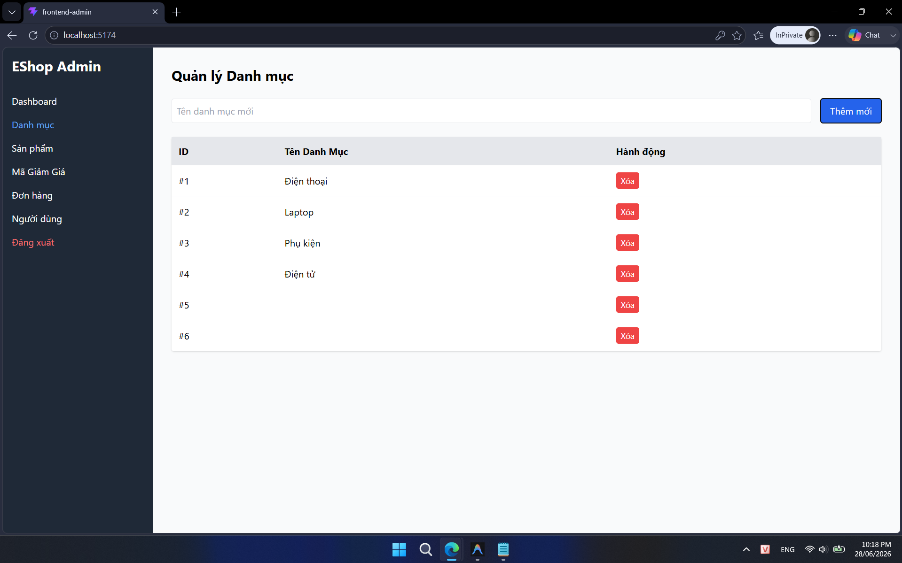

## Found by Test Case

TC-CATEGORY-002, TC-CATEGORY-003

## Requirement liên quan

FR-14 (Quản lý Danh mục)

## Severity / Priority

Major / P1

## Environment

Browser: Google Chrome / Microsoft Edge, OS: Windows, URL: http://localhost:5174

## Steps to reproduce

1. Đăng nhập vào hệ thống bằng tài khoản Admin.
2. Mở trang Admin → Categories.
3. Để trống trường Name hoặc nhập toàn bộ khoảng trắng.
4. Bấm nút Thêm / Submit.

## Expected result

- Hệ thống từ chối yêu cầu (HTTP 400 Bad Request hoặc hiển thị validation error).
- Thông báo lỗi xuất hiện: trường Name là bắt buộc / không hợp lệ.
- Không có danh mục nào được thêm vào danh sách.

## Actual result

Hệ thống không báo lỗi, tạo thành công một danh mục mới có tên rỗng hoặc chỉ chứa khoảng trắng.

## Evidence

- **TC-CATEGORY-002 (Không báo lỗi, thêm thành công danh mục tên rỗng):**
  
- **TC-CATEGORY-003 (Không báo lỗi, thêm thành công danh mục chỉ chứa khoảng trắng):**
  
