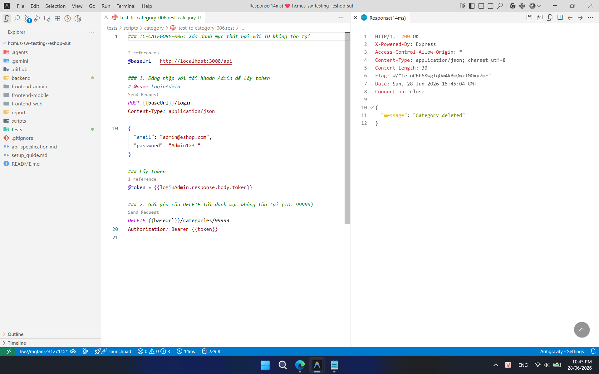

## Found by Test Case

TC-CATEGORY-006

## Requirement liên quan

FR-14 (Quản lý Danh mục)

## Severity / Priority

Minor / P2

## Environment

Browser: Google Chrome / Microsoft Edge, OS: Windows, URL: http://localhost:5173

## Steps to reproduce

1. Đăng nhập vào hệ thống bằng tài khoản Admin.
2. Gửi DELETE request đến `DELETE /api/categories/99999` (ID 99999 là ID không tồn tại).

## Expected result

- Hệ thống trả về HTTP 404 Not Found.
- Response body chứa thông báo lỗi danh mục không tìm thấy.

## Actual result

Hệ thống không báo lỗi, trả về HTTP 200 OK (hoặc 204 No Content) báo xóa thành công.

## Evidence

- **TC-CATEGORY-006 (Không báo lỗi 404 khi xóa ID không tồn tại):**
  
