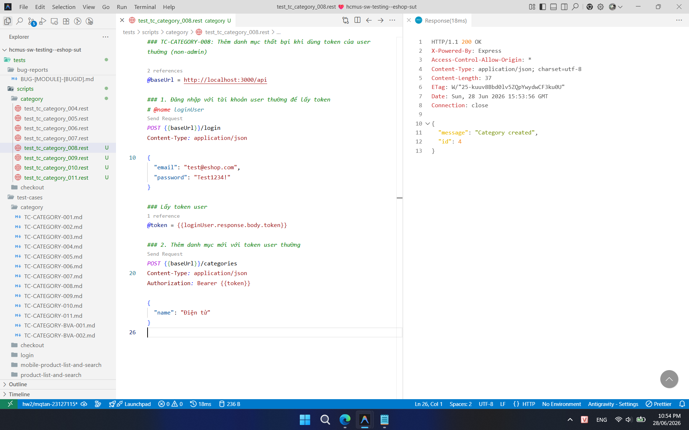

## Found by Test Case

TC-CATEGORY-008

## Requirement liên quan

FR-12 (Kiểm soát truy cập), FR-14 (Quản lý Danh mục)

## Severity / Priority

Major / P1

## Environment

Browser: Google Chrome / Microsoft Edge, OS: Windows, URL: http://localhost:5173

## Steps to reproduce

1. Đăng nhập vào hệ thống bằng tài khoản user thường.
2. Gửi POST request đến `/api/categories` với body `{"name": "Điện tử"}` có kèm header Authorization chứa token của user thường.

## Expected result

- Hệ thống từ chối yêu cầu và trả về HTTP 403 Forbidden.
- Response body chứa thông báo lỗi không đủ quyền.
- Không có danh mục nào được thêm vào hệ thống.

## Actual result

Hệ thống cho phép thêm danh mục thành công (trả về HTTP 201 Created hoặc 200 OK) và danh mục mới được thêm vào database.

## Evidence

- **TC-CATEGORY-008 (User thường tạo thành công danh mục):**
  
