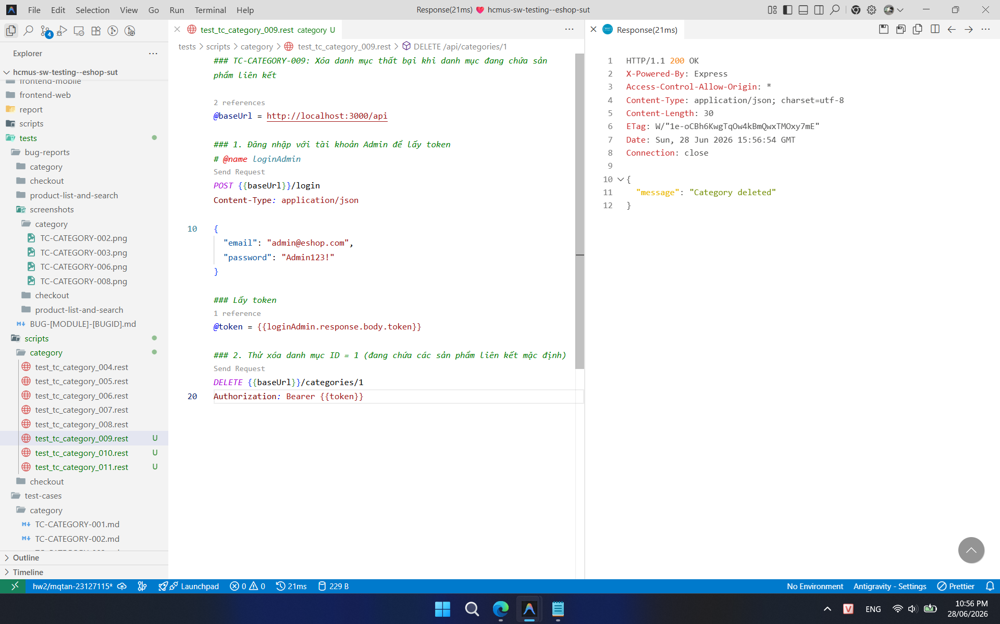

## Found by Test Case

TC-CATEGORY-009

## Requirement liên quan

FR-14 (Quản lý Danh mục)

## Severity / Priority

Critical / P1

## Environment

Browser: Google Chrome / Microsoft Edge, OS: Windows, URL: http://localhost:5173

## Steps to reproduce

1. Đăng nhập vào hệ thống bằng tài khoản Admin.
2. Gửi DELETE request đến `DELETE /api/categories/1` (Danh mục ID = 1 đang chứa các sản phẩm liên kết mặc định trong hệ thống).

## Expected result

- Hệ thống từ chối yêu cầu xóa danh mục và trả về mã lỗi phù hợp (HTTP 400/409/500).
- Hiển thị thông báo lỗi ràng buộc khóa ngoại (ví dụ: không thể xóa danh mục chứa sản phẩm).
- Danh mục không bị xóa khỏi hệ thống.

## Actual result

Hệ thống cho phép xóa danh mục thành công (trả về HTTP 200 OK hoặc 204 No Content), khiến các sản phẩm liên kết trước đó trỏ tới một danh mục không còn tồn tại trong database (vi phạm tính toàn vẹn dữ liệu).

## Evidence

- **TC-CATEGORY-009 (Xóa thành công danh mục có sản phẩm liên kết):**
  
