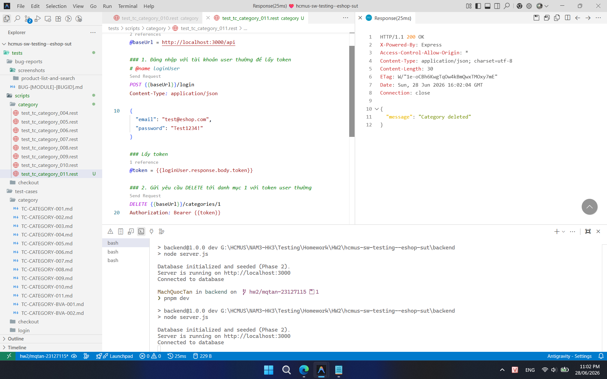

## Found by Test Case

TC-CATEGORY-011

## Requirement liên quan

FR-12 (Kiểm soát truy cập), FR-14 (Quản lý Danh mục)

## Severity / Priority

Critical / P1

## Environment

Browser: Google Chrome / Microsoft Edge, OS: Windows, URL: http://localhost:5174

## Steps to reproduce

1. Đăng nhập vào hệ thống bằng tài khoản user thường.
2. Gửi DELETE request đến `/api/categories/1` (hoặc ID danh mục khác bất kỳ) có kèm header Authorization chứa token của user thường.

## Expected result

- Hệ thống từ chối yêu cầu và trả về HTTP 403 Forbidden.
- Danh mục không bị xóa khỏi hệ thống.

## Actual result

Hệ thống cho phép xóa danh mục thành công (trả về HTTP 200 OK hoặc 204 No Content) và danh mục bị xóa khỏi database.

## Evidence

- **TC-CATEGORY-011 (User thường xóa thành công danh mục):**
  
