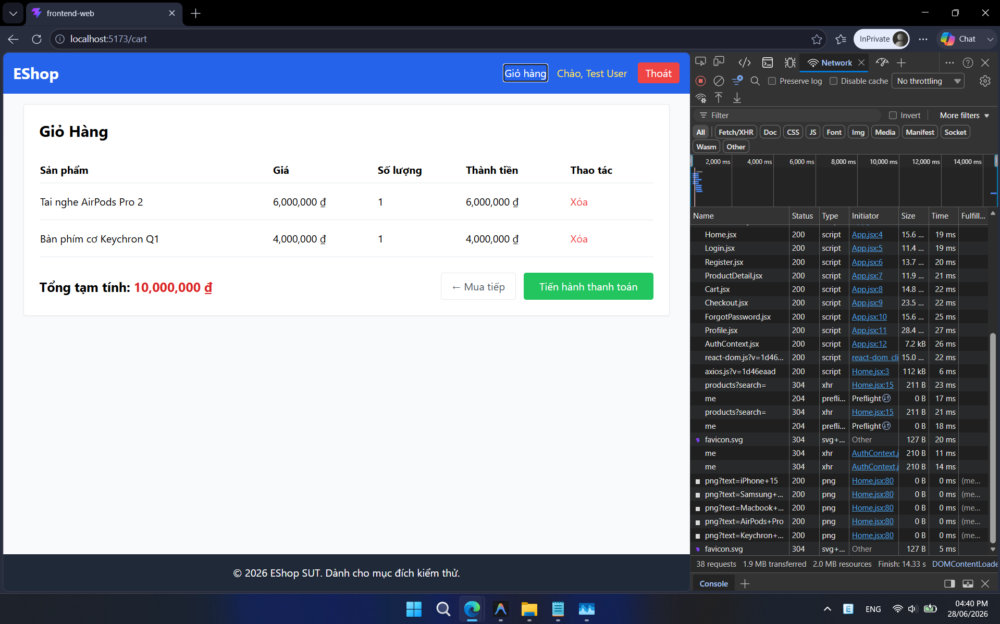
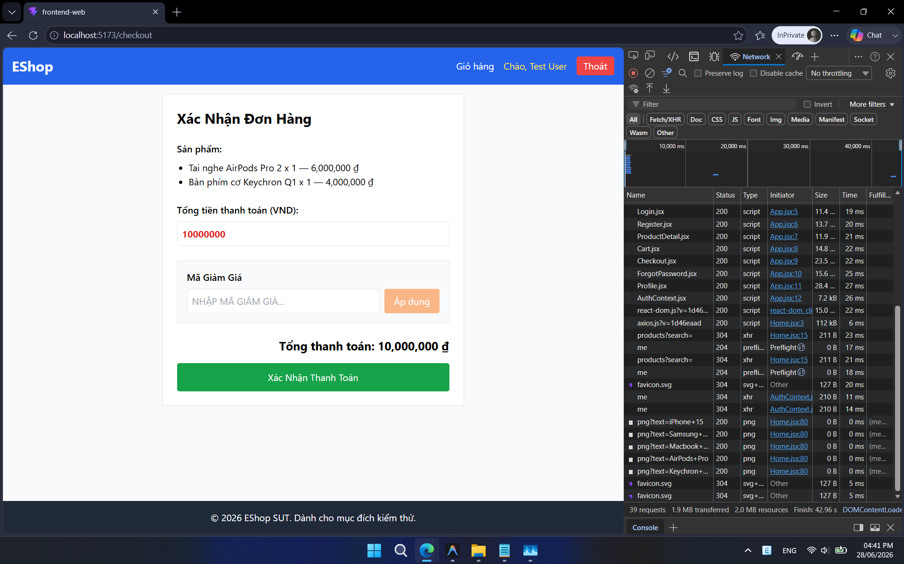
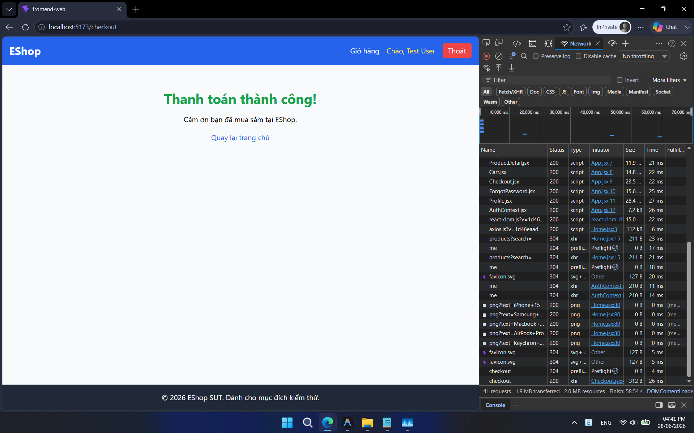
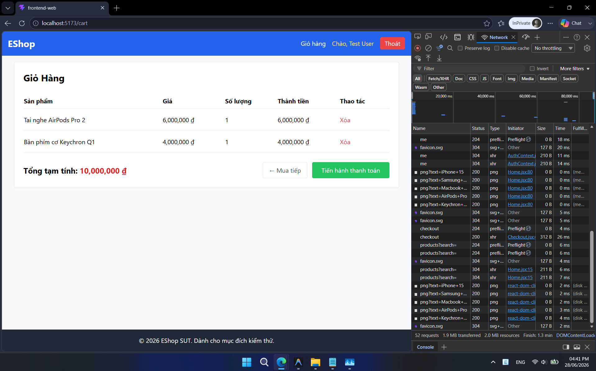
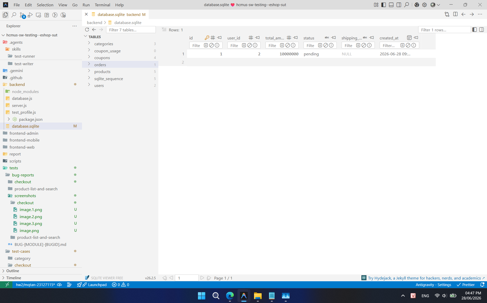

## Found by Test Case

TC-CHECKOUT-001

## Requirement liên quan

FR-08 (Thanh toán)

## Severity / Priority

Major / P1

## Environment

Browser: Google Chrome / Microsoft Edge, OS: Windows, URL: http://localhost:5173

## Steps to reproduce

1. Đăng nhập và lấy Token JWT hợp lệ.
2. Thêm 1 "Tai nghe AirPods Pro 2" (6.000.000 ₫) và 1 "Bàn phím cơ Keychron Q1" (4.000.000 ₫) vào giỏ hàng.
3. Gửi yêu cầu POST tới `/api/checkout` với Token JWT trong header và Request Body chứa `total_amount = 10000000`.
4. Kiểm tra cơ sở dữ liệu để xác nhận đơn hàng đã được tạo.
5. Quay lại trang giỏ hàng hoặc gửi yêu cầu GET tới `/api/cart` để kiểm tra.

## Expected result

Giỏ hàng của người dùng được xóa sạch (GET `/api/cart` trả về giỏ hàng trống).

## Actual result

Đồ vẫn trong giỏ chứ không được xóa sạch. Mảng sản phẩm vừa thanh toán vẫn còn nguyên vẹn trong bộ nhớ.

## Evidence

- **TC-CHECKOUT-001 (Ảnh 1: Giỏ hàng có đồ):**
  
- **TC-CHECKOUT-001 (Ảnh 2: Qua trang thanh toán):**
  
- **TC-CHECKOUT-001 (Ảnh 3: Thanh toán thành công):**
  
- **TC-CHECKOUT-001 (Ảnh 4: Quay lại vẫn thấy đồ trong giỏ):**
  
- **TC-CHECKOUT-001 (Ảnh 5: Minh chứng order đang pending):**
  
