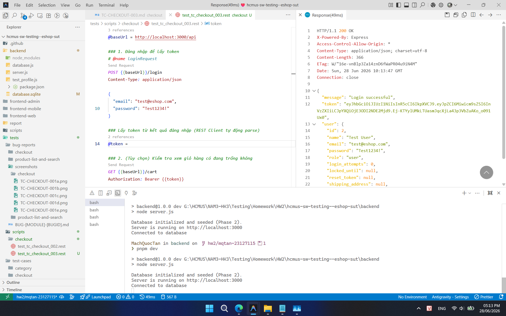
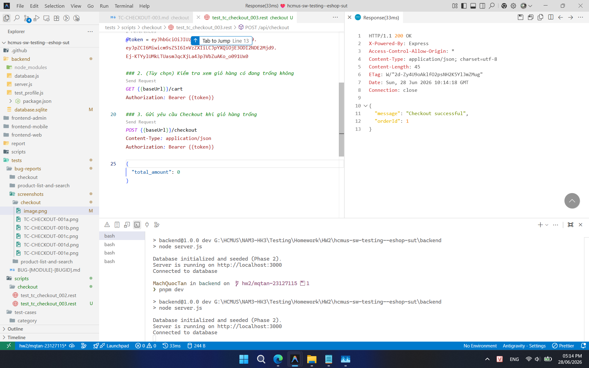
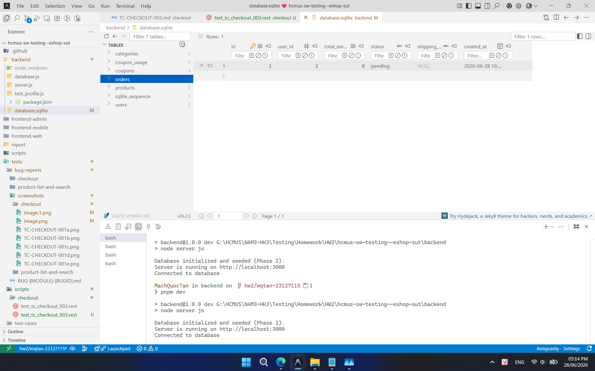

## Found by Test Case

TC-CHECKOUT-003

## Requirement liên quan

FR-08 (Thanh toán)

## Severity / Priority

Major / P1

## Environment

Browser: Google Chrome / Microsoft Edge, OS: Windows, URL: http://localhost:5173

## Steps to reproduce

1. Đăng nhập và lấy Token JWT hợp lệ.
2. Đảm bảo giỏ hàng trống (xóa toàn bộ sản phẩm hoặc reset CSDL).
3. Gửi yêu cầu POST tới `/api/checkout` với Token JWT trong header và Request Body chứa `total_amount = 0`.
4. Kiểm tra phản hồi trả về từ API.
5. Kiểm tra cơ sở dữ liệu để xác nhận đơn hàng mới có được tạo hay không.

## Expected result

API phản hồi với mã trạng thái `400 Bad Request` và thông báo lỗi phù hợp. Không có đơn hàng nào được tạo trong cơ sở dữ liệu.

## Actual result

API phản hồi thành công và một đơn hàng mới với `total_amount = 0` vẫn được tạo trong cơ sở dữ liệu mặc dù giỏ hàng trống.

## Evidence

- **TC-CHECKOUT-003 (Ảnh 1: Reset DB và lấy token):**
  
- **TC-CHECKOUT-003 (Ảnh 2: Tạo thành công đơn hàng):**
  
- **TC-CHECKOUT-003 (Ảnh 3: DB chứa order với amount là 0):**
  
