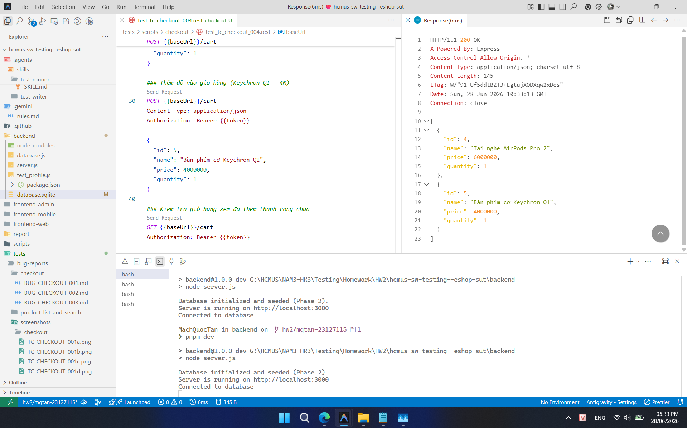
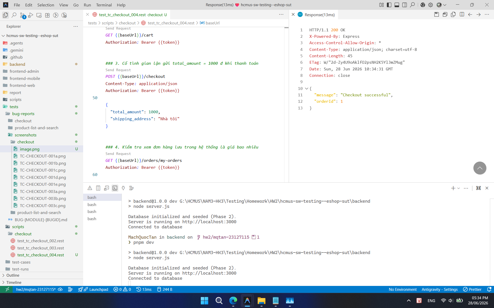
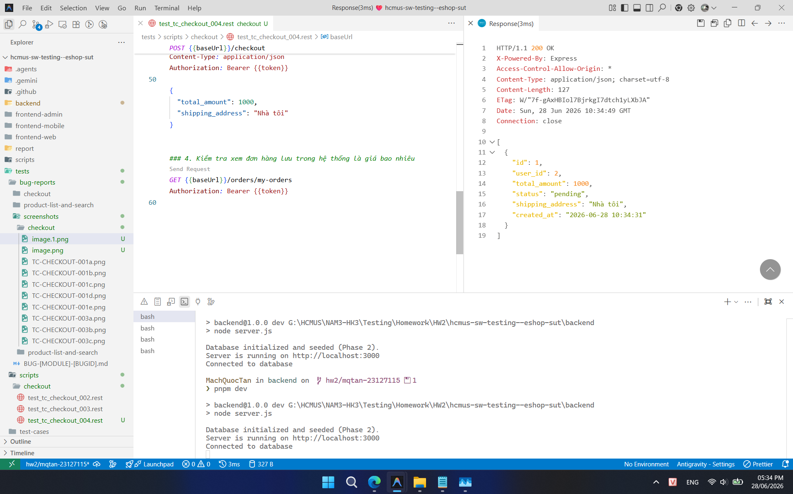

## Found by Test Case

TC-CHECKOUT-004, TC-CHECKOUT-BVA-002, TC-CHECKOUT-BVA-003

## Requirement liên quan

FR-08 (Thanh toán)

## Severity / Priority

Critical / P0

## Environment

Browser: Google Chrome / Microsoft Edge, OS: Windows, URL: http://localhost:5173

## Steps to reproduce

1. Đăng nhập và lấy Token JWT hợp lệ.
2. Thêm sản phẩm vào giỏ hàng sao cho tổng tiền thực tế là 10.000.000 ₫.
3. Gửi yêu cầu POST tới `/api/checkout` với Token JWT trong header và Request Body chứa `total_amount = 1000`.
4. Kiểm tra phản hồi trả về từ API.
5. Kiểm tra cơ sở dữ liệu (hoặc qua API `GET /api/orders/my-orders`) để xác nhận đơn hàng mới có được tạo với giá trị 1.000 ₫ hay không.

## Expected result

API phản hồi với mã trạng thái `400 Bad Request` và thông báo lỗi không khớp tổng tiền. Không được lưu đơn hàng với giá trị `1000` do client gửi lên.

## Actual result

API phản hồi thành công và tạo một đơn hàng mới lưu vào cơ sở dữ liệu với `total_amount = 1000`. Hệ thống không validate hay tính toán lại giá trị thật của giỏ hàng.

## Evidence

- **TC-CHECKOUT-004 (Ảnh 1: Thêm sản phẩm vào giỏ hàng):**
  
- **TC-CHECKOUT-004 (Ảnh 2: Đặt order thành công với tổng tiền bị sửa thành 1000):**
  
- **TC-CHECKOUT-004 (Ảnh 3: Đơn hàng lưu thành công trong DB với giá 1000):**
  
